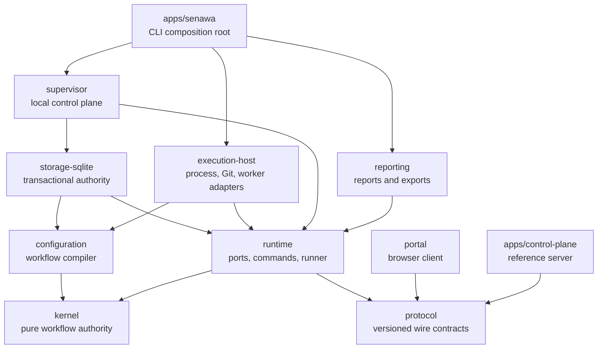
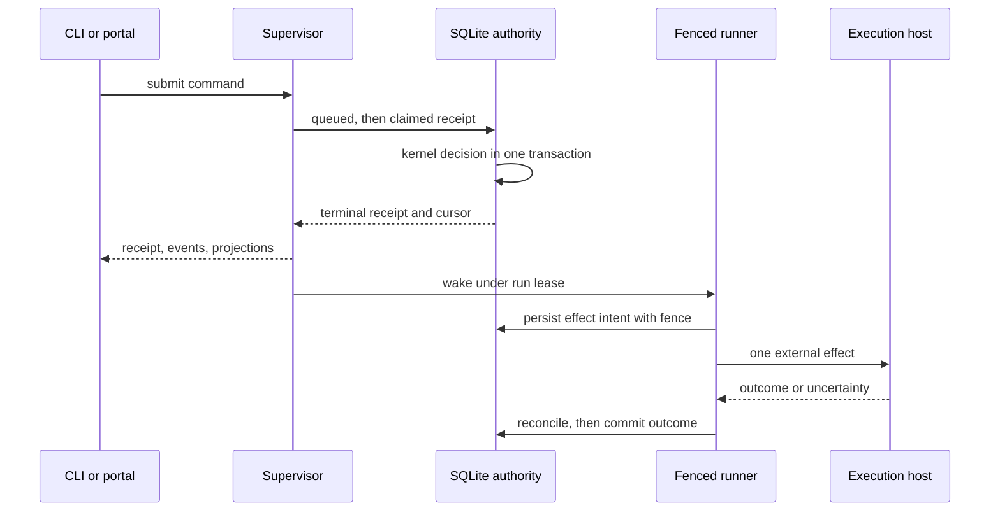
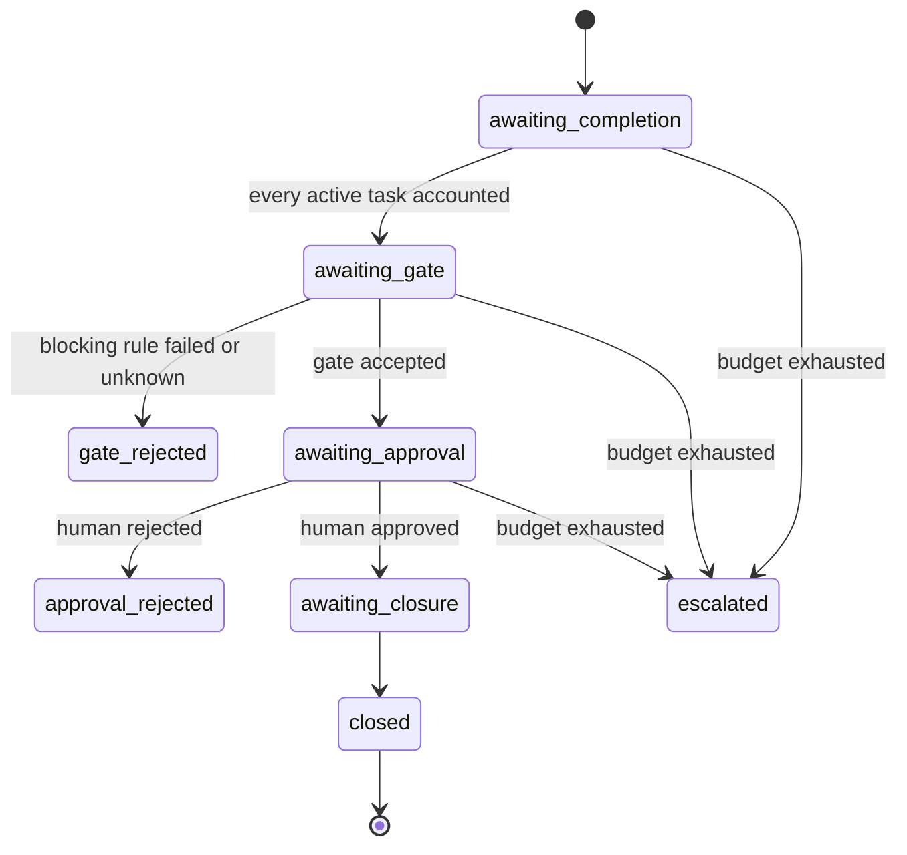

Senawa is being rebuilt as the deterministic workflow kernel of a
consumer-defined software factory.

The repository is in an alpha implementation reset. The executable creates and
validates versioned workflow configuration, starts the local supervisor, and
uses authenticated Unix-socket HTTP for workflow and operational commands.
Product direction and implementation phases are documented in the
[comprehensive plan](docs/design/implementation-plan.md), with decisions in the
[implementation log](docs/design/implementation-log.md).

The Node-local supervisor package exposes authenticated HTTP over a private Unix
socket and session-authenticated HTTP on `127.0.0.1`. See the [local supervisor
HTTP reference](docs/reference/local-supervisor-http.md) for routes and the alpha
security boundary. The daemon owns durable command recovery, bounded wake
processing, service lifecycle, persisted logs, SDK session-store health, and
state backup composition.

The optional outbound connector is disabled by default and preserves local
supervisor authority when enabled. See the [remote control-plane
reference](docs/reference/remote-control-plane.md) for local enrollment,
classified synchronization, partition behavior, and reference-server limits.

## High-level design

Senawa executes consumer-defined workflows as a deterministic state machine.
Every transition is an immutable, content-addressed record derived from exact
authority facts, so a run can be replayed, audited, and resumed from the exact
boundary where it stopped.

Five rules shape the whole system:

* Authority flows one way. The kernel decides, storage commits, adapters act,
  and clients observe. No client, prompt, or model response can widen authority.
* Agents propose. Humans and workflow policy approve. Model output, central
  receipts, and prompt text are evidence, never decisions.
* Intent is persisted before any external effect, and the outcome is reconciled
  before it is committed, so a crash never silently duplicates work.
* Every autonomous loop carries an independent finite budget that escalates
  instead of running unbounded.
* Local-first control. Source, credentials, leases, and unsynchronized assets
  stay on the repository host even when a remote control plane is enrolled.

### Package graph

The kernel is pure and has no filesystem, process, network, database, Git,
clock, random, worker, sensor, or UI dependency. Protocol carries contracts with
no behavior. Only direct edges appear below.



### Command and effect lifecycle

A command becomes a durable receipt before anything external happens. The runner
then performs exactly one recoverable transition per operation under a fenced
run lease.



### Phase lifecycle

Phase state is derived, never stored as mutable status. Each projection is
rebuilt from the current candidate, gate evaluation, authority decision,
closure, and escalation records.



### Where the branch stands

Phases 0 through 13 are delivered. Phase 14 adds standard delivery workflow
authoring: external prompt and schema resources, typed phase dataflow,
schema-selected task fan-out, reviewed plan import, and schema-validated agent
output. Phase 15 adds consumer documentation. Current status, acceptance
criteria, and remaining work live in the [comprehensive
plan](docs/design/implementation-plan.md).

## Development

```bash
pnpm install
pnpm build
pnpm typecheck
pnpm lint
pnpm test
pnpm package:alpha
pnpm test:packaging
pnpm check:boundaries
pnpm docs:links
```

The alpha execution host targets Linux x64 with glibc 2.34 or newer. Builds
require a C17 compiler available as `cc` and package the resulting
`senawa-process-supervisor` and `senawa-workspace-files` executables under
`@senawa/execution-host/dist`. Installed packages use those prebuilt helpers;
installation and runtime sensor execution never invoke a compiler.

`pnpm package:alpha` builds a deterministic local bundle under `dist/alpha`.
The bundle contains the public `senawa` package and exact local tarballs for its
internal workspace dependencies. It is a local alpha verification lane, not a
registry publication command. `pnpm test:packaging` copies the bundle to an
operating-system temporary directory, installs it there, and verifies init,
doctor, service, portal, platform metadata, dependency versions, inventories,
digests, executable modes, migrations, and native helpers without workspace
resolution.

The local core bundle does not declare, resolve, install, or load the Copilot
SDK or Koffi. A live-enabled installation must make the exact SDK available
separately; worker execution loads it only when a repository worker is
configured. The separate `pnpm test:live-worker` source lane requires explicit
cost and data acknowledgement plus its bounded model, credit, and timeout
settings. It can invoke a model and is never part of default or packaging
validation.

## CLI

`senawa init` creates the complete canonical example at
`.senawa/workflow.json`. The document contains workflow structure, execution
policy, roles, model policy, schemas, sensors, gates, and projected work. Init
non-recursively creates a real `.senawa` directory when needed, exclusively
creates the file, writes and syncs it, closes it, then syncs `.senawa` and the
project root. Existing files and directories are never overwritten. A failed
operation can leave an exclusively created partial file or directory in place;
init never removes those paths.

`senawa init <path>` creates exactly the supplied file and requires its parent
directory to exist. Even an explicit `.senawa/workflow.json` does not create
`.senawa`. The default path rejects a stable `.senawa` symlink, but pathname-only
Node filesystem APIs cannot prevent a hostile parent swap between validation
and file creation.

`senawa doctor` reads only `.senawa/workflow.json`. It does not search ancestor
directories or fall back to the earlier root `senawa.json` location. An
explicit path validates exactly that path, so `senawa doctor senawa.json`
remains available during manual migration. Doctor reports deterministic syntax
locations, safe filesystem error codes, and all configuration diagnostics. It
does not execute sensors, invoke models, start work, or contact a runner. See
the [CLI reference](docs/reference/cli.md) for the complete alpha surface and
migration steps.

`senawa service start` launches the detached local supervisor and waits for an
authenticated status response. Use `senawa service run` for foreground service
ownership, or `status`, `drain`, `stop`, `logs`, and `recover` for lifecycle
operations. Workflow commands, receipt and event queries, projection reads, and
portal bootstrap all use the same authenticated local client. Installed
packages discover their verified portal manifest relative to the `senawa`
package. `SENAWA_PORTAL_MANIFEST` remains an explicit development and test
override.

Measured historical substrate behavior remains under
[experiments/probes](experiments/probes/README.md). Those probes do not imply
that their former production integrations remain supported.