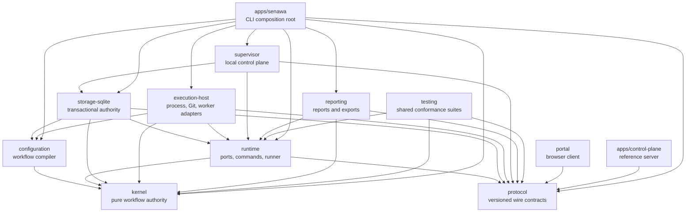
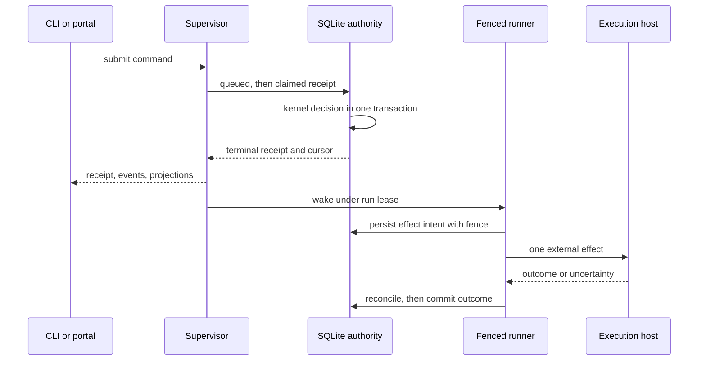
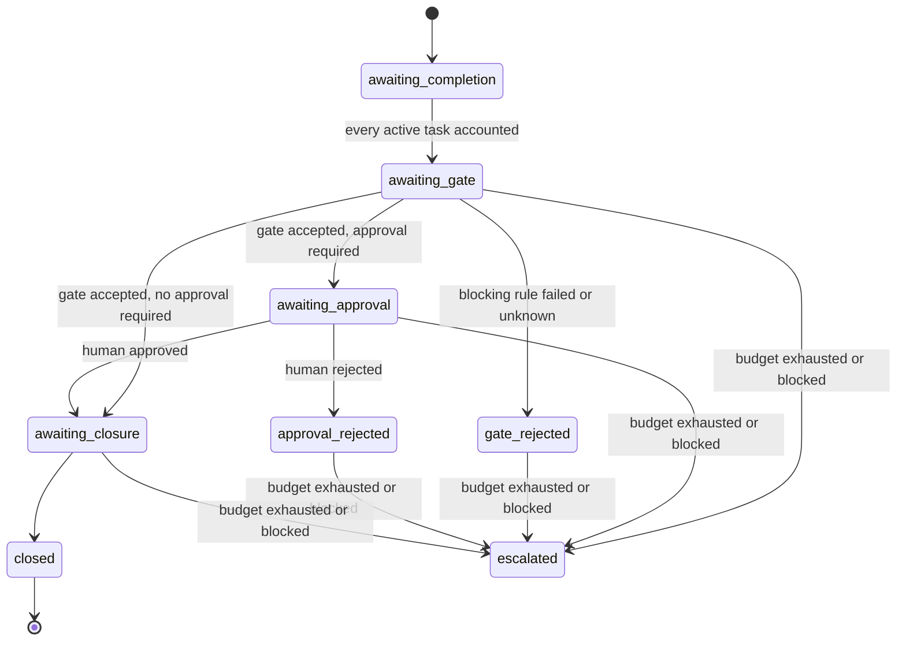

# Senawa

Senawa is the deterministic workflow kernel of a consumer-defined software
factory. It executes consumer-defined workflows as an auditable state machine on
your own host, with a local supervisor, a SQLite authority, and a browser run
console.

Start with [Getting started](docs/guide/getting-started.md).

## The three loops

Senawa runs three nested loops, and almost every design choice follows from
which loop a decision belongs to.

The **inner loop** is one agent working alone on one phase. It reads its
assignment, does the work, and asks to finish. It repeats until it satisfies the
conditions or says it cannot. It runs for minutes.

The **middle loop** is the deterministic driver. It dispatches a phase, measures
the result, and either grants completion or hands back reasons. No model runs
this loop, which is what makes it repeatable. It runs for the length of a run.

The **outer loop** is the human. They define what better means, review at the
points they declared, and change the workflow when it is producing the wrong
thing. It runs for as long as the project does.

The property that makes this worth building is that **completion is granted, not
claimed**. An agent asks to finish; the harness decides.

## The vocabulary

A **sensor** measures a property of the work by running a real command, and
returns a reading.

A **gate** is a rule over readings that resists progress while they are red. A
blocking rule refuses; an advisory rule is recorded and shown.

An **anchor** is a deterministic reading that cannot be argued with. Every
blocking gate needs one, or the harness is only agreeing with whoever submitted
the work. Senawa refuses a blocking gate with no anchor when it is written, not
when it runs.

**Backpressure** is what the gates provide. An agent that cannot pass does not
get to continue by insisting, and it cannot lower the bar it is measured
against.

A **frozen set** is the part of a workflow the run may not weaken while it is
running. Attempt limits, blocking gates, and declared outputs are frozen: an
agent that could relax them would optimise against the measurement rather than
the work.

Four things keep this honest: deterministic sensors that execute real code, a
journal no agent can write, a frozen set the optimizer cannot weaken, and a
human who decides what better means.

This is loop engineering: the system is a graph of loops, and the design work is
deciding what each loop optimises, what measures it, and who may change the
target. The inner loop optimises one phase against its gates. The middle loop
optimises the run against its workflow. The outer loop optimises the workflow
against what the human actually wanted, and only that loop may change the
target.

## Documentation

* [Consumer guide](docs/guide/README.md) is the index for everything below.
* [Getting started](docs/guide/getting-started.md) installs senawa, creates a
  workflow tree, starts the service, opens the portal, submits a command, and
  shuts down without spending model credits.
* [Workflow authoring](docs/guide/workflow-authoring.md) documents the authored
  workflow tree.
* [Portal](docs/guide/portal.md) documents the run console, its workflow
  diagram, and its human decision surfaces.
* [Worktree mode](docs/guide/worktree-mode.md) documents the optional isolated
  workspace mode.
* [Operations](docs/guide/operations.md) documents paths, credentials, backup,
  restore, recovery, diagnostics, and the live-worker opt-in.
* [Security](docs/guide/security.md) documents principals, capabilities, grants,
  approvals, and the local and remote trust boundaries.
* [Troubleshooting and limits](docs/guide/troubleshooting.md) documents the
  platform matrix, common failures, and deferred behavior.

The references define exact surfaces: the [authoring
reference](docs/reference/authoring.md), the [CLI
reference](docs/reference/cli.md), the [local supervisor HTTP
reference](docs/reference/local-supervisor-http.md), and the [remote
control-plane reference](docs/reference/remote-control-plane.md).

[What proves each claim](docs/reference/acceptances.md) names the test behind
each documented behaviour, and a check refuses the build when a name stops
matching anything real.

The [design set](docs/design/README.md) explains why the system behaves this way,
with the [v1 brief](docs/design/WIP/redesign-2/brief.md) carrying the canonical
behaviours, the [plan](docs/design/WIP/redesign-2/plan.md) as the active source,
and the [implementation log](docs/design/WIP/redesign-2/implementation-log.md)
recording decisions.

The repository carries no `examples/` tree. Every runnable example lives inside
the consumer guides: [Getting started](docs/guide/getting-started.md) carries the
end-to-end command sequence, [Workflow authoring](docs/guide/workflow-authoring.md)
carries the configuration documents, and [Operations](docs/guide/operations.md)
carries the service, backup, restore, and diagnostics sequences.

## High-level design

Senawa executes consumer-defined workflows as a deterministic state machine.
Every transition is an immutable, content-addressed record derived from exact
authority facts, so a run can be replayed, audited, and resumed from the exact
boundary where it stopped.

Five rules shape the whole system:

* Authority flows one way. The kernel decides, storage commits, adapters act,
  and clients observe. No client, prompt, or model response can widen authority.
* Agents propose. Humans and workflow policy approve. Model output, central
  receipts, and prompt text are evidence, never decisions.
* Intent is persisted before any external effect, and the outcome is reconciled
  before it is committed, so a crash never silently duplicates work.
* Every autonomous loop carries an independent finite budget that escalates
  instead of running unbounded.
* Local-first control. Source, credentials, leases, and unsynchronized assets
  stay on the repository host even when a remote control plane is enrolled.

### Package graph

The kernel is pure and has no filesystem, process, network, database, Git,
clock, random, worker, sensor, or UI dependency. Protocol carries contracts with
no behavior. Every edge below is a direct entry in the `dependencies` field of
the source manifest. External dependencies are listed per component in
[Architecture](docs/design/architecture.md).



### Command and effect lifecycle

A command becomes a durable receipt before anything external happens. The runner
then performs exactly one recoverable transition per operation under a fenced
run lease.



### Phase lifecycle

Phase state is derived, never stored as mutable status. Each projection is
rebuilt from the current candidate, gate evaluation, authority decision,
closure, and escalation records.



An escalation requires a current candidate, so `awaiting-completion` cannot
escalate. [Workflow model](docs/design/workflow-model.md) carries the exact
derivation rules.

### Where the branch stands

Every implementation phase is delivered. Phases 0 through 14 built the kernel
through packaged delivery and standard authoring, Phase 16 added the
browser run console, and Phase 17 added the design and consumer documentation
sets. No phase carries the number 15; the former Phase 15 was renumbered to
Phase 17 so documentation could describe final behavior. Acceptance criteria and
the decision record live in the [comprehensive
plan](docs/design/WIP/redesign-1/implementation-plan.md).

## Development

```bash
pnpm install
pnpm build
pnpm typecheck
pnpm lint
pnpm test
pnpm package:release
pnpm test:packaging
pnpm check:boundaries
pnpm docs:links
```

The execution host targets Linux x64 with glibc 2.34 or newer. Builds
require a C17 compiler available as `cc` and package the resulting
`senawa-process-supervisor` and `senawa-workspace-files` executables under
`@senawa/execution-host/dist`. Installed packages use those prebuilt helpers;
installation and runtime sensor execution never invoke a compiler.

`pnpm package:release` builds a deterministic local bundle under `dist/release`.
The bundle contains the public `senawa` package and exact local tarballs for its
internal workspace dependencies. It is a local verification lane, not a
registry publication command. `pnpm test:packaging` copies the bundle to an
operating-system temporary directory, installs it there, and verifies init,
doctor, service, portal, platform metadata, dependency versions, inventories,
digests, executable modes, migrations, and native helpers without workspace
resolution.

The local core bundle does not declare, resolve, install, or load the Copilot
SDK or Koffi. A live-enabled installation must make the exact SDK available
separately; worker execution loads it only when a repository worker is
configured. The separate `pnpm test:live-worker` source lane requires explicit
cost and data acknowledgement plus its bounded model, credit, and timeout
settings. It can invoke a model and is never part of default or packaging
validation.

## CLI

Senawa ships one public executable, `senawa`. It creates and validates
workflow configuration, owns the local supervisor lifecycle, submits workflow
commands, reads durable receipts, events, and projections, reviews amendments,
mints portal sessions, and performs backup, restore, integrity, diagnostics, and
repair operations.

See [Getting started](docs/guide/getting-started.md) for the first journey,
[Operations](docs/guide/operations.md) for the operational commands, and the
[CLI reference](docs/reference/cli.md) for the complete surface with exact
arguments and exit codes.

Measured historical substrate behavior remains under
[experiments/probes](experiments/probes/README.md). Those probes do not imply
that their former production integrations remain supported.
