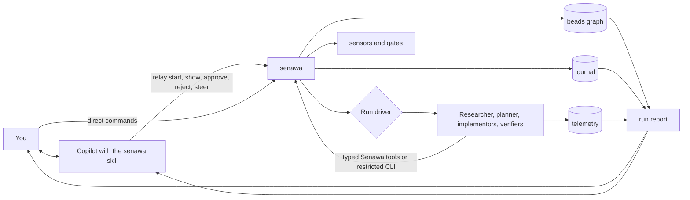

# Senawa

## Overview

Senawa (සේනාව) is an orchestration harness for [GitHub Copilot CLI](https://docs.github.com/copilot/how-tos/copilot-cli). You talk to an ordinary Copilot session carrying the senawa skill, and it turns what you ask for into `senawa` commands. Senawa decomposes the work and delegates the pieces to specialist worker sessions: a researcher, a planner, one or more implementors, and verifiers. The part that decides what runs next is a deterministic driver rather than a model, so no agent is ever in the control path.

Three ideas hold the design together.

Durable workflow state lives outside the model, as a dependency graph in [beads](https://github.com/gastownhall/beads). Agents ask the graph what is workable rather than remembering a plan.

Every agent-facing operation crosses the Senawa boundary. The principal agent
uses the CLI. Hosted workers use typed Senawa tools, and subprocess workers use a
restricted CLI wrapper. That single seam is where policy lives, which means
guardrails are enforced rather than merely requested.

Completion is granted, not claimed. A worker requests completion; the harness
runs sensors, evaluates gates, and either accepts the work or hands back
actionable failures. The driver remains authoritative even when a worker ends a
turn without making the request. This is the backpressure model described in
[Manufacturing Backpressure in Coding Agent Harnesses](https://dasith.me/2026/06/14/backpressure-in-coding-agent-harnesses/).

Because everything routes through that one seam, the harness can also write down what happened. Every orchestration event lands in an append-only journal that no agent can author, and `senawa work report` renders it into a document you can read or attach to a pull request: which role did which task, on which model, how many times the harness sent the work back and why, what you decided, and what it cost.

## Three loops, and where you sit

Senawa runs three nested loops. Each outer layer sets a reference the layer
inside it cannot redefine.

| Loop | Who runs it | Period | You |
|------|-------------|--------|-----|
| Outer | you | hours to days | you own the request, declared phase decisions, and definition of better |
| Middle | the run driver, deterministic | minutes to hours | steer it any time; it asks at declared approvals and escalations |
| Inner | one worker, alone | seconds to minutes | absent by design; this is where the harness pushes back |

`senawa work start` drives the run and stops when it needs you, so the loop advances without anyone watching it. Cancel it and `senawa work resume` picks up where it stopped. When a principal agent starts it on your behalf it runs detached, which is what lets you keep asking questions and steering while the work continues.

## What a run looks like

A workflow is a sequence of phases you declare in the repository. Each one can
ask for your approval, and any phase you are not happy with can be sent back to
run again on top of what it already produced.

```text
you   Add Entity Framework support for the persistence layer
PA    [senawa workflow list] I can run standard-delivery or hotfix. Which?
you   standard-delivery
PA    [senawa work start "<goal>" --workflow standard-delivery --detach] Started.
PA    [senawa work wait --timeout 300] Define is ready: artifacts/define/v1.json
you   looks right, go on
PA    [senawa approve define] [senawa work resume --detach]
PA    [senawa work wait --timeout 300] Research is ready: v1
you   approve
PA    [senawa approve research] [senawa work resume --detach]
PA    [senawa work wait --timeout 300] Plan is ready: v1, 6 tasks
you   no error handling on the adapter boundary
PA    [senawa reject plan --reason "<reason>"] [senawa work resume --detach]
PA    [senawa work wait --timeout 300] Plan v2 adds two tasks for it
you   approve
PA    [senawa approve plan] [senawa work resume --detach] Implementing.
you   how is it going?
PA    [senawa work show] 4 of 6 closed.
      bd-a1b2 was refused once on unit-tests and passed on its second attempt.
PA    [senawa work wait --timeout 300] Verify is ready: v1
you   add the tasks in extra-tasks.json
PA    [senawa plan revise --add extra-tasks.json] [senawa work resume --detach]
PA    [senawa work wait --timeout 300] Done, verify re-ran: v2
you   accept
PA    [senawa approve verify] [senawa work resume --detach]
PA    [senawa work wait --timeout 300] Run accepted. Report at report.md
```

Everything in brackets is a `senawa` command. Rejecting a phase is the normal
case rather than an error path: your reason becomes the input to the next
iteration, and every artifact version is kept, so you can see what changed and
why.

Additive plan revision currently consumes a schema-valid task file. Turning a
free-form request into that file is not part of the principal agent contract.

This is the shape [Addy Osmani calls loop engineering](https://addyosmani.com/blog/loop-engineering/): you design the system that prompts the agents rather than prompting them yourself. [Carlos Perez's follow-up](https://medium.com/intuitionmachine/from-loop-engineering-to-graph-engineering-d3ebeb08511c) argues that a single loop always fails, and that the fix is a graph of loops that check each other. Senawa takes that seriously without mistaking its task graph for a control graph: what keeps it honest is narrower than topology. Deterministic sensors that execute real code. A journal no agent can write. A frozen set of files the optimizer cannot weaken. And a human who decides what "better" means.

## Status

Production implementation has not started, but the risky assumptions have been
tested rather than assumed. Eight probes in [poc/](poc/README.md) exercise the
real Copilot CLI, Copilot SDK, beads, and the proposed extension and workflow
contracts. The principal-agent surface and per-task rework loop use live models.
The full five-phase workflow, including approval, rejection, crash recovery, and
additive revision, uses deterministic worker hosts.

Start with the [design index and reading order](docs/design/README.md). It moves
from the system model and workflow lifecycle into agents, quality enforcement,
runtime state, provenance, and implementation. Probe evidence and abandoned
directions remain available in the non-authoritative design working record.

## How it fits together



The normal conversational path is you, the principal agent, Senawa, then the
workers. The principal agent relays your intent and explains what came back; it
never decides what runs next, and it never reaches past Senawa to the graph, the
journal, or the workers. You can also drive Senawa directly, and the harness runs
headless with no principal agent at all.

## Concepts

| Term | Meaning |
|------|---------|
| Workflow | A declarative sequence of phases, with their gates, approvals, and iteration budgets. Lives in the repository |
| Phase | A stage of a workflow. Can be entered more than once, so rejecting one starts an iteration rather than an error |
| Run driver | The process started by `senawa work start`. Performs every transition and decides what runs next |
| Principal agent | The Copilot session you talk to, carrying the senawa skill. Relays your intent as `senawa` commands and explains what came back. It never decides what runs next, and the harness runs without it |
| Worker session | A role-scoped worker with its own context window, model, reasoning effort, and tool permissions. A separate session, not an in-process helper |
| Artifact | A phase's schema-validated output, versioned rather than overwritten. A plan's tasks become the implementation frontier |
| Graph state | The dependency graph of phases, tasks, and gates, plus their orchestration metadata, held in beads |
| Sensor | A tool that measures a property of the work and returns an assessment plus evidence. Builds, tests, linters, and reviewer agents |
| Gate | A rule that consumes sensor readings and resists progress when they are red |
| Anchor | A deterministic reading that cannot be argued with. Every blocking gate needs at least one, or the harness is only agreeing with itself |
| Frozen set | Files no worker may write, such as the tests and the sensor definitions. Enforced, not requested |
| Journal | An append-only log of every orchestration event, written by the harness rather than by any agent |
| Run report | A rendered account of how the work was done, regenerated from the journal, the graph, and telemetry |
| Work directory | Durable per-run files under `.agents/.copilot-tracking/`, including frozen definitions, versioned artifacts, transcripts, evidence, and the journal |

## Prerequisites

You will need GitHub Copilot CLI with an active Copilot subscription, Node.js 22 or later, and the `bd` binary from beads. Git is assumed.

### Package registry

The devcontainer uses the public npm registry by default. On first creation it copies `.devcontainer/.env.example` to the gitignored `.devcontainer/.env` file automatically. Docker Compose passes these values into the image build, so npm-based Dev Container Features use the configured registry before the container starts. The same values are available inside the running container.

To use a package proxy instead, create or edit the local file before rebuilding the devcontainer:

```bash
cp .devcontainer/.env.example .devcontainer/.env
```

Set both `NPM_CONFIG_REGISTRY` and `COREPACK_NPM_REGISTRY` in that file to the proxy URL, then rebuild the devcontainer. Variables exported by the host shell take precedence over `.devcontainer/.env` during Docker Compose interpolation.

Build arguments and image environment variables are not secret storage. Keep credentials out of the URL; configure npm authentication through your user-level `.npmrc` or a secret store.

## Repository layout

The tree below is the planned shape. Only `docs/` and `poc/` exist today.

```text
docs/design/                 numbered current-state guides and their reading index
docs/design/wip/             proposed decisions, evidence, rejected ideas, and the historical monolith
poc/                         throwaway probes that validated the design against reality
packages/                    core, graph, sensors, report, orchestrator, cli
.senawa/workflows/           phase definitions: gates, approvals, iteration budgets
.senawa/schemas/             artifact contracts for each phase
.senawa/extensions/          locally declared sensor extensions
.agents/skills/senawa/       the skill that lets a Copilot session drive the harness
.agents/rubrics/             rubrics for inferential sensors
.github/agents/              role definitions for researcher, planner, implementor, verifier
.github/hooks/               gate enforcement for sessions senawa does not host
sensors.yaml                 sensor extensions, configured sensors, and gates
```

## Further reading

* [Design index and reading order](docs/design/README.md)
* [System model](docs/design/01-system-model.md)
* [Workflows and lifecycle](docs/design/02-workflows-and-lifecycle.md)
* [Agents and interaction](docs/design/03-agents-and-interaction.md)
* [Design working record](docs/design/wip/README.md)
* [Manufacturing Backpressure in Coding Agent Harnesses](https://dasith.me/2026/06/14/backpressure-in-coding-agent-harnesses/)
* [Refining Inferential Sensors in Coding Agent Harnesses](https://dasith.me/2026/06/20/refining-inferential-sensors/)
* [Structured workflows for coding with AI agents using the Breadcrumb Protocol](https://dasith.me/2025/04/02/vibe-coding-breadcrumbs/)
* [Loop Engineering](https://addyosmani.com/blog/loop-engineering/) and [From Loop Engineering to Graph Engineering?](https://medium.com/intuitionmachine/from-loop-engineering-to-graph-engineering-d3ebeb08511c)
* [beads documentation](https://beads.gascity.com/)
* [Comparing GitHub Copilot CLI customization features](https://docs.github.com/en/copilot/concepts/agents/copilot-cli/comparing-cli-features)

## Name

Senawa (සේනාව) is Sinhala for an army or host.
