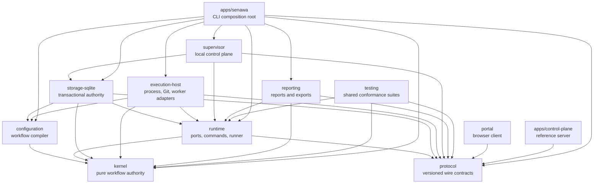
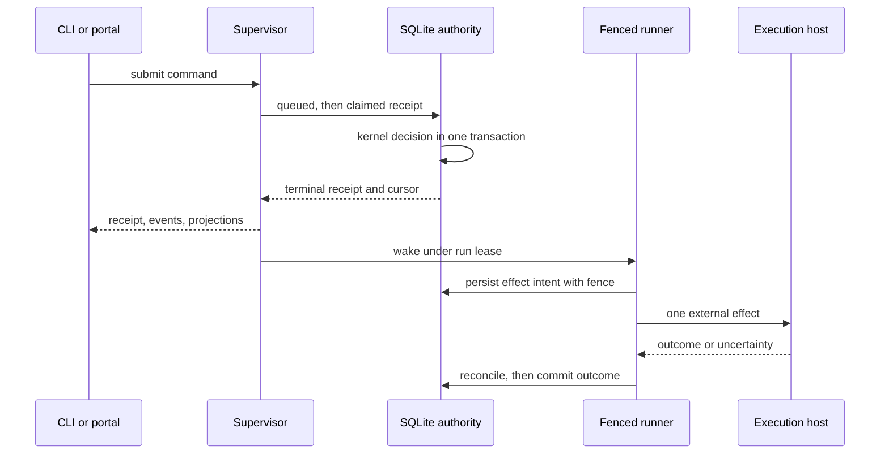
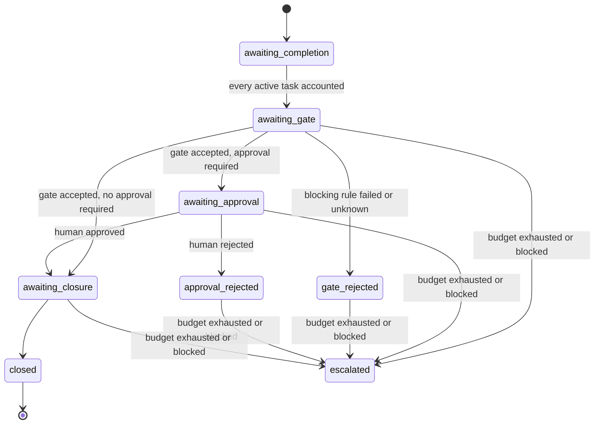

# Senawa

Senawa is the deterministic workflow kernel of a consumer-defined software
factory. It executes consumer-defined workflows as an auditable state machine on
your own host, with a local supervisor, a SQLite authority, and a browser run
console.

Start with [Getting started](docs/guide/getting-started.md).

## Why not just run an agent

An agent decides when it is done. That is fine for work you are watching and a
problem for work you are not: the thing being asked to judge whether the job is
finished is the thing that did the job.

Senawa takes that decision away from it. A real command measures the work, the
result of that command decides whether the phase closes, and the run keeps a
record no agent can write. What you get back is not a claim that the work is
done, but a reading you can check and a trail you can read afterwards.

## The three loops

Senawa runs three nested loops, and almost every design choice follows from
which loop a decision belongs to.

The **inner loop** is one agent working alone on one phase. It reads its
assignment, does the work, and asks to finish. It repeats until it satisfies the
conditions or says it cannot. It runs for minutes.

The **middle loop** is the deterministic driver. It dispatches a phase, measures
the result, and either grants completion or hands back reasons. No model runs
this loop, which is what makes it repeatable. It runs for the length of a run.

The **outer loop** is the human. They define what better means, review at the
points they declared, and change the workflow when it is producing the wrong
thing. It runs for as long as the project does.

The property that makes this worth building is that **completion is granted, not
claimed**. An agent asks to finish; the harness decides.

## What happens when an agent asks to finish

Nothing in a run happens on its own. `senawa advance` takes exactly one step and
returns, and you or a scheduler call it again for the next one. Here is one
phase, in the order those steps happen.

1. **Dispatch.** The driver writes an assignment: the agent's prompt, the inputs
   it may read, and the tools it may call. It gets nothing else. That record is
   the dispatch, and it is what the agent runs against.
2. **Work.** The agent works, then hands in its output and says it is done. That
   is a request. Nothing is published yet.
3. **Measure.** The next `advance` runs the phase's sensors. Each is a real
   command, run by the driver in its own process, and each returns a reading:
   an exit code, some output, whether it timed out. Every attempt re-runs them
   against the work as it now stands; no reading is carried over from the last
   one.
4. **Judge.** The gate is a rule over those readings, written by the author. A
   rule is *green* when the reading satisfies it and *red* when it does not.
   Green on every blocking rule: the driver publishes the output, grants
   completion, and the phase closes. One red blocking rule and none of that
   happens. An advisory rule that is red is recorded and shown and stops
   nothing, which is the whole difference between the two.
5. **Retry.** The phase stays open with one attempt spent. The output stays
   unpublished, so the next phase still cannot see it. The next `advance`
   writes a **new dispatch** for the same phase, carrying the readings that
   failed, in the words the sensors produced. That is how the agent learns what
   was wrong: it is in the assignment it is handed, not a message it must go and
   look for. An attempt not told what failed only spends an attempt.
6. **Stop.** When the attempts the author allowed are used up, `advance` returns
   that the phase was refused and stops. It does not lower the bar, and it does
   not carry on to the next phase.

The agent never runs step 3 and never decides step 4. It cannot edit the gate,
the attempt limit, or the output shape, because those are in the workflow and it
is only ever handed a dispatch. Asking again with better work is its only move.

A phase can also ask for a person before it closes. That approval sits after the
gate, not instead of it: green readings make a phase eligible to close, and an
authored approval then holds it open until somebody accepts or rejects it. A
rejection carries the person's reason into the next attempt exactly as a red
reading does.

## What you write

Three files, and the prompts and schemas they name.

```yaml
# .senawa/workflow.yaml
name: delivery
input: schemas/request.schema.json
phases:
  - name: implement
    agent: builder
    output: schemas/change.schema.json
    gates: [tests]
    attempts: 3
```

```yaml
# .senawa/sensors.yaml
sensors:
  tests:
    run: [pnpm, test]
gates:
  tests:
    blocking:
      - sensor: tests
        equals: { exitCode: 0 }
```

`senawa init` writes a working project, `senawa doctor` checks it, `senawa start`
begins a run, and `senawa advance` takes the next step. The
[getting started guide](docs/guide/getting-started.md) walks through one.

A prompt says what the work is and never mentions senawa. The **operating
contract** is the part senawa writes: a short set of instructions appended to
every prompt at dispatch, telling the agent how to hand work in, what it may
call, and what it may not. It is generated rather than authored so an author
cannot drift from it or claim authority the dispatch does not carry.

## The vocabulary

A **sensor** measures a property of the work by running a real command, and
returns a reading.

A **gate** is a rule over readings that resists progress while they are red. A
blocking rule refuses; an advisory rule is recorded and shown.

An **anchor** is a deterministic reading that cannot be argued with. Every
blocking gate needs one, or the harness is only agreeing with whoever submitted
the work. Senawa refuses a blocking gate with no anchor when it is written, not
when it runs.

**Backpressure** is what the gates provide. An agent that cannot pass does not
get to continue by insisting, and it cannot lower the bar it is measured
against.

A **frozen set** is what a run may not weaken while it is running: the attempt
limits, the blocking gates, and the declared outputs. They are settled when the
workflow is written and no run can move them, because an agent that could relax
them would optimise against the measurement rather than the work.

The **journal** is the run's record of what was asked, measured, and decided. It
is written by the authority and no agent can write to it, which is what makes a
finished run something you can read back rather than take on trust.

Four things keep this honest: deterministic sensors that execute real code, a
journal no agent can write, a frozen set the optimizer cannot weaken, and a
human who decides what better means.

This is loop engineering: the system is a graph of loops, and the design work is
deciding what each loop optimises, what measures it, and who may change the
target. The inner loop optimises one phase against its gates. The middle loop
optimises the run against its workflow. The outer loop optimises the workflow
against what the human actually wanted, and only that loop may change the
target.

## Documentation

* [Consumer guide](docs/guide/README.md) is the index for everything below.
* [Getting started](docs/guide/getting-started.md) installs senawa, creates a
  workflow tree, starts the service, opens the portal, submits a command, and
  shuts down without spending model credits.
* [Workflow authoring](docs/guide/workflow-authoring.md) documents the authored
  workflow tree.
* [Portal](docs/guide/portal.md) documents the run console, its workflow
  diagram, and its human decision surfaces.
* [Worktree mode](docs/guide/worktree-mode.md) documents the optional isolated
  workspace mode.
* [Operations](docs/guide/operations.md) documents paths, credentials, backup,
  restore, recovery, diagnostics, and the live-worker opt-in.
* [Security](docs/guide/security.md) documents principals, capabilities, grants,
  approvals, and the local and remote trust boundaries.
* [Troubleshooting and limits](docs/guide/troubleshooting.md) documents the
  platform matrix, common failures, and deferred behavior.

The references define exact surfaces: the [authoring
reference](docs/reference/authoring.md), the [CLI
reference](docs/reference/cli.md), the [local supervisor HTTP
reference](docs/reference/local-supervisor-http.md), and the [remote
control-plane reference](docs/reference/remote-control-plane.md).

[What proves each claim](docs/reference/acceptances.md) names the test behind
each documented behaviour, and a check refuses the build when a name stops
matching anything real.

The [design set](docs/design/README.md) explains why the system behaves this way,
with the [v1 brief](docs/design/WIP/redesign-2/brief.md) carrying the canonical
behaviours, the [plan](docs/design/WIP/redesign-2/plan.md) as the active source,
and the [implementation log](docs/design/WIP/redesign-2/implementation-log.md)
recording decisions.

The repository carries no `examples/` tree. Every runnable example lives inside
the consumer guides: [Getting started](docs/guide/getting-started.md) carries the
end-to-end command sequence, [Workflow authoring](docs/guide/workflow-authoring.md)
carries the configuration documents, and [Operations](docs/guide/operations.md)
carries the service, backup, restore, and diagnostics sequences.

## High-level design

Senawa executes consumer-defined workflows as a deterministic state machine.
Every transition is an immutable, content-addressed record derived from exact
authority facts, so a run can be replayed, audited, and resumed from the exact
boundary where it stopped.

Five rules shape the whole system:

* Authority flows one way. The kernel decides, storage commits, adapters act,
  and clients observe. No client, prompt, or model response can widen authority.
* Agents propose. Humans and workflow policy approve. Model output, central
  receipts, and prompt text are evidence, never decisions.
* Intent is persisted before any external effect, and the outcome is reconciled
  before it is committed, so a crash never silently duplicates work.
* Every autonomous loop carries an independent finite budget that escalates
  instead of running unbounded.
* Local-first control. Source, credentials, leases, and unsynchronized assets
  stay on the repository host even when a remote control plane is enrolled.

### Package graph

The kernel is pure and has no filesystem, process, network, database, Git,
clock, random, worker, sensor, or UI dependency. Protocol carries contracts with
no behavior. Every edge below is a direct entry in the `dependencies` field of
the source manifest. External dependencies are listed per component in
[Architecture](docs/design/architecture.md).



### Command and effect lifecycle

A command becomes a durable receipt before anything external happens. The runner
then performs exactly one recoverable transition per operation under a fenced
run lease.



### Phase lifecycle

Phase state is derived, never stored as mutable status. Each projection is
rebuilt from the current candidate, gate evaluation, authority decision,
closure, and escalation records.



An escalation requires a current candidate, so `awaiting-completion` cannot
escalate. [Workflow model](docs/design/workflow-model.md) carries the exact
derivation rules.

### Where the branch stands

Every implementation phase is delivered. Phases 0 through 14 built the kernel
through packaged delivery and standard authoring, Phase 16 added the
browser run console, and Phase 17 added the design and consumer documentation
sets. No phase carries the number 15; the former Phase 15 was renumbered to
Phase 17 so documentation could describe final behavior. Acceptance criteria and
the decision record live in the [comprehensive
plan](docs/design/WIP/redesign-1/implementation-plan.md).

## Development

```bash
pnpm install
pnpm build
pnpm typecheck
pnpm lint
pnpm test
pnpm package:release
pnpm test:packaging
pnpm check:boundaries
pnpm docs:links
```

The execution host targets Linux x64 with glibc 2.34 or newer. Builds
require a C17 compiler available as `cc` and package the resulting
`senawa-process-supervisor` and `senawa-workspace-files` executables under
`@senawa/execution-host/dist`. Installed packages use those prebuilt helpers;
installation and runtime sensor execution never invoke a compiler.

`pnpm package:release` builds a deterministic local bundle under `dist/release`.
The bundle contains the public `senawa` package and exact local tarballs for its
internal workspace dependencies. It is a local verification lane, not a
registry publication command. `pnpm test:packaging` copies the bundle to an
operating-system temporary directory, installs it there, and verifies init,
doctor, service, portal, platform metadata, dependency versions, inventories,
digests, executable modes, migrations, and native helpers without workspace
resolution.

The local core bundle does not declare, resolve, install, or load the Copilot
SDK or Koffi. A live-enabled installation must make the exact SDK available
separately; worker execution loads it only when a repository worker is
configured. The separate `pnpm test:live-worker` source lane requires explicit
cost and data acknowledgement plus its bounded model, credit, and timeout
settings. It can invoke a model and is never part of default or packaging
validation.

## CLI

Senawa ships one public executable, `senawa`. It creates and validates
workflow configuration, owns the local supervisor lifecycle, submits workflow
commands, reads durable receipts, events, and projections, reviews amendments,
mints portal sessions, and performs backup, restore, integrity, diagnostics, and
repair operations.

See [Getting started](docs/guide/getting-started.md) for the first journey,
[Operations](docs/guide/operations.md) for the operational commands, and the
[CLI reference](docs/reference/cli.md) for the complete surface with exact
arguments and exit codes.

Measured historical substrate behavior remains under
[experiments/probes](experiments/probes/README.md). Those probes do not imply
that their former production integrations remain supported.
