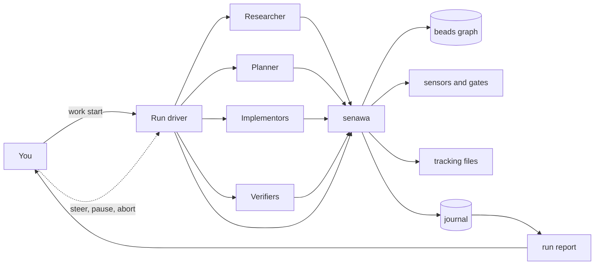

## Overview

Senawa (සේනාව) is an orchestration harness for [GitHub Copilot CLI](https://docs.github.com/copilot/how-tos/copilot-cli). You give it a goal and a workflow; it decomposes the work and delegates the pieces to specialist worker sessions: a researcher, a planner, one or more implementors, and verifiers. The part that decides what runs next is a deterministic driver rather than a model, so no agent is ever in the control path.

Three ideas hold the design together.

Durable workflow state lives outside the model, as a dependency graph in [beads](https://github.com/gastownhall/beads). Agents ask the graph what is workable rather than remembering a plan.

Every agent talks to the system through one command, `senawa`. That single seam is where policy lives, which means guardrails are enforced rather than merely requested.

Completion is granted, not claimed. A worker that finishes submits it; the harness runs sensors, evaluates gates, and either accepts the work or hands back actionable failures. This is the backpressure model described in [Manufacturing Backpressure in Coding Agent Harnesses](https://dasith.me/2026/06/14/backpressure-in-coding-agent-harnesses/).

Because everything routes through that one seam, the harness can also write down what happened. Every orchestration event lands in an append-only journal that no agent can author, and `senawa work report` renders it into a document you can read or attach to a pull request: which role did which task, on which model, how many times the harness sent the work back and why, what you decided, and what it cost.

## Three loops, and where you sit

Senawa runs three nested loops. You are not in the fast one, and you do not wait for the slow one.

| Loop | Who runs it | Period | You |
|------|-------------|--------|-----|
| Inner | one worker, alone | seconds to minutes | absent by design; this is where the harness pushes back |
| Middle | the run driver, deterministic | minutes to hours | steer it any time; it never waits for you |
| Outer | you | hours to days | you own the phase boundaries |

`senawa work start` blocks and drives the run to completion, so the loop advances with nobody watching. Cancel it and `senawa work resume` picks up where it stopped. While it runs you can steer a worker, pause new dispatches, or abort a task from another terminal, and every one of those lands in the run report.

This is the shape [Addy Osmani calls loop engineering](https://addyosmani.com/blog/loop-engineering/): you design the system that prompts the agents rather than prompting them yourself. [Carlos Perez's follow-up](https://medium.com/intuitionmachine/from-loop-engineering-to-graph-engineering-d3ebeb08511c) argues that a single loop always fails, and that the fix is a graph of loops that check each other. Senawa takes that seriously without mistaking its task graph for a control graph: what keeps it honest is narrower than topology. Deterministic sensors that execute real code. A journal no agent can write. A frozen set of files the optimizer cannot weaken. And a human who decides what "better" means.

## Status

Design stage. Nothing is implemented yet, but the risky assumptions have been tested rather than assumed. Eight probes in [poc/](poc/README.md) ran against the real Copilot CLI, the Copilot SDK, beads, and the proposed extension and workflow contracts. Six design assumptions did not survive, and throwaway prototypes now run both the worker rework loop and the declarative workflow engine end to end.

Start with [the design document](docs/design/multi-agent-orchestration.md), then read [the proof-of-concept findings](docs/design/poc-findings.md) before writing any code.

## How it fits together



## Concepts

| Term | Meaning |
|------|---------|
| Run driver | The foreground process started by `senawa work start`. Performs every transition and decides what runs next |
| Principal agent | An optional agent you talk to about a run. Reads status and steers on your behalf; it cannot dispatch or close work |
| Worker session | A role-scoped worker with its own context window, model, reasoning effort, and tool permissions. A separate session, not an in-process helper |
| Graph state | The dependency graph of tasks, gates, and their orchestration metadata, held in beads |
| Sensor | A tool that measures a property of the work and returns an assessment plus evidence. Builds, tests, linters, and reviewer agents |
| Gate | A rule that consumes sensor readings and resists progress when they are red |
| Anchor | A reading that cannot be argued with. Every gate needs at least one, or the harness is only agreeing with itself |
| Frozen set | Files no worker may write, such as the tests and the sensor definitions. Enforced, not requested |
| Journal | An append-only log of every orchestration event, written by the harness rather than by any agent |
| Run report | A rendered account of how the work was done, regenerated from the journal, the graph, and telemetry |
| Work directory | Per-request scratch space under `.agents/.copilot-tracking/`, holding research, plans, briefs, transcripts, verdicts, and the journal |

## Prerequisites

You will need GitHub Copilot CLI with an active Copilot subscription, Node.js 22 or later, and the `bd` binary from beads. Git is assumed.

### Package registry

The devcontainer uses the public npm registry by default. On first creation it copies `.devcontainer/.env.example` to the gitignored `.devcontainer/.env` file automatically. Docker Compose passes these values into the image build, so npm-based Dev Container Features use the configured registry before the container starts. The same values are available inside the running container.

To use a package proxy instead, create or edit the local file before rebuilding the devcontainer:

```bash
cp .devcontainer/.env.example .devcontainer/.env
```

Set both `NPM_CONFIG_REGISTRY` and `COREPACK_NPM_REGISTRY` in that file to the proxy URL, then rebuild the devcontainer. Variables exported by the host shell take precedence over `.devcontainer/.env` during Docker Compose interpolation.

Build arguments and image environment variables are not secret storage. Keep credentials out of the URL; configure npm authentication through your user-level `.npmrc` or a secret store.

## Repository layout

The tree below is the planned shape. Only `docs/` exists today.

```text
docs/design/          architecture, decision records, and proof-of-concept findings
poc/                  throwaway probes that validated the design against reality
packages/             core, graph, sensors, report, orchestrator, cli
.github/agents/       role definitions for the principal and each subagent
.github/hooks/        gate enforcement for sessions senawa does not host
.beads/formulas/      reusable workflow templates
sensors.yaml          sensor and gate definitions for this repository
```

## Further reading

* [Design documents map](docs/design/README.md)
* [Multi-agent orchestration design](docs/design/multi-agent-orchestration.md)
* [Proof-of-concept findings](docs/design/poc-findings.md)
* [Manufacturing Backpressure in Coding Agent Harnesses](https://dasith.me/2026/06/14/backpressure-in-coding-agent-harnesses/)
* [Refining Inferential Sensors in Coding Agent Harnesses](https://dasith.me/2026/06/20/refining-inferential-sensors/)
* [Structured workflows for coding with AI agents using the Breadcrumb Protocol](https://dasith.me/2025/04/02/vibe-coding-breadcrumbs/)
* [Loop Engineering](https://addyosmani.com/blog/loop-engineering/) and [From Loop Engineering to Graph Engineering?](https://medium.com/intuitionmachine/from-loop-engineering-to-graph-engineering-d3ebeb08511c)
* [beads documentation](https://beads.gascity.com/)
* [Comparing GitHub Copilot CLI customization features](https://docs.github.com/en/copilot/concepts/agents/copilot-cli/comparing-cli-features)

## Name

Senawa (සේනාව) is Sinhala for an army or host.
