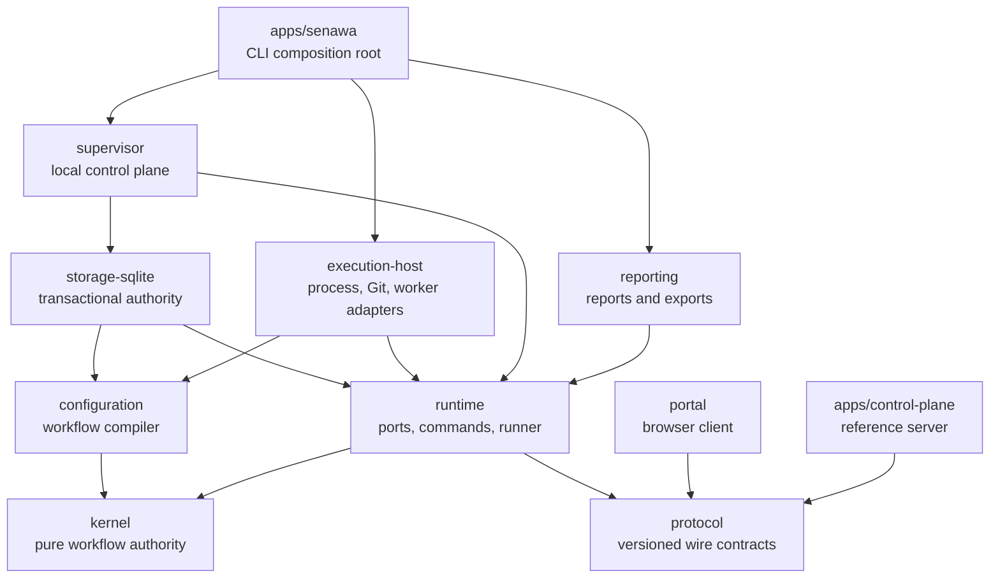
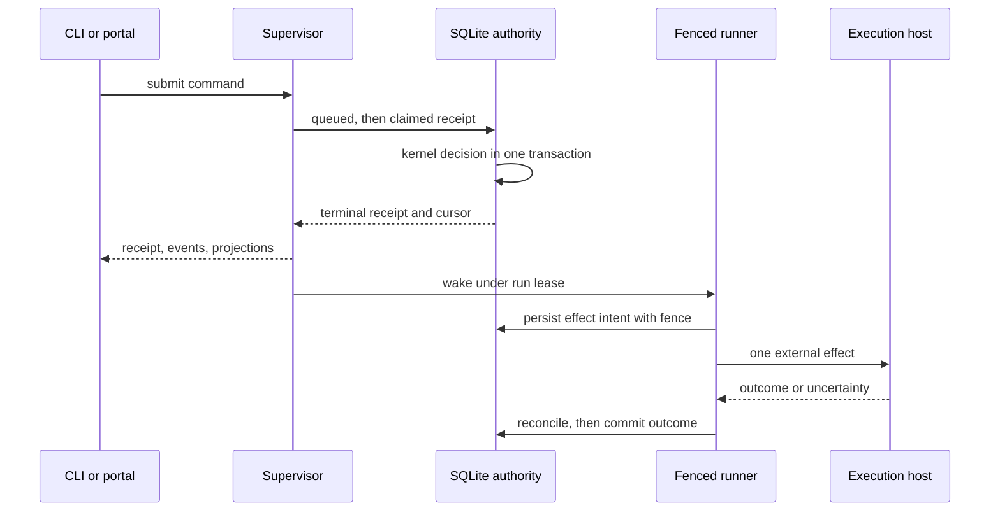
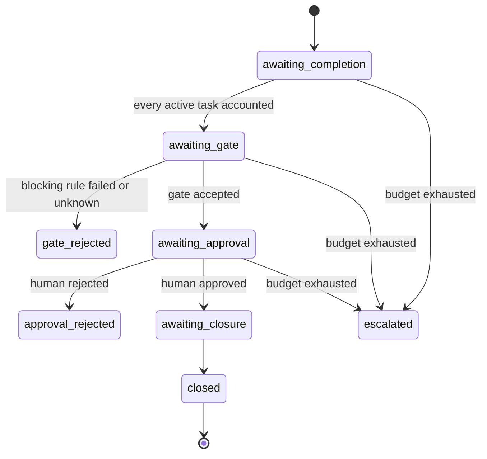

Senawa is the deterministic workflow kernel of a consumer-defined software
factory. It executes consumer-defined workflows as an auditable state machine on
your own host, with a local supervisor, a SQLite authority, and a browser run
console.

The repository is in an alpha implementation reset. Start with
[Getting started](docs/guide/getting-started.md).

## Documentation

* [Consumer guide](docs/guide/README.md) is the index for everything below.
* [Getting started](docs/guide/getting-started.md) installs the alpha, creates a
  workflow tree, starts the service, opens the portal, submits a command, and
  shuts down without spending model credits.
* [Workflow authoring](docs/guide/workflow-authoring.md) documents every field
  of `.senawa/workflow.json`.
* [Portal](docs/guide/portal.md) documents the run console, its workflow
  diagram, and its human decision surfaces.
* [Worktree mode](docs/guide/worktree-mode.md) documents the optional isolated
  workspace mode.
* [Operations](docs/guide/operations.md) documents paths, credentials, backup,
  restore, recovery, diagnostics, and the live-worker opt-in.
* [Security](docs/guide/security.md) documents principals, capabilities, grants,
  approvals, and the local and remote trust boundaries.
* [Troubleshooting and limits](docs/guide/troubleshooting.md) documents the
  platform matrix, common failures, and deferred behavior.

The references define exact surfaces: the [CLI reference](docs/reference/cli.md),
the [local supervisor HTTP reference](docs/reference/local-supervisor-http.md),
and the [remote control-plane reference](docs/reference/remote-control-plane.md).

The [design set](docs/design/README.md) explains why the system behaves this way,
with the [comprehensive plan](docs/design/implementation-plan.md) as the active
architecture source and the [implementation
log](docs/design/implementation-log.md) recording decisions.

## High-level design

Senawa executes consumer-defined workflows as a deterministic state machine.
Every transition is an immutable, content-addressed record derived from exact
authority facts, so a run can be replayed, audited, and resumed from the exact
boundary where it stopped.

Five rules shape the whole system:

* Authority flows one way. The kernel decides, storage commits, adapters act,
  and clients observe. No client, prompt, or model response can widen authority.
* Agents propose. Humans and workflow policy approve. Model output, central
  receipts, and prompt text are evidence, never decisions.
* Intent is persisted before any external effect, and the outcome is reconciled
  before it is committed, so a crash never silently duplicates work.
* Every autonomous loop carries an independent finite budget that escalates
  instead of running unbounded.
* Local-first control. Source, credentials, leases, and unsynchronized assets
  stay on the repository host even when a remote control plane is enrolled.

### Package graph

The kernel is pure and has no filesystem, process, network, database, Git,
clock, random, worker, sensor, or UI dependency. Protocol carries contracts with
no behavior. Only direct edges appear below.



### Command and effect lifecycle

A command becomes a durable receipt before anything external happens. The runner
then performs exactly one recoverable transition per operation under a fenced
run lease.



### Phase lifecycle

Phase state is derived, never stored as mutable status. Each projection is
rebuilt from the current candidate, gate evaluation, authority decision,
closure, and escalation records.



### Where the branch stands

Phases 0 through 16 are delivered, ending with the browser run console. Phase 17
adds the design and consumer documentation sets. Current status, acceptance
criteria, and remaining work live in the [comprehensive
plan](docs/design/implementation-plan.md).

## Development

```bash
pnpm install
pnpm build
pnpm typecheck
pnpm lint
pnpm test
pnpm package:alpha
pnpm test:packaging
pnpm check:boundaries
pnpm docs:links
```

The alpha execution host targets Linux x64 with glibc 2.34 or newer. Builds
require a C17 compiler available as `cc` and package the resulting
`senawa-process-supervisor` and `senawa-workspace-files` executables under
`@senawa/execution-host/dist`. Installed packages use those prebuilt helpers;
installation and runtime sensor execution never invoke a compiler.

`pnpm package:alpha` builds a deterministic local bundle under `dist/alpha`.
The bundle contains the public `senawa` package and exact local tarballs for its
internal workspace dependencies. It is a local alpha verification lane, not a
registry publication command. `pnpm test:packaging` copies the bundle to an
operating-system temporary directory, installs it there, and verifies init,
doctor, service, portal, platform metadata, dependency versions, inventories,
digests, executable modes, migrations, and native helpers without workspace
resolution.

The local core bundle does not declare, resolve, install, or load the Copilot
SDK or Koffi. A live-enabled installation must make the exact SDK available
separately; worker execution loads it only when a repository worker is
configured. The separate `pnpm test:live-worker` source lane requires explicit
cost and data acknowledgement plus its bounded model, credit, and timeout
settings. It can invoke a model and is never part of default or packaging
validation.

## CLI

The alpha ships one public executable, `senawa`. It creates and validates
workflow configuration, owns the local supervisor lifecycle, submits workflow
commands, reads durable receipts, events, and projections, reviews amendments,
mints portal sessions, and performs backup, restore, integrity, diagnostics, and
repair operations.

See [Getting started](docs/guide/getting-started.md) for the first journey,
[Operations](docs/guide/operations.md) for the operational commands, and the
[CLI reference](docs/reference/cli.md) for the complete surface with exact
arguments and exit codes.

Measured historical substrate behavior remains under
[experiments/probes](experiments/probes/README.md). Those probes do not imply
that their former production integrations remain supported.