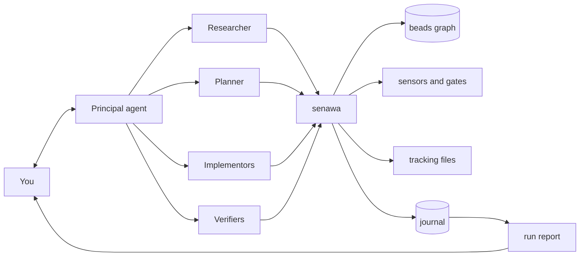

## Overview

Senawa (සේනාව) is an orchestration harness for [GitHub Copilot CLI](https://docs.github.com/copilot/how-tos/copilot-cli). A principal agent takes a high level request from you, decomposes it, and delegates the pieces to specialist subagents: a researcher, a planner, one or more implementors, and verifiers. The principal never reads your code. It coordinates, and it keeps its context small enough to see a multi-day piece of work through to the end.

Three ideas hold the design together.

Durable workflow state lives outside the model, as a dependency graph in [beads](https://github.com/gastownhall/beads). Agents ask the graph what is workable rather than remembering a plan.

Every agent talks to the system through one command, `senawa`. That single seam is where policy lives, which means guardrails are enforced rather than merely requested.

Completion is granted, not claimed. A subagent that finishes work submits it; the harness runs sensors, evaluates gates, and either accepts the work or hands back actionable failures. This is the backpressure model described in [Manufacturing Backpressure in Coding Agent Harnesses](https://dasith.me/2026/06/14/backpressure-in-coding-agent-harnesses/).

Because everything routes through that one seam, the harness can also write down what happened. Every orchestration event lands in an append-only journal that no agent can author, and `senawa work report` renders it into a document you can read or attach to a pull request: which role did which task, on which model, how many times the harness sent the work back and why, what you decided, and what it cost.

## Status

Design stage. Nothing is implemented yet. The architecture, the CLI surface, the sensor and gate model, and the technology decision are written up in [the design document](docs/design/multi-agent-orchestration.md), which is the place to start.

## How it fits together



## Concepts

| Term | Meaning |
|------|---------|
| Principal agent | The single agent you talk to. Plans the workflow, delegates, and surfaces decisions back to you |
| Subagent | A role-scoped worker with its own context window, model, reasoning effort, and tool permissions |
| Graph state | The dependency graph of tasks, gates, and their orchestration metadata, held in beads |
| Sensor | A tool that measures a property of the work and returns an assessment plus evidence. Builds, tests, linters, and reviewer agents |
| Gate | A rule that consumes sensor readings and resists progress when they are red |
| Journal | An append-only log of every orchestration event, written by the harness rather than by any agent |
| Run report | A rendered account of how the work was done, regenerated from the journal, the graph, and telemetry |
| Work directory | Per-request scratch space under `.agents/.copilot-tracking/`, holding research, plans, briefs, transcripts, verdicts, and the journal |

## Prerequisites

You will need GitHub Copilot CLI with an active Copilot subscription, Node.js 22 or later, and the `bd` binary from beads. Git is assumed.

## Repository layout

The tree below is the planned shape. Only `docs/` exists today.

```text
docs/design/          architecture and decision records
packages/             core, graph, sensors, report, orchestrator, cli
.github/agents/       role definitions for the principal and each subagent
.github/hooks/        gate enforcement for sessions senawa does not host
.beads/formulas/      reusable workflow templates
sensors.yaml          sensor and gate definitions for this repository
```

## Further reading

* [Multi-agent orchestration design](docs/design/multi-agent-orchestration.md)
* [Refining Inferential Sensors in Coding Agent Harnesses](https://dasith.me/2026/06/20/refining-inferential-sensors/)
* [Structured workflows for coding with AI agents using the Breadcrumb Protocol](https://dasith.me/2025/04/02/vibe-coding-breadcrumbs/)
* [beads documentation](https://beads.gascity.com/)
* [Comparing GitHub Copilot CLI customization features](https://docs.github.com/en/copilot/concepts/agents/copilot-cli/comparing-cli-features)

## Name

Senawa (සේනාව) is Sinhala for an army or host.
