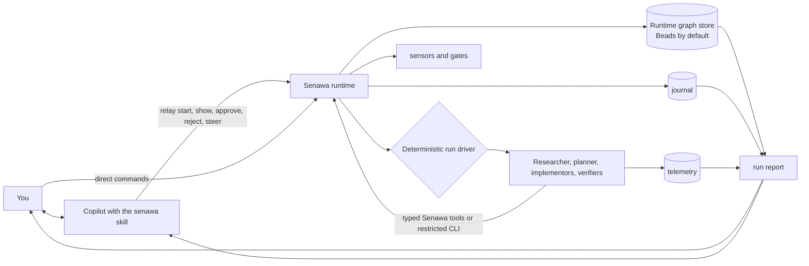

# Senawa

## Overview

Senawa (සේනාව) is an orchestration harness for [GitHub Copilot CLI](https://docs.github.com/copilot/how-tos/copilot-cli). You talk to an ordinary Copilot session carrying the senawa skill, and it turns what you ask for into `senawa` commands. Senawa decomposes the work and delegates the pieces to specialist worker sessions: a researcher, a planner, one or more implementors, and verifiers. The part that decides what runs next is a deterministic driver rather than a model, so no agent is ever in the control path.

Three ideas hold the design together.

Durable workflow state lives outside the model, behind a runtime graph-store
boundary. Ordinary CLI commands use
[beads](https://github.com/gastownhall/beads). The split file-backed runtime is
available only through explicit global `--runtime file` for development and
tests. Agents ask runtime state what is workable rather than remembering a plan.

Every agent-facing operation crosses the Senawa boundary. The principal agent
uses the CLI. Hosted workers use typed Senawa tools, and subprocess workers use a
restricted CLI wrapper. That single seam is where policy lives, which means
guardrails are enforced rather than merely requested.

Completion is granted, not claimed. A worker requests completion; the harness
runs sensors, evaluates gates, and either accepts the work or hands back
actionable failures. The driver remains authoritative even when a worker ends a
turn without making the request. This is the backpressure model described in
[Manufacturing Backpressure in Coding Agent Harnesses](https://dasith.me/2026/06/14/backpressure-in-coding-agent-harnesses/).

Because everything routes through that one seam, the harness can also write down what happened. Every orchestration event lands in an append-only journal that no agent can author, and `senawa work report` renders it into a document you can read or attach to a pull request: which host and adapter handled each turn, which models and efforts were configured, requested, resolved, and invoked, what evidence was consumed, how many times the harness sent the work back and why, what you decided, and what it cost.

## Three loops, and where you sit

Senawa runs three nested loops. Each outer layer sets a reference the layer
inside it cannot redefine.

| Loop | Who runs it | Period | You |
|------|-------------|--------|-----|
| Outer | you | hours to days | you own the request, declared phase decisions, and definition of better |
| Middle | the run driver, deterministic | minutes to hours | steer it any time; it asks at declared approvals and escalations |
| Inner | one worker, alone | seconds to minutes | absent by design; this is where the harness pushes back |

`senawa work start` drives the run in the foreground and stops when it needs a
decision. `senawa work resume` picks up from durable state. Detached execution
is not exposed because the current process does not provide a durable background
driver lifecycle.

Version 1 allows one unfinished Senawa run per repository and one active worker
turn. If a run cannot be completed or resumed, `senawa work end --reason "..."`
records its abandonment and frees the repository for a replacement. It does not
delete the ended run or its evidence. An active or stranded worker requires
explicit `--force`; forced end cancels the turn, waits a bounded grace period,
takes over through the fenced driver lease, reconciles the dispatch, and
persists terminal state before repository ownership is released.

## What a run looks like

A workflow is a sequence of phases you declare in the repository. Each one can
ask for your approval, and any phase you are not happy with can be sent back to
run again on top of what it already produced.

```text
you   Add Entity Framework support for the persistence layer
PA    [senawa workflow list] I can run standard-delivery or hotfix. Which?
you   standard-delivery
PA    [senawa work start "<goal>" --workflow standard-delivery] Define is ready.
PA    [senawa phase brief define] Define is ready: artifacts/define/v1.json, version 1, digest <digest>
PA    [senawa phase artifact define --version 1] <complete definition artifact>
you   looks right, go on
PA    [senawa --caller principal-agent approve define --expected-version 1 --expected-digest <digest>] [senawa work resume]
PA    [senawa work wait --timeout 300] Research is ready: v1
PA    [senawa phase brief research] Research artifact: artifacts/research/v1.json, version 1, digest <digest>
PA    [senawa phase artifact research --version 1] <complete research artifact>
you   approve
PA    [senawa --caller principal-agent approve research --expected-version 1 --expected-digest <digest>] [senawa work resume]
PA    [senawa work wait --timeout 300] Plan is ready: v1, 6 tasks
PA    [senawa phase brief plan] Plan artifact: artifacts/plan/v1.json, version 1, digest <digest>
PA    [senawa phase artifact plan --version 1] <complete plan artifact>
you   no error handling on the adapter boundary
PA    [senawa --caller principal-agent reject plan --reason "<reason>" --expected-version 1 --expected-digest <digest>] [senawa work resume]
PA    [senawa work wait --timeout 300] Plan v2 adds two tasks for it
PA    [senawa phase brief plan] Plan artifact: artifacts/plan/v2.json, version 2, digest <digest>
PA    [senawa phase artifact plan --version 2] <complete plan artifact>
you   approve
PA    [senawa --caller principal-agent approve plan --expected-version 2 --expected-digest <digest>] [senawa work resume] Implementing.
you   how is it going?
PA    [senawa work show] 4 of 6 closed.
      bd-a1b2 was refused once on unit-tests and passed on its second attempt.
PA    [senawa work wait --timeout 300] Verify is ready: v1
you   add the tasks in extra-tasks.json
PA    [senawa plan revise --add extra-tasks.json] [senawa work resume]
PA    [senawa work wait --timeout 300] Done, verify re-ran: v2
PA    [senawa phase brief verify] Verification artifact: artifacts/verify/v2.json, version 2, digest <digest>
PA    [senawa phase artifact verify --version 2] <complete verification artifact>
you   accept
PA    [senawa --caller principal-agent approve verify --expected-version 2 --expected-digest <digest>] [senawa work resume]
PA    [senawa work wait --timeout 300] Run accepted. Report at report.md
```

Everything in brackets is a `senawa` command. Rejecting a phase is the normal
case rather than an error path: your reason becomes the input to the next
iteration, and every artifact version is kept, so you can see what changed and
why.

Additive plan revision currently consumes a schema-valid task file. Turning a
free-form request into that file is not part of the principal agent contract.

This is the shape [Addy Osmani calls loop engineering](https://addyosmani.com/blog/loop-engineering/): you design the system that prompts the agents rather than prompting them yourself. [Carlos Perez's follow-up](https://medium.com/intuitionmachine/from-loop-engineering-to-graph-engineering-d3ebeb08511c) argues that a single loop always fails, and that the fix is a graph of loops that check each other. Senawa takes that seriously without mistaking its task graph for a control graph: what keeps it honest is narrower than topology. Deterministic sensors that execute real code. A journal no agent can write. A frozen set of files the optimizer cannot weaken. And a human who decides what "better" means.

## Status

The first production vertical slice is implemented in `packages/`. It includes
strict repository contracts, a deterministic driver, versioned artifacts,
singleton and lease enforcement, append-only events and output, a shared CLI and
HTTP command path, the loopback browser supervisor, and report rendering.
`@senawa/application` owns commands, queries, driver transitions, prompts,
status projections, and the ports consumed by both adapters. Its production
code imports only `@senawa/domain`; executable composition lives in
`apps/senawa` and injects the selected adapters directly.
Repository worker profiles under `.senawa/agents` now provide strict model,
capability-request, and prompt configuration. Their exact sources are frozen,
snapshotted, and fingerprinted; hosts apply a separate Senawa-owned capability
ceiling. Workflows, schemas, profiles, and sensor policy are repository-owned at
`.senawa/workflows/`, `.senawa/schemas/`, `.senawa/agents/`, and
`.senawa/sensors.yaml`. Runtime hooks, isolation, capability ceilings, gate
evaluation, and audit remain Senawa-owned.

The `@senawa/sensors` package now runs the built-in artifact and command sensors
from snapshotted policy. `RunCommandService` evaluates their readings and owns
every gate transition; worker hosts return no acceptance verdict. Sensor starts,
completions, execution errors, and gate evidence are recorded in the journal.
Deterministic sensors run from cheap to expensive, later blocking expensive
checks stop after a deterministic failure, and advisory checks still report.
Cache identity and evidence-spill ports keep those storage choices outside the
gate evaluator. `senawa sensor audit [<run>]` derives verdict agreement, drift
transitions, and latency from recorded readings. Hook latency remains an
explicit unreported metric until the hook writes measurements.

`@senawa/workers` owns simulated, recording, Copilot subprocess, and Copilot SDK
lifecycle adapters, capability negotiation, authorization, normalized events,
and explicit create, resume, inspect, cancel, and release operations. The SDK
adapter is pinned to `@github/copilot-sdk` 1.0.7 and uses caller-chosen session
identity, pre-send event registration, native typed tools, canonical permission
callbacks, model and effort discovery, W3C trace injection, explicit abort,
isolated session storage, and retain or archive-delete release. Application-owned
typed binding contracts cover task completion, phase submission, questions,
discoveries, and notes. Normalized lifecycle, model, trace, text, artifact,
task-diff, duration, usage, AIU, and cost events are durably deduplicated before
output can fan out to the browser. Task transcripts and explicit no-diff
evidence are materialized in the work directory. Offline conformance uses the
simulated adapter, a bounded recording fake executable, and an injected
fake SDK client. No validation command starts Copilot or spends AI credits.
Live SDK session execution remains unvalidated.
New worker-producing runs default to canonical `--worker-host copilot-sdk` and
persist that choice. Select `--worker-host simulated` explicitly for tests,
offline demos, and no-credit probes. Read-only status, report, browser, workflow,
and ordinary doctor commands do not start Copilot. The SDK launches the installed
`copilot` runtime over stdio only for connected diagnostics or worker dispatch.
Senawa resolves the runtime to an absolute executable from `PATH`; set
`SENAWA_COPILOT_CLI` to an absolute path when the CLI is installed outside
`PATH`. A failed live host never falls back to simulation.

The `senawa` app composes `@senawa/runtime-beads` by default and selects
`@senawa/runtime-file` only for explicit `--runtime file` commands. Mutable runtime state,
active-run ownership, fenced leases, immutable documents, journal JSONL, and
session/turn output streams each have one file authority. Owner output replay is
derived across those streams. Browser commands have a separate run-scoped,
append-only receipt authority with fenced claims and restart recovery. A
write-ahead transaction
replays interrupted cross-store commits on reopen. Shared contracts cover
restart, revisions, document conflicts, journal and output idempotency, lease
fencing, mid-commit crash recovery, dispatch reconstruction, and projections.
Run, output, worker, and receipt SSE streams reread durable cursors as their
correctness path, so independent process writes and supervisor restart do not
depend on process-local notifications.

The loopback console now lives in `@senawa/browser`, and `@senawa/reporting`
renders from an application evidence projection rather than a runtime adapter.
The report renderer neutralizes control characters, instruction-like tags, raw
HTML, and Markdown syntax in capped untrusted fields. It renders request and
outcome, decomposition, worker execution, gate and human history, discoveries,
notes, exact consumed manifests, trusted task evidence, and usage by role and
invoked model. `@senawa/web` and
`@senawa/report` have been removed with the other internal compatibility
packages. The `senawa` app wires target adapters directly.

Run identity and the active-run pointer record the selected backend. Status and
reports expose it, and reopening through another backend is rejected. Beads
startup errors are terminal and never fall back to file state. The deterministic
file and Beads offline demos are covered by integration tests. The opt-in
Copilot subprocess host is implemented, but this production live-worker path has
not been validated in this slice. Existing live-model claims remain limited to
the probes that recorded them.

Start with the [design index and reading order](docs/design/README.md). It moves
from the system model and workflow lifecycle into agents, quality enforcement,
runtime state, provenance, and implementation. Probe evidence and abandoned
directions remain available in the non-authoritative design working record.

## Production demo

Install dependencies, then run the no-credit demo against the default Beads
runtime:

```bash
pnpm install
pnpm demo:beads
```

This builds Senawa, creates an isolated temporary repository, and runs the
standard workflow through the real CLI and loopback browser command path with
explicit simulated workers. Mutable state is stored in a real Beads database. See
[`examples/demos/beads-offline/README.md`](examples/demos/beads-offline/README.md)
for full details and the `--keep-server` option.

To run the file-backed variant instead (explicit development/test mode using
`--runtime file`), use:

```bash
pnpm demo
```

See [`examples/demos/file-offline/README.md`](examples/demos/file-offline/README.md)
for details.

The complete generated command grammar is in the [CLI reference](docs/reference/cli.md).
`senawa init`, individual `sensor run`, `task done`, and `task abort` remain
deferred. Initialization lacks versioned scaffold assets; individual sensor
execution lacks an instance-level expectation contract; task completion lacks
an authenticated subprocess command bridge; and task abort lacks per-task
driver coordination despite forced whole-run cancellation being available.

Open the active run console directly:

```bash
senawa browser
```

Pass a run ID to open an ended or finished run. The command starts the loopback
supervisor, opens a high-entropy bootstrap URL through `$BROWSER`, and keeps
serving until interrupted. It also prints that URL so a failed browser launch,
link preview, or later retry can recover the same session.

For remote forwarding or manual opening, prevent the local launch:

```bash
senawa browser [<run-id>] --no-open
```

The bootstrap capability remains valid only while that supervisor process is
running. Keep it private: anyone who can reach the loopback or forwarded port
and possesses the URL can obtain a browser session. Authentication remains
necessary because the console can approve, reject, steer, resume, and end runs,
answer active worker questions, and display source, prompts, paths, and process
diagnostics. Command POSTs return after durable receipt submission; the fenced
supervisor executes and recovers the command while receipt-local SSE reports
queued, running, completed, or refused state. Worker answers use a separate
authenticated route so they remain available while a command receipt is active.

The live-worker launcher is separate and guarded:

```bash
pnpm demo:live -- --confirm-cost --host copilot-sdk --goal "Implement the requested change"
```

It prints an AI-credit warning before starting and selects
`--worker-host copilot-sdk`. Pass `--host copilot-subprocess` to exercise the
experimental subprocess adapter. It uses `--runtime file` (the explicit
development and test adapter) for state storage. This path is opt-in and does
not establish authenticated Sonnet 5 or Opus 5 availability, live workflow
quality, or tmux behavior. Exit code `2` means the run reached a human decision,
not that the start failed. Resume uses the host persisted by start and refuses
an explicit mismatch.

## How it fits together



The normal conversational path is you, the principal agent, Senawa, then the
workers. The principal agent relays your intent and explains what came back; it
never decides what runs next, and it never reaches past Senawa to the graph, the
journal, or the workers. You can also drive Senawa directly, and the harness runs
headless with no principal agent at all.

## Concepts

| Term | Meaning |
|------|---------|
| Workflow | A declarative sequence of phases, with their gates, approvals, and iteration budgets. Lives in the repository |
| Phase | A stage of a workflow. Can be entered more than once, so rejecting one starts an iteration rather than an error |
| Run driver | The process started by `senawa work start`. Performs every transition and decides what runs next |
| Principal agent | The Copilot session you talk to, carrying the senawa skill. Relays your intent as `senawa` commands and explains what came back. It never decides what runs next, and the harness runs without it |
| Worker session | A role-scoped worker with its own context window, model, reasoning effort, and tool permissions. A separate session, not an in-process helper |
| Artifact | A phase's schema-validated output, versioned rather than overwritten. A plan's tasks become the implementation frontier |
| Graph state | The dependency graph of phases, tasks, and gates plus orchestration metadata, held by Beads for ordinary commands |
| Sensor | A tool that measures a property of the work and returns an assessment plus evidence. Builds, tests, linters, and reviewer agents |
| Gate | A rule that consumes sensor readings and resists progress when they are red |
| Anchor | A deterministic reading that cannot be argued with. Every blocking gate needs at least one, or the harness is only agreeing with itself |
| Frozen set | Files no worker may write, such as tests, sensor definitions, workflows, schemas, and worker profiles. Enforced, not requested |
| Journal | An append-only log of every orchestration event, written by the harness rather than by any agent |
| Run report | A rendered account of how the work was done, regenerated from the journal, the graph, and telemetry |
| Work directory | Durable per-run files under `.agents/.copilot-tracking/`, including frozen definitions, versioned artifacts, transcripts, evidence, and the journal |

## Prerequisites

The offline vertical slice requires Node.js 22.12 or later, pnpm 10 or later, Git,
and `bd` 1.1.x for ordinary commands. Explicit `--runtime file` development and
test commands do not require `bd`. Worker-producing commands use the Copilot SDK
host by default and require GitHub Copilot CLI with an active Copilot
subscription. Offline work must select `--worker-host simulated` explicitly.

A repository running Senawa must provide `.senawa/sensors.yaml`, workflows,
schemas, and worker profiles under `.senawa/`. It must also provide
`.agents/skills/senawa/SKILL.md` when a Copilot session will act as the
conversational principal agent. The latter path is a Copilot discovery
exception, not runtime worker configuration.

### Package registry

The devcontainer uses the public npm registry by default. On first creation it copies `.devcontainer/.env.example` to the gitignored `.devcontainer/.env` file automatically. Docker Compose passes these values into the image build, so npm-based Dev Container Features use the configured registry before the container starts. The same values are available inside the running container.

To use a package proxy instead, create or edit the local file before rebuilding the devcontainer:

```bash
cp .devcontainer/.env.example .devcontainer/.env
```

Set both `NPM_CONFIG_REGISTRY` and `COREPACK_NPM_REGISTRY` in that file to the proxy URL, then rebuild the devcontainer. Variables exported by the host shell take precedence over `.devcontainer/.env` during Docker Compose interpolation.

Build arguments and image environment variables are not secret storage. Keep credentials out of the URL; configure npm authentication through your user-level `.npmrc` or a secret store.

## Repository layout

The tree below shows the repository definition and runtime ownership boundaries.

```text
docs/design/                 numbered current-state guides and their reading index
docs/design/wip/             proposed decisions, evidence, rejected ideas, and the historical monolith
apps/                        deployable Senawa CLI and hook composition roots
examples/demos/              supported simulated and guarded live demonstrations
experiments/probes/          bounded experiments that measured substrate behavior
packages/                    reusable runtime, sensor, browser, and reporting components
packages/domain/             pure contracts, schemas, events, and transition invariants
packages/configuration/      repository definitions, snapshots, fingerprints, and diagnostics
packages/application/        commands, queries, driver, prompts, projections, and ports
packages/runtime-beads/      production Beads runtime graph and split-write reconciliation
packages/runtime-file/       explicit dev/test runtime, active-run, lease, receipt, and recovery adapter
packages/artifact-store/     immutable run identity, snapshot, and artifact documents
packages/observability/      append-only journal, output streams, and notification hints
packages/workers/            worker lifecycle, negotiation, authorization, events, and binding adapters
packages/sensors/            ordered gate evaluation, command sensors, cache, and evidence seams
packages/browser/            authenticated HTTP, receipt and output SSE, questions, and graph console
packages/reporting/          report rendering over application evidence projections
packages/testing/            shared adapter contracts and simulated fixtures
tests/contract/              shared storage, recovery, fencing, dispatch, and projection suites
apps/senawa-hook/            embedded subprocess hook policy
.senawa/agents/              strict worker profiles with model, capability requests, and prompts
.senawa/workflows/           phase definitions: gates, approvals, iteration budgets
.senawa/schemas/             artifact contracts for each phase
.senawa/sensors.yaml         sensor extensions, configured sensors, gates, and frozen paths
.senawa/extensions/          locally declared sensor extensions
.agents/skills/senawa/       the skill that lets a Copilot session drive the harness
.agents/rubrics/             rubrics for inferential sensors
```

The `.senawa` entries are consumer-authored Senawa configuration. The skill path
is separate only because Copilot discovers it there. Repository
`.github/agents` and `.github/hooks` files are not Senawa configuration;
enforcement is implemented in Senawa packages.

## Further reading

* [Design index and reading order](docs/design/README.md)
* [System model](docs/design/01-system-model.md)
* [Workflows and lifecycle](docs/design/02-workflows-and-lifecycle.md)
* [Agents and interaction](docs/design/03-agents-and-interaction.md)
* [Design working record](docs/design/wip/README.md)
* [Manufacturing Backpressure in Coding Agent Harnesses](https://dasith.me/2026/06/14/backpressure-in-coding-agent-harnesses/)
* [Refining Inferential Sensors in Coding Agent Harnesses](https://dasith.me/2026/06/20/refining-inferential-sensors/)
* [Structured workflows for coding with AI agents using the Breadcrumb Protocol](https://dasith.me/2025/04/02/vibe-coding-breadcrumbs/)
* [Loop Engineering](https://addyosmani.com/blog/loop-engineering/) and [From Loop Engineering to Graph Engineering?](https://medium.com/intuitionmachine/from-loop-engineering-to-graph-engineering-d3ebeb08511c)
* [beads documentation](https://beads.gascity.com/)
* [Comparing GitHub Copilot CLI customization features](https://docs.github.com/en/copilot/concepts/agents/copilot-cli/comparing-cli-features)

## Name

Senawa (සේනාව) is Sinhala for an army or host.
