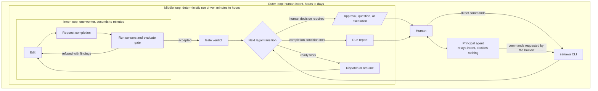

# Senawa System Model

## Purpose

Senawa delegates coding work to role-scoped Copilot sessions while keeping
control flow outside every model. Agents decide how to perform assigned work. A
deterministic driver decides what may run next, and gates decide whether the
result may advance.

The design addresses a specific failure: a model produces unsound work and then
reports success. Senawa does not try to eliminate model mistakes. It makes those
mistakes visible and recoverable by removing completion authority from the model.

## Operating rule

Three invariants carry the system:

* A worker cannot close its task, mutate the graph, or weaken the checks applied
  to it.
* Every blocking gate includes a deterministic reading, so model opinion is
  never the only ground truth.
* The record of what happened is produced by harness operations, not authored by
  an agent.
* A task closes only when the worker states, criterion by criterion, what it did,
  and its configured deterministic gate evidence passes.

Definitions are inputs. Beads is runtime truth. The journal is history.

## The three nested loops

Senawa has three control layers. They are nested because each outer layer sets a
reference the layer inside it may not redefine.

| Layer | Owner | Decides | Human involvement |
|-------|-------|---------|-------------------|
| Outer | Human | What is worth doing and what better means | Owns requests, phase decisions, and termination |
| Middle | Run driver | What runs next and whether a transition is legal | Stops at declared decisions; accepts steering between transitions |
| Inner | Worker session | How to perform one assigned unit of work | Absent by design |

The human is not in the inner loop. That absence is safe because the middle loop
is deterministic and the outer loop retains authority over the references that
determine success.

## Principal agent position

The principal agent is on the interaction path and off the control path.

On the interaction path, it is the Copilot session the human talks to. It carries
the Senawa skill, translates intent into `senawa` commands, reads bounded status,
quotes sensor findings, and relays explicit human decisions.

Off the control path, it has no authority to choose a transition. It cannot
dispatch workers, close tasks, reorder work, alter budgets, or approve something
the human has not approved. The driver performs the same transitions when a
human invokes the CLI directly or when CI runs without a principal agent.

This distinction makes the principal agent architecturally optional and
operationally useful. Headless execution proves that control does not depend on a
model. Conversational execution keeps the system usable.

## Components

| Component | Responsibility | Authority |
|-----------|----------------|-----------|
| Workflow | Declares phases, dependencies, artifacts, gates, approvals, and limits | Defines legal shape before a run starts |
| Principal agent | Converts human intent to CLI operations and explains results | Relays explicit human actions only |
| Run driver | Repeatedly computes and performs the next legal transition | Owns control flow |
| Runtime backend | Persists and reconstructs graph state | Stores state, never chooses transitions |
| Worker host | Selects the operator-facing execution mode frozen into run identity | Resolves one compatible adapter without fallback |
| Worker adapter | Implements worker negotiation, lifecycle, and event normalization | Executes a bounded turn, never grants completion |
| Worker session | Produces one phase artifact or implements one task | Chooses implementation, never completion |
| Sensor | Measures a property and returns a schema-valid assessment | Perceives, never decides |
| Senawa gate | Compares sensor output with declared expectations | Decides whether measured work may advance |
| Beads gate | Records an external condition such as human approval | Blocks graph readiness until resolved |
| Beads graph | Stores phases, tasks, dependencies, gates, and runtime metadata | Runtime source of truth |
| Journal | Records ordered orchestration events and actors | Historical source of truth |
| Work directory | Stores the frozen snapshot, artifacts, evidence, and isolated sessions | Durable per-run files |

## A run in one page

1. `senawa doctor` validates extensions, schemas, sensors, gates, roles,
   workflows, and loop limits.
2. `senawa work start` validates the request, preflights every configured role,
  snapshots every definition the run will consume, and freezes the selected
  worker host and adapter identity.
3. The driver creates the phase graph in beads and computes the first legal
   transition.
4. Agent phases produce schema-validated, versioned artifacts.
5. The plan artifact is imported into a dependency-aware task frontier.
6. Workers request completion through Senawa. Sensors run, and the task closes
   only when its gate accepts the readings.
7. Declared approval points stop the driver and identify the artifact by path,
  version, and digest. The human sees its bounded overview and complete content
  before deciding. Rejection starts another versioned iteration.
8. The driver exits when the workflow completion condition is accepted, a limit
   is exhausted, or the operator interrupts it.
9. `senawa work resume` reconciles interrupted intent and continues the same run.
10. `senawa work report` renders the graph, journal, and telemetry into an
    auditable account.

## Approval and steering

Approval and steering cross the outer-to-middle boundary differently.

Approval stops the run. A phase with `approval: human` remains blocked until the
human approves or rejects its artifact. A relayed approval records the
`principal-agent` channel; a workflow may require `human-direct` instead.
Caller attribution records provenance and never upgrades the principal agent's
authority.

Steering does not stop the run. `senawa steer` writes to a durable inbox that the
driver consumes between transitions. The instruction affects the next safe turn
without changing an operation already in progress.

## Bounded autonomy

Every repeated operation has a finite limit:

| Limit | Counts | Exhaustion response |
|-------|--------|---------------------|
| Task rework attempts | Valid worker turns followed by a red gate | Escalate the task |
| Dispatch failures | Sessions that did not start or resume | Escalate an infrastructure problem |
| Phase iterations | Human rejection of a phase artifact | Stop and request a decision |
| AIU budget | Run spend | Stop before additional dispatch |

A driver can operate unattended inside those boundaries. It cannot invent a new
boundary or spend without an owner.

Version 1 also bounds concurrency at the product level: one unfinished Senawa
run per repository and one active Senawa-created worker turn within that run.
`work end --reason "..."` abandons a stuck run without erasing it, then releases
the repository for a replacement only after terminal state is durable.

These authority, persisted-host, evidence, and artifact-bound decision contracts
are [confirmed offline](wip/probe-findings.md#live-default-and-evidence-contracts).
Authenticated Sonnet 5 and Opus 5 execution and tmux-hosted worker terminals are
not established by that evidence.

## Next reading

Continue with [Workflows and Lifecycle](02-workflows-and-lifecycle.md) to see how
the system model becomes a concrete, restartable run.
