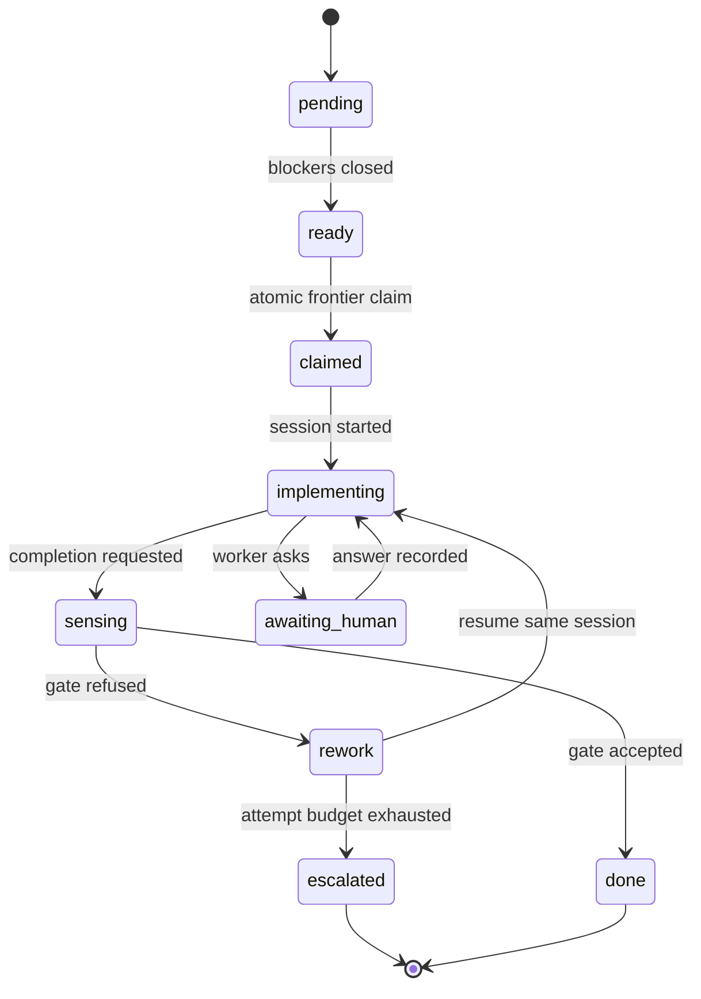

# Runtime and State

## Purpose

The run driver is a deterministic process that repeatedly reloads graph state,
computes one legal transition, performs its side effect, and records the outcome.
It holds no model context and no authoritative plan in memory.

## State ownership

| State | Home | Reason |
|-------|------|--------|
| Epic, phases, tasks, dependencies, statuses | Beads | Dependency-aware runtime truth |
| Iteration, session ID, artifact version, attempts, model | Bead metadata | State attached to the graph node it describes |
| Phase state transitions | `bd set-state` event beads and labels | Audit plus cheap state queries |
| Human approval | Beads human gate | Waiting becomes structural |
| Journal | `journal.jsonl` | Ordered, high-frequency events do not fit an issue tracker |
| Driver lease | `driver.lock` | Heartbeat state is local and transient |
| Steering inbox | `steering.jsonl` | Consumed between transitions |
| Artifacts, snapshot, sessions, sensor cache | Work directory | These values are files or file-backed evidence |
| Run identity | `work.json` | Immutable pointer to workflow, epic, fingerprint, and input |
| Status cache | `cache.json` | Derived and safe to delete |

Where a cache and beads disagree, beads wins. Deleting `cache.json` and resuming
must reconstruct the same projection.

## Workflow graph mapping

| Workflow concept | Beads construct |
|------------------|-----------------|
| Human-requested work | Epic or molecule root |
| Phase and implementation task | Child issue |
| Ordering | `blocks` dependency |
| Concurrent fan-out | Siblings with no edge and a parallel-group hint |
| Fan-in | One dependency per required contribution |
| Approval or external wait | Gate issue |
| Discovered work | Child linked with `discovered-from` |
| Human question | Threaded message issue and a human gate |
| Orchestration substate | `bd set-state` event plus `senawa:<state>` label |
| Integration serialization | Merge slot |

The driver asks the graph for the ready frontier. It does not reconstruct a task
list from an artifact or conversation on every turn.

## Node lifecycle



Coarse beads status supports frontier calculation. Structured metadata under the
`senawa` namespace carries details such as attempt, session ID, artifact version,
resolved model, and last gate fingerprint.

## Driver transition

One transition follows this shape:

1. Reload the relevant graph state.
2. Consume steering that applies before the next operation.
3. Determine the unique legal transition from workflow policy and graph state.
4. Record transition intent when the side effect cannot be atomic with the
   journal.
5. Perform the bounded side effect.
6. Record outcome and update graph metadata.
7. Invalidate affected read-cache entries.
8. Repeat until completion, human intervention, pause, exhaustion, or error.

The command forms of `senawa task next`, `senawa dispatch`, and
`senawa gate check` expose these code paths for debugging. The driver calls the
same operations in process; it does not shell out to itself.

## Intent and outcome

Dispatch crosses a process or RPC boundary, so the journal records both sides:

```text
task.dispatching { task, attempt, session_id }
    ... create or resume the session ...
task.dispatched  { task, attempt, session_id, resolved_model }
```

An intent with no outcome signals reconciliation. `senawa work resume` checks the
stable session identifier:

| Observation | Recovery |
|-------------|----------|
| Session exists and turn completed | Adopt output, evaluate gate, continue |
| Session exists and turn unfinished | Resume with the same brief |
| Session is missing | Redispatch and count one dispatch failure |

Worker failures and dispatch failures have separate budgets. A model flag or
runtime outage must not consume the allowance intended for code rework.

## Driver lease

One driver owns a run at a time. The work directory contains a lease with process
identity, host, and heartbeat.

* `work start` acquires the initial lease.
* `work resume` refuses while a live lease exists.
* A stale lease can be taken over after reconciliation.
* Atomic task claims prevent duplicate task ownership, but the lease also orders
  phase transitions and journal writes.

The first interrupt stops new dispatches and lets in-flight work finish. A second
interrupt aborts the current turn. Both leave resumable state.

## Version 1 singleton

Version 1 supports one unfinished Senawa run per repository and one active
Senawa-created worker turn within that run. These are separate invariants:

| Guard | Scope | Lifetime |
|-------|-------|----------|
| Repository active-run pointer | Prevents a second `work start` for a different work item | From successful start until `finished` or `ended` is durable |
| Driver lease | Prevents two drivers advancing the active run | While one driver process is alive or until its lease is stale |
| Web-supervisor lease | Prevents two HTTP supervisors serving the same run | While `senawa web` owns that run |
| Dispatch limit | Prevents a second worker turn starting | Until the current turn records an outcome |

Retained phase sessions do not count as active workers. They are parked context
that only one dispatcher may resume. Browser viewers and the human's principal
agent session also do not count.

`work start` refuses while the repository pointer names an unfinished run and
returns that run's status and the valid next actions: show, resume, open the web
console, or end. The pointer is released only after terminal graph state, the
journal event, and the projection are durable.

If normal shutdown fails, `work end --force --reason "..."` first asks the live
driver to stop, waits a bounded grace period, then takes over only when its lease
is stale or the process is confirmed gone. It reconciles in-flight intent,
records the affected worker as aborted or dispatch-failed, marks the run ended,
and releases the pointer last. A raw lock-file deletion is not a supported
recovery path.

## Beads adapter contract

`@senawa/graph` is the only component that invokes `bd` and follows these rules:

1. Set `BD_JSON_ENVELOPE=1` for every call and validate the envelope version.
2. Run initialization with non-interactive flags and closed stdin.
3. Claim with `bd ready --claim --json` so selection and ownership are atomic.
4. Use `bd batch` for supported related writes, but write metadata separately.
5. Cache reads and invalidate on every relevant write.
6. Validate imported plans structurally before approval.
7. Use `bd list --all` when reconstructing work, because the default hides
   closed tasks and event beads.

The final rule prevents completed tasks from disappearing and being recreated by
an additive plan revision.

Measured calls take hundreds of milliseconds. That cost is acceptable beside
minute-scale model turns, but it makes graph access unsuitable for per-tool hooks.

## Status projection

`senawa work show` returns a bounded projection rather than the full graph:

```json
{
  "status": "awaiting_approval",
  "needs": {
    "action": "approve",
    "phase": "plan",
    "artifact": "artifacts/plan/v2.json"
  },
  "progress": {
    "phases": "3/5 accepted",
    "tasks": "2/4 closed"
  },
  "frontier": [
    {
      "id": "bd-a1b2",
      "title": "Split parse_batch into stages",
      "role": "implementor"
    }
  ],
  "cursor": 128,
  "budget": {
    "aiu_spent": 41.2,
    "aiu_cap": 250
  }
}
```

`status` and `needs` answer whether the run is done and what the human owes it.
The projection is capped at roughly 1,500 tokens. Larger content is represented
by a path.

## Future parallel execution

Worktrees, multiple active runs, and parallel worker turns are explicitly
deferred. They require run selection in every command and browser route,
filesystem isolation, integration policy, per-run leases, resource scheduling,
and evidence that output and graph updates remain correctly attributed.

The eventual design will require isolation at three boundaries:

| Boundary | Mechanism |
|----------|-----------|
| Filesystem | One Git worktree per parallel worker |
| Graph writes | Serialize through the Senawa graph adapter |
| Integration | Acquire the project merge slot |

Worktrees share the same beads workspace. Filesystem isolation therefore does not
provide graph isolation. Embedded Dolt serializes concurrent writes rather than
corrupting them, but concurrent direct `bd` calls add no throughput and bypass
Senawa policy and accounting.

Planning marks safe sets with `execution_parallel_group`. The dispatcher respects
the current Copilot concurrency cap, queues excess work, and compares intended
parallelism with the waves reported by structural graph validation.

## Model and effort resolution

Execution metadata contains portable hints, not runtime flags. Before session
creation, the dispatcher maps model and reasoning effort through a capability
table. Unsupported effort is omitted rather than forwarded as a hard error.

The graph records both requested hints and resolved runtime values. The run report
must describe what actually ran.

## Next reading

Continue with [Provenance and Observability](06-provenance-and-observability.md)
for the work directory, journal, report, tracing, and cost attribution.
