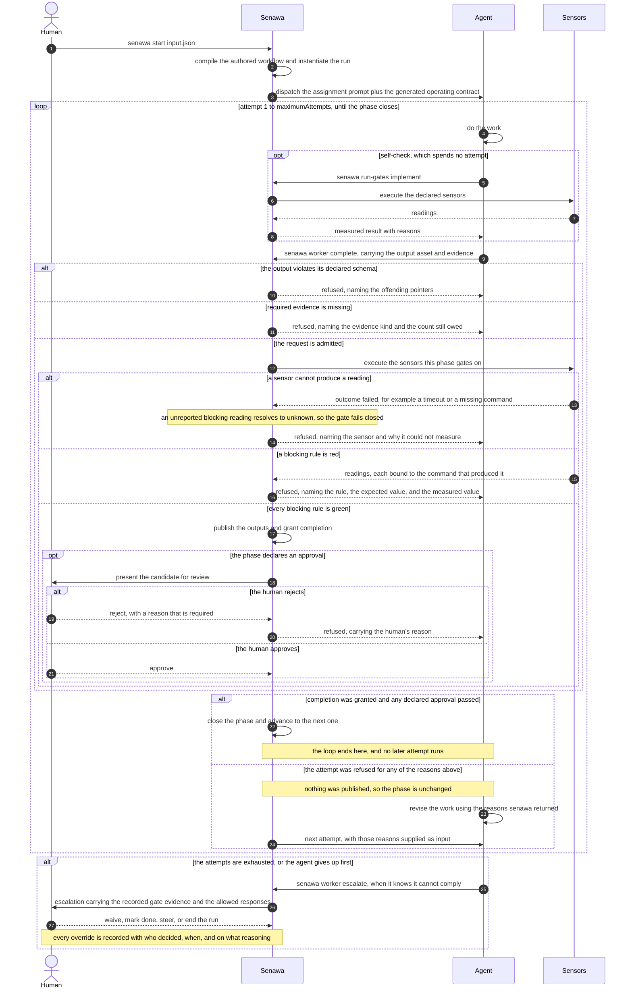
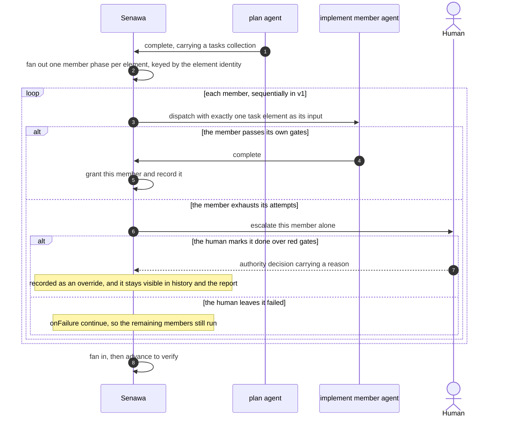

This brief records what v1 must do, why the current branch cannot do it, and
which decisions are already settled. It is the reference the redesign analysis
and proposal are written against. It states the ask; it does not yet propose a
solution.

## The goal

Senawa runs the nested loops described in the project README: an outer loop the
human owns, a middle loop a deterministic driver owns, and an inner loop where a
single agent works alone under pushback. The property that makes it worth
building is that **completion is granted, not claimed**. An agent requests
completion; the harness runs sensors, evaluates gates, and either accepts the
work or hands back actionable reasons.

A consumer must be able to define agents, a workflow, and sensors, then run the
whole thing from the command line, with the portal available for observation and
approval but never required.

## What is wrong today

### The promised loop does not run

This is the primary problem, and it is larger than the other two.

`registerDispatch`, `createPhaseAttempt`, and `createWorkerDispatch` have zero
non-test callers. Every caller is a `*.test.ts` file, the portal fixture setup,
or the conformance harness. `ProductionScheduler.listRuns()` derives runs from
dispatches that already exist, so a run holding no dispatch is never visited,
and `listFreshDispatchRequirements()` only guards: when it returns entries the
scheduler reports no work rather than satisfying them.

The consequence is that a run can be instantiated from a real compiled workflow
and will sit at `mode: "running"` indefinitely. The kernel decides, the authority
persists, and the Copilot worker can execute a dispatch, but nothing in
production composes a phase into a dispatch. The acceptance suites simulate each
agent phase through helpers instead of dispatching one.

The v1 runtime loop is therefore not an enhancement of the current branch. It is
the missing component.

### The workflow file is too complex to author

The generated `workflow.json` carries fourteen top-level keys. A single phase
already nests input mappings expressed as JSON Pointers, six separate budget
units, a completion policy, and an evidence policy. Authoring it is a specialist
activity, and nothing about the consumer's intent requires them to know what a
destination pointer is.

### The portal shows everything at once

Graph and terminal are the right primary surfaces. Evidence, assets, and sensor
readings belong behind progressive disclosure, reachable when a reader wants
depth rather than present by default.

## What a consumer authors

Three repository-owned artifact kinds, in YAML:

| Artifact | Contents |
|---|---|
| Agent definitions | A templated prompt, plus model and capability configuration |
| Workflow | Which agent runs which phase, each phase's input and output schema, and the conditions a phase must satisfy to pass |
| Sensors and gates | Deterministic measurements, and the rules that consume their readings |

Input, output, and schema files are JSON.

The vocabulary is the README's. A **sensor** measures a property of the work and
returns an assessment plus evidence. A **gate** is a rule that resists progress
while readings are red. An **anchor** is a deterministic reading that cannot be
argued with, and every blocking gate needs one or the harness is only agreeing
with itself.

### What evidence means

The README already fixes the family meaning: model output, receipts, and prompt
text are *evidence, never decisions*. Evidence is therefore anything that informs
a decision without being able to make one. Several unrelated things in this
system qualify, which is correct, but the code names one of them with the bare
word and leaves the reader to infer which. That ambiguity produced a real defect
during this redesign, so the rule is now explicit.

**Every name carries a qualifier saying whose evidence it is and which decision
it feeds. The bare word `evidence` is not an identifier.**

| Evidence | Produced by | Feeds | Can it be argued with |
|---|---|---|---|
| Sensor reading | senawa, by executing a command | gate evaluation | No, when deterministic |
| Gate evidence | senawa, from a definition and its readings | candidate and closure | No |
| Completion evidence | the agent, as attachments on a completion | completion accounting | Yes |
| Completion evidence view | authored, filtering an earlier phase's accepted completion evidence | a later phase's input | Yes |

**Completion evidence** is what an agent offers: attachments on a completion
request, each carrying a kind, a descriptor, and the asset it points at, and
optionally the criterion it supports. A phase declares which kinds it requires
and how many of each. This is testimony with exhibits.

**Gate evidence** is what senawa measured: the gate definition, the sensor
readings, and the evaluation over them. No agent supplies it. An escalation
carries it precisely because a human deciding whether to override needs the
measurement rather than the agent's account of the measurement.

**A completion evidence view** is how accepted completion evidence crosses a
phase boundary. A later phase declares which earlier phase it reads from, which
kinds are allowlisted, and a sensitivity ceiling capping what may cross. Without
a view, a phase sees only the outputs of its dependencies.

The distinction that decides correctness is the last column. Completion evidence
can be argued with; a deterministic reading cannot. A blocking gate resting on
completion evidence would be the harness agreeing with whoever submitted the
work, which is the failure the anchor invariant exists to prevent. Completion
evidence records what was offered. Blocking gates rest on readings.

Citations inside an authored output, such as the file a research finding rests
on, are not evidence in any of these senses. They are named `citations`, because
a claim's source informs a reader rather than any decision senawa makes.

## The runtime loop

```text
senawa start workflow.yaml input.json
  1. Senawa reads the workflow and starts the first phase with the given input
     and that phase's agent definition.
  2. The agent works, discovers the completion contract, then calls senawa's
     complete operation with the declared output asset and evidence.
  3. Senawa runs the phase's gates.
       pass -> completion is granted, the run advances
       fail -> senawa returns the reasons, and the agent tries again
  4. The agent can self-check at any time with `senawa run-gates <phase|task>`.
  5. The agent discovers the required output shape by asking senawa for it. The
     output is the asset carried by the complete request; it is not returned as
     assistant chat text and is not uploaded in a separate protocol step.
  6. An agent that cannot satisfy the conditions escalates rather than stalling.
  7. A phase such as plan can produce a collection, and a later phase fans out
     over it, each element running its own loop, then fans back in.
  8. Humans are asked only at declared phase edges. Elsewhere senawa continues
     to completion on its own.
```

### One phase in sequence

The numbered loop above is the happy path. The refusal paths are where the
design earns its keep, so they are drawn explicitly: a schema violation, missing
evidence, a sensor that cannot produce a reading, a red blocking rule, a human
rejection, and exhausted attempts.

Two properties are visible in the diagram and are load bearing. Completion is
one atomic request, so no output is published unless that request is granted.
The self-check spends no attempt, so an agent can measure its own work before
committing to a completion.

Every refusal converges on the same place: the agent revises using the reasons
senawa returned, and the next attempt begins with those reasons as input. That
is the inner loop, and it is the reason a refusal has to name what failed rather
than only that something did.



### Fan-out in sequence

A phase such as plan produces a collection. The next phase runs one member per
element, each with its own loop, gates, approval, and escalation. A member that
cannot pass does not have to stop the ones that did.



## Settled decisions

### Agent channel

Agents reach senawa over a command line surface. A real consumer installs senawa
on `PATH`; during development the environment is prepared before `senawa start`
so that child processes inherit it.

Consumer prompts describe the work, not Senawa's protocol. Senawa appends a
generated operating contract to every rendered prompt after the configured
prompt text. That contract names the worker operations available for the exact
dispatch, the required outputs and evidence, how to call complete with those
assets, what a gate refusal returns, and how to ask a question or escalate. It is
Senawa-owned, derived from the compiled context, and covered by the prompt-pack
digest. Prompt text cannot change it or grant additional authority.

Completion is one idempotent protocol operation. Its body carries every output
asset required by the phase, the evidence offered for the completion criteria,
and the completion summary or disposition. Senawa validates the assets against
their declared schemas and limits, admits evidence, evaluates completion, and
either publishes the assets and grants completion or publishes nothing and
returns structured refusal reasons. An agent never completes by printing JSON in
assistant text, and it never has to coordinate a separate output upload with a
later completion request.

On the command line, the agent writes each JSON output asset to a workspace file
and passes the named file to `senawa worker complete`; Senawa reads it under the
workspace boundary and constructs the request. A model adapter may expose the
same named asset as a typed tool parameter instead. Both forms produce the same
canonical complete request and the same content-derived idempotency identity.

Completion evidence travels the same way. An attachment is named by kind and by
the workspace file that carries it, and senawa ingests that file into an asset
inside the complete request. The internal contract identifies an attachment by
asset identity, which would otherwise force the agent to create assets in an
earlier call and then reference them; ingesting during completion keeps the
single call and keeps the refusal path clean, because an attachment belonging to
a refused completion never becomes an accepted asset.

The command line and model-specific tools are two projections of that same
contract. A scripted worker follows the command forms; the Copilot adapter
offers equivalent typed tools. An authored prompt must not need to mention
Senawa, know a dispatch identity, or teach the agent how to signal completion.

**A scoped credential is required.** If a worker inherits the operator's
credential it can call any command, including approving its own phase, which
collapses the property the whole design exists to protect. The worker's channel
must carry a per-dispatch identity authorised only for worker operations:
discover the completion schema, call complete with output assets and evidence,
run gates for a self-check, ask a question, and escalate. Human authority
operations must be unreachable from it.

A local MCP server is worth offering later as an alternative front end over the
same command surface, for agent runtimes that prefer typed tools. It should not
be built first, and it must not become a second authority path.

The command line is preferred as the primary contract for three reasons: it
works with any agent runtime rather than one SDK, it is inspectable and
scriptable by a human, and it allows the entire loop to be exercised by a
scripted agent with no model and no credits.

### Principal agent

The principal agent is an ordinary assistant session that calls senawa commands
on the human's behalf: starting a workflow, reporting status, and carrying
approvals. The human can also drive every one of those actions by pointing and
clicking in the portal.

The portal visualises a phase's output assets, and lets the human signal intent
to proceed. When the human is not satisfied, senawa reruns the same phase with
their reasons supplied as input, using the same agent. Some phases need no review
at all. Even where approval is declared, the human may delegate it to the
principal agent.

### File formats

YAML for configuration. JSON for input, output, and schema files.

### Execution mode

`senawa start` blocks by default and streams events and agent output. A
non-blocking mode is available by argument. The portal is served by the
always-on service.

### Fan-out and fan-in

Senawa stays as agnostic as it can about what is being orchestrated, while
supporting fan-out over a collection whose elements are not known until an
earlier phase computes them. The mental model is a loop over a collection passed
in from the preceding phase, followed by a fan-in.

**Failure policy is configurable per phase.** When some elements fail their
gates, the phase decides whether the fan-in waits, proceeds with the elements
that passed, or fails outright.

**A human can unstick an element.** Two interventions are required. The human may
mark a failing element done so the run proceeds, and the human may supply
steering or instructions telling that element's agent how to proceed. Marking an
element done is a human grant of completion over failed gate readings, so it has
to be recorded as an explicit authority decision carrying who decided, when, and
on what reasoning. It must never read as a silent bypass, because the value of
gates depends on every override being visible afterwards.

**Nesting is permitted within reason.** A fanned-out element may itself fan out.
One level is acceptable for v1 if arbitrary depth proves expensive, so the design
should keep depth a bounded parameter rather than an assumption baked into the
model.

### Agent pool, sessions, and steering

The consumer's mental model is an agent pool working a workflow the way a
software delivery team would, with the human acting as tech lead and product
manager: owning the request, defining better, and reviewing at declared points
rather than micromanaging.

**Work is sequential in v1.** A pool means a set of agent definitions, not
concurrent execution. Because only one agent works at a time, the repository
working copy needs no isolation, and `workspaceMode: repository` stays the
default. Worktree isolation already exists in the configuration contracts and
should be preserved as a seam for later parallelism rather than removed or built
upon now. Fan-out therefore executes its elements one after another.

**Session scope and durability are declared by the workflow.** A persona keeping
its session across the phases it works helps the rejection loop most: an agent
asked to try again remembers its earlier attempt and why it was refused. Fan-out
elements are meant to be independent units of work, so the sensible default is a
session that spans phases but restarts per element. Because the right answer
differs by workflow, scope is a declared property of the agent rather than a
fixed rule.

**Cross-agent communication stays explicit.** Personas do not share memory. What
passes between phases is the templated prompt, the schema-bound output assets of
earlier phases, and the current repository state. Durable context lives inside a
persona; everything between personas is a declared artifact.

**Steering is supported in all three forms.** The Copilot SDK exposes an
immediate steering queue for interjections delivered during a running turn, so
live steering, queued steering, and abort-and-retry are all available. Steering
can be sent from the portal or the command line, scoped to a running agent
instance.

Two constraints follow. Steering is a human input that changes agent behaviour,
so it must be durably recorded before delivery, exactly like an approval;
otherwise the run history cannot explain why an agent changed course. Steering is
also a human authority operation, so a worker must not be able to steer itself or
a sibling.

## What determinism means once sessions are durable

Two different properties get called determinism, and only one of them was ever
promised.

**Replay determinism is unchanged.** The kernel is a pure function from recorded
state and event to next state, with no clock, randomness, or input or output of
its own. Replaying a recorded event log reconstructs the same state every time.
Durable sessions do not touch this, because the model never sits inside the
kernel. A model produces an artifact, the artifact arrives as an event, and the
kernel decides what to do with it.

**Reproducible execution was never true.** Running the same workflow twice will
not produce the same output, because models are stochastic and their versions
move. Nothing in this design promised otherwise.

What durable sessions actually change is narrower and worth naming: **the
declared dispatch stops being a complete account of what the agent was given.**
With a fresh session, an attempt is a function of the prompt template, the
outputs of earlier phases, the repository state, and any rejection reasons. With
a durable session, accumulated conversation is an additional input that no digest
covers.

Four consequences follow.

* Session identity becomes durable authority state rather than an execution
  detail, because it participates in what an attempt sees.
* A dispatch record should reference the session and the turn within it, so an
  audit can say which attempt of which persona produced an artifact and what
  preceded it.
* Losing a session must be an explicit recorded event that degrades the run
  rather than a silent restart. An attempt after session loss is a fresh start
  with different effective input, and a report that hides this misleads its
  reader.
* Retention and compaction of session history become policy the authority can
  see, because trimming history changes later behaviour.

**Gate meaningfulness is untouched.** Gates run real code against artifacts, so
what an agent remembers cannot soften them. That is the safety property, and it
holds either way.

The trade is deliberate: durable sessions buy a better rejection loop and cheaper
prompts, and cost some completeness in explaining an attempt from its declared
inputs alone. Recording session identity and turn position is what keeps that
cost visible.

## Judgment requested on scope

The recommendation to test during analysis is that the proven foundation
survives and the consumer-facing layers are rebuilt.

| Disposition | Components | Reasoning |
|---|---|---|
| Keep | Deterministic kernel, SQLite authority, migrations, fencing, restart resume, protocol codecs, Copilot SDK adapter, process supervisor, workspace containment, portal transport security | Proven, and several are security critical |
| Rebuild | Configuration authoring, command line surface, portal information architecture | These are where the complexity complaints land |
| Add | The dispatch driver, agent definitions, sensor execution and gate wiring, generalised fan-out, scoped worker credentials | Missing entirely |
| Reconsider | Whole-history durable mirror, the six budget units, one command-driven lifecycle phase per run | Breaking changes are permitted, so this is the moment to revisit them |

The tension to resolve is that the current complexity is not accidental: it is
what makes the kernel deterministic and gates verifiable. The likely answer is an
authoring format that compiles into a strict internal graph, rather than a looser
internal model. The analysis must test that rather than assume it.

## Constraints

* The product is called v1. The word alpha is removed.
* Breaking changes are acceptable. There are no users to migrate.
* Refactoring is in scope.
* Every capability is drivable from the command line. The portal observes and
  grants permission, and is never required.
* Research and proposals live in `docs/design/WIP/redesign-2`.

## What done looks like

A consumer can author three YAML files and a JSON input, run one command, and
watch a multi-phase workflow drive real agents to completion, with gates
refusing work that does not measure up, escalation when an agent cannot comply,
fan-out over a computed collection, and human approval only where declared. The
same run is observable and approvable in the portal. None of it requires editing
a fourteen-key configuration file or writing a line of TypeScript.
