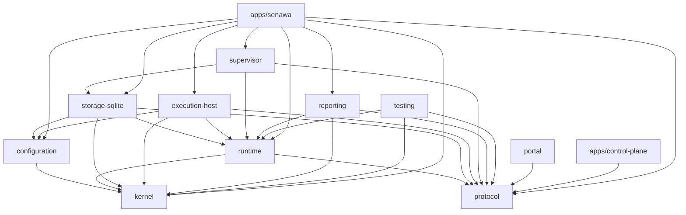

Senawa is a pnpm workspace of ten packages and two applications. Authority flows
in one direction: the kernel decides, storage commits, adapters act, and clients
observe. Every boundary below exists to keep one of those roles from absorbing
another.

Each section states the component's responsibility, what it must never do, its
exact internal dependencies as declared in its `package.json`, and whether it can
run in a browser or requires Node.

## Dependency graph

Every edge is a direct entry in the `dependencies` field of the source
component's manifest. External dependencies (`ajv`, `json-schema-traverse`,
`better-sqlite3`) are noted per component rather than drawn.

Two components sit at the root with no internal dependencies at all: `kernel`
and `protocol`. Nothing above them may be imported by them.

## Protocol

Versioned wire contracts and codecs. `PROTOCOL_VERSION` is
`senawa.dev/protocol/v1`, defined in
[packages/protocol/src/contracts.ts](../../packages/protocol/src/contracts.ts).
The package carries command envelopes, durable receipts, event frames,
projection envelopes, portal contracts, worker contracts, and remote contracts,
plus the decoders that validate them.

Wire identities are plain strings. The comment in `contracts.ts` states the
reason directly: browser and non-TypeScript clients must not inherit the
kernel's compile-time brands.

It must never contain behavior, import kernel, or import a Node module. The
boundary script asserts both: `protocol cannot import kernel behavior` and
`protocol cannot import Node modules`.

* Internal dependencies: none.
* External dependencies: none.
* Runtime: browser-safe.

## Kernel

Pure workflow authority. The kernel compiles and validates the workflow graph,
assesses completion accounting, evaluates gates, consumes budgets, plans phase
attempt transitions, evaluates fan-out, derives readiness frontiers, and projects
phase lifecycle. Its seventeen modules are re-exported from
[packages/kernel/src/index.ts](../../packages/kernel/src/index.ts).

Determinism is structural. Canonical serialization and SHA-256 digests come from
[packages/kernel/src/canonical.ts](../../packages/kernel/src/canonical.ts), and
the hashing implementation arrives as an injected `Sha256` interface rather than
an imported library.

It must never observe runtime state or perform an external effect. The boundary
script rejects `Date.now`, `Math.random`, `process.`, `fetch(`, and `Worker(` in
kernel source, rejects Node built-in imports, and rejects imports of runtime,
storage, execution-host, sensors, workers, git, supervisor, or portal.

* Internal dependencies: none.
* External dependencies: none.
* Runtime: browser-safe.

## Configuration

The workflow compiler. It parses a `senawa.dev/workflow/v1` document,
loads declared external prompt and schema resources through a confined reader,
validates every reference, and produces an immutable `ConfigurationSnapshot`
with per-category component digests and one snapshot digest. Contracts are in
[packages/configuration/src/contracts.ts](../../packages/configuration/src/contracts.ts);
compilation is in
[packages/configuration/src/compiler.ts](../../packages/configuration/src/compiler.ts).

Diagnostics are deterministic and exhaustive. The compiler reports every finding
with a code, a locator, a JSON pointer, and a message, so `senawa doctor` can
print the complete set rather than the first failure.

It must never read the filesystem itself. Resource bytes arrive through the
`ConfigurationResourceReader` interface, and the Node implementation lives in
`execution-host`. It must never import any Senawa package other than `kernel`.

* Internal dependencies: `@senawa/kernel`.
* External dependencies: `ajv` 8.18.0, `json-schema-traverse` 1.0.0.
* Runtime: browser-safe.

## Runtime

Ports, command authority, the context broker, the fenced runner, the scheduler,
dataflow authority, plan import, and the prompt renderer. This is where kernel
decisions are wrapped into commands, receipts, effects, and projections without
binding to any concrete adapter. See
[packages/runtime/src/ports.ts](../../packages/runtime/src/ports.ts) for the
port definitions and
[packages/runtime/src/runner.ts](../../packages/runtime/src/runner.ts) for the
effect lifecycle.

Runtime defines the interfaces that adapters implement: `CommandServicePort`,
`RuntimeQueryPort`, `RunnerAuthorityPort`, `EffectHost`, `AsyncEffectHost`,
`ContextAuthorityPort`, `ReportingSnapshotPort`. Concrete implementations live
in `storage-sqlite` and `execution-host`, above runtime, never inside it.

It must never read a clock or allocate an identifier. The boundary script
rejects `Date.now()` and `Math.random()` in runtime source with the message
`runtime must receive current time and identifier allocation`. It must never
import a Senawa package other than kernel and protocol, and the manifest itself
is checked for the same rule.

* Internal dependencies: `@senawa/kernel`, `@senawa/protocol`.
* External dependencies: none.
* Runtime: browser-safe.

## Storage-sqlite

Transactional authority. This package implements the runtime ports against
SQLite: `SqliteAuthority`, `SqliteRunnerAuthority`, `SqliteContextBroker`,
`SqliteWorkspaceIntegrationAuthority`, `SqliteRemoteAuthority`,
`SqlitePortalQueryAuthority`, and the content-addressed
`SqliteCanonicalJsonAssetStore`. It also owns migrations, backup, restore, and
integrity verification. See
[packages/storage-sqlite/src/index.ts](../../packages/storage-sqlite/src/index.ts).

Committing is its job and only its job. A kernel decision is computed and
persisted inside one `BEGIN IMMEDIATE` transaction, so a receipt and the facts it
was derived from become durable together.

It must never make workflow decisions. Every authority record it writes was
produced by a kernel function or validated by a kernel validator. It must never
depend on a package other than configuration, kernel, protocol, and runtime.

* Internal dependencies: `@senawa/configuration`, `@senawa/kernel`,
  `@senawa/protocol`, `@senawa/runtime`.
* External dependencies: `better-sqlite3` 12.11.1.
* Runtime: Node only.

## Execution host

Adapters that touch the outside world: the Copilot SDK worker and its session
store, the durable workspace effect host, Git command and workspace integration,
the bounded process sensor, workspace file access, and the confined
configuration resource reader. See
[packages/execution-host/src/index.ts](../../packages/execution-host/src/index.ts).

Every effect adapter here implements a runtime port. `WorkspaceEffectHost`,
`DurableWorkspaceEffectHost`, and `CopilotWorkerEffectHost` all implement
`AsyncEffectHost`. `measureExecutableSensor` bounds process execution with argv,
cwd, timeout, and stdout and stderr ceilings declared in configuration.

The Copilot SDK is a peer dependency, not a dependency. A no-credit installation
never resolves, installs, or loads it; worker execution loads it only when a
repository worker is configured.

It must never define authority. It reports observations and lets storage decide
what becomes durable. It must never depend on a package other than
configuration, kernel, protocol, and runtime.

* Internal dependencies: `@senawa/configuration`, `@senawa/kernel`,
  `@senawa/protocol`, `@senawa/runtime`.
* External dependencies: `@github/copilot-sdk` 1.0.9 as a peer dependency.
* Runtime: Node only.

## Supervisor

The local control plane. It owns the durable command queue, the authenticated
Unix-socket HTTP surface, the session-authenticated loopback listener, the run
controller, server-sent events, portal asset serving, service lifecycle, durable
logs, recovery, and the optional outbound remote connector. See
[packages/supervisor/src/index.ts](../../packages/supervisor/src/index.ts) and
the [local supervisor HTTP reference](../reference/local-supervisor-http.md).

The queue is a three-state machine: `queued`, `claimed`, `terminal`, defined as
`SupervisorReceiptStatus` in
[packages/protocol/src/contracts.ts](../../packages/protocol/src/contracts.ts)
and persisted by
[packages/supervisor/src/command-queue.ts](../../packages/supervisor/src/command-queue.ts).

It must never bypass storage to reach the kernel, and it must never depend on
`configuration`, `execution-host`, `kernel`, or `reporting`. Adapter selection
belongs to the composition root.

* Internal dependencies: `@senawa/protocol`, `@senawa/runtime`,
  `@senawa/storage-sqlite`.
* External dependencies: `better-sqlite3` 12.11.1.
* Runtime: Node only.

## Portal

The browser client. It renders the run console: the interactive workflow
diagram, node run states, selection and keyboard traversal, the terminal-style
agent output view, questions, approvals, allowances, and run control. Sources are
in [packages/portal/src](../../packages/portal/src).

The portal reads projections and submits commands through the same authenticated
surface as the CLI. It holds no authority and no local decision logic.

It must never import a Senawa package other than `protocol`, and it must never
import a Node module. The boundary script enforces both against production
source, and the manifest check requires the `dependencies` field to contain
exactly one entry.

* Internal dependencies: `@senawa/protocol`.
* External dependencies: none in production; `vite` builds the bundle.
* Runtime: browser only.

## Reporting

Deterministic reports and verifiable exports.
[packages/reporting/src/index.ts](../../packages/reporting/src/index.ts) turns a
`ReportingSnapshot` into a `DeterministicReport` and a `ReportExportBundle` with
a manifest, and it can verify a bundle it did not produce.

Export classification is a single value: `secret-safe-metadata`. The package
exposes `assertSecretSafePositiveProjection`, which is the mechanism that keeps
arbitrary source values out of a report. A report carries provenance, not
authority state, which is why `senawa export restore` always refuses.

It must never read a database or a filesystem. The snapshot arrives through
`ReportingSnapshotPort`, implemented in
[packages/storage-sqlite/src/reporting-snapshot.ts](../../packages/storage-sqlite/src/reporting-snapshot.ts).
Its production source must not import Node modules or any package beyond kernel,
protocol, and runtime.

* Internal dependencies: `@senawa/kernel`, `@senawa/protocol`,
  `@senawa/runtime`.
* External dependencies: none.
* Runtime: browser-safe.

## Testing

Shared conformance suites. Any implementation of an authority port, a runner
authority port, or a context broker can be run against the same behavioral
contract by importing `@senawa/testing/authority-conformance`,
`@senawa/testing/runner-conformance`, or
`@senawa/testing/context-broker-conformance`.

This is how the in-memory and SQLite implementations are held to identical
semantics rather than merely similar ones.

It must never be imported by production source. The boundary script rejects any
non-test file under `packages/` that mentions `@senawa/testing`. Its own source
imports no Node built-ins; it expects a Vitest harness, which the workspace
provides as a root development dependency.

* Internal dependencies: `@senawa/kernel`, `@senawa/protocol`,
  `@senawa/runtime`.
* External dependencies: none declared; the suites run under Vitest 3.2.4 from
  the workspace root.
* Runtime: harness only.

## apps/senawa

The CLI and composition root. This is the single place where abstract ports are
bound to concrete adapters: SQLite authority, execution host, supervisor
service, scheduler, dataflow composition, phase output bridge, report export,
state backup, and portal asset discovery. Sources are in
[apps/senawa/src](../../apps/senawa/src).

It publishes exactly one executable, `senawa`, and the complete command surface
is documented in the [CLI reference](../reference/cli.md).

Because it is the composition root, it is the only component permitted to depend
on nearly everything. That privilege is why nothing may depend on it: the
boundary script rejects any package source that imports from `apps/`, with a
narrow exception for browser system tests under `packages/*/tests/browser/`.

* Internal dependencies: `@senawa/configuration`, `@senawa/execution-host`,
  `@senawa/kernel`, `@senawa/protocol`, `@senawa/reporting`, `@senawa/runtime`,
  `@senawa/storage-sqlite`, `@senawa/supervisor`.
* External dependencies: none.
* Runtime: Node only.

### The driver

The composition root also holds the loop, in three files.

`start-run.ts` takes a project from authored files to a dispatched first phase:
compile the three YAML documents, instantiate the run, bind the request against
the root phase's declared input schema, and dispatch that phase.

`dispatch-driver.ts` turns one phase into one registered dispatch. It starts a
phase attempt, binds the phase's input from the accepted outputs of the phases it
depends on, builds the worker context, renders the prompt pack, selects a model
route, derives the completion requirements, and registers the dispatch with a
task scope fence and an effect seed. The ordering is not free: the prompt pack
digest is an input to the dispatch and the dispatch is an input to rendering the
pack, so the first dispatch exists only to render against and is discarded.

`advance-run.ts` takes exactly one durable step and reports what it is waiting
for. The steps are dispatch, wait for the agent, read the gate's sensors, form a
candidate, evaluate, retry or close, and start the next phase. One step per call
is deliberate: every step is an authority decision, so a caller that dies between
two of them resumes at the next rather than repeating the last. Nothing is held
between calls, which is why restart recovery is a property of the shape rather
than a feature.

Two refusals are load bearing. The driver will not evaluate a gate over work no
agent has finished, and it will not record an approval, because a driver that
approved on a person's behalf would remove the only step the person owns.

`classifyOutcome` maps every outcome to progress, a human's turn, or a refusal,
through an exhaustive switch with a `never` default. There is no fourth
disposition, so no reachable outcome means stuck with nothing to do.

## apps/control-plane

A reference remote server used to prove the outbound connector against something
other than a mock. It implements peer authority, signature verification, a
transport, and a simulator. Sources are in
[apps/control-plane/src](../../apps/control-plane/src).

Its dependency ceiling is the point. A remote peer that could import the kernel
or storage would be able to hold authority; this one cannot, because the
boundary script rejects any production import other than `@senawa/protocol`,
Node built-ins, and sibling modules, and requires the manifest to declare
exactly one dependency.

* Internal dependencies: `@senawa/protocol`.
* External dependencies: none.
* Runtime: Node only. It uses `node:crypto` for signature verification.

## Why the boundaries hold

Three properties fall out of the graph above.

Nothing can smuggle nondeterminism into a decision, because the decision
function has no dependency capable of producing it. Nothing can hold two
conflicting beliefs about durable state, because exactly one component owns
transactions. Nothing can be reached by a browser client except contracts,
because the portal's production dependency set is checked to be exactly one
entry.

The rules that enforce this are listed with their exact messages in
[extending.md](extending.md).

## How this is proven

* Manifest and source boundary rules, plus rule self-tests: [scripts/check-boundaries.mjs](../../scripts/check-boundaries.mjs),
  run as `pnpm check:boundaries`.
* Port conformance across implementations: [packages/testing/src/authority-port-conformance.test.ts](../../packages/testing/src/authority-port-conformance.test.ts),
  [packages/testing/src/runner-conformance.test.ts](../../packages/testing/src/runner-conformance.test.ts),
  [packages/testing/src/context-broker-conformance.test.ts](../../packages/testing/src/context-broker-conformance.test.ts).
* Supervisor transport and security boundaries: [packages/supervisor/src/transport-conformance.test.ts](../../packages/supervisor/src/transport-conformance.test.ts),
  [packages/supervisor/src/http-security.test.ts](../../packages/supervisor/src/http-security.test.ts).
* Portal isolation from Node and non-protocol packages: [packages/portal/src/static-security.test.ts](../../packages/portal/src/static-security.test.ts).
* Composition root wiring: [apps/senawa/src/production-composition.test.ts](../../apps/senawa/src/production-composition.test.ts),
  [apps/senawa/src/daemon-composition.test.ts](../../apps/senawa/src/daemon-composition.test.ts).
* Control-plane interoperability: [apps/senawa/src/remote-interoperability.test.ts](../../apps/senawa/src/remote-interoperability.test.ts),
  [apps/control-plane/src/authority.test.ts](../../apps/control-plane/src/authority.test.ts).
