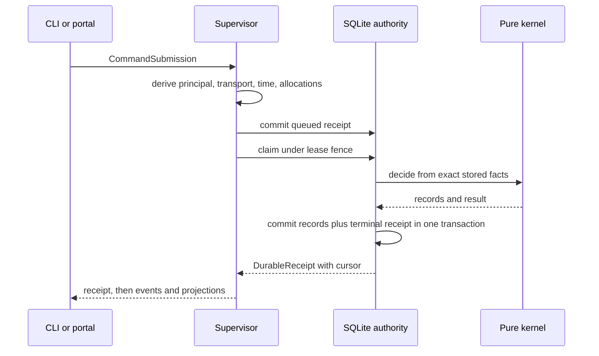
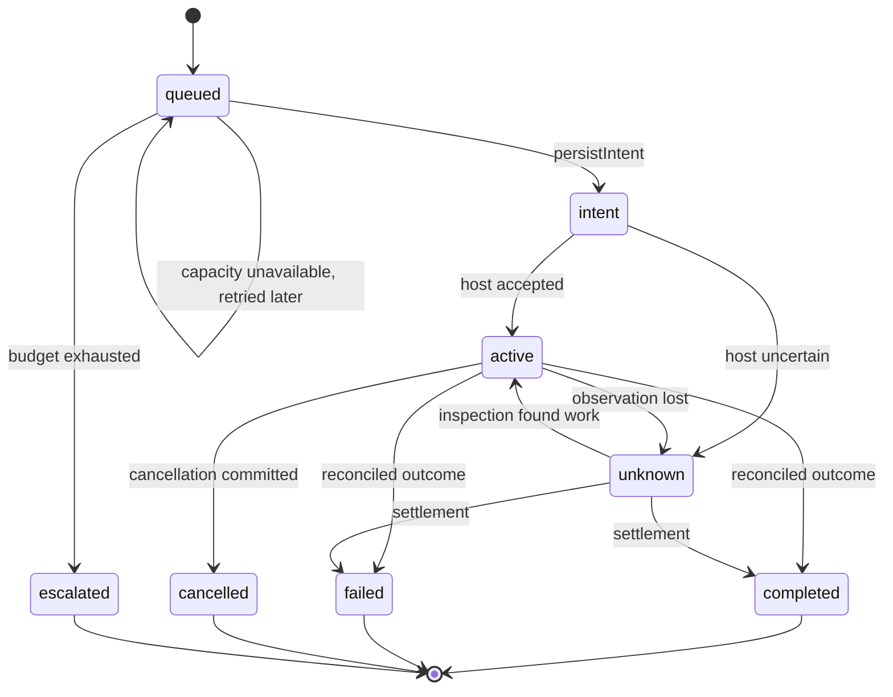

Authority in Senawa is the answer to one question: which facts are allowed to
change what the system believes. The answer has three parts. Commands become
durable receipts. Effects persist intent before acting and reconcile before
committing. Projections are recomputed from those records and never written to
directly.

## The command path

A client submits a `CommandSubmission`: a protocol envelope without principal or
transport attribution. The supervisor derives the missing attribution, the
current time, the request identity, and any allocation facts, then admits the
result as a `CommandEnvelope`. Contracts are in
[packages/protocol/src/contracts.ts](../../packages/protocol/src/contracts.ts).

Twenty-two command intents exist, from `instantiate-run` through `end-run`. The
full list is the `CommandIntent` union.

### Queued, claimed, terminal

The supervisor queue is a three-state machine. `SupervisorReceiptStatus` is
`queued`, `claimed`, or `terminal`, persisted by
[packages/supervisor/src/command-queue.ts](../../packages/supervisor/src/command-queue.ts)
into the `supervisor_commands` and `supervisor_receipts` tables.

Each state has a durable meaning:

* Queued means the envelope and its admission facts are committed. A crash here
  loses nothing, because nothing external has happened.
* Claimed means one owner holds the command under a lease fence. A second worker
  cannot claim it.
* Terminal means the kernel decided and the outcome is committed, carrying a
  `DurableReceipt` with the final `ReceiptStatus`.

The receipt status vocabulary is wider than the queue vocabulary because it must
express refusal and uncertainty: `queued`, `claimed`, `completed`, `refused`,
`expired`, `cancelled`, `unknown-effect`.

### The per-run monotonic cursor

Every run carries one integer cursor. `RuntimeCommandService` in
[packages/runtime/src/authority.ts](../../packages/runtime/src/authority.ts)
advances it by one for each recorded transition and stamps that value onto both
the receipt and the emitted event frame. A run starts at cursor `0`.

The cursor is dense and per-run, which is what makes resumable reading possible.
`queryReceiptPage` and `queryEventPage` in
[packages/runtime/src/ports.ts](../../packages/runtime/src/ports.ts) take an
`afterCursor` and return `latestCursor` plus `hasMore`. Two failure modes are
named rather than silently tolerated: `cursor-ahead` when a caller asks past the
latest authority cursor, and `event-replay-gap` when a caller asks for events
that are no longer available.

Because `EventReplayPage` reports `earliestAvailableCursor` separately from
`latestCursor`, a reader can detect that it fell behind instead of inferring
continuity from a stream that quietly skipped.

### Retry, replay, and conflict

Submission is idempotent by command identity. When a command identifier is
already stored, the service compares the canonical envelope. An exact match
returns the stored receipt unchanged. A different envelope under the same
identifier returns a conflict receipt rather than executing twice.

This is why the CLI can retry safely: exact retries reuse the durable command
identity, and the second attempt observes the first attempt's outcome.

## How the kernel decides

The kernel never runs alongside the world. It runs inside the storage
transaction, against facts already committed, and returns records rather than
side effects.

A decision has this shape:

* Inputs are canonical values. `canonicalValue` in
  [packages/kernel/src/canonical.ts](../../packages/kernel/src/canonical.ts)
  normalizes a JSON value, `canonicalSerialize` produces stable bytes, and
  `canonicalDigest` produces the SHA-256 identity used everywhere else.
* Hashing is injected. The `Sha256` interface is a parameter, so the kernel does
  not import a crypto library and cannot reach a platform primitive.
* Failure is typed. Each module defines its own error code union, such as
  `RunTransitionErrorCode`, `LifecycleErrorCode`, `CompletionAccountingErrorCode`,
  `GateErrorCode`, `FanOutErrorCode`, `BudgetErrorCode`. A refusal names its
  reason.
* Output is content-addressed. A record carries the digest of its own content,
  so a later reference either matches exactly or does not match at all.

`decideRunCommand` and `applyRunEvent` in
[packages/kernel/src/run.ts](../../packages/kernel/src/run.ts) show the pattern
in its smallest form: decide produces events, apply folds events into state, and
`replayRunEvents` reconstructs state from the log.

## The effect path

Commands change beliefs. Effects change the world. The runner treats them
differently because the world can fail in ways a transaction cannot.

### Persist intent, then act

`scheduleRunnerTransitions` in
[packages/runtime/src/runner.ts](../../packages/runtime/src/runner.ts) picks at
most `maxTransitions` plans from a snapshot. Reconciliation of already-started
effects is scheduled ahead of new starts, so an uncertain effect settles before
the runner adds another.

For a start plan, `persistIntent` writes an `EffectIntent` carrying the queued
command, the owner, the lease fence, an attempt identifier, status `intent`, and
the persist timestamp. It can return three results:

* `persisted` with the intent, when budget and capacity allow.
* `escalated` with a `RunnerEscalation` when the reserved budget unit is
  exhausted.
* `capacity-unavailable` with the reservation and the currently available
  amount, when a writer slot is not free.

Only after `persisted` does the runner call the effect host.

### Reconcile, then commit

The host returns an `EffectObservation` whose status is one of `active`,
`completed`, `failed`, `cancelled`, or `unknown`. That last value is the reason
the design works: a host that cannot tell what happened says so, and the runner
keeps the effect in the reconcilable set.

`claimEffectAttempt` decides what happens next and returns one of four answers:

* `claimed` with an origin of `dispatch`, `inspection`, `cancellation`, or
  `settlement`.
* `busy` when another attempt holds the effect.
* `fenced` with the current task scope currentness, when the claim is stale.
* `replay` with the already-committed outcome, when the work is done.

`commitEffect` then writes an `EffectOutcome` that records both the command's
task scope and the claim's task scope, a `freshness` of `current` or `stale`, the
reconciliation attempt count, and a `FinalizedEffectUsage` that separates
reserved, reported, and unreported amounts. Unreported budget is accounted for
rather than forgiven.

## Leases and fences

Two independent fencing mechanisms guard against stale writers.

### Run leases

`acquireLease` in
[packages/storage-sqlite/src/index.ts](../../packages/storage-sqlite/src/index.ts)
runs inside `BEGIN IMMEDIATE` and applies three rules:

* No existing lease grants fence `1`.
* The same owner with a live expiry keeps its fence and may only extend the
  expiry, never shorten it.
* A different owner with a live expiry is refused with `LeaseUnavailableError`.
  After expiry, the new owner takes `current.fence + 1`.

Because the fence only ever increases, an old owner that wakes up after expiry
presents a lower fence. Every fenced mutation compares owner and fence against
the stored row and throws `StaleLeaseFenceError` on mismatch. The old owner
cannot write, even if it still believes it holds the lease.

This is what makes `senawa service recover --direct` safe. It refuses a live
foreign lease and proceeds with a higher fence only after expiry.

### Task scope fences

A lease protects a run. A task scope fence protects the assumption that a task's
context has not moved. `TaskScopeFence` in
[packages/runtime/src/task-currentness.ts](../../packages/runtime/src/task-currentness.ts)
combines the run, the task, the definition generation, the accepted context
digest, and a fence generation. `TaskScopeCurrentness` adds `claimsAccepted`.

The scheduler only starts a command whose task scope matches a currentness row
with `claimsAccepted` set. When an amendment or a supersession changes a task's
accepted context, installing a new fence generation makes every outstanding claim
against the old context stale. Work already in flight is reconciled rather than
allowed to commit against a context that no longer exists.

## Why projections are derived

A projection is a read model: `ProjectionEnvelope` carries a `projectionType`, a
`revision`, a `cursor`, and a payload digest. Nothing in the system decides based
on a projection.

Three reasons drive that choice.

A stored status can drift. If a phase's status were a column, then a bug, a
partial write, or a repair could set it to a value that the underlying records do
not support, and nothing would detect the contradiction. `projectPhaseLifecycle`
in [packages/kernel/src/lifecycle.ts](../../packages/kernel/src/lifecycle.ts)
recomputes status from the candidate, gate evidence, authority decision, closure,
and escalation records every time, so a contradiction is impossible by
construction.

A stored status hides its reasoning. The projection returns
`LifecycleRecordDigests` naming the exact candidate, gate evaluation, decision,
closure, and escalation records it used, plus a `projectionDigest` over the whole
result. A reader can follow the digests back to the evidence.

A stored status blocks recovery. Because projections are derived, a restarted
process rebuilds them from committed records rather than trusting a cache that
may have been written before a crash. `ReportingSourceVector` in
[packages/runtime/src/ports.ts](../../packages/runtime/src/ports.ts) carries the
per-family revisions that a snapshot was taken at, which is how a report states
exactly which authority state it describes.

## Crash boundaries

The dangerous moments are named, not assumed. `SqliteFaultPoint` and
`SupervisorFaultPoint` enumerate the exact positions where a process can be
killed during a test:

* Before a command commit, and after commit but before acknowledgement.
* After an asset is staged, and after it is installed but before its descriptor
  commits.
* After a queued commit but before acknowledgement, and after a claim commit but
  before execution.
* After amendment fences, and after amendment application.
* At four points during restore.

Each of those points has one correct convergent outcome after restart, and the
storage and supervisor suites assert it.

## How this is proven

* Command decision, replay, and cursor behavior: [packages/kernel/src/run.test.ts](../../packages/kernel/src/run.test.ts)
  and [packages/testing/src/authority-port-conformance.test.ts](../../packages/testing/src/authority-port-conformance.test.ts).
* Queue states, fault points, and convergent restart: [packages/supervisor/src/command-queue.test.ts](../../packages/supervisor/src/command-queue.test.ts)
  and [packages/supervisor/src/service.test.ts](../../packages/supervisor/src/service.test.ts).
* Intent persistence, reconciliation, claim outcomes, and usage finalization: [packages/testing/src/runner-conformance.test.ts](../../packages/testing/src/runner-conformance.test.ts)
  and [packages/runtime/src/scheduler.test.ts](../../packages/runtime/src/scheduler.test.ts).
* Lease acquisition, expiry, and fence rejection: [packages/storage-sqlite/tests/storage-sqlite.test.ts](../../packages/storage-sqlite/tests/storage-sqlite.test.ts).
* Derived phase lifecycle projection: [packages/kernel/src/lifecycle.test.ts](../../packages/kernel/src/lifecycle.test.ts).
* End-to-end command, effect, and recovery behavior through the real service: [apps/senawa/src/service-blackbox.test.ts](../../apps/senawa/src/service-blackbox.test.ts)
  and [apps/senawa/src/production-composition.test.ts](../../apps/senawa/src/production-composition.test.ts).
