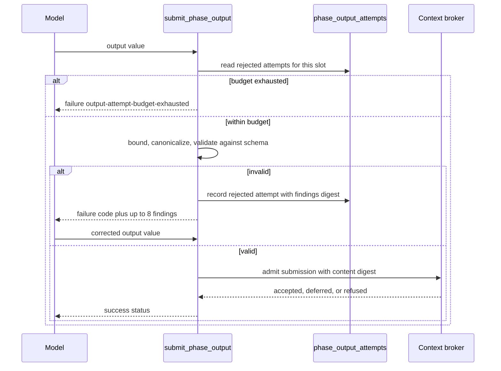

Data moves through a Senawa run as a chain of content-addressed bindings. A
value is validated against a declared schema, stored as canonical bytes,
addressed by digest, and referenced by digest everywhere downstream. Nothing
passes an untyped blob from one step to the next.

The chain has five links: workflow input, phase attempt, mapped phase input,
schema-validated phase output, and accepted output. Fan-out and plan import
branch off the last link.

```mermaid
flowchart LR
    input["workflow input<br/>schema validated"]
    binding["WorkflowInputBinding<br/>content digest"]
    attempt["PhaseAttempt<br/>attempt digest"]
    mapped["PhaseInputBinding<br/>evaluated mappings"]
    dispatch["worker dispatch<br/>immutable context"]
    output["PhaseOutputPublication<br/>schema validated"]
    accepted["PhaseOutputAcceptance<br/>bound to closure"]
    fanout["FanOutEvaluation<br/>schema-selected items"]
    tasks["generated tasks<br/>via amendment"]

    input --> binding --> attempt --> mapped --> dispatch --> output --> accepted
    accepted --> fanout --> tasks
    accepted -.-> mapped
```

## Workflow input binding

A workflow declares exactly one input schema:
`WorkflowDeclaration.input.schema` names a key from the `schemas` registry. The
supplied input is validated against that schema and recorded as a
`WorkflowInputBinding` in
[packages/kernel/src/dataflow.ts](../../packages/kernel/src/dataflow.ts).

The binding carries the repository and run identity, the workflow identifier, the
graph revision digest, the configuration snapshot digest, the schema key, the
schema resource digest, the content digest, the byte length, a validation receipt
digest, and its own binding digest.

Two of those fields matter more than they look. The schema resource digest pins
the exact schema bytes that validated this input, so a later schema change cannot
retroactively claim the input was valid. The validation receipt digest records
that validation happened and against what.

## Phase attempts

A phase does not execute once. It executes as a numbered attempt.
`PhaseAttemptReference` is a triple: phase identifier, definition generation, and
attempt number.

A `PhaseAttempt` record binds an attempt to everything it assumed:

* `inputBindingDigest` and `sourceSetDigest`, the resolved inputs.
* `executorDigest`, the executor declaration in force.
* `graphRevisionDigest` and `configurationSnapshotDigest`, the definition state.
* `upstreamClosureSetDigest` and `upstreamOutputSetDigest`, the upstream results
  it read.

Those last two are the mechanism behind `onUpstreamChanged`. If an upstream phase
closes again with different outputs, a new attempt's upstream digests differ from
the recorded ones, and the declared policy decides whether to iterate or refuse.

## JSON Pointer input mapping

Phase input is assembled, not passed. `PhaseInputDeclaration` names a schema and
a list of `DataMappingDeclaration` entries. Each mapping has a key, a source, and
a `destinationPointer`.

Four source kinds exist:

* `workflow-input` with a pointer into the workflow input value.
* `phase-output` with a phase key, an output key, and a pointer.
* `current-item` with a pointer, valid only inside a fan-out generated task.
* `implementation-evidence` with a phase key, a view key, and a pointer.

`evaluateDataMappings` resolves each source through
`valueAtJsonPointer`, writes the selected value at the destination pointer, and
returns an `EvaluatedPhaseInput` carrying the assembled value, the per-mapping
records, a content digest, and a source set digest.

Bounds are fixed in the kernel: at most 256 mappings, pointers at most 2,048
characters and 128 segments.

Mapping legality is checked against a `MappingEvaluationPolicy` that lists the
dependency phases, the declared phase outputs, the declared implementation
evidence views, and whether `current-item` is allowed. A phase cannot read the
output of a phase it does not depend on.

Each resolved source binding is itself digested. A `phase-output` binding carries
the `acceptanceDigest` of the closure that accepted it, so a mapped input names
the exact accepted value rather than whatever the source phase last produced.

The assembled value is then validated against the phase input schema, and the
result becomes a `PhaseInputBinding` with a validation receipt digest.

## Schema-validated phase outputs

A phase declares its outputs: a key, a schema key, a path, a maximum byte count,
and a sensitivity of `public`, `internal`, `confidential`, or `restricted`.

An accepted output becomes a `PhaseOutputPublication` naming the phase attempt,
the output name, the schema key and resource digest, the content digest and byte
length, the media type `application/json`, the sensitivity, the producing task,
the dispatch and context identity, the graph revision and snapshot digests, the
input binding digest, and a validation receipt digest.

Publication is not acceptance. `PhaseOutputAcceptance` binds a publication to a
specific candidate and closure, and closure carries its acceptances. A downstream
mapping reads accepted values only.

## The structured agent output loop

An agent submits a phase output through a generated tool rather than by writing a
file. `submit_phase_output` is built in
[packages/execution-host/src/copilot-worker.ts](../../packages/execution-host/src/copilot-worker.ts)
from the declared output slot, and its parameter schema is generated from the
declared output schema itself, with `$schema` and `$id` stripped and a size note
appended. The wrapper accepts `output` plus optional `changeNotes`.

Submission runs a fixed sequence of checks, each with its own rejection code:

* Attempt budget. A dispatch gets at most `PHASE_OUTPUT_LIMITS.maxAttempts`
  rejected attempts per output slot, currently 3. Exhaustion returns
  `output-attempt-budget-exhausted`.
* Argument shape. An unexpected key or a malformed `changeNotes` array returns
  `output-arguments-invalid`.
* Bounds before materialization. `assertBoundedArgument` walks the raw arguments
  and refuses at 10,000 nodes, depth 64, or the slot ceiling, before any
  canonical value is built. Oversize returns `output-too-large`.
* Canonical byte ceiling. The canonical encoding is re-measured against the
  slot's `maxBytes`, itself capped at 262,144 bytes.
* Schema validation. Findings return `output-schema-invalid` with at most 8
  reported findings, each naming an instance pointer and, when available, a
  schema pointer and keyword.

### Bounded correction feedback

A rejection is not an exception. `outputFailure` returns a tool result with
`resultType: "failure"` and a JSON body of `{ status, code, findings }`, which the
SDK returns to the model verbatim. The model can read exactly which pointer
failed which keyword and call the tool again in the same session.

Every rejection is also recorded durably through `recordPhaseOutputAttempt`, so
the attempt budget survives a process restart rather than resetting. The counter
used is the maximum of the durable count and the process-local count.

When the budget runs out, the phase's declared iteration or escalation policy
takes over. Nothing retries forever.

Whether a given model actually corrects itself is a measurement question, not a
guarantee. See PE-003 in
[Production Enhancements](WIP/redesign-1/production-enhancements.md#pe-003-model-correction-behavior-is-unproven-without-credits).
The current one-slot-per-dispatch limit is recorded as PE-002 in the same
document.

## Schema-selected fan-out

A `task-frontier` executor generates its task set from data. A `ForEachDeclaration`
names a source (a phase output or a phase input), a pointer to the collection, a
collection schema, an item schema, an identity pointer, and limits.

`evaluateTaskFrontier` in
[packages/kernel/src/fanout.ts](../../packages/kernel/src/fanout.ts) does the
selection:

* Reads the collection at the collection pointer and requires an array.
* Validates the collection against the collection schema, then checks
  `maxSelectedItems` and, against the already accepted total, `maxTotalTasks`.
* Validates every item against the item schema. Validation is all-or-nothing:
  one invalid item fails the whole evaluation with `item-schema-invalid` rather
  than being quietly dropped.
* Reads each item's identity at the identity pointer, bounded at 256 bytes, then
  sorts by identity and rejects duplicates.
* Derives each generated task key and task identifier from the digest of the
  item identity, so the same item always produces the same task.
* Resolves optional item-level dependencies through
  `dependencyIdentityPointer`, rejecting references outside the selection and
  rejecting cycles.
* Evaluates the task template's input mappings per item with `current-item`
  bound to that item, then validates the generated input against the template
  input schema.

The result is a `FanOutEvaluation` with one `FanOutMember` per selected item, a
task set digest, and an evaluation digest over the whole selection.

Limits are declared, not implicit: `maxSelectedItems`, `maxTotalTasks`,
`maxConcurrency`, and an `exhaustion` disposition of `escalate` or `fail`.
Failure codes are specific: `fan-out-bound-exceeded`, `collection-schema-invalid`,
`item-schema-invalid`, `task-input-schema-invalid`, `invalid-item-identity`,
`duplicate-item-identity`, `unknown-item-dependency`, `item-dependency-cycle`,
`task-identity-collision`.

The selection is a function of the source value, the schemas, and the template.
Running it twice on the same accepted output yields the same evaluation digest.

## Reviewed plan import

Generated tasks do not enter the graph directly. They enter as an additive
amendment, which means they inherit the amendment review path.

`PlanImportCoordinator` in
[packages/runtime/src/plan-import.ts](../../packages/runtime/src/plan-import.ts)
first refuses anything stale. It requires the acceptance to match the expected
closure digest, the evaluation's source binding digest to equal the acceptance
digest, the definition and template digests to match, the graph revision and
snapshot digests to match the base, and the publication's phase to match the
attempt's phase. Any mismatch throws `stale-plan-authority`.

It then compares against the previously applied evaluation with
`compareFanOutEvaluations`, which yields a `FanOutDiff` of `idempotent`,
`additions`, or `review-required`. Recording the evaluation is a
compare-and-swap against the prior evaluation digest; losing the race throws
`concurrent-plan-import`.

Three outcomes follow:

* `idempotent` when nothing changed, or when the diff produced no operations.
* `review-required` when a member changed or was removed and no decision was
  supplied. The run stops and waits.
* `proposal-enqueued` when the diff is purely additive, or when a
  `FanOutDiffDecision` explicitly resolves it.

That decision is deliberately narrow. `record-fan-out-diff-decision` accepts
exactly one policy: `changed: "supersede-changed"` and
`removed: "retain-removed"`. A changed item supersedes its prior task rather than
editing it, and a removed item's task is retained rather than deleted. History
does not shrink.

## Iteration and rework

Rework reuses the same machinery rather than adding a repair path.

A rejected gate or a rejected approval produces a
`PhaseAttemptTransition` whose disposition is `iterate`, `escalate`, `fail`,
`closed`, or `refused`. An `iterate` disposition carries a `nextAttempt`
reference, and the next attempt builds a fresh `PhaseAttempt` with freshly
evaluated mappings against the current accepted upstream outputs.

Because the attempt is new, its input binding digest is new, its candidate digest
is new, and every gate evaluation, decision, and closure must be produced against
that new candidate. A stale approval cannot carry over: the lifecycle projection
refuses a decision whose `candidateDigest` does not match.

Agent session continuity is a separate, explicit decision. An agent executor may
declare `resumeAcrossAttempts`, and `decideAgentSessionResume` in
[packages/kernel/src/resume.ts](../../packages/kernel/src/resume.ts) decides
whether a requested resume binding is authorized. Resuming a conversation never
resumes authority.

## How this is proven

* Mapping evaluation, pointer bounds, and binding records: [packages/kernel/src/dataflow.test.ts](../../packages/kernel/src/dataflow.test.ts)
  and [packages/runtime/src/dataflow-authority.test.ts](../../packages/runtime/src/dataflow-authority.test.ts).
* Fan-out selection, limits, identities, and dependency cycles: [packages/kernel/src/fanout.test.ts](../../packages/kernel/src/fanout.test.ts).
* Plan import staleness, compare-and-swap, diff review, and proposal generation: [packages/runtime/src/plan-import.test.ts](../../packages/runtime/src/plan-import.test.ts)
  and [packages/supervisor/src/plan-import-command-bridge.test.ts](../../packages/supervisor/src/plan-import-command-bridge.test.ts).
* Structured output submission, rejection codes, and durable attempt budget: [packages/execution-host/src/copilot-worker.test.ts](../../packages/execution-host/src/copilot-worker.test.ts)
  and [apps/senawa/src/structured-output-acceptance.test.ts](../../apps/senawa/src/structured-output-acceptance.test.ts).
* SDK tool failure passthrough and same-session correction: [packages/execution-host/src/copilot-sdk-tool-feedback.test.ts](../../packages/execution-host/src/copilot-sdk-tool-feedback.test.ts).
* Prompt and schema resource resolution: [packages/configuration/src/resources.test.ts](../../packages/configuration/src/resources.test.ts)
  and [packages/configuration/src/prompt-template.test.ts](../../packages/configuration/src/prompt-template.test.ts).
* Attempt transitions and agent session resume: [packages/kernel/src/iteration.test.ts](../../packages/kernel/src/iteration.test.ts)
  and [packages/kernel/src/resume.test.ts](../../packages/kernel/src/resume.test.ts).
* Full authored workflow exercising input, mapping, output, fan-out, and import: [apps/senawa/src/standard-delivery-acceptance.test.ts](../../apps/senawa/src/standard-delivery-acceptance.test.ts).
