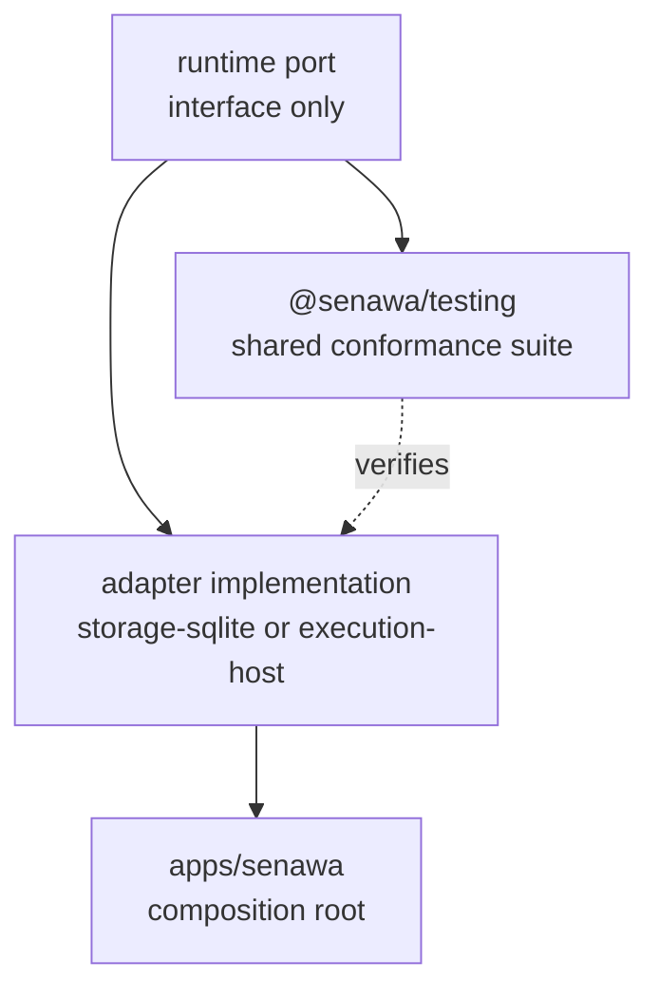

Extension in Senawa follows one pattern: define behavior against an abstract port
in `runtime`, implement that port in a Node-capable package, and bind the
implementation in the composition root at `apps/senawa`. The dependency rules
that make this the only workable pattern are machine-checked, so a design that
violates them fails `pnpm check:boundaries` before it fails review.

## The extension pattern

Three layers, in order.

Ports live in [packages/runtime/src/ports.ts](../../packages/runtime/src/ports.ts)
and [packages/runtime/src/runner.ts](../../packages/runtime/src/runner.ts). A port
is an interface with no Node dependency, no clock, and no identifier allocation.
If your new capability needs a contract, this is where it goes.

Implementations live above runtime. `storage-sqlite` holds anything that commits.
`execution-host` holds anything that touches a process, a filesystem, Git, or a
model. Both may import configuration, kernel, protocol, and runtime, and nothing
else.

Binding happens in [apps/senawa/src](../../apps/senawa/src). This is the only
place permitted to know which concrete implementation satisfies which port.
Nothing may import from `apps/`, so the composition root cannot leak upward.



## Adding an adapter

An adapter satisfies an existing port with a new backing technology.

Start by choosing the port. The main ones are `CommandServicePort` and
`RuntimeQueryPort` for command authority, `RunnerAuthorityPort` for effect
authority, `ContextAuthorityPort` and `ContextAssetPort` for context,
`ReportingSnapshotPort` for report capture, and `ConfigurationResourceReader` for
prompt and schema bytes.

Implement it in a package that is allowed to reach the technology. A SQLite,
filesystem, or process-backed adapter belongs in `storage-sqlite` or
`execution-host`. A new package is acceptable, but it must declare only
`@senawa/configuration`, `@senawa/kernel`, `@senawa/protocol`, and
`@senawa/runtime` among internal dependencies, and `apps/senawa` must be the only
consumer.

Verify it against the shared conformance suite rather than a bespoke test.
`@senawa/testing` exports three subpath entries for this purpose:

```ts
import { registerRuntimeAuthorityConformance } from "@senawa/testing/authority-conformance";
import { registerRunnerAuthorityConformance } from "@senawa/testing/runner-conformance";
import { registerContextBrokerConformance } from "@senawa/testing/context-broker-conformance";
```

An adapter that passes the same suite as the in-memory implementation has the
same semantics, not merely a similar shape. Import those suites only from
`.test.ts` files: production source under `packages/` may not mention
`@senawa/testing` at all.

Bind the adapter in the composition root and add a composition test alongside
[apps/senawa/src/production-composition.test.ts](../../apps/senawa/src/production-composition.test.ts).

## Adding a sensor

Sensors are declared data rather than Senawa code. A bounded process host
executes the declared argv.

Add a `SensorDeclaration` to the `sensors` array of your workflow document. The
declaration fixes argv (at least one element), working directory, timeout,
maximum stdout and stderr bytes, an inherited environment allowlist, and both
`maxAttempts` and `maxReconciliationAttempts`. The shape is in
[packages/configuration/src/contracts.ts](../../packages/configuration/src/contracts.ts).

Reference it from a gate. `GateReadingAccessorDeclaration` names the sensor key
and a JSON pointer into the reading data, and gate conditions compose those
accessors.

Run `senawa doctor` to validate. A malformed declaration produces an
`invalid-sensor` diagnostic with an exact locator and pointer.

Only a sensor with a different execution model needs code. `measureExecutableSensor`
in [packages/execution-host/src/process-sensor.ts](../../packages/execution-host/src/process-sensor.ts)
returns an `ExecutableSensorOutcome` of a measurement or a typed failure, and any
replacement must produce readings through `createSensorReading` so that gate
evaluation and evidence digests stay unchanged. A sensor must not decide; it
reports, and the gate decides.

## Adding a worker

A worker is an agent execution backend. The seam is `CopilotSdkPort` in
[packages/execution-host/src/copilot-sdk-port.ts](../../packages/execution-host/src/copilot-sdk-port.ts),
with the production binding in `copilot-sdk-production.ts` and the effect host in
`copilot-worker-effect-host.ts`.

Four constraints apply.

The worker must expose only the sanctioned tool surface.
`COPILOT_WORKER_TOOL_NAMES` and `COPILOT_WORKSPACE_TOOL_NAMES` in
[packages/execution-host/src/copilot-worker.ts](../../packages/execution-host/src/copilot-worker.ts)
are the complete set. A tool that writes authority directly breaks the
proposal-only rule described in [overview.md](overview.md).

The worker must run against a validated immutable context. Inputs pass through
`validateWorkerContextBase`, `validateWorkerDispatch`, and
`validateWorkerModelRouteSelection` before a session starts.

The worker must respect its route limits. `maxTurns`, `maxSubmissions`, and
`maxMillidollars` come from the declared model policy and bound the session.

The SDK must stay optional. `@github/copilot-sdk` is a peer dependency of
`execution-host`, and a no-credit installation must never resolve, install, or
load it. `apps/senawa/src/no-credit-acceptance.test.ts` asserts this.

Live model behavior is verified only in the opt-in lane, `pnpm test:live-worker`,
which requires explicit cost and data acknowledgement and bounded model, credit,
and timeout settings. It is never part of default or packaging validation.

## Adding a transport

A transport carries commands and reads between a client and the supervisor. Three
exist today: authenticated Unix-socket HTTP, session-authenticated loopback HTTP
for the portal, and the optional outbound remote connector.

Define the wire shape in `protocol` first, with a codec that validates it. The
protocol package holds contracts and codecs and nothing else: it may not import
kernel and may not import a Node module.

Implement the server side in `supervisor`, alongside
[packages/supervisor/src/http-router.ts](../../packages/supervisor/src/http-router.ts)
and `http-server.ts`. Authentication belongs in `local-security.ts` for
credential-based access or `session-security.ts` for browser sessions.

Hold the new transport to the shared expectations in
[packages/supervisor/src/transport-conformance.test.ts](../../packages/supervisor/src/transport-conformance.test.ts),
and to the security expectations in `http-security.test.ts`.

Two rules are absolute. A transport carries authority decisions; it never makes
them. A remote peer never holds local authority: the reference server in
[apps/control-plane](../../apps/control-plane) is limited to `@senawa/protocol`
precisely to prove that a remote implementation cannot reach the kernel or
storage. See the
[remote control-plane reference](../reference/remote-control-plane.md) for the
enrollment and classification model.

## Stable versus internal contracts

Treat as stable, with a versioned identifier and a compatibility obligation:

* The wire protocol, `PROTOCOL_VERSION` at `senawa.dev/protocol/v1`.
* The remote protocol, `REMOTE_PROTOCOL_VERSION` at
  `senawa.dev/remote-control/v1`, and `REMOTE_NEGOTIATION_VERSION` at
  `senawa.dev/remote-control/negotiation/v1`.
* The workflow document, `WORKFLOW_CONFIGURATION_API_VERSION` at
  `senawa.dev/workflow/v1`, and the compiled
  `CONFIGURATION_SNAPSHOT_API_VERSION` at
  `senawa.dev/configuration-snapshot/v1`.
* Reporting outputs: `REPORTING_SNAPSHOT_VERSION`,
  `DETERMINISTIC_REPORT_VERSION`, and `REPORT_EXPORT_VERSION`, all at
  `v1`.
* Kernel record contracts that carry their own `apiVersion`, such as
  `WORKER_CONTEXT_BASE_API_VERSION`, `WORKER_DISPATCH_API_VERSION`,
  `PHASE_ATTEMPT_API_VERSION`, `FAN_OUT_EVALUATION_API_VERSION`, and
  `AMENDMENT_PROPOSAL_API_VERSION`.
* Whatever a package lists in its `exports` field. Every package that declares
  one exposes `.`; `storage-sqlite` also exposes `./reporting-snapshot`, and
  `testing` exposes its three conformance subpaths. `portal` and the `senawa`
  app declare no `exports` field, because they ship built assets and an
  executable rather than a module surface.
* The `senawa` executable surface documented in the
  [CLI reference](../reference/cli.md) and the routes in the
  [local supervisor HTTP reference](../reference/local-supervisor-http.md).

Treat as internal, changeable without notice:

* Any module not reachable through a package `exports` entry.
* SQLite table and column shapes. The stable surface is
  `CURRENT_SCHEMA_VERSION` plus the migration sequence, not the tables. See
  [durability.md](durability.md).
* Fault injection points (`SqliteFaultPoint`, `SupervisorFaultPoint`) and the
  in-memory implementations used to exercise them.
* Portal internals: view models, layout, rendering, and the diagram
  implementation. The stable portal contract is the protocol surface in
  `portal-contracts.ts`.
* Diagnostic message text. Diagnostic codes are stable; the prose is not.

Senawa is alpha software. A stable contract carries a versioned identifier so a
change is observable, not so it never changes.

## Rules enforced by check-boundaries

`pnpm check:boundaries` runs
[scripts/check-boundaries.mjs](../../scripts/check-boundaries.mjs). It reads every
`.ts` file under `packages/` and `apps/`, checks eight manifests, and reports
every violation before exiting non-zero.

### Manifest rules

* `runtime` may declare only `@senawa/kernel` and `@senawa/protocol`.
* `reporting` may declare only `@senawa/kernel`, `@senawa/protocol`, and
  `@senawa/runtime`.
* `configuration` may declare only `@senawa/kernel`, `ajv`, and
  `json-schema-traverse`.
* `execution-host` may declare only `@github/copilot-sdk`,
  `@senawa/configuration`, `@senawa/kernel`, `@senawa/protocol`, and
  `@senawa/runtime`.
* `storage-sqlite` may declare only `@senawa/configuration`, `@senawa/kernel`,
  `@senawa/protocol`, `@senawa/runtime`, and `better-sqlite3`.
* `supervisor` may declare only `@senawa/protocol`, `@senawa/runtime`,
  `@senawa/storage-sqlite`, and `better-sqlite3`.
* `portal` must declare exactly one production dependency, `@senawa/protocol`.
* `apps/control-plane` must declare exactly one production dependency,
  `@senawa/protocol`.

### Source rules

Each rule below reports the offending file with the quoted message.

* `packages cannot import apps`. Applies to every file under `packages/`, with
  one exception: browser system tests matching
  `packages/<name>/tests/browser/` may compose the CLI.
* `production packages cannot import testing`. Any non-`.test.ts` file under
  `packages/` that mentions `@senawa/testing`.
* `<package> cannot import Node modules`. Applies to `kernel`, `protocol`,
  `runtime`, `configuration`, and non-test `reporting` source.
* `portal production source cannot import Node modules`.
* `portal production source may import only protocol`.
* `control-plane production source may import only protocol, Node built-ins, and
  sibling modules`.
* `protocol cannot import kernel behavior`.
* `kernel cannot observe runtime state or external effects`. Rejects `Date.now`,
  `Math.random`, `process.`, `fetch(`, and `Worker(`.
* `runtime must receive current time and identifier allocation`. Rejects
  `Date.now()` and `Math.random()`.
* `runtime may import only protocol and kernel packages`.
* `reporting may import only kernel, protocol, and runtime packages`.
* `configuration may import only the kernel package`.
* `execution-host may import only configuration, kernel, protocol, and runtime
  packages`.
* `kernel cannot import effect or adapter packages`. Rejects any
  `@senawa/runtime`, `@senawa/storage*`, `@senawa/execution-host`,
  `@senawa/sensors`, `@senawa/workers`, `@senawa/git`, `@senawa/supervisor`, or
  `@senawa/portal` reference.

### How Node imports are detected

Detection is AST-based, not textual. The script parses each file with the
TypeScript compiler and inspects import declarations, export declarations,
import-equals declarations, dynamic `import()` calls, and `require()` calls, then
resolves each specifier against `builtinModules` and `isBuiltin` with and without
the `node:` prefix.

Both `import "node:fs"` and `import os from "os"` are caught. So are
`const bytes = import("buffer")` and `export { once } from "events"`.

### The script tests itself

Before reporting success, `verifyRules` runs `checkSource` against a table of
synthetic violating files and requires each to produce its expected message. It
also asserts one negative case: a browser system test composing
`apps/senawa/src/main.js` must not be rejected.

A rule that stops working fails the script rather than silently passing every
file.

## Checklist before opening a change

```bash
pnpm build
pnpm typecheck
pnpm lint
pnpm test
pnpm check:boundaries
pnpm docs:links
```

Add `pnpm test:packaging` when the change affects packaged contents, and
`pnpm test:portal` when it affects the portal.

## How this is proven

* Every manifest and source rule, plus the rule self-tests: [scripts/check-boundaries.mjs](../../scripts/check-boundaries.mjs).
* Adapter semantic equivalence across implementations: [packages/testing/src/authority-port-conformance.test.ts](../../packages/testing/src/authority-port-conformance.test.ts),
  [packages/testing/src/runner-conformance.test.ts](../../packages/testing/src/runner-conformance.test.ts),
  [packages/testing/src/context-broker-conformance.test.ts](../../packages/testing/src/context-broker-conformance.test.ts),
  [packages/testing/src/runtime-conformance.test.ts](../../packages/testing/src/runtime-conformance.test.ts).
* Sensor declaration validation and bounded execution: [packages/configuration/src/configuration.test.ts](../../packages/configuration/src/configuration.test.ts)
  and [packages/execution-host/src/process-sensor.test.ts](../../packages/execution-host/src/process-sensor.test.ts).
* Worker tool surface, route limits, and session handling: [packages/execution-host/src/copilot-worker.test.ts](../../packages/execution-host/src/copilot-worker.test.ts),
  [packages/execution-host/src/copilot-sdk-production.test.ts](../../packages/execution-host/src/copilot-sdk-production.test.ts),
  [packages/execution-host/src/copilot-session-store.test.ts](../../packages/execution-host/src/copilot-session-store.test.ts).
* Optional SDK and no-credit installation: [apps/senawa/src/no-credit-acceptance.test.ts](../../apps/senawa/src/no-credit-acceptance.test.ts)
  and [scripts/test-packaging.mjs](../../scripts/test-packaging.mjs).
* Transport conformance and security: [packages/supervisor/src/transport-conformance.test.ts](../../packages/supervisor/src/transport-conformance.test.ts),
  [packages/supervisor/src/http-security.test.ts](../../packages/supervisor/src/http-security.test.ts),
  [packages/supervisor/src/portal-transport.test.ts](../../packages/supervisor/src/portal-transport.test.ts),
  [packages/supervisor/src/remote-connector.test.ts](../../packages/supervisor/src/remote-connector.test.ts).
* Composition root wiring: [apps/senawa/src/production-composition.test.ts](../../apps/senawa/src/production-composition.test.ts).
