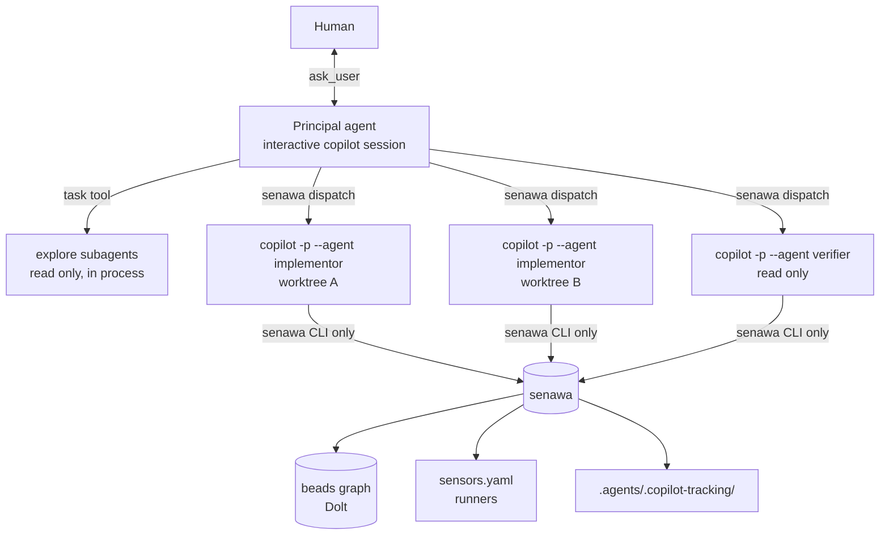
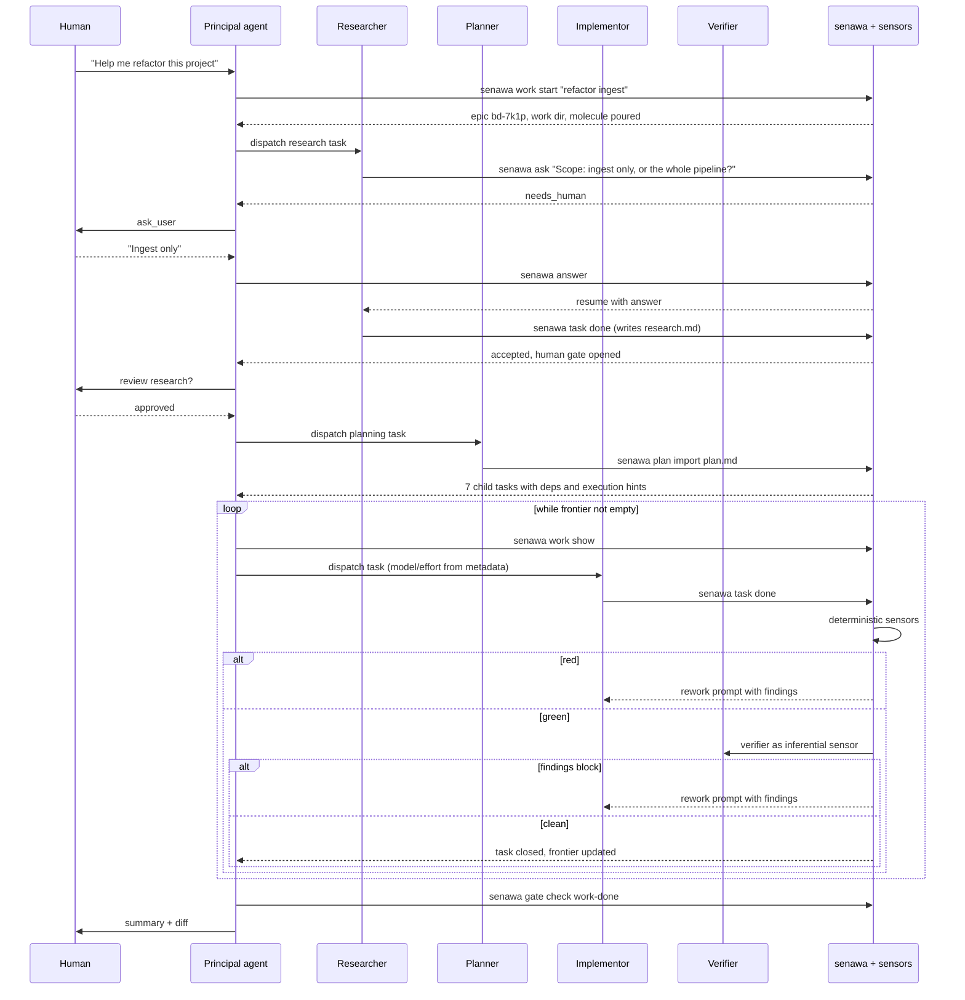

## Purpose

This document proposes an architecture for a principal agent (PA) that decomposes a high level human request into research, planning, implementation, and verification work, delegates each piece to a subagent (SA), and refuses to let work advance until sensors say it is sound.

Three ideas carry the design:

1. Durable graph state lives outside the model, in [beads](https://github.com/gastownhall/beads). The PA queries a bounded view of it instead of remembering it.
2. Every agent interacts with the system through one CLI, `senawa`. Agents never call `bd` directly and never run test commands directly. That single seam is where policy lives.
3. Completion is not something an agent asserts. It is something the harness grants, after sensors return readings and gates consume them. This is the backpressure model from [Manufacturing Backpressure in Coding Agent Harnesses](https://dasith.me/2026/06/14/backpressure-in-coding-agent-harnesses/).

## What the substrate actually gives us

The design leans on capabilities that exist in Copilot CLI today (verified against version 1.0.76 and the current reference docs). Knowing exactly which primitives are real changes the architecture significantly.

| Capability | Where it lives | Why it matters here |
|------------|----------------|---------------------|
| Custom agents | `.github/agents/*.agent.md` with `description`, `name`, `tools`, `model`, `mcp-servers`, `disable-model-invocation`, `user-invocable` | Each role (researcher, planner, implementor, verifier) becomes a profile with its own model, reasoning posture, and tool surface |
| Subagents | `task` tool, invoked by the main agent | Delegated work gets a separate context window; the PA stays small |
| Agent messaging | `list_agents`, `read_agent`, `write_agent` tools, with `scope` values `siblings` and `children` | The PA can send follow-up instructions into a still-running subagent instead of restarting it |
| Hooks | `.github/hooks/*.json`, `~/.copilot/hooks/*.json`, plugin `hooks.json` | Deterministic interception at `preToolUse`, `postToolUse`, `subagentStart`, `subagentStop`, `agentStop`, `sessionStart`, `preCompact` |
| Hook decision control | `permissionDecision` on `preToolUse`, `decision: "block"` with a `reason` on `agentStop` and `subagentStop`, `additionalContext` on `postToolUse` and `subagentStart` | Gates that the model cannot route around, and forced continuation prompts |
| Programmatic mode | `copilot -p`, `--agent`, `--model`, `--effort`, `--output-format json`, `--session-id`, `--resume`, `--share`, `--allow-tool`, `--deny-tool`, `--add-dir` | Per task control of model, effort, permissions, and a resumable session identity |
| Node SDK | `@github/copilot-sdk` (MIT, JSON-RPC to the CLI runtime): `createSession`, `resumeSession`, per-session `model` and `reasoningEffort`, in-process `hooks`, `onPermissionRequest`, `onUserInputRequest`, `defineTool`, `commands`, typed events | Turns most of this design from process orchestration into ordinary function calls |
| Isolation | `-w/--worktree` (experimental), `--add-dir`, `/sandbox` | Parallel implementors that do not stomp on each other |
| Observability | OpenTelemetry GenAI spans (`invoke_agent`, `chat`, `execute_tool`) with cost, tokens, and `gen_ai.agent.name` | Per-role cost accounting and gate quality measurement |
| Plugins | `plugin.json` bundling agents, skills, hooks, MCP servers | Ship the whole harness as one installable unit later |
| Extensions | `.github/extensions/NAME/extension.mjs`, experimental, JavaScript only | Register senawa's operations as native tools and slash commands rather than shell commands |

Two limits shape everything downstream. Subagent concurrency is capped by plan (2 on Free, 4 on Pro, 8 on Max, 16 on Business, 32 on Enterprise), and a `subagentStop` hook that keeps returning `block` is overridden after eight consecutive continuations. Neither is fatal, but both argue against treating in-process subagents as an unlimited worker pool.

## Topology choice

There are two credible shapes, and the right answer is a hybrid.

### Topology A, in-process subagents

The human runs `copilot --agent principal`. The PA delegates with the `task` tool. Subagents run inside the same process tree with their own context windows.

This is cheap, native, and parallel. `subagentStart` can prepend a task brief; `subagentStop` can force a retry. The PA talks to the human with `ask_user`. Weaknesses: model and reasoning effort are fixed by the agent profile rather than per task, work dies with the session, and the built-in `general-purpose` agent emits neither `subagentStart` nor `subagentStop`, so hook based gating silently does not apply to it.

### Topology B1, worker sessions as subprocesses

The PA (or the `senawa` CLI acting on its behalf) spawns a fresh `copilot -p` process per task:

```bash
copilot -p "$(senawa task brief bd-a1b2)" \
  --agent implementor \
  --model "$(senawa task hint bd-a1b2 model)" \
  --effort "$(senawa task hint bd-a1b2 effort)" \
  --session-id "$(senawa task session bd-a1b2)" \
  --output-format json \
  --share ".agents/.copilot-tracking/$WORK/tasks/bd-a1b2/transcript.md" \
  --allow-tool 'write' --allow-tool 'shell(senawa:*)' \
  --deny-tool 'shell(bd:*)' --deny-tool 'shell(git push)' \
  --no-ask-user
```

Every dial is per task: model, effort, tool allowlist, working directory, timeout, retry. The session identity is durable, so the rework loop the request describes becomes literal:

```bash
copilot --resume="$SESSION_ID" -p "$(senawa task rework bd-a1b2)" --allow-all-tools
```

The subagent resumes with its own memory of what it built, receives the sensor failures and the verifier findings, and fixes them. That is materially better than restarting a fresh agent that has to rediscover the change.

### Topology B2, worker sessions hosted through the SDK

Same topology, better plumbing. `@github/copilot-sdk` drives the CLI runtime over JSON-RPC, so the orchestrator holds many sessions inside one process and every control point becomes a callback rather than a subprocess contract:

```ts
const client = new CopilotClient({ telemetry: { otlpEndpoint: OTLP } });
await client.start();

const session = await client.createSession({
  sessionId: task.sessionId,
  model: task.hints.model,
  reasoningEffort: task.hints.effort,
  systemMessage: { mode: "customize", sections: { guidelines: { action: "append", content: HOUSE_RULES } } },
  tools: [taskDoneTool(task), askTool(task), discoverTool(task)],
  onPermissionRequest: (req) =>
    policy.decide(req), // { kind: "reject", feedback: "may-commit is red: ..." }
  onUserInputRequest: (req) => relay.toHuman(task, req),
  hooks: {
    onPostToolUse: (i) => ({ additionalContext: sensors.fast(i) }),
    onPreToolUse: (i) => policy.preTool(i),
  },
});

await session.sendAndWait({ prompt: brief(task) });
```

Five things get materially better. Hooks stop being shell scripts parsing JSON on stdin, which removes a process spawn from every single tool call. `onPermissionRequest` returns `{ kind: "reject", feedback }`, so a denied action carries an explanation back to the model instead of a bare refusal. `onUserInputRequest` intercepts `ask_user` directly, which is the cleanest possible implementation of the human relay described later in this document. `defineTool` exposes `senawa task done` as a first class typed tool with Zod validation, so workers never need shell access to reach the harness. And `resumeSession(id)` makes the rework loop a method call.

Two cautions. The SDK is young (version 1.0.8 at the time of writing, published within the last week), so pin it and expect churn. And SDK-hosted sessions do not read `.github/hooks/*.json`, so any policy you want applied to both SDK sessions and plain `copilot` sessions has to exist in two forms driven by one shared implementation.

### Recommendation

Use Topology B for anything that writes, implemented as B2 where the orchestrator is running and B1 as the fallback for detached or CI invocations. Use Topology A for cheap read-only fan-out (codebase exploration, parallel file reconnaissance) where the built-in `explore` agent is already excellent and context isolation is the only goal.



## Graph state

The PA needs to know the shape of the workflow without holding it in context. Beads provides that natively: a dependency aware issue graph where `bd ready` computes the claimable frontier, hash IDs avoid multi-writer collisions, and arbitrary JSON metadata carries orchestration state.

### Mapping the workflow onto beads

| Workflow concept | Beads construct |
|------------------|-----------------|
| A unit of work the human asked for | Epic (also a molecule root) |
| Research phase, plan phase, each implementation task, verification | Child issues of the epic |
| Ordering (plan needs research) | `bd dep add <plan> <research>`, type `blocks` |
| Fan-out that can run concurrently | Sibling children with no edges between them, plus `execution_parallel_group` metadata |
| Fan-in before integration | `waits-for` dependency, or one `blocks` edge per contributing task |
| Human sign-off on research and plan | Gate issue of type `human`, resolved by `bd gate resolve` |
| Waiting on CI or a PR | Gate issue of type `gh:run` or `gh:pr`, auto-closed by `bd gate check` |
| Work discovered mid-task | New issue linked with `discovered-from`, so provenance survives |
| Serializing conflict-prone integration | `bd merge-slot acquire` and `release` |
| Reusable end-to-end shape | Formula in `.beads/formulas/*.formula.toml`, cooked to a proto, poured into a molecule |

The important consequence: the PA never invents a task list in its head. It pours a molecule, then repeatedly asks for the frontier. Closing work reshapes the graph, and the graph decides what is next.

### Node lifecycle

Beads statuses (`open`, `in_progress`, `blocked`, `closed`, `deferred`) are coarse. The orchestration substate lives in issue metadata under a `senawa` namespace, so it round-trips through Dolt sync and survives every agent restart.


The metadata contract:

```json
{
  "senawa": {
    "state": "rework",
    "role": "implementor",
    "attempt": 2,
    "max_attempts": 3,
    "session_id": "0cb916db-26aa-40f2-86b5-1ba81b225fd2",
    "worktree": ".worktrees/bd-a1b2",
    "work_dir": ".agents/.copilot-tracking/2026-07-28-refactor-ingest",
    "context_refs": [
      "research.md#ingest-pipeline",
      "plan.md#task-4",
      "tasks/bd-a1b2/brief.md"
    ],
    "last_reading": {
      "gate": "task-done",
      "verdict": "fail",
      "fingerprint": "sha256:9f2c...",
      "failed": ["unit-tests", "arch-review"],
      "at": "2026-07-28T04:11:09Z"
    }
  },
  "execution_agent_type": "worker",
  "execution_suggested_model": "claude-sonnet-4.6",
  "execution_reasoning_effort": "high",
  "execution_mode": "delegated",
  "execution_parallel_group": "ingest-adapters"
}
```

The `execution_*` keys are not invented here. They are an existing beads convention for exactly this purpose, and the beads documentation is explicit that an orchestrator must read them before spawning a subagent, because model and reasoning effort cannot be changed after launch.

### Keeping the PA's context small

`senawa state show` returns a token-bounded projection, never the whole graph:

```json
{
  "work": "2026-07-28-refactor-ingest",
  "epic": "bd-7k1p",
  "phase": "execute",
  "counts": { "pending": 4, "ready": 2, "in_flight": 3, "rework": 1, "done": 9, "escalated": 0 },
  "frontier": [
    { "id": "bd-a1b2", "title": "Split parse_batch into stages", "group": "ingest-adapters", "role": "implementor" },
    { "id": "bd-c3d4", "title": "Extract retry policy", "group": "ingest-adapters", "role": "implementor" }
  ],
  "needs_human": [],
  "recent_events": [
    "bd-9x2m rework 2/3: unit-tests red (3 failures)",
    "bd-4t8n done"
  ],
  "budget": { "aiu_spent": 41.2, "aiu_cap": 250 }
}
```

Hard rule: the projection is capped (suggest 1,500 tokens). Anything larger is a file path, not a payload. Combined with a `sessionStart` and `preCompact` hook that re-runs `senawa prime`, the PA can drive a multi-day workflow without its context ever growing with the work.

## The senawa CLI

This is the load bearing piece. Agents get one tool surface, and every policy decision routes through it.

### Command surface

```text
senawa init                                  # scaffold .beads, sensors.yaml, agents, hooks
senawa prime                                 # compact workflow context for sessionStart/preCompact

senawa work start "<goal>"                   # create epic + tracking dir, pour the workflow molecule
senawa work show [--json]                    # bounded projection for the PA
senawa work finish                           # close epic, squash wisps, write summary

senawa task next [--role R] [--group G]      # next ready task with execution hints
senawa task claim <id>                       # atomic claim (bd update --claim)
senawa task brief <id>                       # rendered prompt for a worker session
senawa task rework <id>                      # rendered follow-up prompt with failures
senawa task note <id> "<text>"               # append durable note
senawa task discover <id> "<title>"          # create a discovered-from child
senawa task done <id> --summary "<text>"     # REQUEST completion; runs the gate; may refuse
senawa task escalate <id> --reason "<text>"

senawa ask <id> "<question>"                 # subagent -> human relay, opens a human gate
senawa answer <msg-id> "<answer>"            # PA writes the human's answer, resolves the gate

senawa sensor list [--json]
senawa sensor run [--id S ...] [--task <id>] [--json]
senawa gate check <gate-id> [--task <id>] [--json]

senawa plan import <file> [--epic <id>]      # planner output -> beads subgraph
senawa dispatch <id>                         # spawn/resume the worker session for a task
```

### The contract that creates backpressure

`senawa task done` is the entire trick. A worker cannot close a bead. It submits a completion request, and the CLI answers:

```json
{
  "accepted": false,
  "task": "bd-a1b2",
  "gate": "task-done",
  "attempt": 2,
  "attempts_remaining": 1,
  "readings": [
    { "sensor": "typecheck", "verdict": "pass", "duration_ms": 4120 },
    { "sensor": "unit-tests", "verdict": "fail", "duration_ms": 18344,
      "findings": [
        { "file": "src/ingest/parse.py", "line": 88, "message": "test_parse_batch_empty: expected 0 rows, got None" }
      ]
    },
    { "sensor": "arch-review", "verdict": "fail", "trust": "advisory",
      "findings": [
        { "message": "stage_two() reaches into the Reader's private buffer; violates the layering rule in docs/architecture.md" }
      ]
    }
  ],
  "next_prompt": "Two readings are red. Fix these, then call senawa task done again.\n\n1. unit-tests ...\n2. arch-review ..."
}
```

The worker receives actionable evidence rather than a bare refusal, which is precisely what makes a sensor useful. Even the advisory reading appears, tagged so the model knows how much weight to give it.

### Why a CLI rather than an MCP server

MCP tool schemas cost tokens in every context window, and this harness runs many sessions. A CLI costs one line of instruction, and hooks can gate shell invocations by pattern. The recommendation is CLI-first, with an optional thin MCP wrapper later for editor-side use. Beads reached the same conclusion for the same reason.

## Sensors and gates

The blog post's separation is worth preserving exactly: a sensor perceives, a gate decides, and backpressure is what the agent feels when a gate refuses.

### sensors.yaml

```yaml
version: 1

defaults:
  timeout_sec: 300
  max_evidence_bytes: 8000

sensors:
  - id: format
    kind: deterministic
    run: "ruff format --check ."
    cost: trivial
    scope: changed_files

  - id: lint
    kind: deterministic
    run: "ruff check --output-format=json ."
    cost: cheap
    scope: changed_files
    parser: ruff-json

  - id: typecheck
    kind: deterministic
    run: "pyright --outputjson"
    cost: cheap
    parser: pyright-json

  - id: unit-tests
    kind: deterministic
    run: "pytest -q --json-report --json-report-file=-"
    cost: medium
    parser: pytest-json

  - id: contract-tests
    kind: deterministic
    run: "pytest -q tests/contract"
    cost: expensive

  - id: arch-review
    kind: inferential
    agent: architecture-reviewer          # .github/agents/architecture-reviewer.agent.md
    rubric: .agents/rubrics/architecture.md
    model: gpt-5.4
    cost: expensive
    trust: advisory                        # promote to "proof" once the false positive rate drops

  - id: security-review
    kind: inferential
    builtin_agent: security-review
    cost: expensive
    trust: advisory

gates:
  - id: may-edit
    requires: []
    description: Always open; placeholder for future path policy

  - id: may-commit
    requires: [format, lint, typecheck]
    on_fail: block

  - id: task-done
    requires: [typecheck, unit-tests]
    advisory: [arch-review]
    on_fail: rework
    max_rework: 3
    escalate_on_exhaustion: true

  - id: plan-accepted
    requires: [plan-lint]
    human_approval: true
    on_fail: block

  - id: work-done
    requires: [typecheck, unit-tests, contract-tests]
    advisory: [arch-review, security-review]
    on_fail: block
```

Three composition rules follow directly from the blog and should be enforced by the runner rather than left to convention. Cheap deterministic sensors run first and short-circuit the expensive ones. Inferential sensors run last, only on otherwise green work, because they are the costly readings. Advisory findings never block on their own, but they always reach the agent.

### Reading cache and fingerprints

Every reading is keyed by `(sensor_id, tree_hash_of_relevant_paths, sensor_definition_hash)`. Re-running `senawa task done` after an unrelated edit reuses green readings instead of paying for them again. Cache entries live under the work directory and the digest is written to bead metadata, which gives the PA a cheap way to answer "is this still green" without re-running anything.

### Sensor output hygiene

Sensor output is untrusted input that flows straight into an agent's context. The runner should cap evidence size, strip control characters, normalize each parser's output into a `findings[]` shape with `file`, `line`, `message`, and refuse to forward raw output larger than the cap (write it to disk and pass the path instead). This matters more than it sounds: a test suite that dumps a hostile fixture into stdout is a prompt injection vector.

## Enforcing gates so the model cannot route around them

Instructions alone produce advisory gates. Three mechanisms make them real, in ascending order of strength.

### Tool permissions per worker session

```bash
--deny-tool 'shell(bd:*)'          # no direct graph mutation
--deny-tool 'shell(git commit)'    # commits go through senawa
--deny-tool 'shell(git push)'
--allow-tool 'shell(senawa:*)'
```

### Hooks

`.github/hooks/senawa.json`:

```json
{
  "version": 1,
  "hooks": {
    "sessionStart": [
      { "type": "command", "bash": "senawa prime --hook", "timeoutSec": 10 }
    ],
    "preCompact": [
      { "type": "command", "bash": "senawa prime --hook", "timeoutSec": 10 }
    ],
    "preToolUse": [
      { "type": "command", "matcher": "bash|powershell",
        "bash": "senawa hook pre-tool", "timeoutSec": 8 }
    ],
    "postToolUse": [
      { "type": "command", "matcher": "edit|create|apply_patch",
        "bash": "senawa hook post-edit", "timeoutSec": 20 }
    ],
    "subagentStart": [
      { "type": "command", "bash": "senawa hook subagent-start", "timeoutSec": 10 }
    ],
    "subagentStop": [
      { "type": "command", "bash": "senawa hook subagent-stop", "timeoutSec": 25 }
    ],
    "agentStop": [
      { "type": "command", "bash": "senawa hook agent-stop", "timeoutSec": 25 }
    ]
  }
}
```

What each one buys:

`preToolUse` reads `toolName` and `toolArgs` from stdin and returns `{"permissionDecision":"deny","permissionDecisionReason":"..."}` for `git commit` while `may-commit` is red, or for any direct `bd` mutation from a worker role. Command `preToolUse` hooks are fail-closed on error, which is the right default for a policy check.

`postToolUse` on edit tools runs only the trivial sensors (format, single-file lint) and returns `additionalContext` with any findings. This is the tightest feedback loop available, and it catches mechanical defects while the change is one edit old.

`subagentStart` prepends the task brief and the house rules to the subagent's prompt, which means the rules cannot be dropped by a sloppy delegation prompt.

`subagentStop` and `agentStop` return `{"decision":"block","reason":"<failures>"}` when the task-done gate is red, forcing another turn with the failures as the prompt. In Topology B this runs inside the worker's own process, so a worker self-corrects before the PA is even involved.

### Guardrails on the guardrails

Keep every hook under a few seconds. `preToolUse` timeouts are always fail-open, so a slow policy check silently stops being a gate. Put fast checks in hooks and expensive checks behind `senawa task done`, which the agent calls explicitly and can afford to wait on.

Also respect the runaway guard: `subagentStop` blocking eight times in a row gets overridden. Track attempts in bead metadata and stop blocking at `max_rework`, escalating instead.

## The orchestration loop

### Phase flow



### The inner loop, precisely

For each dispatch the PA performs exactly four bounded operations:

1. `senawa task next --role implementor` returns one task plus its execution hints.
2. `senawa dispatch <id>` starts or resumes the worker session with the right model, effort, worktree, and tool policy.
3. The worker loops internally against sensors until green or out of attempts. The PA is not in this loop.
4. `senawa work show` returns the updated bounded projection.

The PA's context grows by roughly a hundred tokens per task, not by the size of the work. That is the map-reduce the request calls for: the PA maps tasks onto workers and reduces their verdicts, never their diffs.

### Dynamic context injection

The brief a worker receives is assembled by `senawa task brief`, not written by the PA in prose. It is deterministic, templated, and mostly pointers:

```markdown
# Task bd-a1b2: Split parse_batch into stages

## Scope
Refactor `parse_batch()` in `src/ingest/parse.py` into logical stages.
Do not change public behaviour. Do not touch files outside `src/ingest/`.

## Context (read these, do not re-derive)
- .agents/.copilot-tracking/2026-07-28-refactor-ingest/research.md#parse-pipeline
- .agents/.copilot-tracking/2026-07-28-refactor-ingest/plan.md#task-4
- .agents/.copilot-tracking/2026-07-28-refactor-ingest/decisions.md

## Acceptance
- parse_batch() delegates to named stage functions
- No behaviour change: tests/ingest/test_parse.py passes unchanged
- Public API surface unchanged

## Rules
- You may not close this task. Call `senawa task done bd-a1b2 --summary "..."`.
- If you need a decision from a human, call `senawa ask bd-a1b2 "<question>"` and stop.
- If you find unrelated work, call `senawa task discover bd-a1b2 "<title>"`. Do not do it.
- Commit through `senawa commit`. Direct `git commit` is denied.
```

That last block is the completion pressure control. A worker that cannot declare itself done, cannot widen its own scope, and cannot commit unaided has very few ways to fake progress.

## Human in the loop, through the PA

Subagents should not have `ask_user`. In headless worker sessions there is no user to ask, and in in-process subagents a direct question bypasses the PA's coordination. The relay instead:

1. The SA calls `senawa ask <task-id> "<question>"`.
2. `senawa` creates a beads issue of type `message` threaded to the task, opens a `human` gate blocking the task, sets state to `awaiting_human`, and returns a marker telling the SA to stop and summarize what it has.
3. `senawa work show` now reports `needs_human`, so the PA sees it on its next poll.
4. The PA asks the human with `ask_user`, then calls `senawa answer <msg-id> "<answer>"`, which resolves the gate and appends the answer to the task's notes.
5. `senawa dispatch <id>` resumes the same worker session (`copilot --resume=<session-id>`) with the answer, so the SA keeps everything it had already learned.

This gives the back-and-forth the request describes, it is durable across restarts, and every question and answer ends up in the graph as an auditable artifact rather than in a transcript nobody re-reads.

## Context offloading layout

```text
.agents/
  .copilot-tracking/
    2026-07-28-refactor-ingest/
      work.json               # epic id, molecule id, phase, budget
      research.md             # researcher output, human approved
      plan.md                 # planner output, human approved
      decisions.md            # append-only decision log with rationale
      questions.jsonl         # every senawa ask / answer pair
      sensors/
        cache.json            # fingerprinted readings
        runs/<sensor>/<ts>.json
      tasks/
        bd-a1b2/
          brief.md            # exact prompt the worker received
          transcript.md       # copilot --share output
          verdicts.jsonl      # one line per gate evaluation
          diff.patch
  rubrics/
    architecture.md           # inferential sensor rubrics
    security.md
  skills/                     # Copilot CLI discovers skills here natively
```

Beads holds the graph and the pointers; the tracking directory holds the prose and the evidence. Neither duplicates the other. The date-prefixed work directory keeps concurrent efforts separate and makes archival trivial.

Two notes on placement. `.agents/skills/` is already a location Copilot CLI scans for skills, so the root is a natural fit. The tracking directory should be committed, not gitignored: the value of a decision log is that it survives the session and reaches the reviewer.

## Parallelism and isolation

Parallel implementors need three things.

For filesystem isolation, give each parallel group member its own git worktree. `copilot -w` creates one automatically under `<repo>.worktrees/`, or `senawa dispatch` can manage them explicitly and record the path in bead metadata. Workers in different worktrees cannot conflict on disk.

For graph write safety, note that embedded Dolt is a single writer. Concurrent workers all calling `bd` will contend. Two ways out: run `bd init --server` for genuine multi-writer support, or funnel every graph mutation through `senawa`, which serializes writes (and which you want anyway, since workers are denied direct `bd` access). The second option is simpler and is the recommended default.

For integration safety, use `bd merge-slot acquire` around any step that merges parallel work back to the trunk, so only one agent resolves conflicts at a time. Mark concurrency-safe sets with `execution_parallel_group` at planning time, and have `senawa task next --group G` respect it.

## Observability and tuning

Turn on OTel for every session:

```bash
export COPILOT_OTEL_ENABLED=true
export OTEL_EXPORTER_OTLP_ENDPOINT=http://localhost:4318
export OTEL_RESOURCE_ATTRIBUTES="senawa.work=2026-07-28-refactor-ingest"
```

Each subagent produces an `invoke_agent` span carrying `gen_ai.agent.name`, token counts, `github.copilot.cost`, and `github.copilot.aiu`. Joined with `verdicts.jsonl`, that yields the metrics that actually matter for tuning this harness:

| Metric | What it tells you |
|--------|-------------------|
| Rework loops per task, by role | Whether briefs are underspecified or the model is mismatched to the task |
| Sensor verdict distribution over time | Whether a sensor is flaky and creating false backpressure |
| Advisory findings later confirmed by a deterministic sensor | Whether an inferential sensor has earned promotion to blocking |
| AIU per closed task, by role and model | Whether the expensive model is buying anything on this class of work |
| Escalation rate | Whether the attempt budget is set sensibly |

The blog's point applies directly: a gate's false positives and false negatives are a reading on sensor quality. Instrument for it from day one, because the alternative is tuning by vibes.

## Failure modes and known sharp edges

| Risk | Mitigation |
|------|------------|
| Repository hooks do not load in `-p` mode by default | Set `GITHUB_COPILOT_PROMPT_MODE_REPO_HOOKS=true` for worker sessions, or rely on user-level hooks in `~/.copilot/hooks/` |
| `general-purpose` built-in agent emits no `subagentStart` or `subagentStop` | Never use it for gated work; always dispatch a named custom agent |
| `subagentStop` block loop capped at 8 | Enforce `max_rework` in metadata and escalate before the cap |
| `preToolUse` hook timeouts fail open | Keep hooks fast; put expensive checks behind `senawa task done` |
| Subagent concurrency capped by plan | Read the cap at startup, size the dispatch pool accordingly, queue the rest |
| Model and effort fixed at launch | Read `execution_*` metadata before spawning, never after |
| Embedded Dolt single writer | Serialize writes through `senawa`, or use `bd init --server` |
| Sensor output as an injection vector | Normalize, cap, and strip control characters before it reaches any context |
| Over-gating creating false backpressure | Start inferential sensors advisory; promote only on measured trust |
| PA context creep | Cap `senawa work show`, re-prime on `preCompact`, keep the PA's tool list minimal |
| Escaped scope, worker doing unrequested work | Deny writes outside the task's declared paths via `preToolUse`; require `senawa task discover` for anything else |

## Technology choices

### What the components actually need

The system is four components with genuinely different constraints, and treating them as one undifferentiated "CLI" leads to the wrong answer.

| Component | Dominant constraint |
|-----------|---------------------|
| Orchestrator runtime | Programmatic control of Copilot sessions, concurrency, long-lived process |
| `senawa` command line | Startup latency, because shell hooks fire on every tool call |
| Sensor runner | Subprocess management and output parsing, which every language does adequately |
| Graph adapter | A stable interface to `bd`, plus JSON schema validation |

### Startup latency, measured

Hook latency is not a theoretical concern. A `preToolUse` hook runs before every tool call, and a hook that times out fails open, which silently turns a gate back into a suggestion. Measured on a Linux dev machine, best of five runs:

| Invocation | Time |
|------------|------|
| `/bin/true`, `git --version` | 2 ms |
| `python3 -c ''` | 11 ms |
| `python3` with a few stdlib imports | 20 ms |
| `node -e ''` | 25 ms |
| Node CLI bundled with esbuild (`yaml`, `zod`, `commander`, `execa`, 365 KB single file) | 34 ms |
| The same Node CLI resolving through `node_modules` | 137 ms |
| A compiled Go or Rust binary (not measured here; typical) | 3 to 5 ms |

The headline is that bundling reduces Node's cost by a factor of four. Module resolution is the tax, not V8 startup. A bundled Node CLI at 34 ms is perfectly usable as a hook. An unbundled one at 137 ms is not, and neither is a Python CLI once Click, PyYAML, and Pydantic are in the import graph, which typically lands between 150 ms and 300 ms.

### The decisive factor

`@github/copilot-sdk` exists, is MIT licensed, and has no counterpart in any other language. It provides session creation and resumption, per-session model and reasoning effort, in-process hooks, programmatic permission decisions with feedback to the model, `ask_user` interception, custom typed tools, and slash commands. Roughly half of the hard parts in this design (dispatch, the rework loop, the human relay, gate enforcement, per-task model selection) are a few lines against the SDK and are bespoke infrastructure without it.

The alternative is reimplementing the JSON-RPC protocol against the CLI runtime. That protocol is undocumented, the SDK has shipped 85 versions, and the current release is days old. Betting on it from another language is a poor trade.

### Why the beads language does not decide this

Beads is written in Go and exposes public Go packages, which superficially argues for writing senawa in Go and importing it. Resist that. Beads publishes a documented JSON output contract with a `schema_version` envelope, and that is the supported integration surface. Their internals move fast: the SQLite backend was removed recently, schema version guards were added, and the Dolt dependency brings CGO and build tag complexity into whatever links it. Shell out to `bd --json`, validate `schema_version`, and stay decoupled. Once you accept that, Go's language affinity advantage largely evaporates.

### Recommendation

Write senawa in TypeScript on Node 22 or later, as a single pnpm workspace.

| Package | Contents |
|---------|----------|
| `@senawa/core` | Pure logic with no I/O: the sensors.yaml schema as Zod types, gate evaluation, reading fingerprints, the node state machine, brief and rework templating |
| `@senawa/graph` | The beads adapter; shells out to `bd --json`, validates `schema_version`, serializes writes |
| `@senawa/sensors` | The runner plus normalizers that turn tsc, pyright, pytest, ruff, and eslint output into one `findings[]` shape |
| `@senawa/orchestrator` | The principal agent runtime, built on `@github/copilot-sdk` |
| `senawa` | The command line, built with `commander`, bundled to one file with esbuild, published with a shebang |
| `.github/extensions/senawa/` | Optional: exposes `task done`, `ask`, and `discover` as native tools and slash commands inside interactive sessions |

Supporting choices: `vitest` for tests, `zod` for every external boundary (sensors.yaml, `bd` JSON, hook payloads), `execa` for subprocesses, `esbuild` for the bundle, and Biome for lint and format because it is one fast binary instead of a plugin ecosystem.

Distribution is `npm i -g @senawa/cli`. Node is already a hard dependency of Copilot CLI itself, as the installed shim on this machine confirms, so this adds no new runtime requirement. If a true single binary becomes desirable later, Node's single executable application support can wrap the same bundle without changing any code.

### Keep the sensor boundary language-agnostic

A sensor is any executable that exits nonzero on failure and writes the normalized findings JSON to stdout. That contract deliberately admits shell scripts, Python, Go, or anything else, so the harness never forces a language on the people writing checks for their own codebase. Ship first party normalizers for the common tools, and let everything else be a subprocess.

### If latency ever becomes a real problem

The escape hatch is a shim, not a rewrite. Run the orchestrator as a daemon listening on a Unix domain socket, and replace the shell hook with a tiny compiled client that reads the hook payload on stdin, forwards it to the socket, and prints the decision. That is roughly a hundred lines of Go or Rust, brings hook cost down to single digit milliseconds, and shares one warm state cache across every hook invocation. Add it when measurement demands it, not before.

### Options considered and rejected

Go is the strongest alternative and would win outright if you decided never to use the SDK. It gives 3 to 5 ms hooks, effortless static binary distribution, excellent concurrency for a worker pool, and language parity with beads for anyone who wants to contribute upstream. The cost is rebuilding session management, permission handling, and the human relay on top of `copilot -p` and shell hooks. Revisit if the SDK proves unstable.

Python suits the sensor and parser layer well and is the natural language for anyone writing project-specific checks, but it is the weakest choice for the core: no SDK, the worst startup profile once realistic dependencies are imported, and a distribution story that needs uv or pipx to be pleasant.

Rust would produce the fastest and most portable binary, and is genuinely attractive for the hook shim described above. For the orchestrator it buys nothing the design needs while slowing iteration on a system whose shape is still moving.

A mixed Go CLI with a TypeScript orchestrator is defensible on paper and expensive in practice: two toolchains, two test suites, and the sensors.yaml schema duplicated in both languages with no compiler keeping them honest. The shim approach gets the same latency benefit for a fraction of the surface area.

## Suggested build order

The design is large, but it degrades gracefully. Build it in slices that are each useful alone.

Slice zero sets up the workspace: a pnpm monorepo, `@senawa/core` with the sensors.yaml Zod schema, vitest, and an esbuild bundle step that produces the `senawa` binary. Verify the bundled startup time stays under about 40 ms, and keep a test asserting it, because that number is what makes hook-based gating viable.

Slice one gives you the seam. Implement `senawa init`, `senawa sensor run`, `senawa gate check`, and a minimal `sensors.yaml` with format, lint, typecheck, and tests. No agents yet. You immediately get a single command that answers "is this work sound".

Slice two adds enforcement. Wire `.github/hooks/senawa.json` with `postToolUse` fast sensors and `agentStop` gating. Run it against a single ordinary Copilot session. You now have real backpressure with no orchestration at all, and you will learn which sensors are noisy before they matter.

Slice three adds graph state. Add beads, implement `senawa work start`, `task next`, `task claim`, `task done`, and `work show`. Drive it by hand. Verify that a task genuinely cannot close while a sensor is red.

Slice four adds the roles. Write `researcher`, `planner`, `implementor`, and `verifier` agent profiles, plus `senawa dispatch` and `senawa plan import`. Start with the subprocess path (Topology B1) because it is easy to debug: you can read the exact command and rerun it by hand. Run one full loop end to end on a small refactor.

Slice five adds the principal. Introduce `@senawa/orchestrator` on `@github/copilot-sdk`, move dispatch to hosted sessions (Topology B2), and implement the `ask` and `answer` relay on `onUserInputRequest`. Write `principal.agent.md` with a deliberately narrow tool list. Now the human talks to one agent.

Slice six adds scale. Worktrees, parallel groups, merge slots, OTel dashboards, and a formula that captures the whole workflow so `senawa work start` pours it in one step. Package the lot as a Copilot CLI plugin.

## Open questions worth deciding early

1. Does `senawa` shell out to `copilot -p`, or embed a longer-lived worker pool that it messages? Shelling out is simpler and resumable; a pool is faster and cheaper per task.
2. Should the verifier be an inferential sensor invoked by the gate (proposed here), or a first class graph node with its own bead? The sensor framing keeps the graph smaller; the bead framing gives verification its own audit trail.
3. How much should the PA be allowed to re-plan? A PA that can add tasks mid-flight is more capable and much harder to reason about. Suggest starting with re-planning only through an explicit `senawa plan revise` that re-invokes the planner and requires human approval.
4. Where does the attempt budget live: per task, per work item, or per AIU spend? A spend-based budget is the most honest, and Copilot CLI already reports AIU per span.
5. Is the tracking directory committed to the repository or kept in a sibling branch? Committing is better for review; a sibling branch keeps history clean.

## References

* [Manufacturing Backpressure in Coding Agent Harnesses](https://dasith.me/2026/06/14/backpressure-in-coding-agent-harnesses/)
* [Refining Inferential Sensors in Coding Agent Harnesses](https://dasith.me/2026/06/20/refining-inferential-sensors/)
* [Structured workflows for coding with AI agents using the Breadcrumb Protocol](https://dasith.me/2025/04/02/vibe-coding-breadcrumbs/)
* [beads](https://github.com/gastownhall/beads) and the [beads documentation](https://beads.gascity.com/)
* [Comparing GitHub Copilot CLI customization features](https://docs.github.com/en/copilot/concepts/agents/copilot-cli/comparing-cli-features)
* [GitHub Copilot hooks reference](https://docs.github.com/en/copilot/reference/hooks-reference)
* [GitHub Copilot CLI command reference](https://docs.github.com/en/copilot/reference/copilot-cli-reference/cli-command-reference)
* [GitHub Copilot CLI programmatic reference](https://docs.github.com/en/copilot/reference/copilot-cli-reference/cli-programmatic-reference)
* [@github/copilot-sdk](https://www.npmjs.com/package/@github/copilot-sdk) and the [copilot-sdk repository](https://github.com/github/copilot-sdk)
* [About extensions for GitHub Copilot CLI](https://docs.github.com/en/copilot/concepts/agents/copilot-cli/about-cli-extensions)
