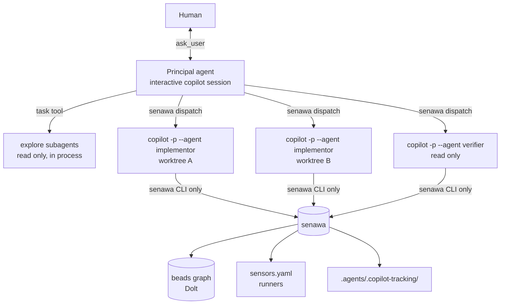
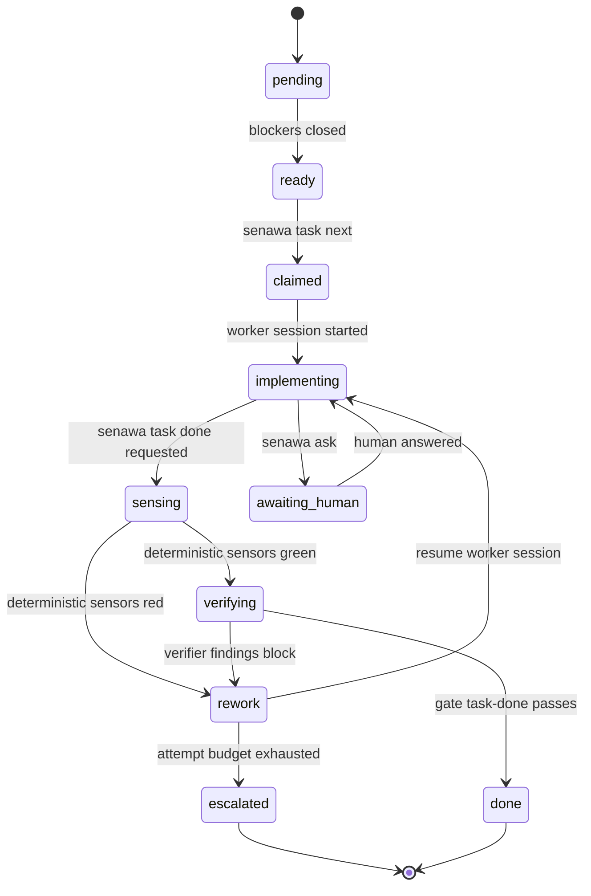
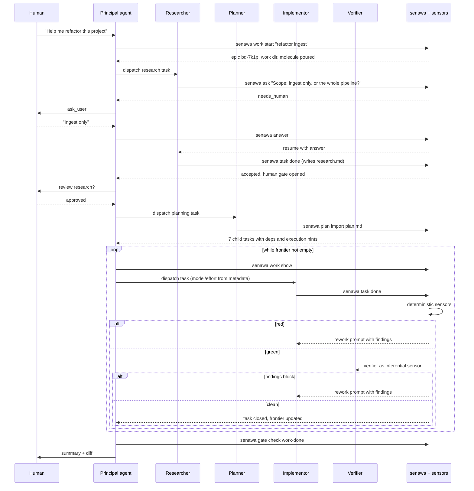

## Purpose

This document proposes an architecture for a principal agent (PA) that decomposes a high level human request into research, planning, implementation, and verification work, delegates each piece to a subagent (SA), and refuses to let work advance until sensors say it is sound.

Three ideas carry the design:

1. Durable graph state lives outside the model, in [beads](https://github.com/gastownhall/beads). The PA queries a bounded view of it instead of remembering it.
2. Every agent interacts with the system through one CLI, `senawa`. Agents never call `bd` directly and never run test commands directly. That single seam is where policy lives.
3. Completion is not something an agent asserts. It is something the harness grants, after sensors return readings and gates consume them. This is the backpressure model from [Manufacturing Backpressure in Coding Agent Harnesses](https://dasith.me/2026/06/14/backpressure-in-coding-agent-harnesses/).

## What the substrate actually gives us

The design leans on capabilities that exist in Copilot CLI today (verified 2026-07-28 against CLI 1.0.75, `@github/copilot-sdk` 1.0.8, `bd` 1.1.0, and the current reference docs). Knowing exactly which primitives are real changes the architecture significantly.

| Capability | Where it lives | Why it matters here |
|------------|----------------|---------------------|
| Custom agents | `.github/agents/*.agent.md` with `description` (required), `name`, `tools`, `model`, `mcp-servers`, `infer` | Each role (researcher, planner, implementor, verifier) becomes a profile with its own model and tool surface. There is no reasoning-effort field; see the note below |
| Subagents | `task` tool, invoked by the main agent | Delegated work gets a separate context window; the PA stays small |
| Agent messaging | `list_agents`, `read_agent`, `write_agent` tools, with `scope` values `siblings` and `children` | The PA can send follow-up instructions into a still-running subagent instead of restarting it |
| Hooks | `.github/hooks/*.json`, `~/.copilot/hooks/*.json`, repository and user `settings.json`, plugin `hooks.json`, machine-wide policy files | Deterministic interception at `preToolUse`, `permissionRequest`, `postToolUse`, `postToolUseFailure`, `subagentStart`, `subagentStop`, `agentStop`, `sessionStart`, `sessionEnd`, `preCompact`, `userPromptTransformed`, `notification` |
| Hook decision control | `permissionDecision` on `preToolUse`; `behavior` plus `message` and `interrupt` on `permissionRequest`; `decision: "block"` with a `reason` on `agentStop` and `subagentStop`; `additionalContext` on `postToolUse` and `subagentStart` | Gates that the model cannot route around, denials that carry an explanation, and forced continuation prompts |
| Programmatic mode | `copilot -p`, `--agent`, `--model`, `--effort`, `--output-format json`, `--session-id`, `--resume`, `--share`, `--allow-tool`, `--deny-tool`, `--available-tools`, `--excluded-tools`, `--add-dir` | Per task control of model, effort, tool visibility, permissions, and a resumable session identity |
| Autopilot | `--autopilot` or `--mode autopilot`, the `task_complete` tool, `--max-autopilot-continues=N` | A native completion-pressure loop with a configurable continuation budget, not subject to the eight-block cap |
| SDK | `@github/copilot-sdk` and siblings (MIT, JSON-RPC to the CLI runtime): `createSession`, `resumeSession`, per-session `model` and `reasoningEffort`, in-process `hooks`, `onPermissionRequest`, `onUserInputRequest`, `defineTool`, `commands`, typed events | Turns most of this design from process orchestration into ordinary function calls. Published for TypeScript, Python, Go, .NET, Java, and Rust |
| Isolation | `-w/--worktree` (experimental), `--add-dir`, `--sandbox` / `/sandbox` | Parallel implementors that do not stomp on each other |
| Observability | OpenTelemetry GenAI spans (`invoke_agent`, `chat`, `execute_tool`) with cost, tokens, and `gen_ai.agent.name`, plus `github.copilot.hook.*` span events | Per-role cost accounting, gate quality measurement, and hook latency measurement |
| Plugins | `plugin.json` bundling agents, skills, hooks, MCP servers | Ship the whole harness as one installable unit later |
| Extensions | `.github/extensions/NAME/extension.mjs`, experimental, JavaScript only, requires `--experimental` | Register senawa's operations as native tools and slash commands rather than shell commands |

Four limits shape everything downstream.

Subagent concurrency is capped by plan (2 on Free, 4 on Pro, 8 on Max, 16 on Business, 32 on Enterprise), so read the cap at startup rather than hard-coding it. A `subagentStop` hook that keeps returning `block` is overridden after eight consecutive continuations. Command hooks are fail-closed on crash or non-zero exit but always fail-open on timeout, while HTTP hooks are fail-open on everything, so a policy check that can be slow is not a policy check.

The fourth limit is subtler and breaks a premise the rest of the design depends on. Agent profiles carry `model` but have no reasoning-effort field at all: effort comes from `--effort`, the `effortLevel` setting, or the SDK's `reasoningEffort`. Worse, when the session model is `Auto`, subagents inherit the resolved session model and ignore their profile's `model` entirely. Per-role model selection therefore only works if the principal session pins an explicit model. Never run the PA on `Auto`.

## Topology choice

There are two credible shapes, and the right answer is a hybrid.

### Topology A, in-process subagents

The human runs `copilot --agent principal`. The PA delegates with the `task` tool. Subagents run inside the same process tree with their own context windows.

This is cheap, native, and parallel. `subagentStart` can prepend a task brief; `subagentStop` can force a retry. The PA talks to the human with `ask_user`. Weaknesses: the model is fixed by the agent profile rather than per task and reasoning effort cannot be set per profile at all, work dies with the session, and the built-in `general-purpose` agent emits neither `subagentStart` nor `subagentStop`, so hook based gating silently does not apply to it. Use `infer: false` on any profile that must only run when senawa dispatches it.

### Topology B1, worker sessions as subprocesses

The PA (or the `senawa` CLI acting on its behalf) spawns a fresh `copilot -p` process per task:

```bash
copilot -p "$(senawa task brief bd-a1b2)" \
  --agent implementor \
  --model "$(senawa task hint bd-a1b2 model)" \
  --effort "$(senawa task hint bd-a1b2 effort)" \
  --session-id "$(senawa task session bd-a1b2)" \
  --output-format json \
  --share ".agents/.copilot-tracking/$WORK/tasks/bd-a1b2/transcript.md" \
  --allow-tool 'write' --allow-tool 'shell(senawa:*)' \
  --deny-tool 'shell(git push)' \
  --no-ask-user
```

Every dial is per task: model, effort, tool allowlist, working directory, timeout, retry. The session identity is durable, so the rework loop the request describes becomes literal:

```bash
copilot --resume="$SESSION_ID" -p "$(senawa task rework bd-a1b2)" --allow-all-tools
```

The subagent resumes with its own memory of what it built, receives the sensor failures and the verifier findings, and fixes them. That is materially better than restarting a fresh agent that has to rediscover the change.

Note that `--session-id` and `--resume` must not appear in the same invocation; they compete to decide which session to open. The first launch creates the session by UUID, and every subsequent turn resumes it. Bare `--resume` with no value needs a TTY and errors under `-p`, so always pass the identifier.

#### Why the deny list is not the containment boundary

An earlier draft of this design denied graph mutation with `--deny-tool 'shell(bd:*)'`. That is theatre. The `:*` suffix matches a command stem followed by a space, so bare `bd` does not match at all, and `bash -c 'bd close ...'`, `env bd ...`, or a two-line wrapper script all walk straight past it. Path scoping fares no better: `--deny-tool='write(PATH)'` is an exact or trailing-path-segment match with no glob support, so "no writes outside `src/ingest/`" is not expressible as a deny rule.

Containment is layered instead, strongest first:

1. **Capability removal.** `senawa dispatch` builds the worker's environment with `bd` absent from `PATH`. A tool the process cannot resolve needs no policy.
2. **Tool visibility.** `--excluded-tools` removes a tool from the model's menu entirely, which is a different and stronger control than `--deny-tool`, which only refuses the permission after the model has decided to try.
3. **Policy interception.** A `preToolUse` or `permissionRequest` hook inspects `toolArgs` and refuses writes outside the task's declared paths, with a reason the model can act on.
4. **OS sandbox.** `--sandbox` for anything running unattended.

Deny rules stay as a cheap last line for the handful of exact commands worth naming, such as `git push`. They are not the wall.

### Topology B2, worker sessions hosted through the SDK

Same topology, better plumbing. `@github/copilot-sdk` drives the CLI runtime over JSON-RPC, so the orchestrator holds many sessions inside one process and every control point becomes a callback rather than a subprocess contract:

```ts
const client = new CopilotClient({ telemetry: { otlpEndpoint: OTLP } });
await client.start();

const session = await client.createSession({
  sessionId: task.sessionId,
  model: task.hints.model,
  reasoningEffort: task.hints.effort,
  systemMessage: { mode: "customize", sections: { guidelines: { action: "append", content: HOUSE_RULES } } },
  tools: [taskDoneTool(task), askTool(task), discoverTool(task)],
  onPermissionRequest: (req) =>
    policy.decide(req), // { kind: "reject", feedback: "may-commit is red: ..." }
  onUserInputRequest: (req) => relay.toHuman(task, req),
  hooks: {
    onPostToolUse: (i) => ({ additionalContext: sensors.fast(i) }),
    onPreToolUse: (i) => policy.preTool(i),
  },
});

await session.sendAndWait({ prompt: brief(task) });
```

Five things get materially better. Hooks stop being shell scripts parsing JSON on stdin, which removes a process spawn from every single tool call and removes the timeout-fail-open hole with it. `onPermissionRequest` returns `{ kind: "reject", feedback }`, so a denied action carries an explanation back to the model instead of a bare refusal. `onUserInputRequest` intercepts `ask_user` directly, which is the cleanest possible implementation of the human relay described later in this document. `defineTool` exposes `senawa task done` as a first class typed tool with Zod validation, so workers never need shell access to reach the harness. And `resumeSession(id)` makes the rework loop a method call.

Three cautions, one of them structural.

The structural one: **the SDK's hook surface is not the CLI's hook surface.** It exposes `onPreToolUse`, `onPostToolUse`, `onPostToolUseFailure`, `onUserPromptSubmitted`, `onSessionStart`, `onSessionEnd`, and `onErrorOccurred`. There is no `onSubagentStop` and no `onAgentStop`. The "worker keeps getting handed its failures until it is green, without the PA in the loop" mechanism described under Topology B1 does not exist here. In B2 the orchestrator rebuilds it explicitly: call `sendAndWait`, run the gate, and if the verdict is red send the rework prompt into the same session and wait again, bounded by `max_attempts`. That is arguably better, because the budget is the harness's rather than a hard-coded cap of eight, but it is code you write rather than configuration you declare.

The second: SDK sessions do not read `.github/hooks/*.json`, so any policy you want applied to both SDK sessions and plain `copilot` sessions has to exist in two forms driven by one shared implementation in `@senawa/core`.

The third: infinite sessions are **on by default**, meaning the runtime already does background compaction and already persists a workspace containing `checkpoints/`, `plan.md`, and `files/` under `~/.copilot/session-state/<sessionId>/`. That overlaps the tracking directory this design specifies. Decide deliberately: either disable it for worker sessions so senawa owns all durable state, or keep it and treat `session.workspacePath` as a per-task scratch area that the tracking directory links to rather than duplicates.

One compatibility note for `@senawa/core`: the effort scales differ. The CLI accepts `low`, `medium`, `high`, `xhigh`, and `max`; the SDK's `reasoningEffort` and the beads `execution_reasoning_effort` convention both stop at `xhigh`. Store the canonical beads value and map to the runtime's nearest level at dispatch.

### Recommendation

Use Topology B for anything that writes, implemented as B2 where the orchestrator is running and B1 as the fallback for detached or CI invocations. Use Topology A for cheap read-only fan-out (codebase exploration, parallel file reconnaissance) where the built-in `explore` agent is already excellent and context isolation is the only goal.



## Graph state

The PA needs to know the shape of the workflow without holding it in context. Beads provides that natively: a dependency aware issue graph where `bd ready` computes the claimable frontier, hash IDs avoid multi-writer collisions, and arbitrary JSON metadata carries orchestration state.

### Mapping the workflow onto beads

| Workflow concept | Beads construct |
|------------------|-----------------|
| A unit of work the human asked for | Epic (also a molecule root) |
| Research phase, plan phase, each implementation task, verification | Child issues of the epic |
| Ordering (plan needs research) | `bd dep add <plan> <research>`, type `blocks`; the dependent comes first |
| Fan-out that can run concurrently | Sibling children with no edges between them, plus `execution_parallel_group` metadata |
| Fan-in before integration | `waits-for` dependency, or one `blocks` edge per contributing task |
| Human sign-off on research and plan | Gate issue of type `human`, resolved by `bd gate resolve` |
| Waiting on CI or a PR | Gate issue of type `gh:run` or `gh:pr`, auto-closed by `bd gate check` |
| Work discovered mid-task | New issue linked with `discovered-from`, so provenance survives |
| A question for the human, and its answer | `message` issue threaded to the task with `--thread` |
| Orchestration substate (`rework`, `awaiting_human`) | `bd set-state <id> senawa=<state> --reason`, which writes an event bead and a `senawa:<state>` label |
| Serializing conflict-prone integration | `bd merge-slot acquire` and `release` |
| Structural validation of a plan before it is accepted | `bd swarm validate <epic>` |
| Reusable end-to-end shape | Formula in `.beads/formulas/*.formula.toml`, cooked to a proto, poured into a molecule |

The important consequence: the PA never invents a task list in its head. It pours a molecule, then repeatedly asks for the frontier. Closing work reshapes the graph, and the graph decides what is next.

### The bd integration contract

`@senawa/graph` is the only thing in the system that runs `bd`, and it holds itself to four rules.

**Set `BD_JSON_ENVELOPE=1` on every invocation.** By default only object commands carry a top-level `schema_version`; list commands including `bd ready` emit a bare JSON array with no version marker at all. Envelope mode wraps every response as `{"schema_version": 1, "data": …}`, which is the only shape worth validating against. It becomes the default in bd 2.0, so adopting it now is also the forward-compatible choice.

**Claim atomically in one call.** `bd ready --claim --json` returns the first ready issue matching the filters and claims it in the same operation. Splitting that into a read and a write reintroduces the race the claim exists to prevent.

**Batch related writes.** `bd batch` runs multiple write operations in a single database transaction. Closing a task, recording its verdict, and appending a note belong in one batch, not three.

**Validate plans structurally before accepting them.** `bd swarm validate <epic>` checks dependency direction (requirement-based rather than temporal, which is the mistake agents actually make), orphans, missing dependencies, cycles, and disconnected subgraphs. It also reports the ready fronts, the maximum parallelism, and an estimate of the worker-sessions required. That is the `plan-lint` sensor behind the `plan-accepted` gate, and it exists already. `bd swarm create` and `bd swarm status` cover epic-level parallel coordination on the same graph.

### Node lifecycle

Beads statuses (`open`, `in_progress`, `blocked`, `closed`, `deferred`) are coarse. The orchestration substate lives in two places, deliberately.

The substate *name* is written with `bd set-state <id> senawa=<state> --reason "..."`, which creates an event bead recording the transition and refreshes a `senawa:<state>` label. The event bead is the audit trail the run report is built from, and the label makes `bd list --label senawa:rework` a cheap query. The structured *payload* that goes with the state (attempt count, session id, last reading) lives in issue metadata under a `senawa` namespace, so it round-trips through Dolt sync and survives every agent restart.



The metadata contract:

```json
{
  "senawa": {
    "state": "rework",
    "role": "implementor",
    "attempt": 2,
    "max_attempts": 3,
    "session_id": "0cb916db-26aa-40f2-86b5-1ba81b225fd2",
    "resolved_model": "claude-sonnet-4.6",
    "worktree": ".worktrees/bd-a1b2",
    "work_dir": ".agents/.copilot-tracking/2026-07-28-refactor-ingest",
    "context_refs": [
      "research.md#ingest-pipeline",
      "plan.md#task-4",
      "tasks/bd-a1b2/brief.md"
    ],
    "last_reading": {
      "gate": "task-done",
      "verdict": "fail",
      "fingerprint": "sha256:9f2c...",
      "failed": ["unit-tests", "arch-review"],
      "at": "2026-07-28T04:11:09Z"
    }
  },
  "execution_agent_type": "worker",
  "execution_suggested_model": "claude-sonnet-4.6",
  "execution_reasoning_effort": "high",
  "execution_mode": "delegated",
  "execution_parallel_group": "ingest-adapters"
}
```

The `execution_*` keys are not invented here. They are an existing beads convention for exactly this purpose, and the beads documentation is explicit that an orchestrator must read them before spawning a subagent, because model and reasoning effort cannot be changed after launch. Treat them as portable capability-tier hints rather than runtime bindings: store the canonical beads value and map it to the runtime's nearest level at dispatch, which is why `senawa.resolved_model` records what actually ran alongside `execution_suggested_model`, which records what was asked for.

`senawa.state` is a denormalized cache of the same value that `bd set-state` writes as a label, kept in metadata so one `bd show --json` returns the whole picture. The event beads remain the source of truth, and `senawa` writes both in the same `bd batch`.

### Keeping the PA's context small

`senawa work show` returns a token-bounded projection, never the whole graph:

```json
{
  "work": "2026-07-28-refactor-ingest",
  "epic": "bd-7k1p",
  "phase": "execute",
  "counts": { "pending": 4, "ready": 2, "in_flight": 3, "rework": 1, "done": 9, "escalated": 0 },
  "frontier": [
    { "id": "bd-a1b2", "title": "Split parse_batch into stages", "group": "ingest-adapters", "role": "implementor" },
    { "id": "bd-c3d4", "title": "Extract retry policy", "group": "ingest-adapters", "role": "implementor" }
  ],
  "needs_human": [],
  "recent_events": [
    "bd-9x2m rework 2/3: unit-tests red (3 failures)",
    "bd-4t8n done"
  ],
  "budget": { "aiu_spent": 41.2, "aiu_cap": 250 }
}
```

Hard rule: the projection is capped (suggest 1,500 tokens). Anything larger is a file path, not a payload. Combined with a `sessionStart` and `preCompact` hook that re-runs `senawa prime`, the PA can drive a multi-day workflow without its context ever growing with the work.

## The senawa CLI

This is the load bearing piece. Agents get one tool surface, and every policy decision routes through it.

### Command surface

```text
senawa init                                  # scaffold .beads, sensors.yaml, agents, hooks
senawa prime                                 # compact workflow context for sessionStart/preCompact

senawa work start "<goal>"                   # create epic + tracking dir, pour the workflow molecule
senawa work show [--json]                    # bounded projection for the PA
senawa work report [--format md|json]        # render the human-facing run report
senawa work finish                           # close epic, squash wisps, finalize the report

senawa task next [--role R] [--group G]      # next ready task, claimed atomically, with execution hints
senawa task brief <id>                       # rendered prompt for a worker session
senawa task rework <id>                      # rendered follow-up prompt with failures
senawa task note <id> "<text>"               # append durable note
senawa task discover <id> "<title>"          # create a discovered-from child
senawa task done <id> --summary "<text>"     # REQUEST completion; runs the gate; may refuse
senawa task escalate <id> --reason "<text>"

senawa ask <id> "<question>"                 # subagent -> human relay, opens a human gate
senawa answer <msg-id> "<answer>"            # PA writes the human's answer, resolves the gate

senawa sensor list [--json]
senawa sensor run [--id S ...] [--task <id>] [--json]
senawa gate check <gate-id> [--task <id>] [--json]

senawa plan import <file> [--epic <id>]      # planner output -> beads subgraph
senawa plan validate [--epic <id>]           # bd swarm validate + senawa's own structural rules
senawa dispatch <id>                         # spawn/resume the worker session for a task
```

There is no `senawa task claim`. Claiming is folded into `senawa task next`, which wraps `bd ready --claim --json` so that selecting a task and owning it are one atomic operation. A separate claim command is a race waiting to be lost.

### The contract that creates backpressure

`senawa task done` is the entire trick. A worker cannot close a bead. It submits a completion request, and the CLI answers:

```json
{
  "accepted": false,
  "task": "bd-a1b2",
  "gate": "task-done",
  "attempt": 2,
  "attempts_remaining": 1,
  "readings": [
    { "sensor": "typecheck", "verdict": "pass", "duration_ms": 4120 },
    { "sensor": "unit-tests", "verdict": "fail", "duration_ms": 18344,
      "findings": [
        { "file": "src/ingest/parse.py", "line": 88, "message": "test_parse_batch_empty: expected 0 rows, got None" }
      ]
    },
    { "sensor": "arch-review", "verdict": "fail", "trust": "advisory",
      "findings": [
        { "message": "stage_two() reaches into the Reader's private buffer; violates the layering rule in docs/architecture.md" }
      ]
    }
  ],
  "next_prompt": "Two readings are red. Fix these, then call senawa task done again.\n\n1. unit-tests ...\n2. arch-review ..."
}
```

The worker receives actionable evidence rather than a bare refusal, which is precisely what makes a sensor useful. Even the advisory reading appears, tagged so the model knows how much weight to give it.

### Why a CLI rather than an MCP server

MCP tool schemas cost tokens in every context window, and this harness runs many sessions. A CLI costs one line of instruction, and hooks can gate shell invocations by pattern. The recommendation is CLI-first, with an optional thin MCP wrapper later for editor-side use. Beads reached the same conclusion for the same reason.

## Sensors and gates

The blog post's separation is worth preserving exactly: a sensor perceives, a gate decides, and backpressure is what the agent feels when a gate refuses.

### sensors.yaml

```yaml
version: 1

defaults:
  timeout_sec: 300
  max_evidence_bytes: 8000

sensors:
  - id: format
    kind: deterministic
    run: "ruff format --check ."
    cost: trivial
    scope: changed_files

  - id: lint
    kind: deterministic
    run: "ruff check --output-format=json ."
    cost: cheap
    scope: changed_files
    parser: ruff-json

  - id: typecheck
    kind: deterministic
    run: "pyright --outputjson"
    cost: cheap
    parser: pyright-json

  - id: unit-tests
    kind: deterministic
    run: "pytest -q --json-report --json-report-file=-"
    cost: medium
    parser: pytest-json

  - id: contract-tests
    kind: deterministic
    run: "pytest -q tests/contract"
    cost: expensive

  - id: arch-review
    kind: inferential
    agent: architecture-reviewer          # .github/agents/architecture-reviewer.agent.md
    rubric: .agents/rubrics/architecture.md
    model: gpt-5.4
    cost: expensive
    trust: advisory                        # promote to "proof" once the false positive rate drops

  - id: security-review
    kind: inferential
    builtin_agent: security-review
    cost: expensive
    trust: advisory

gates:
  - id: may-edit
    requires: []
    description: Always open; placeholder for future path policy

  - id: may-commit
    requires: [format, lint, typecheck]
    on_fail: block

  - id: task-done
    requires: [typecheck, unit-tests]
    advisory: [arch-review]
    on_fail: rework
    max_rework: 3
    escalate_on_exhaustion: true

  - id: plan-accepted
    requires: [plan-lint]
    human_approval: true
    on_fail: block

  - id: work-done
    requires: [typecheck, unit-tests, contract-tests]
    advisory: [arch-review, security-review]
    on_fail: block
```

Three composition rules follow directly from the blog and should be enforced by the runner rather than left to convention. Cheap deterministic sensors run first and short-circuit the expensive ones. Inferential sensors run last, only on otherwise green work, because they are the costly readings. Advisory findings never block on their own, but they always reach the agent.

### Two things are called gates

This is a naming collision worth heading off. A **senawa gate** is a rule in `sensors.yaml` that consumes sensor readings and decides whether work may advance. A **beads gate** is an issue of type `gate` that blocks its waiters until an external condition is met, and its vocabulary is fixed: `human`, `timer`, `gh:run`, `gh:pr`, and `bead`.

They compose rather than compete. `task-done` is a senawa gate, evaluated by `senawa task done`. "The human has approved the research document" is a beads gate, created by `bd gate create --type=human --blocks <id>` and closed by `bd gate resolve`. The `plan-accepted` senawa gate has `human_approval: true`, which is implemented as a beads `human` gate underneath.

Two details matter when wiring beads gates from formulas. The `[steps.gate]` block accepts exactly four fields, `type`, `id`, `await_id`, and `timeout`, and unknown TOML keys are dropped silently, so verify with `bd formula show <formula> --json` before pouring rather than trusting that an extra key took effect. And `bd gate check --escalate` marks gates whose condition failed outright, such as a PR closed without merging, which is the signal that should raise `needs_human` rather than leave the frontier quietly empty.

### Reading cache and fingerprints

Every reading is keyed by `(sensor_id, tree_hash_of_relevant_paths, sensor_definition_hash)`. Re-running `senawa task done` after an unrelated edit reuses green readings instead of paying for them again. Cache entries live under the work directory and the digest is written to bead metadata, which gives the PA a cheap way to answer "is this still green" without re-running anything.

### Sensor output hygiene

Sensor output is untrusted input that flows straight into an agent's context. The runner should cap evidence size, strip control characters, normalize each parser's output into a `findings[]` shape with `file`, `line`, `message`, and refuse to forward raw output larger than the cap (write it to disk and pass the path instead). This matters more than it sounds: a test suite that dumps a hostile fixture into stdout is a prompt injection vector.

The substrate has opinions here that the `max_evidence_bytes` default should respect. Tool output larger than `COPILOT_LARGE_OUTPUT_THRESHOLD_BYTES` (20 KiB by default) is already diverted rather than returned to the model, and `additionalContext` returned from `postToolUse` hooks is capped at 10 KB and joined with a double newline when several hooks contribute. An 8 KB `max_evidence_bytes` therefore sits comfortably inside both ceilings and leaves room for the surrounding prompt, which is why it is the default. Findings that do not fit are truncated deterministically, worst-severity first, with a pointer to the full run under `sensors/runs/`.

## Enforcing gates so the model cannot route around them

Instructions alone produce advisory gates. Five mechanisms make them real, and they are not equally strong. Grade them honestly, because a harness that believes its own weakest control is a harness that is not enforcing anything.

| Mechanism | Strength | Fails how |
|-----------|----------|-----------|
| Not putting the capability in the worker's environment | Absolute | It cannot fail; there is nothing to fail |
| `--excluded-tools` / `--available-tools` | Strong | The tool is never offered to the model |
| SDK `onPermissionRequest` | Strong | In-process, no timeout, returns feedback the model can act on |
| `permissionRequest` / `preToolUse` command hooks | Moderate | Fail-closed on error, but **always fail-open on timeout** |
| `--deny-tool` patterns | Weak | Stem matching only; trivially evaded through a shell wrapper |

### Environment and tool surface per worker session

```bash
--excluded-tools 'task'            # workers do not spawn their own workers
--allow-tool 'shell(senawa:*)'
--deny-tool 'shell(git commit)'    # commits go through senawa
--deny-tool 'shell(git push)'
```

The deny rules above are convenience, not containment. The real controls are that `senawa dispatch` constructs the worker's environment without `bd` on `PATH`, and that anything the worker genuinely must not reach is removed from the tool surface with `--excluded-tools` rather than merely denied.

### Hooks

`.github/hooks/senawa.json`:

```json
{
  "version": 1,
  "hooks": {
    "sessionStart": [
      { "type": "command", "bash": "senawa prime --hook", "timeoutSec": 10 }
    ],
    "preCompact": [
      { "type": "command", "bash": "senawa prime --hook", "timeoutSec": 10 }
    ],
    "preToolUse": [
      { "type": "command", "matcher": "bash|powershell",
        "bash": "senawa hook pre-tool", "timeoutSec": 8 }
    ],
    "permissionRequest": [
      { "type": "command", "matcher": "bash|powershell|edit|create|apply_patch",
        "bash": "senawa hook permission", "timeoutSec": 8 }
    ],
    "postToolUse": [
      { "type": "command", "matcher": "edit|create|apply_patch",
        "bash": "senawa hook post-edit", "timeoutSec": 20 }
    ],
    "subagentStart": [
      { "type": "command", "bash": "senawa hook subagent-start", "timeoutSec": 10 }
    ],
    "subagentStop": [
      { "type": "command", "bash": "senawa hook subagent-stop", "timeoutSec": 25 }
    ],
    "agentStop": [
      { "type": "command", "bash": "senawa hook agent-stop", "timeoutSec": 25 }
    ]
  }
}
```

What each one buys:

`preToolUse` reads `toolName` and `toolArgs` from stdin and returns `{"permissionDecision":"deny","permissionDecisionReason":"..."}` for `git commit` while `may-commit` is red, or for a write outside the task's declared paths. Command `preToolUse` hooks are fail-closed on crash or non-zero exit, which is the right default for a policy check. Exit code 2 is also a deny, and it denies even if stdout claims `allow`.

`permissionRequest` fires earlier still, before the permission service runs its rules and session approvals, and returns `behavior` plus a `message` that is fed back to the model. It is the closest config-file equivalent of the SDK's `{ kind: "reject", feedback }`, and the documentation calls it out specifically for `-p` and CI use, where there is no human to answer a prompt. It also supports `interrupt: true`, which stops the agent outright rather than merely refusing one call. That is the right response to a worker attempting something the harness considers a policy breach rather than an honest mistake.

`postToolUse` on edit tools runs only the trivial sensors (format, single-file lint) and returns `additionalContext` with any findings. This is the tightest feedback loop available, and it catches mechanical defects while the change is one edit old. Pair it with `postToolUseFailure`, which is the only hook that sees a failed tool call, to hand back recovery guidance instead of a bare error.

`subagentStart` prepends the task brief and the house rules to the subagent's prompt, which means the rules cannot be dropped by a sloppy delegation prompt.

`subagentStop` and `agentStop` return `{"decision":"block","reason":"<failures>"}` when the task-done gate is red, forcing another turn with the failures as the prompt. In Topology A and B1 this runs inside the worker's own process, so a worker self-corrects before the PA is even involved. In B2 it does not exist at all, because the SDK exposes no subagent or agent stop hook, and the orchestrator drives the retry loop explicitly instead.

### Guardrails on the guardrails

Keep every hook under a few seconds. Command hook timeouts are always fail-open, for every event, including `preToolUse` and including hooks deployed by an administrator as machine-wide policy. A slow policy check silently stops being a gate, and nothing in the transcript will tell the model that. Put fast checks in hooks and expensive checks behind `senawa task done`, which the agent calls explicitly and can afford to wait on. Instrument hook duration from the `github.copilot.hook.start` and `github.copilot.hook.end` span events and alert on the tail, because a gate that times out under load is worse than no gate: it is a gate you believe in.

Prefer command hooks over HTTP hooks for anything load bearing. HTTP `preToolUse` hooks are fail-open on network errors, timeouts, and non-2xx responses alike.

Also respect the runaway guard: `subagentStop` blocking eight times in a row gets overridden. Track attempts in bead metadata, read `stop_hook_active` on the incoming payload to detect a turn that was already forced, and stop blocking at `max_rework` so the harness escalates rather than being silently overruled.

## The orchestration loop

### Phase flow



### The inner loop, precisely

For each dispatch the PA performs exactly four bounded operations:

1. `senawa task next --role implementor` claims one task atomically and returns it with its execution hints.
2. `senawa dispatch <id>` starts or resumes the worker session with the right model, effort, worktree, and tool policy.
3. The worker loops internally against sensors until green or out of attempts. The PA is not in this loop.
4. `senawa work show` returns the updated bounded projection.

The PA's context grows by roughly a hundred tokens per task, not by the size of the work. That is the map-reduce the request calls for: the PA maps tasks onto workers and reduces their verdicts, never their diffs. Everything it does not keep is still in the journal, which is what makes forgetting safe.

### Dynamic context injection

The brief a worker receives is assembled by `senawa task brief`, not written by the PA in prose. It is deterministic, templated, and mostly pointers:

```markdown
# Task bd-a1b2: Split parse_batch into stages

## Scope
Refactor `parse_batch()` in `src/ingest/parse.py` into logical stages.
Do not change public behaviour. Do not touch files outside `src/ingest/`.

## Context (read these, do not re-derive)
- .agents/.copilot-tracking/2026-07-28-refactor-ingest/research.md#parse-pipeline
- .agents/.copilot-tracking/2026-07-28-refactor-ingest/plan.md#task-4
- .agents/.copilot-tracking/2026-07-28-refactor-ingest/decisions.md

## Acceptance
- parse_batch() delegates to named stage functions
- No behaviour change: tests/ingest/test_parse.py passes unchanged
- Public API surface unchanged

## Rules
- You may not close this task. Call `senawa task done bd-a1b2 --summary "..."`.
- If you need a decision from a human, call `senawa ask bd-a1b2 "<question>"` and stop.
- If you find unrelated work, call `senawa task discover bd-a1b2 "<title>"`. Do not do it.
- Commit through `senawa commit`. Direct `git commit` is denied.
```

That last block is the completion pressure control. A worker that cannot declare itself done, cannot widen its own scope, and cannot commit unaided has very few ways to fake progress.

## Human in the loop, through the PA

Subagents should not have `ask_user`. In headless worker sessions there is no user to ask, and in in-process subagents a direct question bypasses the PA's coordination. The relay instead:

1. The SA calls `senawa ask <task-id> "<question>"`.
2. `senawa` creates a beads issue of type `message` threaded to the task, opens a `human` gate blocking the task, sets state to `awaiting_human`, and returns a marker telling the SA to stop and summarize what it has.
3. `senawa work show` now reports `needs_human`, so the PA sees it on its next poll.
4. The PA asks the human with `ask_user`, then calls `senawa answer <msg-id> "<answer>"`, which resolves the gate and appends the answer to the task's notes.
5. `senawa dispatch <id>` resumes the same worker session (`copilot --resume=<session-id>`) with the answer, so the SA keeps everything it had already learned.

This gives the back-and-forth the request describes, it is durable across restarts, and every question and answer ends up in the graph as an auditable artifact rather than in a transcript nobody re-reads.

## Context offloading layout

```text
.agents/
  .copilot-tracking/
    2026-07-28-refactor-ingest/
      work.json               # epic id, molecule id, phase, budget
      journal.jsonl           # append-only event log, the provenance record
      report.md               # rendered run report, regenerated from the journal
      research.md             # researcher output, human approved
      plan.md                 # planner output, human approved
      decisions.md            # append-only decision log with rationale
      questions.jsonl         # every senawa ask / answer pair
      sensors/
        cache.json            # fingerprinted readings
        runs/<sensor>/<ts>.json
      tasks/
        bd-a1b2/
          brief.md            # exact prompt the worker received
          transcript.md       # copilot --share output
          verdicts.jsonl      # one line per gate evaluation
          diff.patch
  rubrics/
    architecture.md           # inferential sensor rubrics
    security.md
  skills/                     # Copilot CLI discovers skills here natively
```

Beads holds the graph and the pointers; the tracking directory holds the prose and the evidence. Neither duplicates the other. The date-prefixed work directory keeps concurrent efforts separate and makes archival trivial.

Two notes on placement. `.agents/skills/` is already a location Copilot CLI scans for skills, so the root is a natural fit. The tracking directory should be committed, not gitignored: the value of a decision log is that it survives the session and reaches the reviewer.

## Workflow provenance and the run report

A harness that delegates work to five agents across three days owes the human an answer to one question: what actually happened? Not the diff, which git already has, but the process. Which role did which task, on which model, how many times did the harness refuse the work and why, what did the human decide, and what did it cost.

That answer has to be a durable artifact rather than a chat transcript, for the same reason the graph is durable: the session that produced it will be gone. It also has to be built from evidence the agents cannot author, or it is marketing rather than provenance.

### Three sources, one derived document

| Source | Holds | Written by |
|--------|-------|------------|
| `journal.jsonl` | Every orchestration event, in order, with its actor | `senawa`, on every state-changing command |
| Beads | The graph shape, `set-state` event beads, gate resolutions, discovered-from edges | `senawa`, through `bd` |
| OTel spans | Tokens, AIU, cost, wall time, per `gen_ai.agent.name` | The Copilot runtime |

`report.md` is derived from all three and is never hand-edited. `senawa work report` regenerates it from scratch, so it is always consistent with the record and can be run at any point, not just at the end. Deleting it loses nothing.

### The journal

One event per line, append-only, monotonic `seq`, one writer. Since every graph mutation already funnels through `senawa` to avoid Dolt write contention, the journal writer sits on the same seam and inherits the same serialization for free.

```json
{"seq": 128, "ts": "2026-07-28T04:11:09Z", "work": "2026-07-28-refactor-ingest",
 "task": "bd-a1b2", "event": "gate.evaluated",
 "actor": {"role": "implementor", "session_id": "0cb916db-…", "model": "claude-sonnet-4.6", "effort": "high"},
 "gate": "task-done", "verdict": "fail", "attempt": 2,
 "failed": ["unit-tests", "arch-review"],
 "evidence": "sensors/runs/unit-tests/20260728T041109Z.json",
 "aiu": 3.1}
```

The event vocabulary is small and closed: `work.started`, `plan.imported`, `plan.validated`, `task.dispatched`, `task.claimed`, `sensor.read`, `gate.evaluated`, `task.reworked`, `question.asked`, `question.answered`, `task.discovered`, `task.escalated`, `task.closed`, `work.finished`.

Four rules keep it trustworthy.

**Every event names its actor.** Role, session id, model, effort. This is the field that makes the report about the agents rather than about the code, and it is why `senawa dispatch` records the resolved model rather than the requested one: if the session was running on `Auto` and the profile's `model` was ignored, the journal must show what actually ran.

**Agents cannot write to it.** The journal is a side effect of harness operations, not a tool. A worker calling `senawa task done` causes an event; it does not author one. Nothing an agent says about its own work enters the record except as a quoted `summary` field, clearly attributed.

**Evidence is a path, never a blob.** Sensor output lives under `sensors/runs/`; the journal points at it. This keeps the file small enough to scan and stops a hostile test fixture from being copied into an artifact that later gets rendered into a pull request.

**Nothing is ever rewritten.** A superseded decision is a later event, not an edit. The journal is the reason the report can honestly show a task that took four attempts rather than quietly presenting the successful one.

### The report

`senawa work report` renders seven sections, in this order, because it is the order a reviewer asks the questions in.

1. **Request and outcome.** What was asked, what shipped, what was escalated or abandoned.
2. **How the work was decomposed.** The graph as a diagram, generated with `bd dep tree <epic> --format=mermaid`, so the picture cannot drift from the graph.
3. **Who did what.** One row per task: role, model, effort, attempts, wall time, AIU.
4. **Where the harness pushed back.** Every red gate, which sensor fired, the finding, and what changed in response. This is the section that justifies the whole design, so it leads with counts and does not hide them.
5. **What the human decided.** Every `senawa ask` and its answer, plus every human gate resolution, with timestamps.
6. **What was discovered mid-flight.** Every `discovered-from` child, and whether it was done, deferred, or left open.
7. **What it cost.** AIU and wall time, by role and by model.

A fragment of section four, to make the shape concrete:

```markdown
### Where the harness pushed back

11 of 14 tasks passed `task-done` on the first attempt. Three did not.

#### bd-a1b2 — Split parse_batch into stages — implementor, claude-sonnet-4.6, effort high

| Attempt | Verdict | Failed | Finding |
|---------|---------|--------|---------|
| 1 | fail | `unit-tests` | `test_parse_batch_empty`: expected 0 rows, got None |
| 2 | fail | `arch-review` (advisory) | `stage_two()` reaches into the Reader's private buffer |
| 3 | pass | — | — |

The advisory reading on attempt 2 did not block. The worker addressed it anyway.
```

### Two documents, two audiences

It is worth being explicit that this is not the same thing as `senawa work show`. That command is a projection for a model, hard-capped at roughly 1,500 tokens, and it deliberately forgets everything that is not currently actionable. The report is for a human, has no token budget, and deliberately forgets nothing. Conflating them would either blow out the PA's context or produce a report that only lists what is still open, which is exactly the wrong half.

The PA is allowed to call `senawa work report --format md` and hand the human a path. It is not allowed to read the result into its own context.

### Rendering is a trust boundary

The journal contains strings that agents influenced: task summaries, questions, discovered-work titles, and sensor findings that may echo file contents. The report is Markdown that plausibly ends up in a pull request description or a GitHub comment, so the renderer escapes every interpolated string, strips control characters, refuses raw HTML, and length-caps each field. Provenance that can be used to smuggle instructions into a reviewer's agent is not provenance.

## Parallelism and isolation

Parallel implementors need three things.

For filesystem isolation, give each parallel group member its own git worktree. `copilot -w` creates one automatically under `<repo>.worktrees/`, or `senawa dispatch` can manage them explicitly and record the path in bead metadata. Workers in different worktrees cannot conflict on disk.

For graph write safety, note that filesystem isolation buys nothing at all here. Every worktree of a repository resolves to the **same** `.beads` workspace, so ten workers in ten worktrees are ten writers against one embedded Dolt database, which is single writer. Three ways out: run `bd init --server` for genuine multi-writer support, point `BEADS_DIR` at a shared external workspace and accept the same constraint elsewhere, or funnel every graph mutation through `senawa`, which serializes writes and which you want anyway, since workers have no `bd` on their `PATH`. The third option is simplest and is the recommended default. `bd batch` keeps each serialized turn to one transaction.

For integration safety, use `bd merge-slot acquire` around any step that merges parallel work back to the trunk, so only one agent resolves conflicts at a time. There is one merge slot per project, named from the issue prefix, and it must be created once with `bd merge-slot create`. Mark concurrency-safe sets with `execution_parallel_group` at planning time, have `senawa task next --group G` respect it, and cross-check the intended parallelism against what the graph actually permits with `bd swarm validate`, which reports the ready fronts and the maximum achievable parallelism.

## Observability and tuning

Turn on OTel for every session:

```bash
export COPILOT_OTEL_ENABLED=true
export OTEL_EXPORTER_OTLP_ENDPOINT=http://localhost:4318
export OTEL_RESOURCE_ATTRIBUTES="senawa.work=2026-07-28-refactor-ingest"
```

Each subagent produces an `invoke_agent` span carrying `gen_ai.agent.name`, token counts, `github.copilot.cost`, and `github.copilot.aiu`. Joined with `journal.jsonl`, that yields the metrics that actually matter for tuning this harness:

| Metric | What it tells you |
|--------|-------------------|
| Rework loops per task, by role | Whether briefs are underspecified or the model is mismatched to the task |
| Sensor verdict distribution over time | Whether a sensor is flaky and creating false backpressure |
| Advisory findings later confirmed by a deterministic sensor | Whether an inferential sensor has earned promotion to blocking |
| AIU per closed task, by role and model | Whether the expensive model is buying anything on this class of work |
| Escalation rate | Whether the attempt budget is set sensibly |
| Hook duration tail, from `github.copilot.hook.*` span events | Whether a gate is quietly timing out, and therefore quietly failing open |

The blog's point applies directly: a gate's false positives and false negatives are a reading on sensor quality. Instrument for it from day one, because the alternative is tuning by vibes.

## Failure modes and known sharp edges

| Risk | Mitigation |
|------|------------|
| Repository hooks do not load in `-p` mode by default | Set `GITHUB_COPILOT_PROMPT_MODE_REPO_HOOKS=true` for worker sessions, or rely on user-level hooks in `~/.copilot/hooks/` |
| `general-purpose` built-in agent emits no `subagentStart` or `subagentStop` | Never use it for gated work; always dispatch a named custom agent |
| `subagentStop` block loop capped at 8 | Enforce `max_rework` in metadata, read `stop_hook_active`, and escalate before the cap |
| SDK sessions expose no subagent or agent stop hook at all | In Topology B2 the orchestrator owns the retry loop explicitly; do not port the `subagentStop` pattern |
| Command hook timeouts fail open, for every event including policy hooks | Keep hooks fast, alert on the hook duration tail, put expensive checks behind `senawa task done` |
| HTTP hooks fail open on network errors and non-2xx alike | Use command hooks for anything load bearing |
| Subagent concurrency capped by plan | Read the cap at startup, size the dispatch pool accordingly, queue the rest |
| Model and effort fixed at launch | Read `execution_*` metadata before spawning, never after |
| Session model `Auto` silently overrides every subagent's profile `model` | Pin an explicit model on the principal session; never run the PA on `Auto` |
| `--deny-tool 'shell(x:*)'` is stem matching and is trivially shelled around | Remove the capability from the worker's environment; use `--excluded-tools` for tool surface |
| `--deny-tool 'write(PATH)'` has no glob support | Enforce path scope in a `preToolUse` or `permissionRequest` hook, not in a deny rule |
| `bd` list commands carry no `schema_version` by default | Set `BD_JSON_ENVELOPE=1` on every `bd` invocation and read `.data` |
| Worktrees share one `.beads` workspace, so filesystem isolation is not graph isolation | Serialize writes through `senawa`, or use `bd init --server` |
| Embedded Dolt single writer | Same; batch related writes with `bd batch` |
| Unknown keys in formula `[steps.gate]` blocks are dropped silently | Verify with `bd formula show <formula> --json` before pouring |
| SDK infinite sessions persist their own workspace by default | Decide explicitly: disable for workers, or link to `session.workspacePath` rather than duplicating it |
| Sensor output as an injection vector | Normalize, cap, and strip control characters before it reaches any context |
| Run report rendered into a PR body as an injection vector | Escape every interpolated string, refuse raw HTML, length-cap each field |
| Over-gating creating false backpressure | Start inferential sensors advisory; promote only on measured trust |
| PA context creep | Cap `senawa work show`, re-prime on `preCompact`, keep the PA's tool list minimal |
| Escaped scope, worker doing unrequested work | Enforce declared paths via `preToolUse`; require `senawa task discover` for anything else |

## Technology choices

### What the components actually need

The system is four components with genuinely different constraints, and treating them as one undifferentiated "CLI" leads to the wrong answer.

| Component | Dominant constraint |
|-----------|---------------------|
| Orchestrator runtime | Programmatic control of Copilot sessions, concurrency, long-lived process |
| `senawa` command line | Startup latency, because shell hooks fire on every tool call |
| Sensor runner | Subprocess management and output parsing, which every language does adequately |
| Graph adapter | A stable interface to `bd`, plus JSON schema validation |

### Startup latency, measured

Hook latency is not a theoretical concern. A `preToolUse` hook runs before every tool call, and a hook that times out fails open, which silently turns a gate back into a suggestion. Measured on a Linux dev machine, best of five runs:

| Invocation | Time |
|------------|------|
| `/bin/true`, `git --version` | 2 ms |
| `python3 -c ''` | 11 ms |
| `python3` with a few stdlib imports | 20 ms |
| `node -e ''` | 25 ms |
| Node CLI bundled with esbuild (`yaml`, `zod`, `commander`, `execa`, 365 KB single file) | 34 ms |
| The same Node CLI resolving through `node_modules` | 137 ms |
| A compiled Go or Rust binary (not measured here; typical) | 3 to 5 ms |

The headline is that bundling reduces Node's cost by a factor of four. Module resolution is the tax, not V8 startup. A bundled Node CLI at 34 ms is perfectly usable as a hook. An unbundled one at 137 ms is not, and neither is a Python CLI once Click, PyYAML, and Pydantic are in the import graph, which typically lands between 150 ms and 300 ms.

### The SDK is not a tiebreaker

An earlier draft of this section rested on the claim that `@github/copilot-sdk` had no counterpart in any other language, and therefore that TypeScript was the only serious option. That claim is false and the argument built on it has to go.

GitHub publishes first-party, MIT-licensed SDKs from one repository for **TypeScript, Python, Go, .NET, Java, and Rust**. All six speak the same JSON-RPC protocol to the same CLI runtime, and the project describes itself as generally available and semantically versioned. Nobody has to reimplement an undocumented protocol, and no language is locked out of session creation and resumption, per-session model and reasoning effort, in-process hooks, programmatic permission decisions with feedback, `ask_user` interception, typed tools, or slash commands.

One genuine asymmetry survives: for TypeScript, Python, and .NET the CLI is bundled as a dependency, while Go, Java, and Rust expect `copilot` on the `PATH` or use their own bundling features. That is a packaging detail, not an architectural one.

So the decision has to be made on the merits that remain.

### What actually decides it

Three things, in order.

**One toolchain across four components.** The sensors.yaml schema, the gate evaluator, and the fingerprint logic are shared by the CLI, the sensor runner, the graph adapter, and the orchestrator. Splitting languages means duplicating that schema with nothing keeping the copies honest. Any single language wins this; the point is to pick one.

**Hook latency that is good enough without a second toolchain.** A bundled Node CLI at 34 ms is comfortably inside the budget for a `preToolUse` hook. Go and Rust are five to ten times faster, which is better but not decisive, because the escape hatch described below recovers that gap without a rewrite.

**Iteration speed on a design that is still moving.** This is the honest reason TypeScript wins here rather than Go. The shape of `sensors.yaml`, the gate vocabulary, and the report schema will change repeatedly in the first months, and Zod plus vitest make that cheap.

Go is now a much closer second than the earlier draft admitted: 3 to 5 ms hooks, a static binary, a genuine SDK, and language parity with beads for anyone contributing upstream. If the harness stabilises and hook latency becomes the dominant cost, porting is a legitimate future decision rather than a mistake being avoided.

### Why the beads language still does not decide this

Beads is written in Go and exposes public Go packages, which superficially argues for writing senawa in Go and importing it. Resist that regardless of which language wins. Beads publishes a documented JSON output contract, and that is the supported integration surface. Their internals move fast: the SQLite backend was removed recently, schema version guards were added, and the Dolt dependency brings CGO and build tag complexity into whatever links it. Shell out to `bd --json` with `BD_JSON_ENVELOPE=1`, validate `schema_version`, and stay decoupled.

### Recommendation

Write senawa in TypeScript on Node 22 or later, as a single pnpm workspace.

| Package | Contents |
|---------|----------|
| `@senawa/core` | Pure logic with no I/O: the sensors.yaml schema as Zod types, gate evaluation, reading fingerprints, the node state machine, the journal event schema, brief and rework templating |
| `@senawa/graph` | The beads adapter; shells out to `bd --json` under `BD_JSON_ENVELOPE=1`, validates `schema_version`, serializes and batches writes |
| `@senawa/sensors` | The runner plus normalizers that turn tsc, pyright, pytest, ruff, and eslint output into one `findings[]` shape |
| `@senawa/report` | The journal writer and the run report renderer, with escaping at the trust boundary |
| `@senawa/orchestrator` | The principal agent runtime, built on `@github/copilot-sdk` |
| `senawa` | The command line, built with `commander`, bundled to one file with esbuild, published with a shebang |
| `.github/extensions/senawa/` | Optional: exposes `task done`, `ask`, and `discover` as native tools and slash commands inside interactive sessions |

Supporting choices: `vitest` for tests, `zod` for every external boundary (sensors.yaml, `bd` JSON, hook payloads), `execa` for subprocesses, `esbuild` for the bundle, and Biome for lint and format because it is one fast binary instead of a plugin ecosystem.

Distribution is `npm i -g @senawa/cli`. Node is already a hard dependency of Copilot CLI itself, as the installed shim on this machine confirms, so this adds no new runtime requirement. If a true single binary becomes desirable later, Node's single executable application support can wrap the same bundle without changing any code.

### Keep the sensor boundary language-agnostic

A sensor is any executable that exits nonzero on failure and writes the normalized findings JSON to stdout. That contract deliberately admits shell scripts, Python, Go, or anything else, so the harness never forces a language on the people writing checks for their own codebase. Ship first party normalizers for the common tools, and let everything else be a subprocess.

### If latency ever becomes a real problem

The escape hatch is a shim, not a rewrite. Run the orchestrator as a daemon listening on a Unix domain socket, and replace the shell hook with a tiny compiled client that reads the hook payload on stdin, forwards it to the socket, and prints the decision. That is roughly a hundred lines of Go or Rust, brings hook cost down to single digit milliseconds, and shares one warm state cache across every hook invocation. Add it when measurement demands it, not before.

### Options considered and rejected

Go is the strongest alternative and the margin is narrow. It gives 3 to 5 ms hooks, effortless static binary distribution, excellent concurrency for a worker pool, a first-party SDK, and language parity with beads for anyone who wants to contribute upstream. It loses on iteration speed for a schema-heavy design that is still moving, and on the fact that the CLI is not bundled for Go, so distribution has to account for the `copilot` binary separately. Revisit once the shape of `sensors.yaml` and the journal schema stops changing.

Python has a first-party SDK too, and suits the sensor and parser layer well; it is the natural language for anyone writing project-specific checks. It remains the weakest choice for the core because of startup: once Click, PyYAML, and Pydantic are in the import graph a CLI typically lands between 150 ms and 300 ms, which is not usable as a per-tool-call hook, and the distribution story needs uv or pipx to be pleasant.

Rust would produce the fastest and most portable binary, and is genuinely attractive for the hook shim described above. For the orchestrator it buys nothing the design needs while slowing iteration on a system whose shape is still moving.

A mixed Go CLI with a TypeScript orchestrator is defensible on paper and expensive in practice: two toolchains, two test suites, and the sensors.yaml and journal schemas duplicated in both languages with no compiler keeping them honest. The shim approach gets the same latency benefit for a fraction of the surface area.

## Suggested build order

The design is large, but it degrades gracefully. Build it in slices that are each useful alone.

Slice zero sets up the workspace: a pnpm monorepo, `@senawa/core` with the sensors.yaml Zod schema, vitest, and an esbuild bundle step that produces the `senawa` binary. Verify the bundled startup time stays under about 40 ms, and keep a test asserting it, because that number is what makes hook-based gating viable.

Slice one gives you the seam. Implement `senawa init`, `senawa sensor run`, `senawa gate check`, and a minimal `sensors.yaml` with format, lint, typecheck, and tests. No agents yet. You immediately get a single command that answers "is this work sound".

Slice two adds enforcement. Wire `.github/hooks/senawa.json` with `postToolUse` fast sensors and `agentStop` gating. Run it against a single ordinary Copilot session. You now have real backpressure with no orchestration at all, and you will learn which sensors are noisy before they matter.

Slice three adds graph state. Add beads, implement `senawa work start`, `task next`, `task done`, and `work show`, all through `@senawa/graph` with `BD_JSON_ENVELOPE=1` from the first commit. Drive it by hand. Verify that a task genuinely cannot close while a sensor is red.

Slice three-and-a-half adds the journal, and it belongs here rather than at the end. `@senawa/report` starts as an append-only writer that every state-changing command in slice three already calls, plus a `senawa work report` that renders whatever exists. It is a few hundred lines while there are five event kinds, and it is a retrofit across every call site if you leave it until slice six. Backfilling provenance is not possible: the events you did not write are gone.

Slice four adds the roles. Write `researcher`, `planner`, `implementor`, and `verifier` agent profiles, plus `senawa dispatch`, `senawa plan import`, and `senawa plan validate` over `bd swarm validate`. Start with the subprocess path (Topology B1) because it is easy to debug: you can read the exact command and rerun it by hand. Run one full loop end to end on a small refactor, then read the generated `report.md` and check that it describes what actually happened.

Slice five adds the principal. Introduce `@senawa/orchestrator` on `@github/copilot-sdk`, move dispatch to hosted sessions (Topology B2), and implement the `ask` and `answer` relay on `onUserInputRequest`. Rebuild the rework loop explicitly, since the SDK has no `subagentStop`. Write `principal.agent.md` with a deliberately narrow tool list, pinned to an explicit model. Now the human talks to one agent.

Slice six adds scale. Worktrees, parallel groups, merge slots, OTel dashboards joined to the journal, and a formula that captures the whole workflow so `senawa work start` pours it in one step. Package the lot as a Copilot CLI plugin.

## Open questions worth deciding early

1. Does `--autopilot` with `task_complete` and a `--max-autopilot-continues` budget replace the `subagentStop` retry loop for worker sessions? It is native, its continuation budget is configurable rather than fixed at eight, and it works identically in `-p` and under the SDK. The risk is that `task_complete` is the model's assertion of doneness, which is precisely the thing this design refuses to trust, so it would have to be wired so that calling it triggers the gate rather than ends the turn.
2. Should the verifier be an inferential sensor invoked by the gate (proposed here), or a first class graph node with its own bead? The sensor framing keeps the graph smaller; the bead framing gives verification its own place in the run report.
3. How much should the PA be allowed to re-plan? A PA that can add tasks mid-flight is more capable and much harder to reason about. Suggest starting with re-planning only through an explicit `senawa plan revise` that re-invokes the planner, runs `senawa plan validate`, and requires human approval.
4. Where does the attempt budget live: per task, per work item, or per AIU spend? A spend-based budget is the most honest, and Copilot CLI already reports AIU per span.
5. Is the tracking directory committed to the repository or kept in a sibling branch? Committing is better for review; a sibling branch keeps history clean. The run report argues for committing, since its value is that a reviewer finds it without being told where to look.
6. Does the journal ever get compacted? It is append-only by design, but a multi-week work item produces thousands of `sensor.read` events. Suggest keeping the journal whole and letting the renderer summarize, revisiting only if a real file gets uncomfortable.

## References

* [Manufacturing Backpressure in Coding Agent Harnesses](https://dasith.me/2026/06/14/backpressure-in-coding-agent-harnesses/)
* [Refining Inferential Sensors in Coding Agent Harnesses](https://dasith.me/2026/06/20/refining-inferential-sensors/)
* [Structured workflows for coding with AI agents using the Breadcrumb Protocol](https://dasith.me/2025/04/02/vibe-coding-breadcrumbs/)
* [beads](https://github.com/gastownhall/beads) and the [beads documentation](https://beads.gascity.com/)
* [beads issue metadata and execution hints](https://beads.gascity.com/core-concepts/metadata)
* [beads JSON output schema contract](https://beads.gascity.com/reference/json-schema)
* [beads gates](https://beads.gascity.com/workflows/gates) and [agent coordination](https://beads.gascity.com/multi-agent/coordination)
* [Comparing GitHub Copilot CLI customization features](https://docs.github.com/en/copilot/concepts/agents/copilot-cli/comparing-cli-features)
* [GitHub Copilot hooks reference](https://docs.github.com/en/copilot/reference/hooks-reference)
* [GitHub Copilot CLI command reference](https://docs.github.com/en/copilot/reference/copilot-cli-reference/cli-command-reference)
* [GitHub Copilot CLI programmatic reference](https://docs.github.com/en/copilot/reference/copilot-cli-reference/cli-programmatic-reference)
* [@github/copilot-sdk](https://www.npmjs.com/package/@github/copilot-sdk) and the [copilot-sdk repository](https://github.com/github/copilot-sdk)
* [About custom agents](https://docs.github.com/en/copilot/concepts/agents/copilot-cli/about-custom-agents)
* [About extensions for GitHub Copilot CLI](https://docs.github.com/en/copilot/concepts/agents/copilot-cli/about-cli-extensions)
