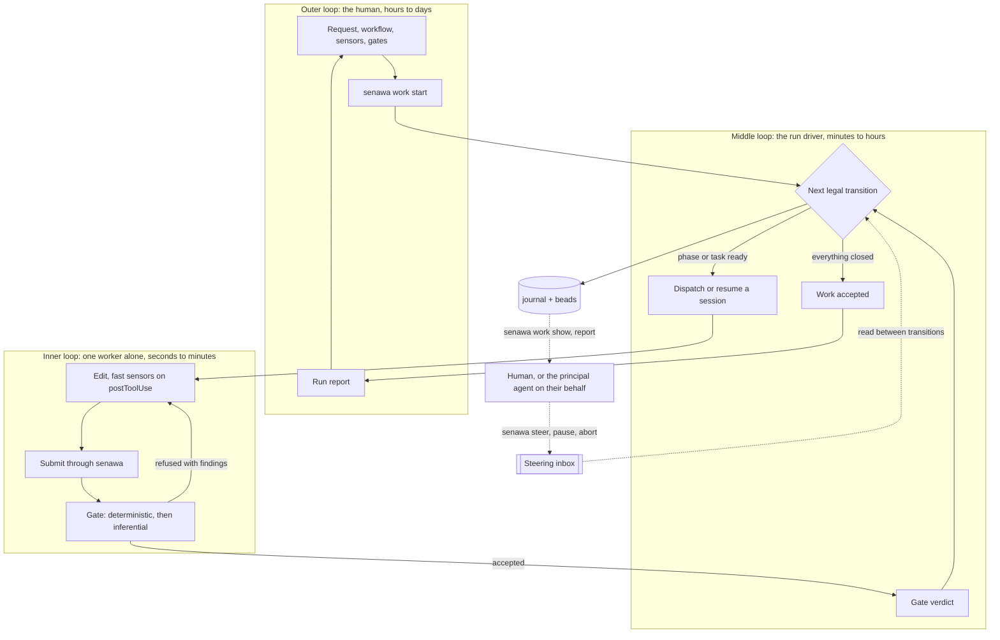
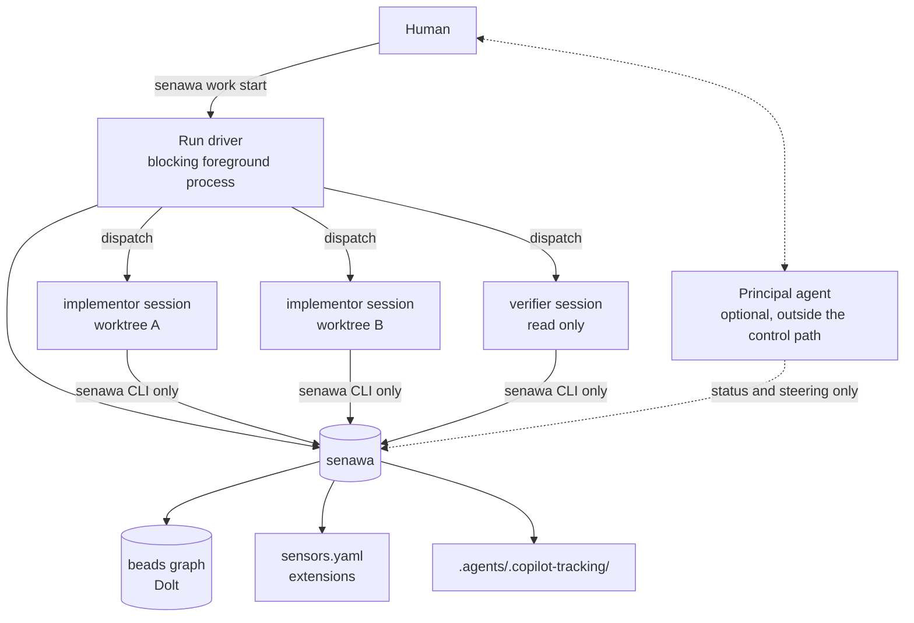
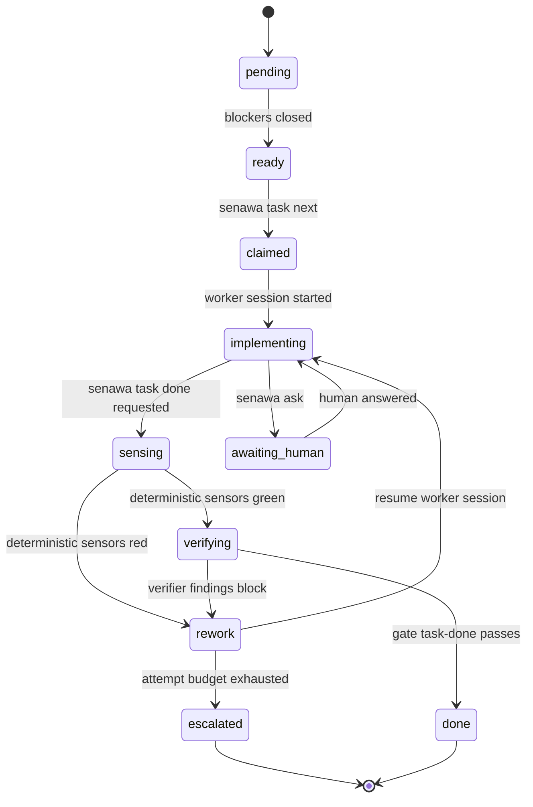
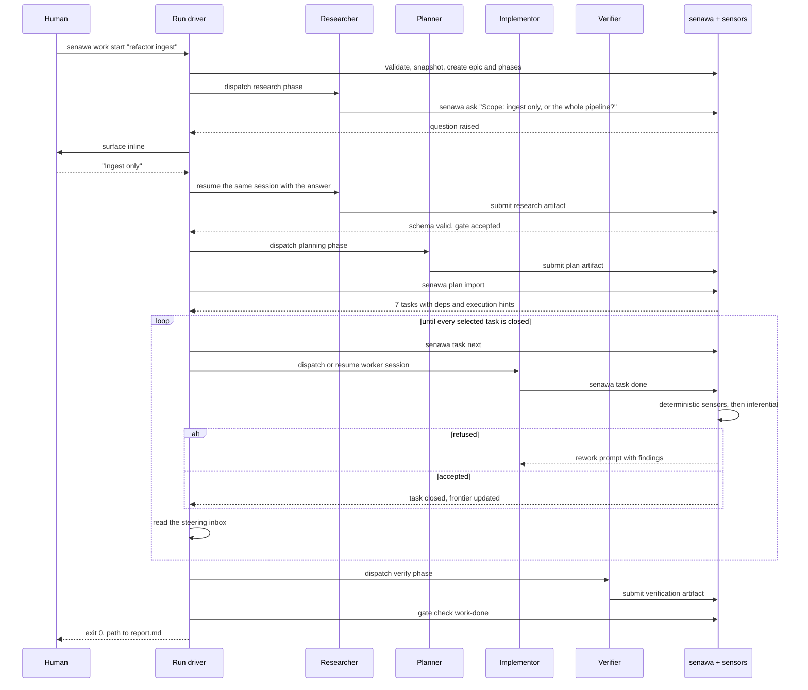

## Purpose

This document proposes an architecture for a harness that decomposes a high level human request into research, planning, implementation, and verification work, delegates each piece to a role-scoped worker session, and refuses to let work advance until sensors say it is sound. The component that decides what runs next is a deterministic run driver rather than a model.

Three ideas carry the design:

1. Durable graph state lives outside the model, in [beads](https://github.com/gastownhall/beads). The driver reloads it on every transition instead of holding a plan in memory, and no agent is trusted to remember one.
2. Every agent interacts with the system through one CLI, `senawa`. Agents never call `bd` directly and never run test commands directly. That single seam is where policy lives.
3. Completion is not something an agent asserts. It is something the harness grants, after sensors return readings and gates consume them. This is the backpressure model from [Manufacturing Backpressure in Coding Agent Harnesses](https://dasith.me/2026/06/14/backpressure-in-coding-agent-harnesses/).

> [!IMPORTANT]
> Claims in this document that were checked by execution rather than by reading documentation are marked as measured, and the evidence is in [Proof-of-Concept Findings](poc-findings.md). Six assumptions in earlier drafts did not survive that process. Read the findings before implementing.

## How it works

This section describes the current solution shape end to end. Later sections go
deep on each part; this one is the operating model, and it is the section to
update first whenever that model changes.

### The operating rule

Agents do the work. The harness decides what runs next and whether anything is
finished. Every mechanism below exists to keep that division intact under
pressure, because the failure this design is built against is not a model that
writes bad code. It is a model that writes bad code and then reports success.

Three consequences follow, and they are non-negotiable:

* A worker cannot close its own task, mutate the graph, or weaken a check
* A gate needs at least one deterministic reading, so opinion never becomes the
  only ground truth
* The record of what happened is a side effect of harness operations, never
  something an agent authors

### The moving parts

| Part                | What it is                                                                 | Written by        |
|---------------------|----------------------------------------------------------------------------|-------------------|
| Workflow definition | A declarative template of phases, roles, artifacts, gates, and bounded loops | A human, in the repository |
| Sensor extension    | A versioned implementation type exposing JSON Schemas for config, input, and output | A human or a package |
| Sensor instance     | One configured sensor in `sensors.yaml`                                     | A human           |
| Gate                | A named set of sensor invocations plus the results they must produce        | A human           |
| Graph state         | The live epic, phases, tasks, dependencies, and gates in beads              | `senawa` only     |
| Work directory      | Frozen definitions, artifacts, evidence, transcripts, and the journal       | `senawa` only     |
| Journal             | Append-only orchestration events                                            | `senawa` only     |
| Worker session      | A role-scoped Copilot session with its own model, tools, and resumable identity | The runtime, dispatched by `senawa` |
| Run driver          | The foreground process started by `senawa work start`, which performs every transition | n/a               |
| Principal agent     | An optional conversational surface for the human, outside the control path | n/a               |

Definitions are inputs. Beads is the runtime truth. The journal is the history.
Keeping those three separate is what makes a run restartable and auditable.

That rule has a sharp consequence worth stating before it is broken. Every
durable fact about where a run has got to lives in beads: phase status and
iteration, session identifiers, artifact versions, attempt counts, and the
approval a phase is waiting on. Local files hold only two things, the run's
identity written once at kickoff and a derived cache. Delete the cache and
`senawa work resume` rebuilds it. Where the two disagree, beads wins.

The journal is the one legitimate exception, because it records intent, actor,
channel, cost and findings that the graph cannot reconstruct, and at roughly
760 ms per bead write storing thousands of events there would be absurd.

One omission in that table is deliberate. No agent appears in the column that
decides what runs next, because nothing in the control path is a model.

### A run, start to finish

```bash
senawa doctor
senawa work start "Refactor the ingest pipeline" --workflow standard-delivery --input request.json
```

1. `senawa doctor` loads the declared extensions, compiles every schema, and
   validates sensors, gates, workflows, roles, and loop budgets. Structural
   mistakes surface here, before anything is dispatched and before any credits
   are spent.
2. `senawa work start` validates the request against the workflow input schema,
   copies the workflow, sensor and gate configuration, schemas, and rubrics into
   the work directory, and records one content fingerprint. It then creates the
   epic and the static phase nodes in beads with their dependency edges.
3. From that moment the run reads its frozen snapshot. Editing the source
   definitions afterwards is reported as drift rather than silently adopted, so a
   run cannot change its own rules halfway through.
4. The same command then drives the run in the foreground, performing one
   transition at a time until the work terminates. Every transition reloads
   status from beads rather than trusting anything held in memory, which is what
   makes an interrupted run resumable rather than merely restartable.
5. An agent phase dispatches one role-scoped session, which submits its artifact
   through a schema-backed tool. The artifact is persisted only after validation.
   The planner's validated artifact is what `senawa plan import` turns into
   implementation tasks.
6. The implementation phase runs a task frontier. It claims a ready task
   atomically, dispatches or resumes one worker session, evaluates the per-task
   gate, and hands red findings back to the same session. It closes the task only
   when the gate passes, and it repeats until every selected task is closed.
7. The command exits when the work is accepted, when a budget or policy stops it,
   or when the operator interrupts it. `senawa work report` renders the run at
   any point, including from a second terminal while work is still in flight.

The exit code carries the outcome, because a factory needs to script on it:

| Exit | Meaning                                                          | Resumable  |
|------|------------------------------------------------------------------|------------|
| 0    | The run completed and you accepted it                            | not needed |
| 2    | Stopped for a human: an approval is due, or a budget was exhausted | yes      |
| 130  | Interrupted by the operator                                      | yes        |
| 1    | Unexpected error                                                 | yes        |

On a terminal an approval is a prompt rather than an exit. Exit 2 is what that
same moment looks like headless, which is why it names the phase and prints the
artifact path.

`senawa work start` is therefore a constructor and a driver in one command. It
is not a scheduler, and nothing outside it is required to make the work advance.

### Foreground and detached

The driver blocks by default, which is right for a human in a terminal and wrong
for a principal agent relaying on your behalf. An agent that shell-executes a
blocking command holds its turn open for the length of the run, cannot show you
anything, and cannot pass your steering through while it waits.

| Mode | Used by | Behaviour |
|------|---------|-----------|
| Foreground, the default | A human at a terminal | Blocks, streams progress, offers the inline controls |
| `--detach` | A principal agent | Returns a handle immediately; the run continues under its lease |

Detached is not a scheduler and does not weaken anything. The driver still
blocks-and-drives internally, still holds the lease, and still stops at the same
approvals. Only the caller's relationship to it changes. With nothing blocked,
`senawa work show` answers where the run is, `senawa work log --follow` streams
it, and `senawa steer` reaches a live worker while the conversation continues.

A detached driver writes its progress to `driver.log` in the work directory
rather than to a terminal, which is what `senawa work log` reads.

### Reading a detached run

The same information has two access patterns, and giving an agent the wrong one
recreates the problem detaching solved.

| Caller | Command | Why |
|--------|---------|-----|
| Human | `senawa work log --follow` | Blocks and streams, which is what watching means |
| Principal agent | `senawa work log --since <seq>` | Returns immediately with what is new, then exits |

The journal's monotonic `seq` makes the cursor free, and it also keeps a relayed
conversation cheap: the agent never re-reads what it already told you, so its
context grows with the conversation rather than with the run.

`senawa work wait` is the exception that is allowed to block, because it is
bounded. It returns as soon as the run needs a human or the timeout expires,
which is what makes "kick it off and tell me when the plan is ready" work without
an agent polling in a loop. Use a timeout an agent host will tolerate; without
one, this is just the blocking problem again wearing a different name.

### Resuming an interrupted run

A blocking driver will be cancelled, disconnected, and crashed, so resumability
is a property of how transitions are recorded rather than an afterthought. Every
transition writes its intent before the side effect and its outcome after:

```text
task.dispatching   { task, attempt, session_id }      <- written first
   ... spawn or resume the worker session ...
task.dispatched    { task, attempt, session_id, resolved_model }
```

`senawa work resume` reconciles any intent that has no outcome. Because session
identifiers are chosen by the harness rather than the runtime, it can look up
that exact session and decide what really happened:

| Reconciliation finds           | Action                                       |
|--------------------------------|----------------------------------------------|
| Session exists, turn completed | Adopt the result, run the gate, continue     |
| Session exists, turn unfinished| Resume the same session with the same brief  |
| Session missing                | Re-dispatch, counted as a dispatch failure   |

Interrupting is two-stage, so cancellation never has to mean losing a turn. The
first interrupt stops new dispatches and lets the in-flight turn finish. The
second aborts the current turn and marks the task interrupted. Both leave a run
that `resume` can pick up.

One driver may hold a run at a time. The work directory carries a lease with the
process identity and a heartbeat, and `resume` refuses while that lease is live,
taking over once it goes stale. Atomic claiming already prevents two drivers
dispatching the same task, but it does not order phase transitions or journal
writes, which is what the lease protects.

### The loops

Three loops, and only the middle one changed when the driver moved into the
foreground. The human is absent from the inner loop by construction and can
reach into it at any time through steering.



| Loop   | Owner              | Decides                                  | Human involvement                          |
|--------|--------------------|------------------------------------------|--------------------------------------------|
| Inner  | One worker session | How to do the assigned task              | None by design; this is where refusals bite |
| Middle | The run driver     | What runs next and whether it is accepted | Steering, which never blocks the loop      |
| Outer  | The human          | What is worth doing and what better means | Owns it entirely                           |

### Where the principal agent sits

Outside the control path, and optional. It is a conversational surface over the
same CLI: it reads status and the journal, renders reports, relays questions, and
issues steering commands the human asks for. It cannot dispatch, close, reorder,
or reprioritise work.

That restriction buys three things. Control flow stops depending on a model's
judgement, so the same workflow advances the same way twice and the journal is an
explanation rather than an anecdote. The trust boundary gets crisp, because no
model sits anywhere in the control path rather than merely being kept away from
completion. And the harness runs headless with no agent at all, which is the
sharpest available test of whether it actually holds.

The principal is still worth having at both ends of the outer loop: turning a
vague request into a valid work request, explaining in natural language why the
harness refused something, and walking the report afterwards.

### Example scenarios

**A clean run, nobody watching.** The operator starts the work and walks away.
The driver closes the define, research, and plan phases, imports six
implementation tasks, and works the frontier. Every task passes its gate on the
first attempt. The command exits 0 and `report.md` shows six tasks, one attempt
each, and the total spend.

**Backpressure does its job.** One task fails `unit-tests` on attempt one. The
driver resumes that same session with the failing findings attached, the worker
fixes the cause, and attempt two passes. The human sees three lines stream past
and nothing else happens. The report later shows the refusal, which is the
evidence that the gate was real.

**A budget stops the run.** A task exhausts `max_attempts` because the plan asked
for something the tests contradict. The driver escalates, stops dispatching, and
exits 2 naming the task and the failing sensor. The human reads the findings,
revises the plan or the acceptance criteria, and runs `senawa work resume`. The
remaining tasks were never touched.

**Steering without stopping.** Halfway through, the human notices the implementor
is about to repeat a pattern they want dropped. From a second terminal they run
`senawa steer bd-a1b2 "prefer the existing adapter; do not introduce a new
factory"`. The driver picks the instruction up at the next safe point and folds
it into that task's brief. Nothing pauses, and the steering event appears in the
report beside the work it changed.

**The laptop closes.** The driver dies mid-dispatch, leaving a `task.dispatching`
intent with no outcome. On `senawa work resume`, reconciliation finds the session
by its identifier, sees the turn completed, runs the gate on what the worker
actually produced, and carries on. No work is repeated and no attempt is wasted.

**You send the plan back.** The planner submits, the driver stops at the
`plan-accepted` gate, and you read `artifacts/plan/v1.json`. It has no error
handling anywhere, so you run `senawa reject plan --reason "no error handling on
the adapter boundary; add tasks for it"`. The driver resumes the planner's own
session with that reason attached, so it does not re-derive the codebase, and
submits `v2.json`. You approve. Implementation starts from v2, and the report
later shows the plan took two iterations and why.

**Verification finds a gap and you add work.** Verify comes back clean but you
notice a case nobody covered. Rather than starting a second work item, you run
`senawa plan revise --add extra-tasks.json`. The three closed implementation
tasks stay closed, two new tasks are appended, the implementation phase re-opens
because its frontier is no longer empty, and the driver works them exactly as it
worked the first three. You verify again, and this time you accept, which is what
ends the run.

### How a gate reaches a verdict

A sensor produces a schema-valid assessment carrying a verdict, a summary, and
findings. A gate declares which sensors it consults and what each result must
look like, addressed by JSON Pointer so a gate can read an extension's own
`data` without embedding code in configuration.

Evaluation follows four rules:

* Cheap deterministic sensors run first and short-circuit the expensive ones
* Inferential sensors run last, and only on otherwise green work
* Advisory readings never block on their own, but they always reach the worker
* A sensor that fails to execute produces an error, which is distinct from a
  valid negative reading and is never treated as one

A refusal is not a bare denial. The worker receives the failed readings and their
findings, sanitized and size-capped, and it receives them in the session that
already knows the change.

### Bounded by construction

Nothing in a workflow repeats without a declared limit. Task rework carries a
finite attempt budget, and dispatch failures carry a separate one, because an
infrastructure error is an operator problem that no amount of rework will fix.
Counting them together was measured to burn a task's entire allowance and then
report the failure as the worker's fault.

When a budget is exhausted the run escalates to the human rather than continuing
or silently giving up.

### Where the human sits

The human owns the phase boundaries and the definition of better. They are
deliberately absent from the inner loop, which is where backpressure does its
work, and they are not required by the middle loop either.

What they keep is the ability to intervene without joining the loop. Steering
commands are written to a durable inbox from any terminal, and the driver reads
that inbox between transitions rather than mid-transition, so an instruction can
never corrupt the intent-and-outcome record that `resume` depends on.

| Action                          | Applied at                       | Effect                                  |
|---------------------------------|----------------------------------|-----------------------------------------|
| `senawa approve <phase>`        | At the phase gate                | Accepts the artifact and unblocks downstream |
| `senawa reject <phase>`         | At the phase gate                | Starts the next iteration with your reason as input |
| `senawa plan revise --add`      | After verification               | Appends tasks without disturbing closed work |
| `senawa steer <task> "..."`     | Next dispatch or rework prompt   | Guidance is folded into the brief       |
| `senawa steer <task> --now`     | Immediately                      | Enqueued into the live session          |
| `senawa work pause` and `resume`| Between transitions              | Stops new dispatch, lets in-flight finish |
| `senawa task abort <id>`        | Between transitions              | Ends that task and records why          |
| `senawa work budget --aiu N`    | Between transitions              | Raises or lowers the spend ceiling      |

Every one of those is a first-class journal event, so the run report shows where
a human redirected the work and what happened next.

## What the substrate actually gives us

The design leans on capabilities that exist in Copilot CLI today (verified 2026-07-28 against CLI 1.0.75, `@github/copilot-sdk` 1.0.8, `bd` 1.1.0, and the current reference docs). Knowing exactly which primitives are real changes the architecture significantly.

| Capability | Where it lives | Why it matters here |
|------------|----------------|---------------------|
| Custom agents | `.github/agents/*.agent.md` with `description` (required), `name`, `tools`, `model`, `mcp-servers`, `infer` | Each role (researcher, planner, implementor, verifier) becomes a profile with its own model and tool surface. There is no reasoning-effort field; see the note below |
| Subagents | `task` tool, invoked by the main agent | Delegated work gets a separate context window, which is what keeps read-only fan-out cheap |
| Agent messaging | `list_agents`, `read_agent`, `write_agent` tools, with `scope` values `siblings` and `children` | Follow-up instructions can reach a still-running subagent instead of restarting it |
| Hooks | `.github/hooks/*.json`, `~/.copilot/hooks/*.json`, repository and user `settings.json`, plugin `hooks.json`, machine-wide policy files | Deterministic interception at `preToolUse`, `permissionRequest`, `postToolUse`, `postToolUseFailure`, `subagentStart`, `subagentStop`, `agentStop`, `sessionStart`, `sessionEnd`, `preCompact`, `userPromptTransformed`, `notification` |
| Hook decision control | `permissionDecision` on `preToolUse`; `behavior` plus `message` and `interrupt` on `permissionRequest`; `decision: "block"` with a `reason` on `agentStop` and `subagentStop`; `additionalContext` on `postToolUse` and `subagentStart` | Gates that the model cannot route around, denials that carry an explanation, and forced continuation prompts |
| Programmatic mode | `copilot -p`, `--agent`, `--model`, `--effort`, `--output-format json`, `--session-id`, `--resume`, `--share`, `--allow-tool`, `--deny-tool`, `--available-tools`, `--excluded-tools`, `--add-dir` | Per task control of model, effort, tool visibility, permissions, and a resumable session identity |
| Autopilot | `--autopilot` or `--mode autopilot`, the `task_complete` tool, `--max-autopilot-continues=N` | A native completion-pressure loop with a configurable continuation budget, not subject to the eight-block cap |
| SDK | `@github/copilot-sdk` and siblings (MIT, JSON-RPC to the CLI runtime): `createSession`, `resumeSession`, per-session `model` and `reasoningEffort`, in-process `hooks`, `onPermissionRequest`, `onUserInputRequest`, `defineTool`, `commands`, typed events | Turns most of this design from process orchestration into ordinary function calls. Published for TypeScript, Python, Go, .NET, Java, and Rust |
| Session isolation | `baseDirectory` (SDK) or `COPILOT_HOME` (subprocess), `mode: "empty"`, `sessionFs`, `deleteSession` | Worker sessions stay out of the human's session picker entirely |
| Trace propagation | `onGetTraceContext` injecting W3C `traceparent` into `session.create`, `session.resume` and `session.send`; `traceparent` on `ToolInvocation` | One distributed trace spanning the principal, every worker session, and senawa's own work |
| Isolation | `-w/--worktree` (experimental), `--add-dir`, `--sandbox` / `/sandbox` | Parallel implementors that do not stomp on each other |
| Observability | OpenTelemetry GenAI spans (`invoke_agent`, `chat`, `execute_tool`) with cost, tokens, and `gen_ai.agent.name`, plus `github.copilot.hook.*` span events | Per-role cost accounting, gate quality measurement, and hook latency measurement |
| Plugins | `plugin.json` bundling agents, skills, hooks, MCP servers | Ship the whole harness as one installable unit later |
| Extensions | `.github/extensions/NAME/extension.mjs`, experimental, JavaScript only, requires `--experimental` | Register senawa's operations as native tools and slash commands rather than shell commands |

Four limits shape everything downstream.

Subagent concurrency is capped by plan (2 on Free, 4 on Pro, 8 on Max, 16 on Business, 32 on Enterprise), so read the cap at startup rather than hard-coding it. A `subagentStop` hook that keeps returning `block` is overridden after eight consecutive continuations. Command hooks are fail-closed on crash or non-zero exit but always fail-open on timeout, while HTTP hooks are fail-open on everything, so a policy check that can be slow is not a policy check.

The fourth limit is subtler and breaks a premise the rest of the design depends on. Agent profiles carry `model` but have no reasoning-effort field at all: effort comes from `--effort`, the `effortLevel` setting, or the SDK's `reasoningEffort`. Worse, when the session model is `Auto`, subagents inherit the resolved session model and ignore their profile's `model` entirely. Per-role model selection therefore only works if the dispatching session pins an explicit model. Never dispatch on `Auto`.

## Topology choice

There are two credible shapes, and the right answer is a hybrid.

### Topology A, in-process subagents

A session delegates with the `task` tool, and subagents run inside the same process tree with their own context windows.

This is cheap, native, and parallel. `subagentStart` can prepend a task brief; `subagentStop` can force a retry. The parent session talks to the human with `ask_user`. Weaknesses: the model is fixed by the agent profile rather than per task and reasoning effort cannot be set per profile at all, work dies with the session, and the built-in `general-purpose` agent emits neither `subagentStart` nor `subagentStop`, so hook based gating silently does not apply to it. Use `infer: false` on any profile that must only run when senawa dispatches it.

### Topology B1, worker sessions as subprocesses

The driver spawns a fresh `copilot -p` process per task:

```bash
copilot -p "$(senawa task brief bd-a1b2)" \
  --agent implementor \
  --model "$(senawa task hint bd-a1b2 model)" \
  --effort "$(senawa task hint bd-a1b2 effort)" \
  --session-id "$(senawa task session bd-a1b2)" \
  --output-format json \
  --share ".agents/.copilot-tracking/$WORK/tasks/bd-a1b2/transcript.md" \
  --allow-tool 'write' --allow-tool 'shell(senawa:*)' \
  --deny-tool 'shell(git push)' \
  --no-ask-user
```

Every dial is per task: model, effort, tool allowlist, working directory, timeout, retry. The session identity is durable, so the rework loop the request describes becomes literal:

```bash
copilot --resume="$SESSION_ID" -p "$(senawa task rework bd-a1b2)" --allow-all-tools
```

The subagent resumes with its own memory of what it built, receives the sensor failures and the verifier findings, and fixes them. That is materially better than restarting a fresh agent that has to rediscover the change.

Note that `--session-id` and `--resume` must not appear in the same invocation; they compete to decide which session to open. The first launch creates the session by UUID, and every subsequent turn resumes it. Bare `--resume` with no value needs a TTY and errors under `-p`, so always pass the identifier.

#### Why the deny list is not the containment boundary

An earlier draft of this design denied graph mutation with `--deny-tool 'shell(bd:*)'`. That is theatre. The `:*` suffix matches a command stem followed by a space, so bare `bd` does not match at all, and `bash -c 'bd close ...'`, `env bd ...`, or a two-line wrapper script all walk straight past it. Path scoping fares no better: `--deny-tool='write(PATH)'` is an exact or trailing-path-segment match with no glob support, so "no writes outside `src/ingest/`" is not expressible as a deny rule.

Containment is layered instead, strongest first:

1. **Capability removal.** `senawa dispatch` builds the worker's environment with `bd` absent from `PATH`. A tool the process cannot resolve needs no policy.
2. **Tool visibility.** `--excluded-tools` removes a tool from the model's menu entirely, which is a different and stronger control than `--deny-tool`, which only refuses the permission after the model has decided to try.
3. **Policy interception.** A `preToolUse` or `permissionRequest` hook inspects `toolArgs` and refuses writes outside the task's declared paths, with a reason the model can act on.
4. **OS sandbox.** `--sandbox` for anything running unattended.

Deny rules stay as a cheap last line for the handful of exact commands worth naming, such as `git push`. They are not the wall.

### Topology B2, worker sessions hosted through the SDK

Same topology, better plumbing. `@github/copilot-sdk` drives the CLI runtime over JSON-RPC, so the orchestrator holds many sessions inside one process and every control point becomes a callback rather than a subprocess contract:

```ts
const client = new CopilotClient({ telemetry: { otlpEndpoint: OTLP } });
await client.start();

const session = await client.createSession({
  sessionId: task.sessionId,
  model: task.hints.model,
  reasoningEffort: task.hints.effort,
  systemMessage: { mode: "customize", sections: { guidelines: { action: "append", content: HOUSE_RULES } } },
  tools: [taskDoneTool(task), askTool(task), discoverTool(task)],
  onPermissionRequest: (req) =>
    policy.decide(req), // { kind: "reject", feedback: "may-commit is red: ..." }
  onUserInputRequest: (req) => relay.toHuman(task, req),
  hooks: {
    onPostToolUse: (i) => ({ additionalContext: sensors.fast(i) }),
    onPreToolUse: (i) => policy.preTool(i),
  },
});

await session.sendAndWait({ prompt: brief(task) });
```

Five things get materially better. Hooks stop being shell scripts parsing JSON on stdin, which removes a process spawn from every single tool call and removes the timeout-fail-open hole with it. `onPermissionRequest` returns `{ kind: "reject", feedback }`, so a denied action carries an explanation back to the model instead of a bare refusal. `onUserInputRequest` intercepts `ask_user` directly, which is the cleanest possible implementation of the human relay described later in this document. `defineTool` exposes `senawa task done` as a first class typed tool with Zod validation, so workers never need shell access to reach the harness. And `resumeSession(id)` makes the rework loop a method call.

Three cautions, one of them structural.

The structural one: **the SDK's hook surface is not the CLI's hook surface.** It exposes `onPreToolUse`, `onPostToolUse`, `onPostToolUseFailure`, `onUserPromptSubmitted`, `onSessionStart`, `onSessionEnd`, and `onErrorOccurred`. There is no `onSubagentStop` and no `onAgentStop`. The "worker keeps getting handed its failures until it is green, without anything outside the session in the loop" mechanism described under Topology B1 does not exist here. In B2 the orchestrator rebuilds it explicitly: call `sendAndWait`, run the gate, and if the verdict is red send the rework prompt into the same session and wait again, bounded by `max_attempts`. That is arguably better, because the budget is the harness's rather than a hard-coded cap of eight, but it is code you write rather than configuration you declare.

The second: SDK sessions do not read `.github/hooks/*.json`, so any policy you want applied to both SDK sessions and plain `copilot` sessions has to exist in two forms driven by one shared implementation in `@senawa/core`.

The third: infinite sessions are **on by default**, meaning the runtime already does background compaction and already persists a workspace containing `checkpoints/`, `plan.md`, and `files/` under `~/.copilot/session-state/<sessionId>/`. That overlaps the tracking directory this design specifies. Decide deliberately: either disable it for worker sessions so senawa owns all durable state, or keep it and treat `session.workspacePath` as a per-task scratch area that the tracking directory links to rather than duplicates.

One compatibility note for `@senawa/core`: the effort scales differ. The CLI accepts `low`, `medium`, `high`, `xhigh`, and `max`; the SDK's `reasoningEffort` and the beads `execution_reasoning_effort` convention both stop at `xhigh`. Store the canonical beads value and map to the runtime's nearest level at dispatch.

### Recommendation

Use Topology B for anything that writes, implemented as B2 where the orchestrator is running and B1 as the fallback for detached or CI invocations. Use Topology A for cheap read-only fan-out (codebase exploration, parallel file reconnaissance) where the built-in `explore` agent is already excellent and context isolation is the only goal.

One clarification that prevents a persistent confusion. The SDK does not spawn subagents. `createSession` creates an independent **session**, and senawa dispatches one per task. What this document calls a subagent is a role-scoped worker *session*, not the CLI's `task`-tool subagent. The distinction is load bearing: sessions carry their own model, their own reasoning effort, their own permission handler and their own resumable identity, and `task`-tool subagents carry none of those.

### Worker sessions are not user sessions

Dispatching one session per task has an obvious consequence that is easy to discover too late: every task lands in the human's Copilot session picker. On a fifty-task work item, senawa would bury the human's own history in its bookkeeping.

There is no "hidden session" flag, and none is needed. Worker sessions get their own home:

```ts
const client = new CopilotClient({
  mode: "empty",                                   // not the Copilot CLI persona
  baseDirectory: `${workDir}/.copilot-home`,       // sets COPILOT_HOME on the runtime
  telemetry: { otlpEndpoint: OTLP },
});
```

Measured: a default client saw 34 sessions before a worker was created under an isolated `baseDirectory`, and 34 after. The isolated client saw its own. The same trick works for the subprocess path with `COPILOT_HOME=… copilot -p --session-id …`.

This is a hard requirement rather than a nicety: **no session senawa creates may ever appear in the human's session picker.** Every dispatch, on either topology, runs under the work directory's own home. Nothing else in this design is allowed to weaken that, including session retention.

Retention and visibility are separate concerns, and it is worth keeping them apart. `client.deleteSession(id)` removes a session once its transcript has been archived into the work directory, but a phase session must survive while its phase can still be re-entered, or the next iteration cannot resume the context that makes iterating cheap. Because the session lives under `<work_dir>/.copilot-home` either way, keeping it costs the human nothing: it was never in their history to begin with. The rule is therefore about lifetime, not exposure:

| Session | Deleted when |
|---------|--------------|
| Task worker | Its task closes and the transcript is archived |
| Phase agent | Its phase is accepted, not when it submits |
| Any session | At `senawa work finish`, unconditionally |

Three consequences worth stating.

**`mode: "empty"` is the right posture, not an optimisation.** It requires `baseDirectory` or `sessionFs`, requires an explicit `availableTools` per session, and flips tool-filter precedence to deny-wins so exclusions are actually expressible. Every one of those is something this design wants anyway.

**Session state becomes senawa's to manage.** Once workers live under `<work_dir>/.copilot-home`, their transcripts and infinite-session workspaces sit beside the tracking directory rather than in the user's home, which makes archival and cleanup a directory operation.

**Isolation does not cost correlation.** Moving the session store does not move the trace context or the journal, so nothing below is weakened by it.



## Graph state

The driver needs the shape of the workflow without holding it in memory. Beads provides that natively: a dependency aware issue graph where `bd ready` computes the claimable frontier, hash IDs avoid multi-writer collisions, and arbitrary JSON metadata carries orchestration state.

### Mapping the workflow onto beads

| Workflow concept | Beads construct |
|------------------|-----------------|
| A unit of work the human asked for | Epic (also a molecule root) |
| Research phase, plan phase, each implementation task, verification | Child issues of the epic |
| Ordering (plan needs research) | `bd dep add <plan> <research>`, type `blocks`; the dependent comes first |
| Fan-out that can run concurrently | Sibling children with no edges between them, plus `execution_parallel_group` metadata |
| Fan-in before integration | `waits-for` dependency, or one `blocks` edge per contributing task |
| Human sign-off on research and plan | Gate issue of type `human`, resolved by `bd gate resolve` |
| Waiting on CI or a PR | Gate issue of type `gh:run` or `gh:pr`, auto-closed by `bd gate check` |
| Work discovered mid-task | New issue linked with `discovered-from`, so provenance survives |
| A question for the human, and its answer | `message` issue threaded to the task with `--thread` |
| Orchestration substate (`rework`, `awaiting_human`) | `bd set-state <id> senawa=<state> --reason`, which writes an event bead and a `senawa:<state>` label |
| Serializing conflict-prone integration | `bd merge-slot acquire` and `release` |
| Structural validation of a plan before it is accepted | `bd swarm validate <epic>` |
| Reusable end-to-end shape | Formula in `.beads/formulas/*.formula.toml`, cooked to a proto, poured into a molecule |

The important consequence: nothing invents a task list in its head. The driver pours a molecule, then repeatedly asks for the frontier. Closing work reshapes the graph, and the graph decides what is next.

### What lives outside beads, and why

The temptation with a slow graph is to keep a parallel copy and treat it as the
real one. That produces two sources of truth that diverge exactly when it
matters, during a crash. So the split is deliberate rather than incidental:

| State | Home | Reason |
|-------|------|--------|
| Epic, phases, tasks, dependencies, statuses | Beads | It is a dependency graph |
| Iteration, session id, artifact version, attempt, resolved model | Bead metadata | Measured to round-trip intact, nested, with numbers preserved |
| Phase state transitions | `bd set-state` | Writes an event bead and a `senawa:<state>` label, so audit and cheap query come free |
| Waiting for an approval | A beads `human` gate blocking the phase | The frontier is then genuinely empty rather than empty because our code says so |
| Journal | `journal.jsonl` | Ordered, high frequency, and not derivable from the graph |
| Driver lease | `driver.lock` | A heartbeat every few seconds is the wrong shape for an issue tracker |
| Steering inbox | `steering.jsonl` | Transient, consumed and discarded |
| Artifacts, snapshot, sessions, sensor cache | Files | They are files; beads holds the pointers |

Three beads capabilities are easy to reimplement badly and worth using directly.
`bd list --label senawa:awaiting_approval` answers "what needs a human" without
reading any local file. A `human` gate makes waiting structural. And
`discovered-from` edges give plan revision the provenance the run report needs
anyway.

This costs real time. At 166 to 563 ms per read and around 760 ms per write, a
transition that touches the graph three or four times costs one to two seconds.
That is affordable when each task takes minutes of model time, and it is the
reason `@senawa/graph` caches reads rather than the reason to keep a second copy
of the truth.

### The bd integration contract

`@senawa/graph` is the only thing in the system that runs `bd`, and it holds itself to six rules. All six come from [the proof-of-concept findings](poc-findings.md), not from reading the reference.

**Set `BD_JSON_ENVELOPE=1` on every invocation.** Without it, `bd ready` returns a bare array and — measured, not assumed — **`bd show` also returns an array with no `schema_version` at all**. Only write commands such as `bd create` carry the field. Envelope mode wraps every response as `{"schema_version": 1, "data": …}`, which is the only shape worth validating against, and it becomes the default in bd 2.0. This is mandatory rather than advisable: without it the version guard silently protects nothing.

**Run `bd init` non-interactively or hang forever.** `bd init --quiet --stealth` prompts *"Contributing to someone else's repo? [y/N]"* and waits, even with `--quiet` and even with stdin closed. `senawa init` must call it as:

```bash
BD_NON_INTERACTIVE=1 DO_NOT_TRACK=1 \
  bd init --quiet --stealth --non-interactive --role maintainer </dev/null
```

**Claim atomically in one call.** `bd ready --claim --json` returns the first ready issue matching the filters and claims it in the same operation. Six concurrent claimants received six distinct issues with no duplicates, so the frontier is safe for parallel pull. Splitting this into a read and a write reintroduces exactly the race the claim exists to prevent, which is why there is no `senawa task claim`.

**Batch related writes, but know what batch cannot do.** `bd batch` runs multiple writes in one transaction, and its grammar is its own rather than the CLI's: `create <type> <priority> <title>`, `update <id> <key>=<value>`, `close`, `dep add`. Crucially **`update` accepts only `status`, `priority`, `title` and `assignee`** — `metadata=` is rejected. Metadata writes stay separate calls, so "close the task and record its verdict in one batch" is only partly achievable.

**Cache reads, because `bd` is slow.** Measured best-of-three on a small database: `bd ready --json` 299 ms, `bd show --json` 166-563 ms, `bd list --json` 378-440 ms, a single `bd create` around 760 ms. A `senawa work show` that makes four calls costs roughly two seconds. `@senawa/graph` therefore keeps a read cache invalidated on write. Two consequences follow immediately: no hook may ever touch the graph, and the driver's read pattern has to be deliberate rather than incidental.

**Validate plans structurally before accepting them.** `bd swarm validate <epic>` checks dependency direction (requirement-based rather than temporal, which is the mistake agents actually make), orphans, missing dependencies, cycles, and disconnected subgraphs. It also reports the ready fronts as numbered waves, the maximum parallelism, and an estimate of the worker-sessions required. That is the `plan-lint` sensor behind the `plan-accepted` gate, and it exists already. `bd swarm create` and `bd swarm status` cover epic-level parallel coordination on the same graph.

### Node lifecycle

Beads statuses (`open`, `in_progress`, `blocked`, `closed`, `deferred`) are coarse. The orchestration substate lives in two places, deliberately.

The substate *name* is written with `bd set-state <id> senawa=<state> --reason "..."`, which creates an event bead recording the transition and refreshes a `senawa:<state>` label. The event bead is the audit trail the run report is built from, and the label makes `bd list --label senawa:rework` a cheap query. The structured *payload* that goes with the state (attempt count, session id, last reading) lives in issue metadata under a `senawa` namespace, so it round-trips through Dolt sync and survives every agent restart.



The metadata contract:

```json
{
  "senawa": {
    "state": "rework",
    "role": "implementor",
    "attempt": 2,
    "max_attempts": 3,
    "session_id": "0cb916db-26aa-40f2-86b5-1ba81b225fd2",
    "resolved_model": "claude-sonnet-4.6",
    "worktree": ".worktrees/bd-a1b2",
    "work_dir": ".agents/.copilot-tracking/2026-07-28-refactor-ingest",
    "context_refs": [
      "research.md#ingest-pipeline",
      "plan.md#task-4",
      "tasks/bd-a1b2/brief.md"
    ],
    "last_reading": {
      "gate": "task-done",
      "verdict": "fail",
      "fingerprint": "sha256:9f2c...",
      "failed": ["unit-tests", "arch-review"],
      "at": "2026-07-28T04:11:09Z"
    }
  },
  "execution_agent_type": "worker",
  "execution_suggested_model": "claude-sonnet-4.6",
  "execution_reasoning_effort": "high",
  "execution_mode": "delegated",
  "execution_parallel_group": "ingest-adapters"
}
```

The `execution_*` keys are not invented here. They are an existing beads convention for exactly this purpose, and the beads documentation is explicit that an orchestrator must read them before spawning a subagent, because model and reasoning effort cannot be changed after launch. Treat them as portable capability-tier hints rather than runtime bindings: store the canonical beads value and map it to the runtime's nearest level at dispatch, which is why `senawa.resolved_model` records what actually ran alongside `execution_suggested_model`, which records what was asked for.

`senawa.state` is a denormalized cache of the same value that `bd set-state` writes as a label, kept in metadata so one `bd show --json` returns the whole picture. The event beads remain the source of truth. Note that they are created as **children** of the issue and are excluded from `bd list --type event`; they only surface through `bd list --all`, which the journal reader must account for. Metadata and state cannot share a `bd batch`, so `senawa` writes the state transition and the metadata payload as separate calls.

### The status projection

`senawa work show` returns a token-bounded projection, never the whole graph:

```json
{
  "work": "2026-07-28-refactor-ingest",
  "epic": "bd-7k1p",
  "status": "awaiting_approval",
  "needs": { "action": "approve", "phase": "plan", "artifact": "artifacts/plan/v2.json" },
  "phase": "plan",
  "progress": { "phases": "3/5 accepted", "tasks": "2/4 closed" },
  "counts": { "pending": 4, "ready": 2, "in_flight": 3, "rework": 1, "done": 9, "escalated": 0 },
  "frontier": [
    { "id": "bd-a1b2", "title": "Split parse_batch into stages", "group": "ingest-adapters", "role": "implementor" },
    { "id": "bd-c3d4", "title": "Extract retry policy", "group": "ingest-adapters", "role": "implementor" }
  ],
  "recent_events": [
    "bd-9x2m rework 2/3: unit-tests red (3 failures)",
    "bd-4t8n done"
  ],
  "cursor": 128,
  "budget": { "aiu_spent": 41.2, "aiu_cap": 250 }
}
```

`status` and `needs` exist so that "is it done?" is answerable in one call with
no interpretation. `status` is one of `running`, `awaiting_approval`, `paused`,
`escalated`, or `finished`, and `needs` is either null or exactly the action a
human owes the run. Everything else in the projection is detail for when the
answer is "not yet".

Hard rule: the projection is capped (suggest 1,500 tokens). Anything larger is a file path, not a payload. The cap exists because this projection is what a human glances at from a second terminal, what a principal agent reads to answer questions about the run, and what a `sessionStart` hook injects, and none of those should grow with the size of the work. The driver does not consume it at all; it reads the graph directly.

## The senawa CLI

This is the load bearing piece. Agents get one tool surface, and every policy decision routes through it.

### Command surface

```text
senawa init                                  # scaffold .beads, sensors.yaml, agents, hooks
senawa prime                                 # compact workflow context for sessionStart/preCompact

senawa work start "<goal>" [--workflow W] [--detach]  # validate, snapshot, then drive
senawa work resume [<work>] [--detach]       # reconcile an interrupted or paused run and keep driving
senawa work step [<work>]                    # perform exactly one transition, for debugging and CI
senawa work show [--json]                    # status projection, safe to call from another terminal
senawa work log [--since <seq>] [--follow]   # --since returns and exits; --follow streams
senawa work wait [--until <what>] [--timeout <s>]  # block until the run needs a human, bounded
senawa work report [--format md|json]        # render the human-facing run report
senawa work finish                           # close epic, squash wisps, finalize the report

senawa approve <phase> [--note "<text>"]     # accept a phase artifact; records the channel used
senawa reject <phase> --reason "<text>"      # start the next iteration with the reason as input
senawa phase show <phase> [--iteration N]    # artifact, gate readings, and consumed versions

senawa task next [--role R] [--group G]      # next ready task, claimed atomically, with execution hints
senawa task brief <id>                       # rendered prompt for a worker session
senawa task rework <id>                      # rendered follow-up prompt with failures
senawa task note <id> "<text>"               # append durable note
senawa task discover <id> "<title>"          # create a discovered-from child
senawa task done <id> --summary "<text>"     # REQUEST completion; runs the gate; may refuse
senawa task escalate <id> --reason "<text>"

senawa ask <id> "<question>"                 # worker -> human relay, opens a human gate
senawa answer <msg-id> "<answer>"            # record the human's answer, resolves the gate
senawa steer <id> "<instruction>" [--now]    # write to the steering inbox; --now cuts into the session
senawa work pause                            # stop dispatching; let in-flight work drain, then exit
senawa task abort <id> --reason "<text>"     # end one task without killing the run
senawa work budget --aiu N                   # adjust the spend ceiling mid-run

senawa sensor list [--json]
senawa sensor info <id> [--json]             # description plus config, input, and output contracts
senawa sensor run [<id>] [--task <id>] [--json]
senawa sensor audit [--id S] [--samples N]   # measure sensor stability; the audit loop
senawa gate check <gate-id> [--task <id>] [--json]

senawa workflow list [--json]
senawa workflow info <name> [--json]
senawa workflow validate [name]
senawa workflow render <name> [--format mermaid|json]

senawa doctor                                # validate extensions, sensors, gates, workflows, and roles

senawa plan import <file> [--epic <id>]      # planner output -> beads subgraph
senawa plan validate [--epic <id>]           # bd swarm validate + senawa's own structural rules
senawa plan revise --add <file>              # append tasks without disturbing closed work
senawa dispatch <id>                         # spawn/resume the worker session for a task
```

There is no `senawa task claim`. Claiming is folded into `senawa task next`, which wraps `bd ready --claim --json` so that selecting a task and owning it are one atomic operation. A separate claim command is a race waiting to be lost, and the atomicity is measured: six concurrent claimants received six distinct tasks.

There is also only one `resume`. Pausing sets a durable flag that makes the driver drain and exit, and `senawa work resume` clears it, reconciles anything that was in flight, and starts driving again. Whether the run stopped because a human paused it, because the process was cancelled, or because the machine died, the command to make it advance again is the same.

`senawa init` is also more than a scaffolder. It runs `bd init` with the flags that stop it blocking on an interactive prompt, which is not optional for any automated path.

### The contract that creates backpressure

`senawa task done` is the entire trick. A worker cannot close a bead. It submits a completion request, and the CLI answers:

```json
{
  "accepted": false,
  "task": "bd-a1b2",
  "gate": "task-done",
  "attempt": 2,
  "attempts_remaining": 1,
  "readings": [
    { "sensor": "typecheck", "verdict": "pass", "duration_ms": 4120 },
    { "sensor": "unit-tests", "verdict": "fail", "duration_ms": 18344,
      "findings": [
        { "file": "src/ingest/parse.py", "line": 88, "message": "test_parse_batch_empty: expected 0 rows, got None" }
      ]
    },
    { "sensor": "arch-review", "verdict": "fail", "trust": "advisory",
      "findings": [
        { "message": "stage_two() reaches into the Reader's private buffer; violates the layering rule in docs/architecture.md" }
      ]
    }
  ],
  "next_prompt": "Two readings are red. Fix these, then call senawa task done again.\n\n1. unit-tests ...\n2. arch-review ..."
}
```

The worker receives actionable evidence rather than a bare refusal, which is precisely what makes a sensor useful. Even the advisory reading appears, tagged so the model knows how much weight to give it.

### Why a CLI rather than an MCP server

MCP tool schemas cost tokens in every context window, and this harness runs many sessions. A CLI costs one line of instruction, and hooks can gate shell invocations by pattern. The recommendation is CLI-first, with an optional thin MCP wrapper later for editor-side use. Beads reached the same conclusion for the same reason.

## Extension and workflow contracts

The first sensor probe proved that unrelated tools can be normalized into one
reading shape, but its implementation hard-codes commands and parsers in the
runner. The inferential half is weaker still: it asks a model for JSON and then
extracts the first substring that looks like an object. Neither mechanism is a
stable extension boundary.

Senawa instead treats a sensor extension as a versioned implementation type and
an entry in `sensors.yaml` as a configured instance of that type. JSON Schema is
the runtime contract. TypeScript generics make extension authoring pleasant,
but the CLI never trusts a generic type at a process or package boundary.

```ts
interface ISensor<TInput, TOutput extends SensorAssessment> {
  readonly manifest: SensorManifest;
  run(input: TInput, context: SensorContext): Promise<TOutput>;
}

interface SensorExtension<TConfig, TInput, TOutput extends SensorAssessment> {
  readonly manifest: SensorManifest;
  create(config: TConfig): ISensor<TInput, TOutput>;
}

interface SensorManifest {
  apiVersion: "senawa.dev/sensor/v1";
  name: string;
  version: string;
  description: string;
  configSchema: JsonSchema;
  inputSchema: JsonSchema;
  outputSchema: JsonSchema;
}
```

Every output extends one common assessment envelope so gates can reason about
all sensors without understanding their private payloads:

```ts
interface SensorAssessment {
  verdict: "pass" | "fail";
  summary: string;
  findings: SensorFinding[];
  data?: unknown;
}
```

Senawa validates four boundaries: the manifest during discovery, configuration
during `senawa doctor`, input immediately before execution, and output before it
can be cached, journalled, or consumed by a gate. A runtime error produces a
sensor error, not a `fail` assessment. Required sensor errors block progression
but remain distinguishable from a valid negative reading.

### Explicit extension discovery

Extensions are declared rather than discovered by scanning installed packages.
Loading every package with a matching name would execute code merely because it
is present in `node_modules`, and it would make two identical checkouts resolve
different sensor sets.

```yaml
version: 1

extensions:
  - package: "@senawa/sensor-command"
  - package: "@senawa/sensor-agent-review"
  - path: "./.senawa/extensions/api-contract/index.mjs"

sensors:
  - id: typecheck
    extension: "@senawa/sensor-command"
    description: Type-check the project
    config:
      command: "npx tsc --noEmit --pretty false"
      parser: tsc-text
      cost: cheap

  - id: architecture-review
    extension: "@senawa/sensor-agent-review"
    description: Review changed code against structural architecture rules
    config:
      agent: architecture-reviewer
      model: claude-sonnet-4.6
      instructions: Review only structural architecture constraints.
      rubric: ".agents/rubrics/architecture.md"
      cost: expensive
      trust: advisory
```

An inferential extension owns the decision to launch a reviewer session and the
instructions and rubric passed to it. It does not own session isolation,
permissions, budgets, or journalling. Those capabilities arrive through
`SensorContext`. The reviewer receives one `submit_sensor_result` tool whose
parameters are the extension's output JSON Schema. Senawa validates the tool
arguments again, returns actionable schema errors for a bounded retry, and
ignores ordinary assistant prose. A reviewer that never submits a valid result
produces a sensor error. The main agent therefore receives a validated reading,
never text that it must parse.

### Gates consume contracts

A gate is a named collection of sensor invocations and expected results. The
common assessment envelope keeps the common case concise, while JSON Pointer
allows a gate to inspect extension-specific `data` without embedding JavaScript
in configuration.

```yaml
gates:
  - id: task-done
    description: Implementation work satisfies its acceptance contract
    checks:
      - sensor: typecheck
        expect:
          path: /verdict
          operator: equals
          value: pass
      - sensor: unit-tests
        expect:
          path: /verdict
          operator: equals
          value: pass
      - sensor: coverage
        expect:
          path: /data/regression
          operator: equals
          value: false
      - sensor: architecture-review
        expect:
          path: /verdict
          operator: equals
          value: pass
        advisory: true
    on_fail: rework
```

The initial operator vocabulary is deliberately closed: `equals`, `notEquals`,
`greaterThan`, `greaterThanOrEqual`, `contains`, `matches`, and `exists`.
`senawa doctor` rejects unknown operators, missing sensor references, pointer
and schema combinations that can never match, and blocking gates with no
deterministic anchor.

### Declarative workflows

A workflow is a static orchestration template above the beads runtime graph.
It describes phase dependencies, agent roles, artifact contracts, quality gates,
human approvals, and bounded loop policies. Starting a workflow compiles that
template into beads nodes. The workflow file does not become a second mutable
source of runtime truth.

```yaml
apiVersion: senawa.dev/workflow/v1
kind: Workflow

metadata:
  name: standard-delivery
  description: Define, research, plan, implement, and verify a change

spec:
  inputSchema: "./schemas/work-request.schema.json"
  completesWhen: verify-accepted          # default: all-phases-closed

  phases:
    - id: define
      executor:
        kind: agent
        role: definer
        resumeAcrossIterations: true
        output:
          path: artifacts/definition.json
          schema: "./schemas/definition.schema.json"
      exit:
        gate: definition-accepted
        approval: human
      iteration:
        max: 5
        onUpstreamChange: flag

    - id: research
      dependsOn: [define]
      executor:
        kind: agent
        role: researcher
        prompt: prompts/research.md
        resumeAcrossIterations: true
        input:
          definition: phases.define.output
        output:
          path: artifacts/research.json
          schema: "./schemas/research.schema.json"
      exit:
        gate: research-accepted
        approval: human
      iteration:
        max: 5
        onUpstreamChange: flag

    - id: plan
      dependsOn: [research]
      executor:
        kind: agent
        role: planner
        prompt: prompts/plan.md
        resumeAcrossIterations: true
        output:
          path: artifacts/plan.json
          schema: "./schemas/plan.schema.json"
      actions:
        - kind: import-plan
          source: phases.plan.output
      exit:
        gate: plan-accepted
        approval: human
      iteration:
        max: 5
        onUpstreamChange: flag

    - id: implement
      dependsOn: [plan]
      executor:
        kind: task-frontier
        role: implementor
        selector:
          phase: implement
        concurrency: auto
        reentrant: true
      loop:
        until: all-selected-tasks-closed
        each:
          gate: task-done
          rework:
            resumeSession: true
            maxAttempts: 3
          dispatch:
            maxFailures: 2
          onExhausted: escalate
      iteration:
        max: 10
        onUpstreamChange: independent

    - id: verify
      dependsOn: [implement]
      executor:
        kind: agent
        role: verifier
        resumeAcrossIterations: true
        output:
          path: artifacts/verification.json
          schema: "./schemas/verification.schema.json"
      exit:
        gate: work-done
        approval: human
      iteration:
        max: 10
        onUpstreamChange: independent
```

`approval` is optional. A phase without it advances on its gate alone, which is
what lets the same workflow run attended while you are still designing it and
unattended once you trust it.

Version one has a small executor vocabulary: `agent` for one schema-constrained
agent artifact, `task-frontier` for the implementation frontier, `sensor-only`
for a gate with no agent, `human` for an explicit decision, and `foreach` for a
schema-valid collection. It has no general expression language and no arbitrary
`while`. Every repeated action names a termination condition and a finite
attempt or dispatch-failure budget.

The `task-frontier` executor is the researched implementation loop made
declarative. It atomically claims a ready bead, dispatches or resumes one worker
session, evaluates the per-task gate, sends red findings back to the same
session, and closes the bead only after the gate passes. It repeats until every
task selected for the phase is closed. Dependency ordering still comes from
beads, and newly imported or discovered tasks become visible through the same
frontier query.

Agent phase outputs use the same structured-submission rule as inferential
sensors. The phase declares an output schema, the worker receives one submission
tool with that schema, and Senawa persists the artifact only after validation.
The planner's validated artifact is then safe for `senawa plan import` to turn
into implementation beads.

### Where the instructions come from

A phase's instructions have two layers, and separating them is what keeps roles
reusable across workflows.

| Layer | Lives in | Scope |
|-------|----------|-------|
| Role | `.github/agents/researcher.agent.md` | Who the worker is: model, tools, permissions, durable persona |
| Prompt | `.senawa/prompts/research.md` | What this phase wants: focus, quality bar, what to look for |

Collapsing them would mean either duplicating model and tool configuration into
every workflow, or writing prompts that cannot be reused. Keeping them apart also
means `senawa doctor` can verify that both the referenced role and the referenced
prompt exist before anything is dispatched.

The prompt file is static. Everything situational is **composed** at dispatch by
`senawa phase brief`, the phase-level counterpart of `senawa task brief`:

```text
[the authored prompt, verbatim]

## Request
Refactor the ingest pipeline. Constraints: preserve public behaviour.

## Inputs, read these rather than re-deriving them
- artifacts/define/v1.json
- artifacts/research/v2.json

## Output
Submit through submit_phase_result. Validated against schemas/plan.schema.json.

## Rules
- You may not accept your own work.
- Do not write outside src/ingest/.

## Iteration 2 of 5
Your previous submission is at artifacts/plan/v1.json.
It was sent back: "no error handling on the adapter boundary; add tasks for it".
```

That last block is the mechanism the iteration model rests on. Without a defined
place for the rejection reason to land, "build on top of the last run" is a
sentiment rather than a behaviour.

Prompts carry no variables and no template syntax. Logic has been kept out of
configuration everywhere else in this design, with a closed operator set in gates
and no expression language in workflows, and a template engine in prompts would
reintroduce it. The composed sections already cover what a variable would be for.

Inputs are passed as paths, not contents, for the same reason task briefs are
mostly pointers. `phases.research.output` resolves to whichever version is
current at dispatch, and the resolved version is recorded on
`phase.iteration_started`, which is what makes staleness detectable later.

### Artifact contracts

Every phase artifact is schema-validated before it is persisted, but who owns the
schema depends on who reads it.

| Consumer | Shape owned by | Example |
|----------|----------------|---------|
| Another agent phase, as context | The workflow author | `research.json` feeding the planner |
| A senawa action that parses it | Senawa | `plan.json` feeding `import-plan` |

The second kind needs a real contract, because senawa turns the document into
graph nodes. `import-plan` consumes this shape:

```json
{
  "tasks": [
    {
      "key": "split-parse-batch",
      "title": "Split parse_batch into stages",
      "dependsOn": ["extract-reader"],
      "paths": ["src/ingest/parse.py"],
      "acceptance": ["parse_batch delegates to named stage functions"],
      "role": "implementor",
      "execution": { "model": "claude-sonnet-4.6", "effort": "high", "group": "ingest-adapters" }
    }
  ]
}
```

Every field earns its place downstream:

| Field | Becomes |
|-------|---------|
| `key` | Stable identity, so `plan revise` can be additive and idempotent |
| `dependsOn` | Beads edges, checked for direction by `bd swarm validate` |
| `paths` | The task's declared write scope, enforced at the `preToolUse` boundary |
| `acceptance` | The acceptance section of the task brief |
| `role` | Which agent profile the worker session runs |
| `execution` | Hints mapped through the model capability table, dropped where unsupported |

A workflow may extend that schema with `allOf` but may not redefine it, because
the importer is senawa's rather than the author's. `senawa doctor` checks the
compatibility, so a planner cannot be asked for a shape the harness cannot
consume.

This is the seam where a document becomes work: the planner writes an artifact,
the artifact is validated, and only then does it become tasks that the
implementation phase iterates over.

### Phases are re-enterable

A phase is a stage that can be entered more than once, not a node that runs once
and closes. That single change is what supports the working pattern this design
is actually for: read what came back, send it around again with better input,
and keep going until you are satisfied.

```text
pending -> running -> awaiting_approval -> accepted
                             |
                             +-> rejected -> running (iteration n+1)
```

`senawa reject <phase> --reason "..."` starts the next iteration, and the reason
is not merely recorded. It becomes input to that iteration, appended to the
phase's session exactly as gate findings are appended during task rework.

**Iterations resume rather than restart.** With `resumeAcrossIterations`, the
next iteration continues the same session, which was measured to recall its own
work without re-reading files. Rejecting a plan therefore costs one more turn
rather than a full rediscovery of the codebase. One consequence follows for
session lifecycle: a phase session must survive until its phase is accepted,
rather than being deleted as soon as its transcript is archived.

**Artifacts are versioned, never overwritten.** Three iterations produce three
artifacts, and every phase records which upstream versions it consumed. That is
the only way staleness becomes detectable rather than silent.

```text
artifacts/
  research/
    v1.json
    v2.json
    current -> v2.json
```

**Upstream change has a declared policy**, because re-running research after the
plan was approved has to mean something specific:

| `onUpstreamChange` | Behaviour                                              | Use for                     |
|--------------------|--------------------------------------------------------|-----------------------------|
| `cascade`          | Downstream phases reopen automatically                 | Premises that invalidate everything after them |
| `flag`             | Downstream stays closed, is marked stale, and says so  | The sensible default        |
| `independent`      | No relationship enforced                               | Implementation and verification, where iteration must be additive |

**Plan revision is additive.** `senawa plan revise --add <file>` appends tasks
after verification without disturbing what already passed. Closed tasks are
never reopened, new tasks arrive as children carrying revision provenance, the
re-entrant implementation phase reopens because its selector now finds unclosed
work, and `bd swarm validate` runs again over the enlarged graph so `plan-lint`
still guards it.

**The human owns termination.** With `completesWhen`, the run ends when the named
phase is accepted rather than when the graph happens to drain. Verify, add more
work, run again, verify again, and the run ends when you say it does.

Three budgets now bound the system, and they count different failures:

| Budget                  | Counts                              | Exhausted means            |
|-------------------------|-------------------------------------|----------------------------|
| `rework.maxAttempts`    | Task rework after a red gate        | Escalate that task         |
| `dispatch.maxFailures`  | Sessions that never started         | Escalate to the operator   |
| `iteration.max`         | Human rejections of a phase         | Stop and ask, rather than loop forever |

One caution about resumed phase sessions. Across many iterations a session
accumulates context, and the runtime's background compaction will eventually
summarise parts of it. The artifact, not the session, remains the source of
truth: each iteration re-reads `current` rather than trusting the model to
remember what it wrote three iterations ago. Resume is continuity, not storage.

### Starting a workflow

The normal entry point remains goal-oriented:

```bash
senawa work start "Refactor the ingest pipeline" --workflow standard-delivery
```

Structured fields can supplement the goal when a workflow requires them:

```bash
senawa work start "Refactor the ingest pipeline" \
  --workflow standard-delivery \
  --input request.json
```

`work start` is one transaction from the user's perspective:

1. Resolve the named workflow, or the repository default when `--workflow` is
   omitted.
2. Run the relevant `doctor` checks for extensions, sensors, gates, roles,
   schemas, phase dependencies, artifact references, and loop bounds.
3. Merge the goal and optional input document, then validate the result against
   the workflow input schema.
4. Copy the resolved workflow, referenced schemas, sensor manifests, gate
   definitions, rubrics, and role identifiers into the work directory and
   record one content fingerprint. An active run never follows later edits to
   configuration silently.
5. Create the beads epic and static phase nodes with their dependency edges.
   Dynamic implementation nodes are created later from the validated plan.
6. Write `work.json`, emit `work.started` and `workflow.instantiated`, and make
   the first phase ready.
7. Begin driving, and keep driving until the run terminates.

The command does not need the principal agent to interpret the workflow. Once the
graph exists the driver owns every transition: it advances ready phases,
dispatches within the configured concurrency, evaluates quality gates, schedules
bounded rework, applies steering between transitions, and escalates when a budget
is exhausted. A principal agent, where one is used at all, reads `senawa work
show` and the journal. It does not implement the state machine in its prompt and
it does not decide what runs next.

`senawa doctor` validates workflows before a run exists. In addition to the
sensor checks, it rejects duplicate phase IDs, dependency cycles, missing roles
or gates, incompatible artifact references, unbounded loops, invalid selectors,
and blocking gates without deterministic anchors. It also checks the iteration
model: `completesWhen` names a real phase, every `iteration.max` is finite,
`resumeAcrossIterations` appears only on agent phases, `reentrant` only on task
frontiers, and `onUpstreamChange` is one of the three allowed policies.
`senawa workflow render` shows the static phase graph and labels the dynamic
frontier so a human can inspect the shape before spending any AI credits.

## Sensors and gates

The blog post's separation is worth preserving exactly: a sensor perceives, a gate decides, and backpressure is what the agent feels when a gate refuses.

### sensors.yaml

```yaml
version: 1

defaults:
  timeout_sec: 300
  max_evidence_bytes: 8000

# Paths no worker may write, enforced at the preToolUse boundary rather than
# merely requested in the brief. These are the rules an optimizing loop would
# otherwise be tempted to weaken.
frozen:
  - sensors.yaml
  - .agents/rubrics/**
  - test/**
  - tests/**
  - .github/hooks/**

sensors:
  - id: format
    kind: deterministic
    run: "ruff format --check ."
    cost: trivial
    scope: changed_files

  - id: lint
    kind: deterministic
    run: "ruff check --output-format=json ."
    cost: cheap
    scope: changed_files
    parser: ruff-json

  - id: typecheck
    kind: deterministic
    run: "pyright --outputjson"
    cost: cheap
    parser: pyright-json

  - id: unit-tests
    kind: deterministic
    run: "pytest -q --json-report --json-report-file=-"
    cost: medium
    parser: pytest-json

  - id: contract-tests
    kind: deterministic
    run: "pytest -q tests/contract"
    cost: expensive

  - id: arch-review
    kind: inferential
    agent: architecture-reviewer          # .github/agents/architecture-reviewer.agent.md
    rubric: .agents/rubrics/architecture.md
    model: gpt-5.4
    cost: expensive
    trust: advisory
    stability:                             # measured, not asserted; see below
      samples: 5
      agreement: 1.0
      measured_on: structural-violations

  - id: security-review
    kind: inferential
    builtin_agent: security-review
    cost: expensive
    trust: advisory

gates:
  - id: may-edit
    requires: []
    description: Always open; placeholder for future path policy

  - id: may-commit
    requires: [format, lint, typecheck]
    on_fail: block

  - id: task-done
    requires: [typecheck, unit-tests]
    must_not_regress: [coverage, public-api-surface, todo-count]
    advisory: [arch-review]
    on_fail: rework
    max_rework: 3
    escalate_on_exhaustion: true

  - id: plan-accepted
    requires: [plan-lint]
    human_approval: true
    on_fail: block

  - id: work-done
    requires: [typecheck, unit-tests, contract-tests]
    advisory: [arch-review, security-review]
    on_fail: block
```

Three composition rules follow directly from the blog and should be enforced by the runner rather than left to convention. Cheap deterministic sensors run first and short-circuit the expensive ones. Inferential sensors run last, only on otherwise green work, because they are the costly readings. Advisory findings never block on their own, but they always reach the agent.

The cost gap justifying that ordering is not marginal. Measured on the probe suite: every deterministic sensor together cost 23 ms; one inferential run cost 16 to 30 seconds. Three orders of magnitude.

### Promoting an inferential sensor, on evidence

"Start advisory and promote once trust is earned" is only actionable with a way to measure trust. Here is one, and it produced a result that changes how the `trust` field should be read.

Run the **same rubric** against **unchanged input**, N times, and count how often the verdict and the cited rules agree. A deterministic sensor scores 1.0 by construction; whatever an inferential sensor scores is the discount being applied when it is allowed to block work.

Against a clear structural violation (a domain type performing file I/O), five runs produced five `fail` verdicts citing the same rule every time: 100% agreement. Against a judgment call (is this abstraction worth its weight?), the same rubric and the same model produced three `fail` and two `pass`, with findings ranging from zero to two and one rule cited in 3/5 runs.

The conclusion is sharper than "inferential sensors are unreliable":

> Trust is not a property of a sensor. It is a property of a **sensor against a class of input**.

The same rubric is gate-worthy on structural questions and pure noise on aesthetic ones. So `trust: proof` is never granted to a sensor outright; it is granted to a sensor for a scope, and the `stability` block records the sample size, the measured agreement, and what it was measured on. Promote only at 100% agreement. Anything less produces backpressure the worker cannot reproduce, which is indistinguishable from a flaky test — and a flaky gate is worse than no gate, because it teaches the worker that refusals are arbitrary.

### Two things are called gates

This is a naming collision worth heading off. A **senawa gate** is a rule in `sensors.yaml` that consumes sensor readings and decides whether work may advance. A **beads gate** is an issue of type `gate` that blocks its waiters until an external condition is met, and its vocabulary is fixed: `human`, `timer`, `gh:run`, `gh:pr`, and `bead`.

They compose rather than compete. `task-done` is a senawa gate, evaluated by `senawa task done`. "The human has approved the research document" is a beads gate, created by `bd gate create --type=human --blocks <id>` and closed by `bd gate resolve`. The `plan-accepted` senawa gate has `human_approval: true`, which is implemented as a beads `human` gate underneath.

Two details matter when wiring beads gates from formulas. The `[steps.gate]` block accepts exactly four fields, `type`, `id`, `await_id`, and `timeout`, and unknown TOML keys are dropped silently, so verify with `bd formula show <formula> --json` before pouring rather than trusting that an extra key took effect. And `bd gate check --escalate` marks gates whose condition failed outright, such as a PR closed without merging, which is the signal that should raise `needs_human` rather than leave the frontier quietly empty.

### Reading cache and fingerprints

Every reading is keyed by `(sensor_id, tree_hash_of_relevant_paths, sensor_definition_hash)`. Re-running `senawa task done` after an unrelated edit reuses green readings instead of paying for them again. Cache entries live under the work directory and the digest is written to bead metadata, which gives the driver a cheap way to answer "is this still green" without re-running anything.

### Sensor output hygiene

Sensor output is untrusted input that flows straight into an agent's context. The runner should cap evidence size, strip control characters, normalize each parser's output into a `findings[]` shape with `file`, `line`, `message`, and refuse to forward raw output larger than the cap (write it to disk and pass the path instead). This matters more than it sounds: a test suite that dumps a hostile fixture into stdout is a prompt injection vector.

The substrate has opinions here that the `max_evidence_bytes` default should respect. Tool output larger than `COPILOT_LARGE_OUTPUT_THRESHOLD_BYTES` (20 KiB by default) is already diverted rather than returned to the model, and `additionalContext` returned from `postToolUse` hooks is capped at 10 KB and joined with a double newline when several hooks contribute. An 8 KB `max_evidence_bytes` therefore sits comfortably inside both ceilings and leaves room for the surrounding prompt, which is why it is the default. Findings that do not fit are truncated deterministically, worst-severity first, with a pointer to the full run under `sensors/runs/`.

This is cheap and it works. A fixture emitting 50 KB containing an injected `<system>` instruction block, ANSI escapes and a NUL byte was reduced to 941 bytes of findings with the control characters gone and the instruction tags neutralised. `@senawa/sensors` keeps that fixture as a regression test, because evidence hygiene is the sort of defence that quietly stops working when a normalizer is refactored.

## Enforcing gates so the model cannot route around them

Instructions alone produce advisory gates. Five mechanisms make them real, and they are not equally strong. Grade them honestly, because a harness that believes its own weakest control is a harness that is not enforcing anything.

| Mechanism | Strength | Fails how |
|-----------|----------|-----------|
| Not putting the capability in the worker's environment | Absolute | It cannot fail; there is nothing to fail |
| `--excluded-tools` / `--available-tools` | Strong | The tool is never offered to the model |
| SDK `onPermissionRequest` | Strong | In-process, no timeout, returns feedback the model can act on |
| `permissionRequest` / `preToolUse` command hooks | Moderate | Fail-closed on error, but **always fail-open on timeout** |
| `--deny-tool` patterns | Weak | Stem matching only; trivially evaded through a shell wrapper |

### Who may call what

The CLI is one API with four callers, and they are not equally trusted. The
principal agent is the most restricted of them rather than the most privileged,
because it is the one that talks in natural language and therefore the one whose
intent cannot be verified.

| Command group | Driver | Human | Worker | Principal agent |
|---------------|--------|-------|--------|-----------------|
| `task next`, `dispatch`, `gate check`, `plan import` | yes | debugging only | no | no |
| `work start`, `resume`, `pause` | n/a | yes | no | relays when asked |
| `work budget` | no | yes | no | no |
| `approve`, `reject`, `plan revise` | no | yes | no | relays only, and only when asked |
| `steer`, `task abort` | no | yes | no | drafts and relays |
| `task done`, `ask`, `discover`, `note` | no | no | yes | no |
| `work show`, `work report`, `workflow info`, `doctor`, `sensor info` | yes | yes | no | yes |

The distinction inside that table is between operating the harness and
exercising judgement. Starting, resuming, and pausing a run are operational: you
asked, and relaying the request costs nothing that you did not already intend.
Raising a spend ceiling and accepting work are judgements, so the first is denied
outright and the second is relayed but recorded with its channel.

One clarification prevents a persistent confusion: the driver does not shell out
to itself. `senawa task next` and `senawa dispatch` are the same code paths the
driver calls in process. They exist as commands for debugging, for scripting, and
for the subprocess topology.

Enforcement differs by caller, and the difference is honest rather than uniform.

**Workers are contained by construction.** Their environment is built rather than
filtered, `bd` is absent from `PATH`, and under the SDK topology they have no
shell at all: their callable surface is the set of typed tools registered for
that session. The `senawa` on a worker's `PATH` is a wrapper pinned to its own
task, so `task done` cannot mean somebody else's work.

**The principal agent is not contained, and cannot be.** It runs in the human's
session, on the human's machine, with the human's authority. The skill defines
its surface, and instructions are the weakest mechanism in the table above, which
we measured directly when a worker ignored its brief in one run and a model
invented a refusal mechanism in another. So the skill is a statement of intent,
not a boundary.

That is acceptable for most of the surface, because a principal agent acting on
your behalf is the entire point. It is not acceptable for the commands that carry
your judgement.

### Approval carries a channel

The realistic failure is not malice. You say "looks good, go ahead", the agent
helpfully approves, and your approval is now a paraphrase of a paraphrase. That
is the anchor breaking quietly, which is exactly the circular failure the anchors
exist to prevent.

The answer is not to forbid it, because forcing you into another window at the
moment you are most engaged is worse. The answer is to record how it happened:

```json
{"event": "phase.approved", "phase": "plan",
 "actor": {"kind": "human", "via": "principal-agent"}}
```

and to let the workflow declare how strict it needs to be:

| `approval` value | Means |
|------------------|-------|
| `human` | Any channel, including relayed by a principal agent |
| `human-direct` | Must come from the driver's own terminal, which an agent cannot reach |

Most workflows want `human`. Something with production consequences wants
`human-direct`. Either way the report can say plainly whether you approved a plan
or approved a summary of one.

### Environment and tool surface per worker session

```bash
--excluded-tools 'task'            # workers do not spawn their own workers
--allow-tool 'shell(senawa:*)'
--deny-tool 'shell(git commit)'    # commits go through senawa
--deny-tool 'shell(git push)'
```

The deny rules above are convenience, not containment. The real controls are that `senawa dispatch` constructs the worker's environment without `bd` on `PATH`, and that anything the worker genuinely must not reach is removed from the tool surface with `--excluded-tools` rather than merely denied.

Constructing that environment is easier than filtering it. The end-to-end probe builds a directory containing exactly the executables a worker may reach — `senawa`, node, coreutils — symlinking everything except `bd`, and sets `PATH` to it. Verifying containment is then one line (`command -v bd` finds nothing) rather than an argument about pattern coverage.

### Never return allow

This rule earns its own heading because getting it wrong disables the strongest control in the system while leaving every log looking healthy.

`preToolUse` and `permissionRequest` both short-circuit the permission service when they return an approval. Measured against the SDK, with a permission handler that rejects every shell command:

| `onPreToolUse` returns | Permission handler calls | Command ran? |
|------------------------|--------------------------|--------------|
| `{ permissionDecision: "allow" }` | **0** | **yes** |
| `{}` | 1 | no |
| (not registered) | 1 | no |

A hook that blanket-allows is not "fast-pathing the safe case". It is switching the gate off. So:

> A senawa hook returns `{}` or a denial. It never returns `allow`.

The same applies to the config-file `permissionRequest` hook, and it is the reason the fast and strong mechanisms can be layered at all.

### Hooks

`.github/hooks/senawa.json`:

```json
{
  "version": 1,
  "hooks": {
    "sessionStart": [
      { "type": "command", "bash": "senawa prime --hook", "timeoutSec": 10 }
    ],
    "preCompact": [
      { "type": "command", "bash": "senawa prime --hook", "timeoutSec": 10 }
    ],
    "preToolUse": [
      { "type": "command", "matcher": "bash|powershell",
        "bash": "senawa hook pre-tool", "timeoutSec": 8 }
    ],
    "permissionRequest": [
      { "type": "command", "matcher": "bash|powershell|edit|create|apply_patch",
        "bash": "senawa hook permission", "timeoutSec": 8 }
    ],
    "postToolUse": [
      { "type": "command", "matcher": "edit|create|apply_patch",
        "bash": "senawa hook post-edit", "timeoutSec": 20 }
    ],
    "subagentStart": [
      { "type": "command", "bash": "senawa hook subagent-start", "timeoutSec": 10 }
    ],
    "subagentStop": [
      { "type": "command", "bash": "senawa hook subagent-stop", "timeoutSec": 25 }
    ],
    "agentStop": [
      { "type": "command", "bash": "senawa hook agent-stop", "timeoutSec": 25 }
    ]
  }
}
```

What each one buys:

`preToolUse` reads `toolName` and `toolArgs` from stdin and returns `{"permissionDecision":"deny","permissionDecisionReason":"..."}` for `git commit` while `may-commit` is red, or for a write outside the task's declared paths. Command `preToolUse` hooks are fail-closed on crash or non-zero exit, which is the right default for a policy check. Exit code 2 is also a deny, and it denies even if stdout claims `allow`.

`permissionRequest` fires earlier still, before the permission service runs its rules and session approvals, and returns `behavior` plus a `message` that is fed back to the model. It is the closest config-file equivalent of the SDK's `{ kind: "reject", feedback }`, and the documentation calls it out specifically for `-p` and CI use, where there is no human to answer a prompt. It also supports `interrupt: true`, which stops the agent outright rather than merely refusing one call. That is the right response to a worker attempting something the harness considers a policy breach rather than an honest mistake.

`postToolUse` on edit tools runs only the trivial sensors (format, single-file lint) and returns `additionalContext` with any findings. This is the tightest feedback loop available, and it catches mechanical defects while the change is one edit old. Pair it with `postToolUseFailure`, which is the only hook that sees a failed tool call, to hand back recovery guidance instead of a bare error.

`subagentStart` prepends the task brief and the house rules to the subagent's prompt, which means the rules cannot be dropped by a sloppy delegation prompt.

`subagentStop` and `agentStop` return `{"decision":"block","reason":"<failures>"}` when the task-done gate is red, forcing another turn with the failures as the prompt. In Topology A and B1 this runs inside the worker's own process, so a worker self-corrects before the driver is even involved. In B2 it does not exist at all, because the SDK exposes no subagent or agent stop hook, and the driver runs the retry loop explicitly instead.

### Guardrails on the guardrails

Keep every hook under a few seconds. Command hook timeouts are always fail-open, for every event, including `preToolUse` and including hooks deployed by an administrator as machine-wide policy. This is not a theoretical hazard: a hook returning a valid denial after 12 seconds against `timeoutSec: 3` was ignored, the `git commit` it refused went through, and nothing in the agent's transcript indicated that a policy check had been skipped. A slow policy check silently stops being a policy check. Put fast checks in hooks and expensive checks behind `senawa task done`, which the agent calls explicitly and can afford to wait on. Instrument hook duration from the `github.copilot.hook.start` and `github.copilot.hook.end` span events and alert on the tail, because a gate that times out under load is worse than no gate: it is a gate you believe in.

Word denial reasons carefully, and name the harness in them. Given `permissionDecisionReason: "may-commit is red: typecheck failed"`, an observed worker reported that "git refused to create the commit due to a pre-commit hook that checks for type safety" — a confident, plausible, entirely invented mechanism. A model that misattributes a refusal will try to work around the wrong obstacle. Prefer `senawa refused this: may-commit is red because typecheck failed. Run senawa sensor run typecheck.`

Prefer command hooks over HTTP hooks for anything load bearing. HTTP `preToolUse` hooks are fail-open on network errors, timeouts, and non-2xx responses alike.

Also respect the runaway guard: `subagentStop` blocking eight times in a row gets overridden. Track attempts in bead metadata, read `stop_hook_active` on the incoming payload to detect a turn that was already forced, and stop blocking at `max_rework` so the harness escalates rather than being silently overruled.

## The orchestration loop

### Phase flow



### The dispatch step, precisely

For each dispatch the driver performs exactly four bounded operations:

1. `senawa task next --role implementor` claims one task atomically and returns it with its execution hints.
2. `senawa dispatch <id>` starts or resumes the worker session with the right model, effort, worktree, and tool policy.
3. The worker loops internally against sensors until green or out of attempts. Nothing outside the session is in that loop.
4. The gate verdict is recorded, and the steering inbox is read before the next transition is chosen.

None of that requires a model. The driver holds no context that grows with the work, because everything it needs is in beads and everything it did is in the journal. A fifty-task run therefore costs the same per decision as a five-task one, and the same four operations describe both.

### Hints are hints, not flags

Step 2 hides a trap that cost a full task budget to find. `execution_reasoning_effort` is a portable capability-tier hint, and beads says so explicitly. It is not a command-line argument.

Passing `--effort medium` to `claude-haiku-4.5` is a **hard error**: *"Model claude-haiku-4.5 does not support reasoning effort configuration"*. The dispatch dies before the worker starts. In the observed run the session was therefore never created, so the two follow-up attempts failed with `--resume` errors as well, and the harness dutifully exhausted the attempt budget and escalated — for a reason that had nothing whatsoever to do with the code.

`senawa dispatch` therefore maps every hint through a model capability table and drops what does not apply, rather than forwarding metadata verbatim.

The deeper lesson is about accounting. **A dispatch failure is not a work failure, and the gate cannot tell the difference.** A gate only ever sees red sensors; it has no way to know whether the worker produced bad code or never ran. So dispatch failures get their own journal event and their own budget:

- `dispatch.failed` is emitted when the session cannot be started or resumed, and never counts against `max_attempts`.
- A separate `max_dispatch_failures` escalates to the human, because a misconfigured flag is an operator problem and no amount of rework will fix it.

Without that split, one bad flag burns a task's entire rework allowance and the run report blames the worker.

### Dynamic context injection

The brief a worker receives is assembled by `senawa task brief`, not written by an agent in prose. It is deterministic, templated, and mostly pointers:

```markdown
# Task bd-a1b2: Split parse_batch into stages

## Scope
Refactor `parse_batch()` in `src/ingest/parse.py` into logical stages.
Do not change public behaviour. Do not touch files outside `src/ingest/`.

## Context (read these, do not re-derive)
- .agents/.copilot-tracking/2026-07-28-refactor-ingest/research.md#parse-pipeline
- .agents/.copilot-tracking/2026-07-28-refactor-ingest/plan.md#task-4
- .agents/.copilot-tracking/2026-07-28-refactor-ingest/decisions.md

## Acceptance
- parse_batch() delegates to named stage functions
- No behaviour change: tests/ingest/test_parse.py passes unchanged
- Public API surface unchanged

## Rules
- You may not close this task. Call `senawa task done bd-a1b2 --summary "..."`.
- If you need a decision from a human, call `senawa ask bd-a1b2 "<question>"` and stop.
- If you find unrelated work, call `senawa task discover bd-a1b2 "<title>"`. Do not do it.
- Commit through `senawa commit`. Direct `git commit` is denied.
```

That last block is the completion pressure control. A worker that cannot declare itself done, cannot widen its own scope, and cannot commit unaided has very few ways to fake progress.

## Loops, control, and where the human sits

Two essays published within weeks of each other describe the shape this design is reaching for, and reading them together is more useful than reading either alone.

Addy Osmani's [Loop Engineering](https://addyosmani.com/blog/loop-engineering/) argues that the leverage has moved from writing prompts to designing the system that writes them: *"you build a small system that finds the work, hands it out, checks it, writes down what is done and then decides the next thing."* Carlos Perez's [From Loop Engineering to Graph Engineering](https://medium.com/intuitionmachine/from-loop-engineering-to-graph-engineering-d3ebeb08511c) is the sequel argument: one loop reliably fails in four specific ways, and the answer is a *graph of loops* that watch, feed, constrain, and correct one another.

There is a trap in reading the second one from inside this design, and it is worth disarming immediately. **Senawa's beads DAG is a work-decomposition graph, not a control graph.** Perez is describing the topology of control, not the shape of the task list. Having a dependency graph of tasks earns nothing against his argument. What earns something is the arrangement of the loops that measure the work.

### The three execution loops

| Loop | Owner | Period | Human involvement |
|------|-------|--------|-------------------|
| **Inner**: edit, fast sensors on `postToolUse`, `senawa task done`, gate refuses with findings, fix, repeat | The worker session, alone | seconds to minutes | **Deliberately none.** This is where backpressure lives |
| **Middle**: claim, dispatch, evaluate the gate, apply steering, choose the next transition | The run driver, deterministic | minutes to hours | Steering only; the loop never waits for a human |
| **Outer**: request, research, plan, execute, review | The human | hours to days | Owns the phase boundaries |

Osmani's `/goal` primitive — *"it keeps working across turns until a verifiable stopping condition holds, and after every turn a separate small model checks whether you are done, so the agent that wrote the code isnt the one grading it"* — is precisely the inner loop plus the `task-done` gate. His "keep the maker away from the checker" is the implementor and verifier split. Those parts of this design need no revision; they were converging on the same shape.

### Where the human can act

Seven points, three of them mid-flight. The human does **not** wait for the work to finish.

| Point | Loop | What it blocks |
|-------|------|----------------|
| The initial request to `senawa work start` | outer | nothing yet |
| Approvals declared in the workflow | outer | that phase |
| Answering `senawa ask` via `senawa answer` | middle | **one task only**; siblings keep running |
| `senawa steer`, at any moment | middle | nothing |
| `senawa work pause` | middle | new dispatches only |
| Responding to an escalation, then `senawa work resume` | outer | the run has already exited |
| The `work-done` gate and the run report | outer | the whole work item |

Two of those matter most. Steering changes the work without stopping it, and a question parks a single task while the rest of the frontier carries on.

### Driving rather than only responding

An earlier draft left every intervention point **agent-initiated**. The human could answer and approve but could not spontaneously intervene, which made them a responder rather than a driver. Three controls close that, and the substrate already supports all of them.

**`senawa steer <task> "<instruction>"`** writes to a durable steering inbox that the driver reads between transitions, so guidance lands in the next brief or rework prompt without ever interrupting a transition in progress. With `--now` it goes straight into the live session: the SDK's `session.send({ mode: "enqueue" })` appends to the queue, `mode: "immediate"` cuts in ahead of it, and `session.abort()` stops the current turn outright. Steering is journalled as a first class event, because a human redirecting a worker mid-flight is exactly the kind of thing the run report should show.

**`senawa work pause`** stops new dispatches and lets in-flight tasks drain, and **`senawa work resume`** picks the run back up. Thinking time should not require killing a run, and killing a run should not lose one.

**A review cadence.** Approve the plan, then see nothing until `work-done`, and on a fifty-task item that is a long blind stretch. A `review_every: N` checkpoint, or a human gate on merge-slot acquisition, bounds it. Osmani names the risk directly: *"the faster the loop ships code you did not write, the bigger the gap between what exists and what you actually get."*

Osmani's other point, that *"automations are what make a loop an actual loop and not just one run you did once"*, is satisfied by the driver itself rather than by a scheduler. Once `work start` is running the loop advances with nobody watching. What senawa deliberately does not do is advance a run that nobody started, because unattended spend without an owner is a liability rather than a feature.

### The control graph, in Perez's terms

His four failure modes, honestly scored against this design.

| Failure | How it would appear here | Status |
|---------|--------------------------|--------|
| **Goodhart**: the loop games its own measure | A worker edits the test instead of the code, or writes the narrowest change that turns the gate green | **Partly handled.** The brief forbids editing sensors and the harness verifies it, but no gate carries a counter-metric |
| **Blindness upward**: nothing can ask whether the reference is right | The gate cannot ask whether this was the right task, or the plan the right plan | **Handled.** Plan approval is a slower human loop owning the faster loop's reference |
| **Conflict**: independently built loops fight | Parallel implementors each turn their own gate green while collectively degrading the design | **Weak.** Merge slots serialize files; nothing arbitrates design conflict until `work-done` |
| **Measurement decay**: nobody watches the watcher | A sensor becomes flaky and manufactures backpressure nobody can reproduce | **Specified, not built.** The metric is named; nothing runs it on a cadence |

### Anchors: why this graph is not circular

Perez's real warning is not about topology at all. It is that a graph of loops fails *circularly* — *"every loop watches another loop, and no loop touches the ground"* — and does so later, more expensively, and with more green lights on the way down. A harness where agents review agents, verified by agent verifiers, summarized in an agent-written report is exactly that failure waiting to happen.

Three choices in this design are the anchors that prevent it, and they are worth naming as anchors rather than leaving as incidental decisions.

| Anchor | In senawa |
|--------|-----------|
| Measurements that cannot be argued with | **Deterministic sensors.** Tests that actually executed, compilers that actually ran. This is why `trust: proof` is reserved for them and inferential sensors start advisory |
| Rules the optimizing loop may never tune | **The frozen set** below |
| A definition of "better" from outside the machinery | The human's request and the plan they approved. No loop in this design may revise its own root reference |

The rule that follows: **an inferential sensor may never be the only reading behind a gate.** Opinion is allowed to add backpressure; it is never allowed to be the sole ground truth. Every gate must include at least one deterministic sensor, and `senawa gate check` refuses to evaluate a gate that does not.

### The frozen set

Perez's second anchor requires being explicit about what the optimizer may not touch, *"precisely because they are the rules the optimizer would be tempted to weaken."* Declared, not implied:

```yaml
frozen:
  - sensors.yaml
  - .agents/rubrics/**
  - test/**
  - tests/**
  - .github/hooks/**
```

Enforced at the `preToolUse` boundary for every worker session, not merely stated in the brief. A worker that cannot pass the gate and cannot weaken the gate has one honest option left, which is the entire point of the design.

### Counter-metrics

The Goodhart answer is pairing, and the mechanism already exists in the source material without having been wired in. From [Refining Inferential Sensors](https://dasith.me/2026/06/20/refining-inferential-sensors/): *"A fitness function can return a count. On an older codebase you may not block because the count is above zero. You block because the count got worse."*

So gates gain a second list. `requires` proves the work is green; `must_not_regress` catches the cheap way to win:

```yaml
  - id: task-done
    requires: [typecheck, unit-tests]
    must_not_regress: [coverage, public-api-surface, todo-count]
    advisory: [arch-review]
```

A regression check is a counted reading compared against the value recorded when the task was claimed. It is a ratchet, not a threshold, which is what makes it adoptable on a codebase that is not already clean.

### The audit loop

The fourth failure has no owner until something runs on a cadence. `senawa sensor audit` is that loop: it replays recent verdicts, re-runs the stability measurement described under [Promoting an inferential sensor](#promoting-an-inferential-sensor-on-evidence), and reports sensors whose agreement has drifted or whose verdict distribution has gone noisy.

It is deliberately independent of the loops it audits: it reads `journal.jsonl` and the reading cache rather than asking any agent how things are going. It runs on its own cadence rather than inside a run, so a drifting sensor is caught by measurement rather than by a worker complaining about a refusal it cannot reproduce.

### The honest summary

Senawa was already a loop in Osmani's sense and was not yet a graph in Perez's. The work graph was never the thing his argument was about. What makes this design defensible is narrower and more boring than a topology: deterministic sensors that execute real code, a journal no agent can author, a frozen set the optimizer cannot reach, and a human who owns what "better" means. The additions above, counter-metrics, the audit loop, and the ability to steer, are what turn a collection of loops into a control graph that stays in contact with the ground.

## Human in the loop, through the driver

Worker sessions should not have `ask_user`. In a headless session there is no user to ask, and a direct prompt would block a worker on a human the driver cannot see. The relay instead:

1. The worker calls `senawa ask <task-id> "<question>"`.
2. `senawa` creates a beads issue of type `message` threaded to the task, opens a `human` gate blocking the task, sets state to `awaiting_human`, and returns a marker telling the worker to stop and summarize what it has.
3. The driver sees the question at its next transition. On a terminal it surfaces it inline; without one it records it and keeps working on unblocked tasks, escalating only if nothing else can proceed.
4. `senawa answer <msg-id> "<answer>"` resolves the gate and appends the answer to the task's notes, whether it comes from the human directly or from a principal agent relaying for them.
5. `senawa dispatch <id>` resumes the same worker session with the answer, so it keeps everything it had already learned.

This gives a durable back-and-forth: it survives restarts, it parks one task rather than the run, and every question and answer ends up in the graph as an auditable artifact rather than in a transcript nobody re-reads.

## How you interact with a run

There is a temptation to build a dashboard. Resist it for now, because the
driver already blocks in a terminal, which means the window into the work mostly
exists for free. What is missing is not display but input, and that is small.

| Level | What it is | Cost |
|-------|------------|------|
| 0 | The driver streams readable progress to stdout while it runs | Free, it is already in the foreground |
| 1 | Inline controls on the driver's own stdin when it has a TTY | Small, a readline loop |
| 2 | A senawa skill, so the human can work in natural language | One markdown file |
| 3 | A TUI over a control plane | Deferred until levels 0 to 2 prove insufficient |

Level 1 is what removes the second terminal. While the driver runs, `p` pauses,
`s` opens a one-line steer prompt for the selected task, `a` approves a pending
phase, `x` aborts a task, and `d` opens the diff in `$BROWSER`. Terminals are bad
at diffs, long artifacts, and graphs, so for those three the driver shells out to
a locally rendered page rather than trying to draw them.

### The principal agent's world is the CLI

Level 2 is a skill rather than a bespoke agent runtime, which is why it works
identically in VS Code and in Copilot CLI, and why `principal.agent.md` is not
needed at all.

The boundary is the same one workers get, aimed one level up: **`senawa` is the
principal agent's entire world view.** It never learns that beads exists, never
runs `bd`, never reads `journal.jsonl` or the tracking directory. It sees command
output and nothing else. Task identifiers are opaque handles to it, so replacing
the graph implementation later does not invalidate everything the skill taught.

What it does with that surface is the work you would otherwise do by hand:
turning a vague goal into a valid work request, reading status back to you in a
sentence, explaining why a gate refused something by quoting the actual sensor
and finding, diffing one plan iteration against the last, and drafting the
rejection reason you half-articulated.

What it does not do is decide what runs next. That is a graph question with a
deterministic answer, and answering it with a model would cost reproducibility,
headless runs, and the ability to say that two runs of one workflow did the same
thing.

### What the skill contains

`.agents/skills/senawa/SKILL.md`, which Copilot CLI scans natively and VS Code
picks up too. Seven sections, and the last two matter most:

| Section | Purpose |
|---------|---------|
| Mental model | Work items have phases, phases produce artifacts, the harness grants completion |
| Command map | Which command answers which kind of question |
| Reading a verdict | Readings, findings, advisory against blocking, attempts remaining |
| Writing a steer | Scope to one task, state the change, do not restate the brief |
| Iterating | When to reject a phase rather than steer a task |
| Explaining refusals | Quote the sensor and the finding verbatim; never describe a mechanism you did not read |
| Boundaries | No `bd`, no journal, no tracking files, no deciding what runs next, no approving unasked |

The refusal rule earns its place from evidence rather than caution. A model in
one probe explained a denial by inventing a git pre-commit hook that did not
exist. A principal agent doing that sends the human to debug the wrong thing, so
the skill requires quotation rather than paraphrase.

Write this file once the command surface has stopped moving. A skill that
documents commands which no longer exist is worse than no skill, because it
produces confident, wrong invocations rather than an admission of ignorance.

### Why the TUI is deferred rather than rejected

A TUI needs the driver to expose an event stream and a command channel, because
anything outside the driver's process has to watch somehow. That is genuinely
useful and genuinely additive: the journal is append-only with a monotonic `seq`
and a single writer, so "subscribe from `seq` N" gives replay and reconnect for
free, and the socket already exists in this design as the hook shim's escape
hatch.

It is deferred because it should be built against a measured complaint rather
than a guess. Run a real work item first. If streamed stdout plus inline controls
plus the browser escape hatch leaves you wanting, the missing thing will be
specific, and the control plane can be added without changing anything above it.

## Context offloading layout

```text
.agents/
  .copilot-tracking/
    2026-07-28-refactor-ingest/
      work.json               # run identity, written once: workflow, epic, fingerprint, input
      cache.json              # derived projection of graph state; safe to delete
      driver.lock             # lease: pid, host, heartbeat
      steering.jsonl          # inbox the driver reads between transitions
      driver.log              # progress output when the driver is detached
      journal.jsonl           # append-only event log, the provenance record
      report.md               # rendered run report, regenerated from the journal
      snapshot/               # frozen workflow, sensors, gates, schemas, rubrics
      .copilot-home/          # COPILOT_HOME for every session senawa creates
      artifacts/
        research/
          v1.json             # every iteration kept, never overwritten
          v2.json
          current -> v2.json
        plan/
          v1.json
          current -> v1.json
      decisions.md            # append-only decision log with rationale
      questions.jsonl         # every senawa ask / answer pair
      sensors/
        cache.json            # fingerprinted readings
        runs/<sensor>/<ts>.json
      tasks/
        bd-a1b2/
          brief.md            # exact prompt the worker received
          transcript.md       # copilot --share output
          verdicts.jsonl      # one line per gate evaluation
          diff.patch
  rubrics/
    architecture.md           # inferential sensor rubrics
    security.md
  skills/                     # Copilot CLI discovers skills here natively
```

Beads holds the graph and the pointers; the tracking directory holds the prose and the evidence. Neither duplicates the other. The date-prefixed work directory keeps concurrent efforts separate and makes archival trivial.

Two notes on placement. `.agents/skills/` is already a location Copilot CLI scans for skills, so the root is a natural fit. The tracking directory should be committed, not gitignored: the value of a decision log is that it survives the session and reaches the reviewer.

## Workflow provenance and the run report

A harness that delegates work to five agents across three days owes the human an answer to one question: what actually happened? Not the diff, which git already has, but the process. Which role did which task, on which model, how many times did the harness refuse the work and why, what did the human decide, and what did it cost.

That answer has to be a durable artifact rather than a chat transcript, for the same reason the graph is durable: the session that produced it will be gone. It also has to be built from evidence the agents cannot author, or it is marketing rather than provenance.

### Three sources, one derived document

| Source | Holds | Written by |
|--------|-------|------------|
| `journal.jsonl` | Every orchestration event, in order, with its actor | `senawa`, on every state-changing command |
| Beads | The graph shape, `set-state` event beads, gate resolutions, discovered-from edges | `senawa`, through `bd` |
| OTel spans | Tokens, AIU, cost, wall time, per `gen_ai.agent.name` | The Copilot runtime |

`report.md` is derived from all three and is never hand-edited. `senawa work report` regenerates it from scratch, so it is always consistent with the record and can be run at any point, not just at the end. Deleting it loses nothing.

### The journal

One event per line, append-only, monotonic `seq`, one writer. Since every graph mutation already funnels through `senawa` to avoid Dolt write contention, the journal writer sits on the same seam and inherits the same serialization for free.

```json
{"seq": 128, "ts": "2026-07-28T04:11:09Z", "work": "2026-07-28-refactor-ingest",
 "task": "bd-a1b2", "event": "gate.evaluated",
 "actor": {"role": "implementor", "session_id": "0cb916db-…", "model": "claude-sonnet-4.6", "effort": "high"},
 "trace_id": "4bf92f3577b34da6a3ce929d0e0e4736", "span_id": "00f067aa0ba902b7",
 "gate": "task-done", "verdict": "fail", "attempt": 2,
 "failed": ["unit-tests", "arch-review"],
 "evidence": "sensors/runs/unit-tests/20260728T041109Z.json",
 "nano_aiu": 3100}
```

The event vocabulary is small and closed: `work.started`, `workflow.instantiated`, `phase.started`, `phase.iteration_started`, `phase.submitted`, `phase.approved`, `phase.rejected`, `phase.marked_stale`, `plan.imported`, `plan.validated`, `plan.revised`, `task.dispatching`, `task.dispatched`, `dispatch.failed`, `task.claimed`, `sensor.read`, `gate.evaluated`, `task.reworked`, `question.asked`, `question.answered`, `task.discovered`, `task.escalated`, `task.aborted`, `task.closed`, `steer.received`, `steer.applied`, `work.paused`, `work.resumed`, `work.finished`.

Two of those exist purely for resumability. `task.dispatching` is written before the session is started or resumed, and `task.dispatched` after, so an intent with no outcome is the signal that reconciliation is needed. Everything else is written after the fact.

Four rules keep it trustworthy.

**Every event names its actor.** Role, session id, model, effort. This is the field that makes the report about the agents rather than about the code, and it is why `senawa dispatch` records the resolved model rather than the requested one: if the session was running on `Auto` and the profile's `model` was ignored, the journal must show what actually ran.

**Gate evaluations record who asked.** A worker calling `senawa task done` and the orchestrator running the same gate after the worker's turn are both `gate.evaluated`, distinguished by `actor.via`. This matters more than it sounds: a worker was observed ignoring its brief's instruction to submit through `senawa task done` entirely, editing the file and ending its turn. The task still closed correctly, because the orchestrator's gate run is authoritative and never depended on the worker declaring itself finished. The report can then say plainly how often the worker complied, without that compliance ever having been load bearing.

**Agents cannot write to it.** The journal is a side effect of harness operations, not a tool. A worker calling `senawa task done` causes an event; it does not author one. Nothing an agent says about its own work enters the record except as a quoted `summary` field, clearly attributed.

**Evidence is a path, never a blob.** Sensor output lives under `sensors/runs/`; the journal points at it. This keeps the file small enough to scan and stops a hostile test fixture from being copied into an artifact that later gets rendered into a pull request.

**Nothing is ever rewritten.** A superseded decision is a later event, not an edit. The journal is the reason the report can honestly show a task that took four attempts rather than quietly presenting the successful one.

### The report

`senawa work report` renders seven sections, in this order, because it is the order a reviewer asks the questions in.

1. **Request and outcome.** What was asked, what shipped, what was escalated or abandoned.
2. **How the work was decomposed.** The graph as a diagram. `bd dep tree --format=mermaid` looked like the obvious source and is not: it follows dependency edges only, so an epic with two children renders as a single node. `@senawa/report` builds the diagram from the graph itself, including parent-child edges.
3. **Who did what.** One row per task: role, model, effort, attempts, wall time, AIU.
4. **Where the harness pushed back.** Every red gate, which sensor fired, the finding, and what changed in response. This is the section that justifies the whole design, so it leads with counts and does not hide them.
5. **Where you pushed back.** Every phase you rejected, the reason you gave, how many iterations it took, and what changed between them. Approvals record the channel, so a plan you approved directly reads differently from one a principal agent relayed.
5. **What the human decided.** Every `senawa ask` and its answer, plus every human gate resolution, with timestamps.
6. **What was discovered mid-flight.** Every `discovered-from` child, and whether it was done, deferred, or left open.
7. **What it cost.** AIU and wall time, by role and by model.

A fragment of section four, to make the shape concrete:

```markdown
### Where the harness pushed back

11 of 14 tasks passed `task-done` on the first attempt. Three did not.

#### bd-a1b2 — Split parse_batch into stages — implementor, claude-sonnet-4.6, effort high

| Attempt | Verdict | Failed | Finding |
|---------|---------|--------|---------|
| 1 | fail | `unit-tests` | `test_parse_batch_empty`: expected 0 rows, got None |
| 2 | fail | `arch-review` (advisory) | `stage_two()` reaches into the Reader's private buffer |
| 3 | pass | — | — |

The advisory reading on attempt 2 did not block. The worker addressed it anyway.
```

### Two documents, two audiences

It is worth being explicit that this is not the same thing as `senawa work show`. That command is a projection, hard-capped at roughly 1,500 tokens, and it deliberately forgets everything that is not currently actionable. The report is for a human, has no token budget, and deliberately forgets nothing. Conflating them would either blow out the context of whatever agent is reading status or produce a report that only lists what is still open, which is exactly the wrong half.

A principal agent is allowed to call `senawa work report --format md` and hand the human a path. It is not allowed to read the result into its own context.

### Rendering is a trust boundary

The journal contains strings that agents influenced: task summaries, questions, discovered-work titles, and sensor findings that may echo file contents. The report is Markdown that plausibly ends up in a pull request description or a GitHub comment, so the renderer escapes every interpolated string, strips control characters, refuses raw HTML, and length-caps each field. Provenance that can be used to smuggle instructions into a reviewer's agent is not provenance.

## Parallelism and isolation

Parallel implementors need three things.

For filesystem isolation, give each parallel group member its own git worktree. `copilot -w` creates one automatically under `<repo>.worktrees/`, or `senawa dispatch` can manage them explicitly and record the path in bead metadata. Workers in different worktrees cannot conflict on disk.

For graph write safety, note that filesystem isolation buys nothing at all here. Every worktree of a repository resolves to the **same** `.beads` workspace, so ten workers in ten worktrees are ten writers against one embedded Dolt database, which is single writer.

What that costs is worth stating precisely, because the intuitive answer is wrong. Six concurrent `bd create` calls all succeeded, nothing was lost, and no error surfaced — they took 4564 ms against a sequential baseline of 4725 ms. Embedded Dolt does not corrupt or fail under concurrency; it serializes transparently and concurrency simply buys nothing.

So the reason to funnel writes through `senawa` is **policy and accounting, not correctness**. Workers have no `bd` on their `PATH` because the harness owns the graph, not because parallel writes would break it. Three ways to arrange this: run `bd init --server` for genuine multi-writer support, point `BEADS_DIR` at a shared external workspace and accept the same constraint elsewhere, or serialize through `senawa`. The third is simplest and is the recommended default.

For integration safety, use `bd merge-slot acquire` around any step that merges parallel work back to the trunk, so only one agent resolves conflicts at a time. There is one merge slot per project, named from the issue prefix, and it must be created once with `bd merge-slot create`. Mark concurrency-safe sets with `execution_parallel_group` at planning time, have `senawa task next --group G` respect it, and cross-check the intended parallelism against what the graph actually permits with `bd swarm validate`, which reports the ready fronts and the maximum achievable parallelism.

## Observability and tuning

Turn on OTel for every session:

```bash
export COPILOT_OTEL_ENABLED=true
export OTEL_EXPORTER_OTLP_ENDPOINT=http://localhost:4318
export OTEL_RESOURCE_ATTRIBUTES="senawa.work=2026-07-28-refactor-ingest"
```

### Correlation requirements

A workflow that spans a principal, a dozen worker sessions, several resumes of those sessions, and senawa's own sensor runs is only debuggable if all of it joins up. State the requirement plainly:

> Every unit of work in a senawa run — principal turn, dispatched worker session, resumed turn, sensor execution, gate evaluation — must be reachable from any other, offline, after the fact.

One field does **not** deliver this, despite looking like it should. `parentAgentTaskId` on `UserMessageEvent` is read-only telemetry, absent from `MessageOptions`, and correlates *in-process `task`-tool subagents to the turn that spawned them within one session*. Its sibling `agentId` is the same. Neither says anything about a separately dispatched session, which is the only kind senawa creates. Do not build on them.

Three layers do deliver it, and they are deliberately redundant so that losing the collector does not lose the audit trail.

| Layer | Join key | Survives OTel being off |
|-------|----------|-------------------------|
| `journal.jsonl` | `work` + `task` + `actor.session_id` | yes |
| OTel spans | `gen_ai.conversation.id`, which is the session id | no |
| Trace tree | `traceparent` propagated across the RPC boundary | no |

### The trace propagation contract

The SDK calls `onGetTraceContext` before `session.create`, `session.resume` and `session.send`, injecting W3C `traceparent` and `tracestate` into the request. That is the seam that makes cross-session tracing work, so senawa's use of it is a contract rather than a nicety:

1. `senawa work start` opens a root span for the work item.
2. `senawa dispatch` opens a child span per attempt, and `onGetTraceContext` returns that span's context. Every span the worker session emits — including on later resumes — is therefore a descendant of the dispatch that caused it.
3. Custom tool handlers read `traceparent` from the `ToolInvocation` they receive, so the sensor run and journal write triggered by `senawa_task_done` nest under the worker's own `execute_tool` span rather than floating free.
4. Every journal event records `trace_id` and `span_id` alongside its actor. This is what lets a reviewer move from a line in `report.md` to the exact span, months later, and it is the only one of the four that still works when the collector was never running.

For the subprocess path the same discipline applies through the environment: `senawa dispatch` sets `TRACEPARENT` and `OTEL_RESOURCE_ATTRIBUTES` on the child so `copilot -p` runs inherit the work item and the parent span.

### Metrics

Each top-level session produces an `invoke_agent` span carrying token counts, `github.copilot.cost`, and `github.copilot.nano_aiu`. Two corrections to the obvious reading of that, both measured.

**The AIU attribute is `github.copilot.nano_aiu`.** There is no `github.copilot.aiu`, whatever the reference implies. Also present and worth capturing: `github.copilot.agent.type`, `github.copilot.context.custom_agent_names`, `github.copilot.git.branch`, and `gen_ai.usage.reasoning.output_tokens`.

**Subagent spans are not exported in `-p` mode.** Only the top-level `invoke_agent` span appeared in the file export, so "AIU per closed task, by role" cannot be built this way for subprocess workers. Use the JSONL event stream instead: `--output-format json` emits `session.usage_checkpoint` events carrying the same accounting, per dispatched session, with no collector to run. Since senawa dispatches one session per task anyway, per-session attribution *is* per-task attribution. Keep OTel for the in-process path and for hook latency, and treat the JSONL stream as the primary cost source.

Joined with `journal.jsonl`, that yields the metrics that actually matter for tuning this harness:

| Metric | What it tells you |
|--------|-------------------|
| Rework loops per task, by role | Whether briefs are underspecified or the model is mismatched to the task |
| Sensor verdict distribution over time | Whether a sensor is flaky and creating false backpressure |
| Advisory findings later confirmed by a deterministic sensor | Whether an inferential sensor has earned promotion to blocking |
| AIU per closed task, by role and model | Whether the expensive model is buying anything on this class of work |
| Escalation rate | Whether the attempt budget is set sensibly |
| Hook duration tail, from `github.copilot.hook.*` span events | Whether a gate is quietly timing out, and therefore quietly failing open |

The blog's point applies directly: a gate's false positives and false negatives are a reading on sensor quality. Instrument for it from day one, because the alternative is tuning by vibes.

## Failure modes and known sharp edges

| Risk | Mitigation |
|------|------------|
| Repository hooks do not load in `-p` mode by default | Set `GITHUB_COPILOT_PROMPT_MODE_REPO_HOOKS=true` for worker sessions, or rely on user-level hooks in `~/.copilot/hooks/` |
| `general-purpose` built-in agent emits no `subagentStart` or `subagentStop` | Documented, but **observation contradicts it**: delegating to `general-purpose` did fire both hooks. Dispatch a named custom agent regardless; that rule costs nothing and does not depend on which claim is right |
| `subagentStop` block loop capped at 8 | Enforce `max_rework` in metadata, read `stop_hook_active`, and escalate before the cap |
| SDK sessions expose no subagent or agent stop hook at all | In Topology B2 the orchestrator owns the retry loop explicitly; do not port the `subagentStop` pattern |
| Command hook timeouts fail open, for every event including policy hooks | Keep hooks fast, alert on the hook duration tail, put expensive checks behind `senawa task done` |
| HTTP hooks fail open on network errors and non-2xx alike | Use command hooks for anything load bearing |
| Subagent concurrency capped by plan | Read the cap at startup, size the dispatch pool accordingly, queue the rest |
| Model and effort fixed at launch | Read `execution_*` metadata before spawning, never after |
| Session model `Auto` silently overrides every subagent's profile `model` | Pin an explicit model on any session senawa dispatches; never dispatch on `Auto` |
| `--deny-tool 'shell(x:*)'` is stem matching and is trivially shelled around | Remove the capability from the worker's environment; use `--excluded-tools` for tool surface |
| `--deny-tool 'write(PATH)'` has no glob support | Enforce path scope in a `preToolUse` or `permissionRequest` hook, not in a deny rule |
| `bd` list commands carry no `schema_version` by default | `bd show` lacks it too. Set `BD_JSON_ENVELOPE=1` on every `bd` invocation and read `.data` |
| `bd init` blocks on an interactive prompt forever | Always pass `--non-interactive --role`, with `BD_NON_INTERACTIVE=1` |
| `bd batch` cannot write metadata | Only `status`, `priority`, `title`, `assignee`. Metadata writes are separate calls |
| `bd` costs 300-500 ms per call | Cache reads in `@senawa/graph`; never call `bd` from a hook |
| Event beads are invisible to `bd list --type event` | The journal reader uses `bd list --all` |
| A hook returning `allow` disables the permission handler entirely | Hooks return `{}` or a denial, never `allow` |
| Forwarding `execution_reasoning_effort` to a model that lacks it kills the dispatch | Map hints through a model capability table and drop what does not apply |
| A dispatch failure consumes the rework budget and is reported as the worker's fault | Separate `dispatch.failed` event and `max_dispatch_failures` budget |
| Subagent spans are absent from OTel in `-p` mode | Take cost from `session.usage_checkpoint` in the `--output-format json` stream |
| One session per task floods the human's session picker | Dispatch under an isolated `baseDirectory` / `COPILOT_HOME`, and `deleteSession` once the transcript is archived |
| `parentAgentTaskId` looks like a correlation hook and is not | It is read-only, intra-session telemetry. Correlate through `onGetTraceContext` and the journal's `trace_id` |
| Nothing advances the work while no human is watching | The driver advances it; `senawa work start` blocks until the run terminates |
| The driver is cancelled or crashes mid-transition | Intent is journalled before the side effect, and `senawa work resume` reconciles by session id |
| Two drivers on one work item | A lease in the work directory, refreshed by heartbeat; `resume` refuses while it is live |
| A blocking run spends unattended | An AIU ceiling in `work.json`, per-task attempt budgets, and `senawa work pause` |
| A phase is rejected forever without converging | `iteration.max`, after which the run stops and asks rather than looping |
| Re-running a phase silently invalidates work downstream of it | Consumed artifact versions are recorded, and `onUpstreamChange` declares the policy |
| An agent approves work on the human's behalf | Approvals record their channel, and `human-direct` requires the driver's terminal |
| A gate backed only by inferential sensors is ungrounded | `senawa gate check` refuses to evaluate a gate with no deterministic sensor in `requires` |
| A worker weakens the check instead of passing it | The `frozen` set, enforced at `preToolUse`, not requested in the brief |
| Every gate is green and the codebase is still worse | `must_not_regress` counter-metrics, ratcheted against the value at claim time |
| Worktrees share one `.beads` workspace, so filesystem isolation is not graph isolation | Serialize writes through `senawa`, or use `bd init --server` |
| Embedded Dolt single writer | Same; batch related writes with `bd batch` |
| Unknown keys in formula `[steps.gate]` blocks are dropped silently | Verify with `bd formula show <formula> --json` before pouring |
| SDK infinite sessions persist their own workspace by default | Decide explicitly: disable for workers, or link to `session.workspacePath` rather than duplicating it |
| Sensor output as an injection vector | Normalize, cap, and strip control characters before it reaches any context |
| Run report rendered into a PR body as an injection vector | Escape every interpolated string, refuse raw HTML, length-cap each field |
| Over-gating creating false backpressure | Start inferential sensors advisory; promote only on measured trust |
| Status readers accumulating context | Cap `senawa work show`, and keep the principal agent's tool list minimal |
| Escaped scope, worker doing unrequested work | Enforce declared paths via `preToolUse`; require `senawa task discover` for anything else |

## Technology choices

### What the components actually need

The system is four components with genuinely different constraints, and treating them as one undifferentiated "CLI" leads to the wrong answer.

| Component | Dominant constraint |
|-----------|---------------------|
| Orchestrator runtime | Programmatic control of Copilot sessions, concurrency, long-lived process |
| `senawa` command line | Startup latency, because shell hooks fire on every tool call |
| Sensor runner | Subprocess management and output parsing, which every language does adequately |
| Graph adapter | A stable interface to `bd`, plus JSON schema validation |

### Startup latency, measured

Hook latency is not a theoretical concern. A `preToolUse` hook runs before every tool call, and a hook that times out fails open, which silently turns a gate back into a suggestion. Measured on this dev container, best of twenty runs:

| Invocation | Time |
|------------|------|
| `/bin/true` | 1 ms |
| `node -e ''` | 16 ms |
| Bundled hot path, 260 KB (`yaml` only) | **33 ms** |
| Bundled full CLI, 1.2 MB (`commander`, `zod`, `yaml`, `execa`) | **66 ms** |
| The same full CLI resolving through `node_modules` | **183 ms** |
| A compiled Go or Rust binary (not measured here; typical) | 3 to 5 ms |

Bundling is worth a factor of three: module resolution is the tax, not V8 startup. But the more useful number is the gap between 33 ms and 66 ms, which is entirely dependencies the hot path does not need. A hook decision requires no argument parsing, no subprocess spawning, and no schema validation beyond three field checks.

**So ship two binaries from one codebase.** `senawa-hook` is the minimal entry point wired into `.github/hooks/*.json`; `senawa` is the full CLI that workers and the driver call, where 66 ms is irrelevant next to sensor runtime and the 300-500 ms that any `bd` call costs. Keep a test asserting the hook binary stays under about 40 ms, because that number is what makes hook-based gating viable.

One build detail that is not optional. esbuild's ESM output cannot `require` CommonJS dependencies, and `commander` and `yaml` are both CJS, so every bundle needs a `createRequire` banner:

```text
--banner:js="import{createRequire as __cr}from'node:module';const require=__cr(import.meta.url);"
```

Without it the bundle throws `Dynamic require of "node:events" is not supported` at import time — at runtime, not at build time, which is the worst place to discover it. A smoke test that imports the built bundle belongs in CI.

For context on the alternatives: a Python CLI lands between 150 ms and 300 ms once Click, PyYAML and Pydantic are in the import graph, which is not usable as a per-tool-call hook.

### The SDK is not a tiebreaker

An earlier draft of this section rested on the claim that `@github/copilot-sdk` had no counterpart in any other language, and therefore that TypeScript was the only serious option. That claim is false and the argument built on it has to go.

GitHub publishes first-party, MIT-licensed SDKs from one repository for **TypeScript, Python, Go, .NET, Java, and Rust**. All six speak the same JSON-RPC protocol to the same CLI runtime, and the project describes itself as generally available and semantically versioned. Nobody has to reimplement an undocumented protocol, and no language is locked out of session creation and resumption, per-session model and reasoning effort, in-process hooks, programmatic permission decisions with feedback, `ask_user` interception, typed tools, or slash commands.

One genuine asymmetry survives: for TypeScript, Python, and .NET the CLI is bundled as a dependency, while Go, Java, and Rust expect `copilot` on the `PATH` or use their own bundling features. That is a packaging detail, not an architectural one.

So the decision has to be made on the merits that remain.

### What actually decides it

Three things, in order.

**One toolchain across four components.** The sensors.yaml schema, the gate evaluator, and the fingerprint logic are shared by the CLI, the sensor runner, the graph adapter, and the orchestrator. Splitting languages means duplicating that schema with nothing keeping the copies honest. Any single language wins this; the point is to pick one.

**Hook latency that is good enough without a second toolchain.** A bundled hot-path binary at 33 ms is comfortably inside the budget for a `preToolUse` hook. Go and Rust are five to ten times faster, which is better but not decisive, because the escape hatch described below recovers that gap without a rewrite.

**Iteration speed on a design that is still moving.** This is the honest reason TypeScript wins here rather than Go. The shape of `sensors.yaml`, the gate vocabulary, and the report schema will change repeatedly in the first months, and Zod plus vitest make that cheap.

Go is now a much closer second than the earlier draft admitted: 3 to 5 ms hooks, a static binary, a genuine SDK, and language parity with beads for anyone contributing upstream. If the harness stabilises and hook latency becomes the dominant cost, porting is a legitimate future decision rather than a mistake being avoided.

### Why the beads language still does not decide this

Beads is written in Go and exposes public Go packages, which superficially argues for writing senawa in Go and importing it. Resist that regardless of which language wins. Beads publishes a documented JSON output contract, and that is the supported integration surface. Their internals move fast: the SQLite backend was removed recently, schema version guards were added, and the Dolt dependency brings CGO and build tag complexity into whatever links it. Shell out to `bd --json` with `BD_JSON_ENVELOPE=1`, validate `schema_version`, and stay decoupled.

### Recommendation

Write senawa in TypeScript on Node 22 or later, as a single pnpm workspace.

| Package | Contents |
|---------|----------|
| `@senawa/core` | Pure logic with no I/O: the sensors.yaml schema as Zod types, gate evaluation, reading fingerprints, the node state machine, the journal event schema, brief and rework templating |
| `@senawa/graph` | The beads adapter; shells out to `bd --json` under `BD_JSON_ENVELOPE=1`, validates `schema_version`, caches reads, serializes writes |
| `@senawa/sensors` | The runner plus normalizers that turn tsc, pyright, pytest, ruff, and eslint output into one `findings[]` shape, with the evidence-hygiene regression suite |
| `@senawa/report` | The journal writer and the run report renderer, including the mermaid graph, with escaping at the trust boundary |
| `@senawa/orchestrator` | The run driver: the transition function, the driver loop, worker session hosting on `@github/copilot-sdk`, reconciliation, the lease, and the inline TTY controls |
| `senawa` | The command line, built with `commander`, bundled to one file with esbuild, published with a shebang |
| `senawa-hook` | The minimal hook entry point. No commander, no zod, no execa. Bundled separately and budgeted at 40 ms |
| `.github/extensions/senawa/` | Optional: exposes `task done`, `ask`, and `discover` as native tools and slash commands inside interactive sessions |

Supporting choices: `vitest` for tests, `zod` for every external boundary (sensors.yaml, `bd` JSON, hook payloads), `execa` for subprocesses, `esbuild` for the bundle, and Biome for lint and format because it is one fast binary instead of a plugin ecosystem.

Distribution is `npm i -g @senawa/cli`. Node is already a hard dependency of Copilot CLI itself, as the installed shim on this machine confirms, so this adds no new runtime requirement. If a true single binary becomes desirable later, Node's single executable application support can wrap the same bundle without changing any code.

### Keep the sensor boundary language-agnostic

A sensor is any executable that exits nonzero on failure and writes the normalized findings JSON to stdout. That contract deliberately admits shell scripts, Python, Go, or anything else, so the harness never forces a language on the people writing checks for their own codebase. Ship first party normalizers for the common tools, and let everything else be a subprocess.

### If latency ever becomes a real problem

The escape hatch is a shim, not a rewrite. Run the orchestrator as a daemon listening on a Unix domain socket, and replace the shell hook with a tiny compiled client that reads the hook payload on stdin, forwards it to the socket, and prints the decision. That is roughly a hundred lines of Go or Rust, brings hook cost down to single digit milliseconds, and shares one warm state cache across every hook invocation. Add it when measurement demands it, not before.

### Options considered and rejected

Go is the strongest alternative and the margin is narrow. It gives 3 to 5 ms hooks, effortless static binary distribution, excellent concurrency for a worker pool, a first-party SDK, and language parity with beads for anyone who wants to contribute upstream. It loses on iteration speed for a schema-heavy design that is still moving, and on the fact that the CLI is not bundled for Go, so distribution has to account for the `copilot` binary separately. Revisit once the shape of `sensors.yaml` and the journal schema stops changing.

Python has a first-party SDK too, and suits the sensor and parser layer well; it is the natural language for anyone writing project-specific checks. It remains the weakest choice for the core because of startup: once Click, PyYAML, and Pydantic are in the import graph a CLI typically lands between 150 ms and 300 ms, which is not usable as a per-tool-call hook, and the distribution story needs uv or pipx to be pleasant.

Rust would produce the fastest and most portable binary, and is genuinely attractive for the hook shim described above. For the orchestrator it buys nothing the design needs while slowing iteration on a system whose shape is still moving.

A mixed Go CLI with a TypeScript orchestrator is defensible on paper and expensive in practice: two toolchains, two test suites, and the sensors.yaml and journal schemas duplicated in both languages with no compiler keeping them honest. The shim approach gets the same latency benefit for a fraction of the surface area.

## Suggested build order

The design is large, but it degrades gracefully. Build it in slices that are each useful alone. Most of the risk in slices zero to three has already been retired by [the probes](poc-findings.md); the code below is now assembly rather than discovery.

Slice zero sets up the workspace: a pnpm monorepo, `@senawa/core` with the sensors.yaml Zod schema, vitest, and two esbuild bundle steps producing `senawa` and `senawa-hook`. Both need the `createRequire` banner. Keep three tests from day one: the hook bundle imports without throwing, the hook bundle starts in under 40 ms, and the hostile-output fixture stays defanged.

Slice one gives you the seam. Implement `senawa init`, `senawa sensor run`, `senawa gate check`, and a minimal `sensors.yaml` with format, lint, typecheck, and tests. No agents yet. You immediately get a single command that answers "is this work sound". The normalizer contract is already proven across node, python, eslint and tsc, so this is mostly typing.

Slice two adds enforcement. Wire `.github/hooks/senawa.json` with `postToolUse` fast sensors and `agentStop` gating, remembering that hooks return `{}` or a denial and never `allow`. Run it against a single ordinary Copilot session. You now have real backpressure with no orchestration at all, and you will learn which sensors are noisy before they matter.

Slice three adds graph state. Add beads, implement `senawa work start`, `task next`, `task done`, and `work show`, all through `@senawa/graph` with `BD_JSON_ENVELOPE=1` and a read cache from the first commit. Drive it by hand. Verify that a task genuinely cannot close while a sensor is red.

Slice three-and-a-half adds the journal, and it belongs here rather than at the end. `@senawa/report` starts as an append-only writer that every state-changing command in slice three already calls, plus a `senawa work report` that renders whatever exists. It is a few hundred lines while there are five event kinds, and it is a retrofit across every call site if you leave it until slice six. Backfilling provenance is not possible: the events you did not write are gone.

Slice four adds the roles and the phases. Write `researcher`, `planner`, `implementor`, and `verifier` agent profiles, plus `senawa dispatch` with its model capability table, `senawa plan import`, and `senawa plan validate` over `bd swarm validate`. Add `approve` and `reject` with phase iterations and versioned artifacts here, not later, because a phase that cannot be sent back is not a phase you would actually use. Start with the subprocess path (Topology B1) because it is easy to debug: you can read the exact command and rerun it by hand. Run one full loop end to end on a small refactor, reject something deliberately, then read the generated `report.md` and check that it describes what actually happened. A throwaway version of this slice exists in `poc/orchestration` and is worth reading first.

Slice five adds the hosted driver. Introduce `@senawa/orchestrator` on `@github/copilot-sdk`, move dispatch to hosted sessions (Topology B2), and implement the `ask` and `answer` relay on `onUserInputRequest`. Rebuild the rework loop explicitly, since the SDK has no `subagentStop`. Add the driver lease, the intent-and-outcome journalling, and `senawa work resume`, because they are what make a blocking driver safe to cancel. Add the inline TTY controls in the same slice: once the driver blocks, steering it from the same terminal is the difference between usable and irritating.

Slice five-and-a-half is the skill. `.agents/skills/senawa/SKILL.md` teaches an ordinary Copilot session to drive the harness in natural language. It is one file, it works in both VS Code and the CLI, and it replaces the principal agent runtime entirely. Write it after the command surface has stopped moving, because a skill that documents commands that no longer exist is worse than no skill.

Slice six adds scale. Worktrees, parallel groups, merge slots, `senawa plan revise` for additive re-planning, cost dashboards fed from `session.usage_checkpoint` and joined to the journal, and a formula that captures the whole workflow so `senawa work start` pours it in one step. Package the lot as a Copilot CLI plugin.

Slice seven closes the control graph, and it is the difference between a harness and a loop. The steering inbox, `senawa work pause`, and `senawa task abort` so the human can drive rather than only respond. `senawa sensor audit` so sensor quality is measured on a cadence rather than assumed. Counter-metrics on the gates that matter. None of it is large; all of it is what stops the system quietly agreeing with itself.

## Open questions worth deciding early

1. Does `--autopilot` with `task_complete` and a `--max-autopilot-continues` budget replace the `subagentStop` retry loop for worker sessions? It is native, its continuation budget is configurable rather than fixed at eight, and it works identically in `-p` and under the SDK. The risk is that `task_complete` is the model's assertion of doneness, which is precisely the thing this design refuses to trust, so it would have to be wired so that calling it triggers the gate rather than ends the turn.
2. Should the verifier be an inferential sensor invoked by the gate (proposed here), or a first class graph node with its own bead? The sensor framing keeps the graph smaller; the bead framing gives verification its own place in the run report.
3. Should `plan revise` ever be non-additive? It is additive by design, so closed work is never disturbed, but that means a plan revision cannot retract a task that turned out to be wrong. Suggest leaving retraction to `senawa task abort` with a reason, and revisiting only if the two mechanisms prove awkward together in practice.
4. Where does the attempt budget live: per task, per work item, or per AIU spend? A spend-based budget is the most honest, and Copilot CLI already reports AIU per span.
5. Is the tracking directory committed to the repository or kept in a sibling branch? Committing is better for review; a sibling branch keeps history clean. The run report argues for committing, since its value is that a reviewer finds it without being told where to look.
6. Does the journal ever get compacted? It is append-only by design, but a multi-week work item produces thousands of `sensor.read` events. Suggest keeping the journal whole and letting the renderer summarize, revisiting only if a real file gets uncomfortable.
7. What is the right review cadence? A human who approves the plan and then sees nothing until `work-done` accumulates comprehension debt at exactly the rate the harness ships. Candidates: every N closed tasks, every merge-slot acquisition, or a token or spend threshold. This wants measuring against a real work item rather than deciding in the abstract.
8. Which counter-metrics are worth the cost? `must_not_regress` is only useful with readings that are cheap, stable, and genuinely orthogonal to the gate they pair with. Coverage and public API surface are obvious candidates; most others are not.

## References

* [Proof-of-Concept Findings](poc-findings.md), the evidence behind every measured claim in this document
* [Manufacturing Backpressure in Coding Agent Harnesses](https://dasith.me/2026/06/14/backpressure-in-coding-agent-harnesses/)
* [Refining Inferential Sensors in Coding Agent Harnesses](https://dasith.me/2026/06/20/refining-inferential-sensors/)
* [Loop Engineering](https://addyosmani.com/blog/loop-engineering/), Addy Osmani, on designing the system that prompts the agent rather than prompting it yourself
* [From Loop Engineering to Graph Engineering?](https://medium.com/intuitionmachine/from-loop-engineering-to-graph-engineering-d3ebeb08511c), Carlos Perez, on why one loop fails and what a graph of loops needs to avoid failing circularly
* [Structured workflows for coding with AI agents using the Breadcrumb Protocol](https://dasith.me/2025/04/02/vibe-coding-breadcrumbs/)
* [beads](https://github.com/gastownhall/beads) and the [beads documentation](https://beads.gascity.com/)
* [beads issue metadata and execution hints](https://beads.gascity.com/core-concepts/metadata)
* [beads JSON output schema contract](https://beads.gascity.com/reference/json-schema)
* [beads gates](https://beads.gascity.com/workflows/gates) and [agent coordination](https://beads.gascity.com/multi-agent/coordination)
* [Comparing GitHub Copilot CLI customization features](https://docs.github.com/en/copilot/concepts/agents/copilot-cli/comparing-cli-features)
* [GitHub Copilot hooks reference](https://docs.github.com/en/copilot/reference/hooks-reference)
* [GitHub Copilot CLI command reference](https://docs.github.com/en/copilot/reference/copilot-cli-reference/cli-command-reference)
* [GitHub Copilot CLI programmatic reference](https://docs.github.com/en/copilot/reference/copilot-cli-reference/cli-programmatic-reference)
* [@github/copilot-sdk](https://www.npmjs.com/package/@github/copilot-sdk) and the [copilot-sdk repository](https://github.com/github/copilot-sdk)
* [About custom agents](https://docs.github.com/en/copilot/concepts/agents/copilot-cli/about-custom-agents)
* [About extensions for GitHub Copilot CLI](https://docs.github.com/en/copilot/concepts/agents/copilot-cli/about-cli-extensions)
