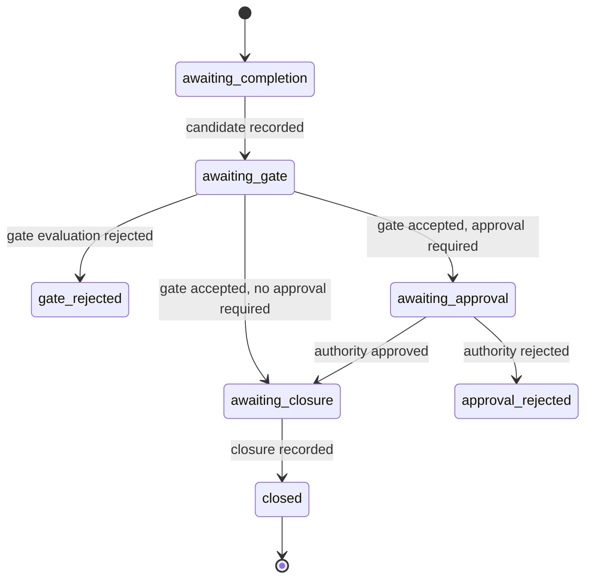

# Workflow Model

A Senawa workflow is a directed graph of definitions plus a set of policies that
decide when each part of that graph is finished. The graph is compiled once per
configuration snapshot and never mutated in place. Progress is recorded as
immutable facts, and phase state is projected from those facts on demand.

## The canonical graph

`compileWorkflowGraph` in
[packages/kernel/src/graph.ts](../../packages/kernel/src/graph.ts) turns a
`NormalizedWorkflowInput` into a `WorkflowGraph` with four node kinds, three edge
kinds, and one revision digest over the whole structure.

Node kinds form a strict containment hierarchy:

* Workflow, the single root.
* Phase, contained by the workflow or by another phase.
* Task, contained by a phase. The kernel calls this executable work.
* Criterion, contained by a task.

Every definition carries the same five fields plus its own digest: an
identifier, a consumer key, a definition generation, a source pointer with a
locator and a JSON pointer, and a canonical input value. The source pointer is
why a compiler diagnostic can name the exact location in the authored document.

### Typed edges

Edges are typed unions, not generic pairs, so an invalid relationship cannot be
represented:

```text
contains:    workflow -> phase | phase -> phase | phase -> task | task -> criterion
depends-on:  phase -> phase | task -> task
supersedes:  phase -> phase | task -> task | criterion -> criterion
```

A task cannot depend on a phase. A criterion cannot supersede a task. The type
system rejects those before the compiler runs, and `diagnoseWorkflowGraph`
rejects structural problems such as cycles with a `GraphCompilationDiagnostic`
naming the offending field.

### Definition generations and supersession

Identity in Senawa is a pair: an identifier and a `DefinitionGeneration`. Every
reference that matters carries both. `TaskGenerationReference` in
[packages/kernel/src/completion.ts](../../packages/kernel/src/completion.ts)
carries a third component, the context revision digest, so a completion fact
names not only which task but which version of which task under which context.

Supersession is how the graph changes without rewriting history. A new
definition declares `supersedes` against a prior identifier, producing a
`supersedes` edge. The prior definition stays in the graph and its records stay
valid. Completion accounting has a matching disposition, `superseded`, which
requires a `replacementTask` on the submission.

This is the difference between a graph that grows and a graph that gets edited.
Senawa only grows.

## Phases

A phase declaration binds an input schema and its mappings, an executor, a set of
outputs, an iteration policy, an exit policy, and optional actions. See
`PhaseDeclaration` in
[packages/configuration/src/contracts.ts](../../packages/configuration/src/contracts.ts).

Three executor kinds exist:

* `agent` runs a single agent role with declared budgets, a completion policy,
  and a `resumeAcrossAttempts` flag.
* `task-set` declares a fixed list of executable work.
* `task-frontier` names a `forEach` declaration and a task template, so the task
  set is computed from data rather than authored.

Phase exit is declared separately from phase execution: `requiredOutputs`, an
optional `gate`, and an approval policy of `none` or `required` with an explicit
authority value.

## Tasks and criteria

A task carries a completion policy: a list of criteria, each with a `required`
flag, plus an evidence policy. A criterion is a graph node in its own right, with
its own generation and its own supersession chain, which is what allows an
amendment to sharpen a requirement without invalidating completed work against
the earlier one.

Task readiness is derived, not stored. `deriveReadyTaskFrontier` in
[packages/kernel/src/readiness.ts](../../packages/kernel/src/readiness.ts) takes
task status facts and returns the tasks whose dependencies are accepted. A task
status is `pending`, `active`, `failed`, `cancelled`, or `accepted`, and only the
accepted form carries an accounting assessment digest.

## Completion accounting

`assessCompletionAccounting` compares a `CompletionSubmission` against
`CompletionRequirements` and produces an `AccountingAssessment`. Both sides are
canonicalized first, so the assessment is a pure function of content.

A task reaches one of five terminal dispositions: `completed`, `blocked`,
`waived`, `skipped`, or `superseded`. Each criterion reaches one of four:
`satisfied`, `unsatisfied`, `waived`, or `skipped`.

The rules that refuse an assessment are named error codes:

* `missing-criterion` and `unknown-criterion` require the submission to address
  exactly the declared criteria.
* `duplicate-criterion` refuses two outcomes for one criterion.
* `required-skip` refuses skipping a criterion declared `required`.
* `invalid-waiver` refuses a waiver without the declared waiver authority.
* `invalid-supersession` refuses a `superseded` disposition without a
  replacement task.
* `duplicate-evidence` refuses the same evidence attachment twice.
* `task-reference-mismatch` refuses a submission whose task reference does not
  match the requirements.

`reassessCompletionAccounting` recomputes an assessment from stored
requirements and a previously submitted assessment, which is how a later reader
verifies that a recorded acceptance still follows from the recorded policy.

## Evidence policy

A `CompletionEvidencePolicy` has a mode and a list of requirements. Each
requirement pairs
an evidence kind with a minimum count. The four modes set the scope:

* `none` requires no evidence.
* `task` applies the requirements once at task level.
* `required-criteria` applies them to each criterion marked required.
* `all-satisfied` applies them to every criterion reaching `satisfied`.

A `CompletionEvidenceItem` names an asset identifier, a kind, a descriptor, and
an optional criterion. The assessment reports per-requirement counts and a
`satisfied` flag rather than a single pass or fail, so a reader can see which
requirement fell short.

Completion evidence is what an agent offers, and it can be argued with. Gate
evidence is what senawa measured, and it cannot. Only readings may back a
blocking gate; completion evidence feeds completion accounting and never a gate.

Evidence is content, not narration. An attachment references a stored asset, and
model prose is never accepted in its place.

## Sensors and gates

A sensor is a bounded external measurement. `SensorDeclaration` fixes the argv,
working directory, timeout, stdout and stderr byte ceilings, inherited
environment allowlist, and retry limits. The Node implementation is
`measureExecutableSensor` in
[packages/execution-host/src/process-sensor.ts](../../packages/execution-host/src/process-sensor.ts).

A reading is either `SensorReadingSucceeded` with data or `SensorReadingFailed`
with an error, and both carry a reading digest.

A gate is a declared set of blocking and advisory rules over those readings.
Conditions compose through `all`, `any`, `not`, `exists`, and six comparisons,
addressed by sensor key and JSON pointer. Evaluation limits are bounded by
default at depth 32, 256 condition nodes, 64 pointer segments, and 1,024 pointer
characters.

Evaluation is three-valued. A rule resolves to `true`, `false`, or `unknown`, and
a composite that contains an unknown child is itself unknown. A gate decision is
`accepted` only when every blocking rule evaluates to `true`. Advisory rules are
evaluated and recorded but do not change the decision.

The result is a `GateEvidence` record bundling the definition, the readings, and
the evaluation, so a rejection can be re-derived from the exact bytes that
produced it.

## Candidate, decision, and closure

Phase completion moves through three immutable records defined in
[packages/kernel/src/candidates.ts](../../packages/kernel/src/candidates.ts).

A `PhaseCandidate` is the claim that a phase is ready. It carries the phase
generation reference, the phase attempt reference, the graph revision digest, the
input binding digest, the required output publications and their set digest, the
selected task set digest, the accepted accounting assessments, the dependency
barrier digest, an optional integration barrier digest, the gate policy digest,
and a derived evidence policy digest.

An `AuthorityDecision` records `approve` or `reject` with an approval identifier,
a canonical principal, a timestamp, and the exact candidate digest it applies to.
A decision bound to one candidate cannot be replayed against another.

A `PhaseClosure` is produced by `closePhase` from the graph, the candidate, the
gate evidence, and an approval reference. Closure also carries the
`PhaseOutputAcceptance` records that bind published outputs to this closure, so a
downstream phase mapping from `phase-output` reads a value that a specific
closure accepted.

## Budgets and escalation

Every autonomous loop draws from a `BudgetLedger` of counters, one per unit.
`BUDGET_UNITS` names six: `work-attempt`, `dispatch-failure`, `sensor-retry`,
`review-iteration`, `integration-attempt`, and `rebase-attempt`. Two earlier
units were removed because nothing counted them.

`consumeBudget` returns either `BudgetConsumed` with the updated ledger or
`BudgetExhausted` with the exhausted facts. Exhaustion is a fact, not an
exception, so it can be recorded and reviewed.

An `Escalation` carries the owner (a phase or a task), the trigger, the context,
candidate, and policy digests, the unresolved criterion identifiers, the failed
and unknown reading digests, the attempt facts, and the allowed responses. Seven
responses exist: `grant-additional`, `reassign`, `escalate-model`,
`approve-amendment`, `waive`, `supersede`, and `end-run`.

Granting more budget is itself bounded. An `AllowanceAuthorityPolicy` fixes which
units may be increased and by how much, and an `AdditionalAllowanceDecision`
names the escalation digest, the unit, the additional limit, and the authority
fact. A human cannot quietly raise a ceiling that policy did not permit.

## Iteration and rework

`PhaseIterationDeclaration` declares `maximumAttempts` plus the disposition for
each trigger: `onGateRejected`, `onApprovalRejected`, optional
`onUpstreamChanged`, and `onExhausted`.

`planPhaseAttemptTransition` in
[packages/kernel/src/iteration.ts](../../packages/kernel/src/iteration.ts)
applies them in a fixed order. A `closure-created` trigger resolves to `closed`.
An `upstream-changed` trigger under a `refuse` policy resolves to `refused`. An
attempt at or beyond `maxAttempts` resolves to the declared exhaustion
disposition and carries a `BudgetExhaustedFact`. Otherwise it consumes one
`review-iteration` unit and resolves to `iterate` with a next attempt reference.

## The derived phase lifecycle

`projectPhaseLifecycle` in
[packages/kernel/src/lifecycle.ts](../../packages/kernel/src/lifecycle.ts)
returns a `PhaseLifecycleProjection` whose `status` is one of eight values. The
projection is recomputed from records; there is no status column anywhere in the
schema.



`deriveStatus` checks escalations first, so any recorded escalation bound to the
current candidate projects `escalated` regardless of which state the phase would
otherwise be in. A gate evaluation is `rejected` when any blocking rule
evaluated to `false` or `unknown`.

The projection also returns a `TaskAccountingProjection` with the selected count,
the accounted count, per-disposition counts, and the individual accounts. That is
what "completion accounting" means in practice: a phase advances when every
selected task is accounted for under some terminal disposition, not when every
task succeeded.

Alongside status the projection returns `humanNeeds`, either an `approval` need
carrying the candidate digest and the required authority, or an `escalation` need
carrying the escalation identity, owner, trigger, unresolved criteria, failed and
unknown readings, and allowed responses. The portal renders exactly these.

The projection is refused rather than fudged when records contradict each other.
`LifecycleErrorCode` names the contradictions: `gate-candidate-mismatch`,
`decision-before-gate`, `wrong-authority`, `closure-escalation-conflict`,
`duplicate-escalation`, and others.

## Additive amendments

A workflow can grow at run time, but only additively. `NormalizedAmendmentOperation`
in [packages/kernel/src/amendments.ts](../../packages/kernel/src/amendments.ts)
permits exactly two operations: `add-phase` and `add-task`. Anything else fails
with `non-additive-change`.

An `AmendmentProposal` carries the source document, the base graph, the base
context digest, the base and result configuration snapshot digests, the
normalized operations, the phase candidate history, a computed `AmendmentImpact`,
and the reviewed result graph. The impact lists added phases, tasks, and
criteria, the existing target phases, and the affected task scopes, with its own
digest.

Reviewing the result graph is part of the proposal, not a later surprise. A human
approves a specific `reviewedResultGraphRevisionDigest`, and application refuses
if the current graph no longer matches.

`projectAmendmentLifecycle` derives one of seven statuses: `reviewable`,
`overlapping`, `stale`, `withdrawn`, `rejected`,
`approved-awaiting-quiescence`, and `applied`.

Two of those deserve attention. `overlapping` appears when two pending proposals
touch intersecting impacts, detected by `amendmentImpactsOverlap`, so two
approvals cannot silently interleave. `approved-awaiting-quiescence` appears
between approval and application: an approved amendment waits for the affected
task scopes to become quiescent, and `AmendmentQuiescenceFact` records that
observation. Storage rechecks durable affected scopes inside the apply
transaction rather than trusting a caller-supplied fact.

## How this is proven

* Graph compilation, typed edges, cycles, and diagnostics: [packages/kernel/src/graph.test.ts](../../packages/kernel/src/graph.test.ts).
* Completion accounting, dispositions, and evidence modes: [packages/kernel/src/completion.test.ts](../../packages/kernel/src/completion.test.ts).
* Three-valued gate evaluation and evaluation limits: [packages/kernel/src/gates.test.ts](../../packages/kernel/src/gates.test.ts).
* Candidate, decision, and closure binding: [packages/kernel/src/candidates.test.ts](../../packages/kernel/src/candidates.test.ts).
* Derived lifecycle status, task accounting, and human needs: [packages/kernel/src/lifecycle.test.ts](../../packages/kernel/src/lifecycle.test.ts).
* Budgets, escalation, and bounded allowance grants: [packages/kernel/src/budgets.test.ts](../../packages/kernel/src/budgets.test.ts).
* Iteration policy and exhaustion: [packages/kernel/src/iteration.test.ts](../../packages/kernel/src/iteration.test.ts).
* Readiness frontier derivation: [packages/kernel/src/readiness.test.ts](../../packages/kernel/src/readiness.test.ts).
* Additive amendment validation, overlap, quiescence, and application: [packages/kernel/src/amendments.test.ts](../../packages/kernel/src/amendments.test.ts)
  and [packages/supervisor/src/amendment-proposal-command-bridge.test.ts](../../packages/supervisor/src/amendment-proposal-command-bridge.test.ts).
* Configuration-level policy compilation: [packages/configuration/src/configuration.test.ts](../../packages/configuration/src/configuration.test.ts).
* End-to-end phase closure through the delivered workflow: [apps/senawa/src/standard-delivery-acceptance.test.ts](../../apps/senawa/src/standard-delivery-acceptance.test.ts).
